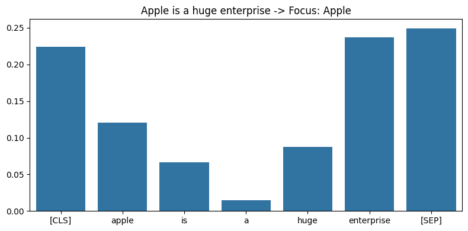

### ⭐️ BERT 모델 불러오기
- 기본적인 model과 tokenizer 불러오기
  - 로컬에서 돌리기에 부담되지 않는 DistilBERT를 사용
  - DistilBERT는 추후에 설명하겠지만, Knowledge Distillation를 기반으로 BERT 모델을 경량화 시킨 모델
```py
from transformers import AutoModel, AutoTokenizer

model_ckpt = 'distilbert-base-uncased'
model = AutoModel.from_pretrained(model_ckpt)
tokenizer = AutoTokenizer.from_pretrained(model_ckpt)
```


### ⚡️ 토큰화 과정 지켜보기
- 토큰화란?
  - 우리가 아는 단어를 컴퓨터가 이해할 수 있는 숫자로 바꾸는 과정
  - KoBERT의 경우, 사전에 정의된 단어사전에 맞춰 토큰 아이디를 반환함
  - 토큰화를 진행했다고 토큰 아이디가 단어에 의미를 담는 것은 아님
  - 두 문장에서의 Apple은 같은 토큰 아이디값을 갖지만, 실제로는 기업 Apple과 과일 Apple로 서로 다른 의미 내포
```py
input_text = ['Apple is huge enterprise',
              'I am eating an apple']
tokenized_text = tokenizer(input_text, padding=True, return_tensors='pt')
print(tokenized_text)
# 결과: {'input_ids': [[101, 6207, 2003, 4121, 6960, 102, 0], [101, 1045, 2572, 5983, 2019, 6207, 102]], 'attention_mask': [[1, 1, 1, 1, 1, 1, 0], [1, 1, 1, 1, 1, 1, 1]]}
```
:::tip
- input_ids: 하나의 문장을, 각 단어들의 토큰값들의 벡터들로 표현
- attention_mask: 두번째 문장이 첫번째 문장보다 긴데, padding을 통해 보다 짧은 문장에 0을 추가함
- 주의해야하는 특징
  - 첫번째 문장의 input_ids에 101, 102와 같은 패턴이 발견됨
  - 6207이라는 숫자가 중복되어 존재함
:::

- 토큰 아이디의 변환
  - 문장 앞과 뒤에 [CLS]와 [SEP]가 있는데, [CLS]는 문장의 시작을, [SEP]는 문장의 끝을 나타냄
  - 모든 토큰들은 소문자로 표현됨
  - [PAD]의 경우 패딩값인 0을 의미함
  - 6207이라는 숫자는 결국, Apple을 나타내는 숫자였음
```py
print(tokenizer.convert_ids_to_tokens(tokenized_text.input_ids[0]))
print(tokenizer.convert_ids_to_tokens(tokenized_text.input_ids[1]))
# 결과: ['[CLS]', 'apple', 'is', 'huge', 'enterprise', '[SEP]', '[PAD]']
# ['[CLS]', 'i', 'am', 'eating', 'an', 'apple', '[SEP]']
```

:::important

여기서 이해해야 하는 건, 컴퓨터는 두 문장에서의 Apple의 차이를 알지 못합니다. 왜냐하면 **두 Apple은 같은 6207이라는 값을 갖기 때문이죠.**
그렇다면 Apple의 의미를 이해하기 위해서는 어떻게 해야하요? 사람들은 일반적으로 단어의 의미를 알아내기 위해서 문맥을 고려하죠? 첫번째 문장의 경우 
Enterprise(기업)가 나오기 때문에, 기업으로서의 Apple을 의미한다고 판단하고, 두 번째 문장의 경우 Eating(먹는 중)으로 Apple이 과일임을 
알아냅니다. 과연 컴퓨터는 어떻게 이 문제를 해결할 수 있을까요?

:::

### 🌮 토큰 임베딩으로 변환하기
- 임베딩이란?
  - 앞서 살펴봤듯, 토큰 아이디는 하나의 숫자임으로 단어의 의미를 담을 수 없음
  - 데이터에 의미를 담아 숫자 집합으로 변환하는 것을 임베딩이라고 함
  - DistilBERT 모델에 토큰들을 넣으면 맥락을 고려한 임베딩 값을 반환함
  - 자세한 내부 연산은 추후 블로그에 추가할 예정임
```py
    outputs = model(**tokenized_text)
    attentions = outputs.attentions
    attentions = [a[0].detach().numpy() for a in attentions]
```

### 🧅 각 문장에서 Apple의 집중도
- 첫 번째 문장에서의 Apple의 집중도


- 두 번째 문장에서의 Apple의 집중도


### 🧩 결론
- Apple is huge enterprise의 경우
  - Apple은 Enterprise에 집중을 많이 함
  - 이에 따라서, Apple을 기업으로 이해할 확률이 높음
- I am eating an apple의 경우
  - Apple은 eating에 집중을 함
  - 이에 따라서, Apple을 먹는 음식으로 이해할 확률이 높음
- 따라서 BERT 모델은, 문장을 이해하는 역할을 함
