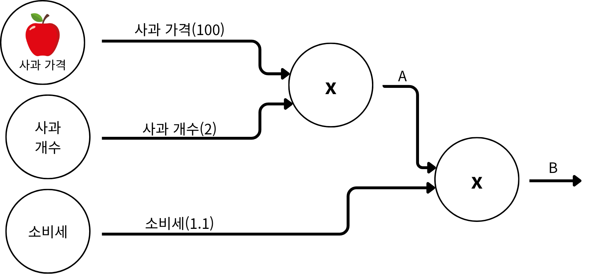
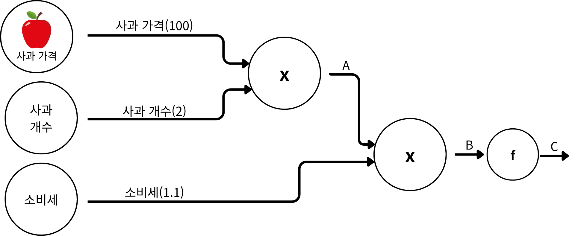

### 🤦🏻‍♂️ 들어가기에 앞서...
> 네. 이번에는 DeepL에서 제가 제일 중요하다고 생각하는 부분 중 첫 번째 부분입니다. 우리가 DeepL 모델을 왜 사용하나요? ==해결하고 싶은 downstream work가 있을 때 주로 사용==합니다. 이 모델에는 ==가중치(Weight)==라는 개념이 존재하죠. 처음에 가중치는 랜덤한 값으로 부여되죠.(물론 He기법이나 Xavier기법과 같이 특정 분포에 따라 가중치를 설정하는 방법도 있습니다.) 우리는 이 가중치 값을 가진 모델이, **우리가 처한 문제를 해결할 수 있도록 만들어야합니다.** 이는 DeepL의 목적을 보여주는데, 결국 ==최적의 가중치 값==을 찾아야한다는거죠.
>
> 그러면, 어떻게 우리는 최적의 가중치 값을 찾을 수 있을까요? 이때 등장하는게 Optimizer인데 Optimzier의 종류에 대해서는 앞으로 차차 언급할 예정이므로 일단 ==경사하강법(Gradient Descent)==을 적용시켜서 역전파 과정에 대해서 이해해보도록 하겠습니다.

:::warning
짐작하셨듯이 이번에 설명할 내용은 수학적 내용이 들어갑니다. 수학이라고 해봐야 미분, 편미분 밖에 없으니 주의해주세요!
:::

### 🏀 미분(Derivative)이란?
이건 중학교때부터 배웠던 개념이니깐 간단히 짚고 넘어갈게요. $\frac{\Delta f}{\Delta x}$는 $\frac{f}{x}$으로 볼 수 있는거죠. 
:::tip
$f(x)=3x^2$을 미분하면 $f'(x)=6x$가 됩니다.
:::

### ⚾️ 편미분(Partial Derivative)이란?
편미분 개념은 빠르면 고등학교때, 아니면 대학교 1학년때 배우는 개념인데요. 미분의 경우 하나의 단변수에 대한 미분을 진행했다면, 편미분은 다변수에 대한 미분을 진행한다고 이해하시면 됩니다.
:::tip
$f(x, y)=x+y$라는 식이 있을 때, $\frac{\partial f(x, y)}{\partial x}=y$와 $$\frac{\partial f(x, y)}{\partial y}=x$$로 계산될 수 있다는 부분이 중요합니다.
$x$에 대한 미분을 진행한다면, $x$를 제외한 나머지 변수들은 상수취급을 한 상태에서 미분을 한다고 이해하시면 편합니다.
:::

### ❤️ 경사하강법의 기본적인 이해
경사하강법.. 어려워 보이는 개념이지만 이 부분은 Optimizer 부분에서 더 자세히 풀어쓸겁니다. 지금은 이런게 있다 정도로만 알아두시면 좋을 것 같아요.
> $$W_{t+1}=W_{t}-\eta \cdot \frac{\partial L}{\partial w}$$

변수 하나씩 설명할게요. $W_{t+1}$은 다음 가중치, $W_t$는 현재 가중치, $\eta$는 학습률(Learning Rate, lr), $\frac{\partial L}{\partial w}$는 w의 변화에 따른 손실함수의 변화량을 나타냅니다.  
따라서 위 수식은, 역전파를 진행한 값을 이용하여 다음 가중치를 업데이트한다고 이해하시면 편합니다.

### 😎 역전파의 연산 과정 1
원래의 신경망에서는 무 조 건 활성화 함수(Activation Function, $\tau$)가 있어야합니다. 하지만 초반부터 활성화 함수를 넣은 상태로 역전파 연산을 하게 되면 예.. 복잡해집니다. $Sigmoid$와 $Tanh$같은 함수를 미분해야하는데 일단은 없는 상황에서 한번 보자구요.

> 예시를 하나 들어봅시다. 우리가 과일 가계에서 사과를 살겁니다. 사과의 가격은 100원이고 총 2개 살겁니다. 우리가 물건을 사면 소비세를 내야겠죠? 이 소비세가 1.1이라고 합시다. 저는 제가 내야할 돈이 ==사과의 개수, 사과의 가격, 소비세 중에서 어떤 값이 가격 변동에 민감==한지 알고 싶습니다. 그렇다면 먼저 A, B를 차례대로 구해볼까요? (계산하기 앞서서 각 변수들을 문자로 정의할게요.)
>
> 먼저 사과 가격$:=x$, 사과 개수$:=y$, 소비세$:=z$로 정의하겠습니다.
>
> $A=x \cdot y$이 첫번째 식이 되겠고 $B=A \cdot z$가 두번째 식이 되겠네요.
>
> 자, 여기서 우리가 구해야하는건 제가 내야할 돈에 대한 사과의 개수, 사과의 가격, 소비세의 변화량이죠? 이걸 수식으로 정리하면 다음과 같습니다. $\frac{\partial B}{\partial x}$, $\frac{\partial B}{\partial y}$, $\frac{\partial B}{\partial z}$입니다.

:::important
여기서 진짜 중요한게 하나 나오거든요? 우리가 구해야하는 식을, 조금 변형해볼게요.

$\frac{\partial B}{\partial x}=\frac{\cancel {\partial A}}{\partial x} \cdot \frac{\partial B}{\cancel{\partial A}}=y \cdot z=2 \cdot 1.1=2.2$

$\frac{\partial B}{\partial y}=\frac{\cancel {\partial A}}{\partial y} \cdot \frac{\partial B}{\cancel{\partial A}}=x \cdot z=100 \cdot 1.1=110$

$\frac{\partial B}{\partial z}=A=100 \cdot 2=200$

위의 식을 체인룰(chain rule)이라고 하는데, 결국 $\partial A$의 값이 상쇄됨을 나타냅니다. 지금은 단일층이지만, 앞으로 층이 더 쌓인다고 하더라도 계속 상쇄되기 때문에 우리가 쉽게 역전파 값을 구할 수 있는거죠.
:::

### 👀 역전파의 연산 과정 2
그러면 이번에는 실제 신경망에서 어떻게 동작하는지 확인해볼까요? 앞에서는 활성화 함수를 거치지 않은 역전파 값을 계산했잖아요. 이번에는 활성화 함수가 $x^2$이라고 가정을 하고 계산을 해보죠.
:::tip
여기서 활성화 함수가 왜 $x^2$인가를 설명드리면 원래 Sigmoid나 tanh와 같은 함수를 활성화 함수로 사용하는데요, 이를 미분하는 과정이 처음 공부하는 사람들에게는 조금 어렵게 작용될 수 있어요. 그래서 미분하기 쉬운 함수인 $x^2$을 사용하는 점, 양해해주세요.
:::

> 이전에 풀었던 문제랑 비슷해요. 하지만 하나가 추가된건데 활성화 함수 $f$가 추가된거든요. 한번 볼까요?
>
> 이번에 우리가 구해야하는 식이 뭐에요? $\frac{\partial C}{\partial x}$, $\frac{\partial C}{\partial y}$, $\frac{\partial C}{\partial z}$죠? 그리고 $A=x \cdot y$, $B=A \cdot z$, $C=B^2$로 정의될 수 있겠죠?

:::important
$\frac{\partial C}{\partial x}=\frac{\cancel {\partial A}}{\partial x} \cdot \frac{\cancel{\partial B}}{\cancel{\partial A}} \cdot \frac{\partial C}{\cancel{\partial B}}=y \cdot z \cdot 2B=2 \cdot 1.1 \cdot 440=968$

$\frac{\partial C}{\partial y}=\frac{\cancel {\partial A}}{\partial y} \cdot \frac{\cancel{\partial B}}{\cancel{\partial A}} \cdot \frac{\partial C}{\cancel{\partial B}}=x \cdot z \cdot 2B=100 \cdot 1.1 \cdot 440=48400$

$\frac{\partial C}{\partial z}=\frac{\cancel{\partial B}}{\partial z} \cdot \frac{\partial C}{\cancel{\partial B}}=A \cdot 2B=200 \cdot 440=88000$

이렇게 되겠죠? 역전파 계산이 활성화 함수가 $x^2$이라고 커졌지만 이런 형식으로 진행된다고 생각하시면 되겠습니다.
:::

### 💁🏻 결론
이렇게 구해진 역전파 계산은 결국 경사하강법과 같은 ==Optimizer에 의해서 다음 가중치를 업데이트==하는데 사용된다는 부분이 정말 중요한 부분입니다. 이번에는 역전파가 구체적으로 어떻게 진행되는지를 살펴봤고 다음엔 이 역전파된 값을 어떻게 업데이트하는지 Optimizer에 대해서 살펴볼 예정입니다.
