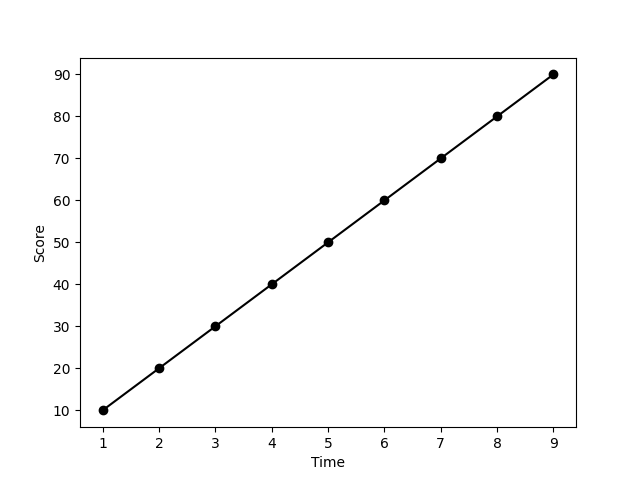
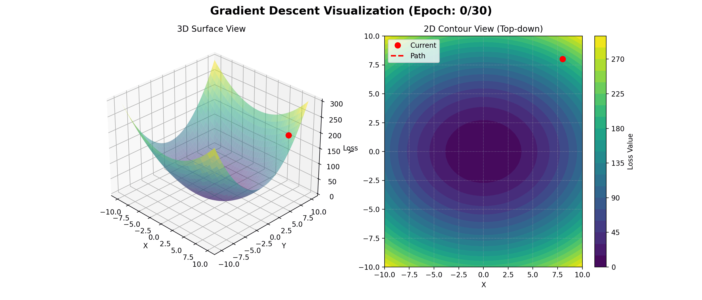
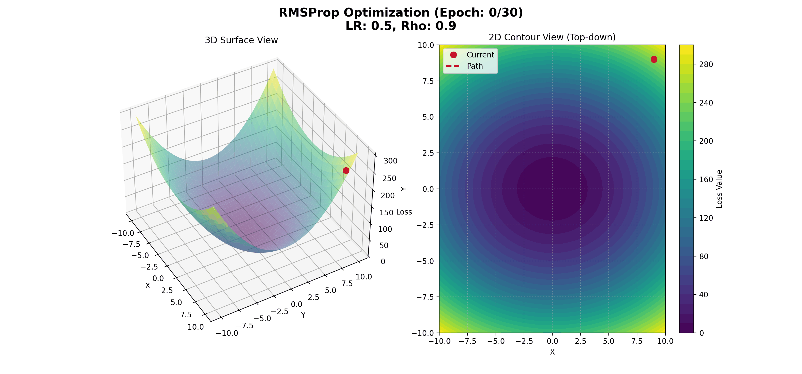

### 🤦🏻‍♂️ 들어가기에 앞서...
이번에는 제가 DeepL에서 두 번째로 중요하다고 생각하는 ==Optimzer==에 대해서 알아보겠습니다. 역전파 부분에서 어떻게 역전파 계산을 수행하는지에 대해서 배웠으니, 역전파 값을 바탕으로 ==어떻게 가중치를 업데이트하는지==를 배워야합니다. 우선 Optimizer에 대해서 알기 위해서는 손실 함수(Loss Function, $Loss:=L$)에 대해서 먼저 알아야합니다.

### 🛢️ 손실 함수란?
여러 DeepL에서 보면 다양한 이름으로 불리는 친구인데요, 손실 함수, 목적 함수, 비용 함수 등으로 불립니다. 모든 용어가 같은 의미를 가지고 있는건 아니지만, DeepL에서는 통칭하는 경향이 있는데 이 부분은 아래 tip 부분에서 설명하겠습니다. ==손실 함수는 모델이 예측한 값과 실제 값과의 차이를 구하는 함수를 의미==합니다. 학습이 너무 잘 진행된다면 모델이 예측한 값과 실제 값의 차이가 적겠죠. 하지만 모델이 잘못 학습되었다면 이 오차값이 커지게 되겠죠? 우리는 손실함수를 $L=\frac{1}{n} \sum(y-\hat y)^2$으로 정의됩니다. 여기서 **$y$는 실제 결과값이고, $\hat y$는 모델의 예측값을 나타내죠.**

이 손실 함수를 ==평균제곱오차==(Mean Squared Error, MSE)라고 부르는데요 이 손실함수 말고 두 값의 차이에 절대값을 지정하는 ==평균절대오차==(Mean Absolute Error, MAE) 등 여러 손실함수가 있다는 점도 유념해두시면 좋을 것 같아요.

:::important
여기서 정말 중요한 내용이 등장하는데요, 제가 처음 공부할때는 왜 오차에 대해서 절대값이나 제곱을 적용해서 방향 정보를 제거하는지가 궁금했습니다. 혹시 왜 그런지 생각 해보셨나요? $y$의 값이 $\hat y$의 값보다 크다면 양수, 그 반대라면 음수겠죠. 만약 오차 값이 -1.4, 1.4라면 두 값의 차이는 방향이죠. 음수 방향에 있는가? 양수 방향에 있는가인데 가중치의 값을 업데이트 하기 위해서는 ==오차의 방향은 중요하지 않습니다. 오차의 크기가 필요한거죠.== 그래서 절대값을 취하거나 제곱을 취하는거죠. 

자, 그러면 이번에는 제곱은 왜 하는걸까요? 만약 오차 값이 2와 4가 있다고 하죠. 2와 4는 고작 2밖에 차이가 나지 않지만, 이 값들을 제곱하면 4와 16의 차이가 되서 12의 차이가 발생합니다. 맞습니다. ==오차가 더 큰 값은 오차를 더 크게 해서 계산을 반영==시키는거죠. 오차가 더 클때, 이 값을 더 ==극대화==시킨다고 이해하시면 됩니다.
:::

:::tip
일반적으로 손실 함수, 비용 함수(Cost Function), 목적 함수(Objective Function)으로 부르는데요, 일단 크게 보면 손실 함수 $\subset$ 비용 함수 $\subset$ 목적 함수로 볼 수 있습니다. 우리가 사용하는 손실함수는 목적 함수들 중에서 비용 함수 중에서 손실 함수 인겁니다. 목적 함수가 가장 큰 집합인거죠.
:::

### 🧩 먼저 시작하는 경사하강법(Gradient Descent)!
역전파 부분에서 잠깐 언급은 했는데 진짜 쉽게 설명을 해볼게요. 우리가 공부 시간에 따른 시험 성적 그래프가 있다고 가정합시다. 

여기서 10시간 공부했을 때의 시험 성적을 알고 싶다면 $\hat y=Wx$ 식을 선언할 수 있겠죠? 여기서 $W$는 우리가 알아야하는 가중치이고, $x$는 공부 시간을 나타냅니다. 여기서 우리는 최적의 W를 구해야합니다. 이게 바로 우리의 목적이죠. 그러면 앞의 손실 함수를 조금 다르게 쓸 수 있겠죠? $L=\frac{1}{n} \sum(y-Wx)^2$로 쓸 수 있고 결국 손실함수는 W에 대한 식인거죠.

> 우리는 ==손실 함수를 최소화==해야합니다. 따라서 손실 함수를 W에 대한 미분을 해서 최적의 W를 구하는거죠. 만약 손실 함수가 $y=x^2$이라면 최소값이 어떤 값이나요? 미분한 값이 0이 되는 부분이죠? 따라서 우리는 손실 함수에 대한 미분을 진행하는 겁니다.

여기서 경사하강법에 대한 이해를 위해 예시를 한번 들어보죠. 우리는 Everest 꼭대기에 있습니다. 우리가 가지고 있는건 아무것도 없습니다. 오로지 감을 이용해서 내려가야하죠. 근데 여기서 직감을 사용하여 내려가는 방식이 과연 올바른 방식일까요? 아마 아닐겁니다. 조금 가능성이 높아보이는 방식은, ==현재 위치에서 기울기가 가장 가파른 곳을 향해서 내려가는게 더 좋은 방식일 겁니다.== 이걸 바로 경사하강법이라고 합니다. 경사하강법에 대한 식은 $W_{t+1}=W_t-\eta \frac{\partial L}{\partial W}$입니다. 자 여기서 $\eta$(Learning Rate, lr)를 사용하는 이유는 값이 너무 변동하는 것을 막기 위함입니다.

간단히 한번 경사하강법을 볼까요?(다만, 여기서 쉬운 계산을 위해서 손실함수가 $x^2+2y^2$이라고 가정합시다.)

지금 보이는 그래프가 손실함수이고, 손실함수가 줄어드는 방향으로 값이 업데이트 되는 것을 볼 수 있습니다.

### 🧅 중력 가속도? 모멘텀
우리는 산 위에서 아래로 내려가잖아요. 올리가지는 않을거고 무조건 내려갈꺼니깐 중력 가속도를 추가해보죠. ==중력 가속도인 0.9==의 값을 주게 되면 내려가는 속도가 당연히 더 빨라지겠죠? 이 개념을 이용한게 바로 모멘텀입니다. 식은 다음과 같습니다. $v_{t+1}=v_{t}+\frac{\partial L}{\partial W}$을 먼저 구한 다음, $W_{t+1}=W_t-\eta v_{t+1}$을 구하는거죠.

여기서도 위의 손실함수와 같게 설정했습니다.

혹시 위의 경사하강법과 차이가 보이시나요? 경사하강법은 천천히, 일정한 값으로 가중치가 점차 업데이트 되는 과정이지만 모멘텀의 경우 0.9라고 하는 중력상수의 영향으로 가중치를 더 많이 업데이트 하게 됩니다. 모멘텀은 ==빠르지만, 최적의 해를 벗어날 수 있다==는 점도 가지고 있습니다. 하지만 당연히 경사 하강법 보다는 빠르다는 장점을 가지고 있죠.

### ⚡️ 다음에 올 내용을 보는 네스테로프 모멘텀
모멘텀은 같은데, 네스테로프(Nesterov)가 붙죠? 모멘텀은 그냥 0.9라는 중력 상수에게 이끌려 최적의 해에 도착하더라도 관성에 의해서 계속 가중치가 업데이트 되는 과정이라면, 네스테로프 모멘텀은 ==다음의 위치를 미리 예측하고 가중치를 변경을 하기 때문에 모멘텀 보다는 안정적이라는 장점==을 가지고 있습니다. 그냥 쉽게 설명하면 경사가 감소하는 중에 다음 위치를 예측했더니 경사가 올라간다면 속도를 늦추는거죠. 따라서 식은 다음과 같습니다. $v_{t+1}=\mu v_t+\frac{\partial L}{\partial W}(w_t-\eta w_t)$이고 $w_{t+1}=w_t-\eta v_{t+1}$입니다.

자, 어떤가요? 모멘텀보다는 안정적으로 최적의 해에 도달하나요? 넵. 확실히 안정적으로 보이긴 하네요.

### 📺 에이다그레디언트(AdaGrad)
지금까지는 중력 가속도라는 값을 통해서 가중치를 보다 빠르게 수정하는 Optimizer에 대해서 배웠습니다. 학습이 빨라서 좋기는 한데, 뭔가 아쉽습니다. 기울기가 내려가면 많이 업데이트를 하고 기울기가 올라가면 조금만 업데이트할 수 있으면 정말 좋을 것 같은데요. 이게 바로 ==적응적 학습==(Adaptive Learning)이라는 겁니다. 그니깐, 짧게 설명하면 ==가중치를 많이 조정해야할때는 학습률을 크게 두고, 그렇지 않는 경우에는 학습률을 작게== 두는거죠. 뭐, 처음부터 최적의 학습률을 찾을 수 있겠지만 대부분의 경우에 초반에는 학습률을 크게 둬서 지역 최솟값을 빠르게 벗어나고 전역 최솟값에 가까워졌을때는 학습률을 낮게 설정해서 조금씩 가중치를 업데이트하는거죠. 

따라서 이번에는 위의 식과 조금 다르게 동작하는데, $s_{t+1}=s_t+\frac{\partial L}{\partial W}^2$이고 $W_{t+1}=W_t-\frac{\eta}{\sqrt{s_{t+1}}+\epsilon}g_t$처럼 학습률을 조정해주는거죠. 

현재의 기울기가 크다면? $s_{t+1}$의 값이 커지겠죠? 따라서 학습률이 낮아지게 되는데 경사가 가파르면 안정적으로 가중치를 업데이트 하라는거죠. 반면에 기울기가 낮으면, $s_{t+1}$의 값은 작아지고 학습률이 높아지면서 지역최솟값을 탈출할 수 있는거죠. 그림에서 볼 수 있듯이 초반에는 빠르게 움직이다가, 나중에는 천천히 움직이죠? 이게 초반에 너무 낮은 학습률을 주게 되면, 학습이 너무 느려서 기존의 0.1이 아니라 1.5로 준 점 양해해주세요.

### ⏰ 거의 마지막 RMSProp
Adagrad는 좋은 Optimizer인건 분명합니다. 하지만 ==과거의 경향성을 추가해서 가중치를 업데이트== 한다면 더 좋을 것 같습니다. 왜냐하면 과거에 기울기가 오르는 추세였다 라는 정보를 추가적으로 준다면 더 좋은 성능을 낼 수 있을 것 같으니깐요. 따라서 우리는 ==지수이동평활의 개념==을 사용합니다. 지수이동평활이란 앞에서 말했듯이 ==과거의 움직임에 대한 정보를 포함==한다는 의미죠. RMSProp의 식은 다음과 같습니다. 먼저 $s_{t+1}=\rho s_t + (1-\rho)g_t^2$로 계산이 되고, $w_{t+1}=w_t-\frac{\eta}{\sqrt s_{t+1}+\epsilon}g_t$게 가중치가 업데이트되죠.

AdaGrad 그래프를 보시면 아시겠지만, 처음에는 잘 조절하던 가중치가 갈수록 조정 폭이 줄어듭니다. $s_t$의 값이 커지게 되버리면 학습률이 굉장히 작아지기 때문에 학습이 조기에 중단되는 문제가 발생합니다. 따라서, $(1-\rho)$를 두면서 $s_{t+1}$의 값을 조정한다고 생각하시면 되겠습니다.

:::warning
여기서 질문이 나올 수 있어요. 그러면 AdaGrad랑 RMSProp의 차이는 도데체 무엇인지 말이죠. 얼핏보면 비슷해 보이기는 합니다. 자세히 보면 AdaGrad의 경우 ==초반에는 업데이트 속도가 빠른데 나중에는 업데이트를 거의 안하죠?== 하지만 RMSProp의 경우 꾸준하게 업데이트 되는 것을 볼 수 있습니다. 네, 이게 바로 차이죠.
:::

### ⌛️ 진짜 마지막 Adam
이거 보니깐, 모멘텀은 속도가 빨라서 좋고 적응적 학습은 학습률을 상황에 따라서 조정할 수 있어서 좋은 것 같아요. 그러면 이 두 개념을 같이 이용하면 더 좋은 Optimizer가 되지 않을까요? 이게 바로 Adam입니다. ==모멘텀의 개념과 적응적 학습률의 개념을 혼합==한거죠. Adam은 1차 모멘텀, 2차 모멘텀, 편향 조정, 가중치 조정 과정에 차례대로 발생합니다.

> 1차 모멘텀: 
$$m_{t+1}=\beta_1m_t + (1-\beta_1)\frac{\partial L}{\partial W}$$
>
> 2차 모멘텀: $$s_{t+1}=\beta_2+(1-\beta_2)\frac{\partial L}{\partial W}^2$$
>
> 편향 조정: $$\hat m_t=\frac{m_{t+1}}{1-\beta_1^t} \quad \hat s_t=\frac{s_{t+1}}{1-\beta_2^t}$$
>
> 가중치 조정: $$w_{t+1}=w_t-\eta \frac{\hat m_t}{\sqrt{\hat s_{t}}+\epsilon}$$

### 🚋 최종 종착지, AdamW
Adam도 좋은데 epoch를 좀 크게 해버리면 최적의 해를 벗어나버립니다. 이때 우리가 할 수 있는건, ==규제==(Regularization)입니다. 규제는 가중치가 너무 커지지 않게 막는거죠. 딥러닝이건, 머신러닝이건 가중치는 너무나도 중요합니다. 여러개의 변수 중에서 특정 하나의 가중치의 값이 너무 크다고 해봅시다. 어떻게 될까요? 0.1, 0.1, 0.1, 10의 가중치를 갖는다면 다른 값들은 다 값이 0.1 정도 밖에 변하지 않는데 마지막 변수는 값이 변하면 10씩 변해버립니다. 한마디로 ==모델이 특정 변수에 민감해지는 현상이 발생==하는거죠. 우리는 이런 모델을 좋은 모델이라고 하지 않습니다. 따라서, 특정한 가중치 값이 너무 커지는 것을 막기 위해서 가중치 감쇠(Weight Decay)라는걸 하는거죠.

일반적인 규제를 할때, 손실함수에 $\frac{1}{2}||\lambda||_2^2$에 더합니다. $\lambda$를 규제항이라고 하는데, 규제를 키울수록 손실값이 커지게 되고 가중치의 값을 더 많이 수정하는거죠. 하지만, AdamW에서는 손실 함수에 규제항을 더하지 않습니다. 왜 그럴까요?

> 1차 모멘텀: $$m_{t+1}=\beta_1m_t + (1-\beta_1)\frac{\partial L}{\partial W}$$
>
> 2차 모멘텀: $$s_{t+1}=\beta_2+(1-\beta_2)\frac{\partial L}{\partial W}^2$$
> 
> 편향 조정: $$\hat m_t=\frac{m_{t+1}}{1-\beta_1^t} \quad \hat s_t=\frac{s_{t+1}}{1-\beta_2^t}$$
>
> 가중치 조정: $$w_{t+1}=w_t-\eta \frac{\hat m_t}{\sqrt{\hat s_{t}}+\epsilon} -\eta \lambda w_t$$

:::important
Adam에서는 손실 함수에 대한 미분을 바탕으로 학습률을 계산합니다. 하지만, ==손실 함수에 규제항을 더하게 되면 학습률이 왜곡되는 현상==이 발생하겠죠? 따라서, 가중치를 갱신할 때, 규제항을 더하는 겁니다.
:::

### ❤️‍🔥 결론
지금까지 여러 Optimizer에 대해서 알아봤습니다. 당연히 어려울거고 생소할겁니다. 하지만 계속 보다보면 익숙해지니깐, 친숙화가 답입니다.

어떤 분이 물어보더라고요. AdamW가 젤 좋아보이는데 그냥 다 몰라도 AdamW만 쓰면 되는거 아니냐고요. 물론 여러 논문에서도 Adam이랑 AdamW가 많이 쓰이는건 사실입니다. 하지만 예전에 BERT 설명할때도 이야기 했듯이, 경사 하강법만 써도 되는 문제를 굳이 Adam, AdamW를 쓸 필요는 없죠. 그리고 데이터의 특징에 따라서 어떤 Optimizer를 선택할지 달라져서 어떤게 SOTA라고 볼 수는 없습니다. 그니깐, 다.. 알아둡시다.