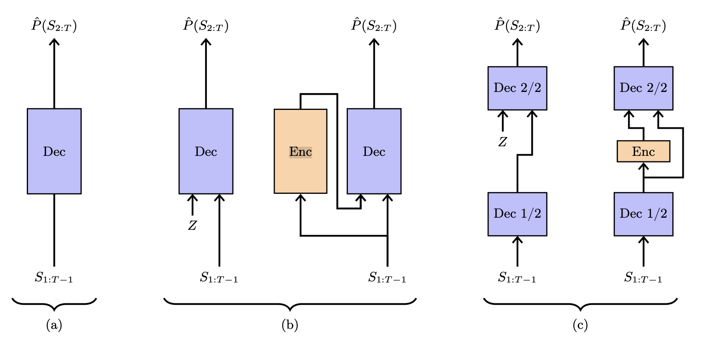
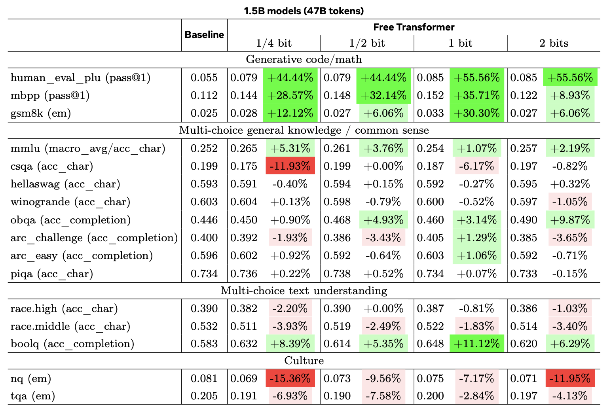

### 🤦🏻‍♂️ 들어가기에 앞서...
우리가 GPT 같은 모델들을 자기회귀모델(AutoRegressive Model)이라고 하는데, 제가 이전에 설명한 것처럼 ==단방향 인코딩==을 진행을 합니다. **다음 단어를 생성하기 위해서 이전까지 생성한 단어들의 정보를 계산하는거죠.** 이번 논문은 기존 트랜스포머 모델에서 Decoder 모델이 오직 **확률에 의존하여 문장을 생성하는 문제를 지적**하며 ==글의 분위기==, 여기서는 잠재 변수 $Z$라고 하는데, $Z$를 넣어서 보다 확실한 느낌의 문장을 생성하도록 새로운 'The Free Transformer' 모델을 제안합니다.

### ☎️ 논문의 전체적인 흐름은? (About. Abstract)
지금까지의 Decoder 모델은 이전에 생성했던 내용들을 바탕으로 문장을 생성하죠. 그래서 Decoder 모델은 좀 안좋게 말하면 끝말잇기 모델인거에요.(단어에 꼬리를 물면서 가장 높은 확률을 가진 단어를 생성하니까요.) 이 모델은 글 전체를 관통하는 ==큰 그림==을 정해두지 않습니다. 확률 분포에 의해 다음에 올 확률이 가장 높은 단어들을 선택하다보니, ==문장이 긍정이 될 수 있고, 부정==이 될 수도 있겠죠. 그리고 가끔 앞뒤 문맥이 꼬여서 이상한 소리를 하기도 하는거죠. 

이를 해결하고자, 이 논문에서는 잠재 변수(Latent Variables, $Z$)라는 개념을 도입합니다. 이전 Decoder 모델들은 단순히 확률을 바탕으로 문장을 생성했다면, 제안하는 모델은 ==특정 잠재 변수를 정의하고 문장을 생성==하는거죠. 여기서의 잠재 변수는 글 전체의 분위기나 방향이 담겨있습니다. 예를 들면, 긍정적인 분위기를 쓴다던가, 부정적인 분위기를 쓰라는 이런 내용이 담겨있겠죠? 한 가지 예시를 들어볼까요?

'나는 영화를 정말'이라는 문장이 있을 때, '정말' 뒤에 들어갈 수 있는 단어는 '재미있었다'나, '지루했다'와 같은 단어가 들어갈 수 있겠죠. 이전 Decoder 모델들은 단순한 확률에 의해서 '지루했다'와 '재미있었다'를 결정하는 반면, 제안된 Decoder 모델의 경우, 임의의 잠재 변수(여기서는 긍정적인 분위기라고 하죠)가 선택될 때, ==잠재 변수와 확률에 따라 다음으로 오는 단어를 '최고였다'로 생성==하는거죠.

여기서 잠재 변수들은 ==조건부 변분 오토인코더==(Conditional Variational Autoencoder, CVAE) 절차를 통해 ==비지도 방식==으로 학습됩니다. 실험 결과, 이러한 이러한 CVAE를 통해서 잠재 변수를 생성하는 것이 다운스트림 작업에서 상당한 성능 향상을 가져왔다고 설명합니다. 또한, 제안된 구현 방식은 ==계산 및 메모리 오버헤드가 매우 적게 든다는 장점== 또한 가지고 있습니다.

:::important
우리가 데이터에 "이건 긍정이야", "이건 부정이야"라고 라벨을 붙여주지 않아도, 모델이 스스로 학습 과정에서 "아, 이런 단어들이 나올 때는 비슷한 $Z$ 값을 쓰는 게 효율적이구나!"라고 깨닫고 **패턴을 $Z$에 압축해 넣는다는 점입니다.** ==즉, 모델이 스스로 '큰 그림'을 분류하는 법을 배운다는 것==이 이 논문이 흥미로운 부분인거죠.
:::

### 🕹️ 제기된 문제 상황
기존의 Decoder 트랜스포머는 ==자동 회귀적 이산 밀도 근사기==(Auto Regressive Discrete Density Approximators)로, 이전에 생성된 토큰들을 기반으로 다음 토큰의 확률을 추정합니다. 여기서 되게 어려운 단어가 나오죠. **자동 회귀적이라는 말은 다음에 올 단어를 예측하기 위해서 계속 반복**한다고 이해하시면 됩니다. 그리고 문제 이산 밀도 근사기인데, 여기서 이산은 딱 정해져있는거로, 애매하게 배와 사과 사이에 있는 값을 만들어내는게 아니라 ==배, 사과 처럼 데이터를 끊어서 생성==한다는거고, 밀도는 모든 단어들에게 다음에 올 확률이 포함되어있잖아요. 이 ==모든 단어들의 분포를 밀도==라고 합니다. 마지막으로 근사기는, 우리가 생성하는 문장이 100% 정답이 아니잖아요. 그래서 ==근사하게 만들어낸다==라고 해서 이산 밀도 근사기라고 부릅니다. 

하지만, 이러한 방식에는 문제점이 있는데 먼저 **모델이 생성할 전체 시퀀스에 대한 ==명시적 결정==을 미리 내리는 것이 아니라, 토큰을 하나씩 생성하며 사후적으로 확률**을 맞추어 나가는거죠. 그리고 잠재적인 속성, 특정 패턴의 위치을 추론하기 위해 모델이 내부적으로 복잡한 확률 밀도 추정을 계속 실행해야 하며, 이는 **비효율적이고 이전 토큰 생성에 오류가 있을 경우 ==전체 과정이 이상==해지는 위험**이 있습니다. 마지막으로 **원인(여기서는 잠재 변수)을 알고 결과를 예측하는 것은 쉽지만, 결과만 보고 원인을 추측하며 다음을 예측하는 것은 수학적으로 매우 복잡**하다는거죠.

### 📻 논문에서 제안하는 부분
따라서 이 논문에서는 "The Free Transformer"라는 모델을 제안합니다. 핵심 아이디어는 생성 과정 중간에 무작위 잠재 변수 $Z$를 넣어서 Decoder가 이를 바탕으로 생성을 수행하도록 하는 것입니다. 

이 모델은 CVAE처럼 작동합니다. 학습 시에는 **Encoder 통해 사후 분포 $Q(Z|S)$에서 $Z$를 샘플링하고 추론 시에는 $Z$를 사전 분포에서 샘플링하여 Decoder에 주입**합니다. 예를 한번 들어볼게요. 학습을 할 때 '이 영화는 최고다!'라는 완성된 문장이 있다고 합시다. ==Encoder는 완성된 문장('이 영화는 최고다!')를 보고 이 문장이 '긍정'이라고 판단==합니다. 이 분석 결과가 $Q(Z|S)$죠. 그래서 이 '긍정'이라는 값인 $Z$를 Decoder에게 줍니다. 이에 따라, Decoder는 '긍정'이라는 쪽지를 받았을 때, '최고'라는 단어를 써야한다는 것을 학습하는거죠. 반면에 ==추론을 할때는 완성된 문장이 주어져있지 않잖아요.== 백지 상태에서 문장을 생성해야하죠. 그래서 사전 분포라는 곳에서 임의의 $Z$를 뽑습니다. 사전 분포라는 곳에는 '긍정', '부정', '슬픔', '화남'과 같은 감정들이 들어가 있겠죠? **이렇게 임의의 $Z$를 뽑은 후에 이 잠재 변수를 바탕으로 문장을 생성해나가는거죠.**

원래 ==Encoder 모델과 Decoder 모델을 동시에 쓰려면, 모델의 크기가 2배 늘어나야==합니다. 하지만 이 논문에서는 3가지 방식으로 모델의 크기를 약 3%만 늘리고도 똑같은 효과를 냈죠. 첫 번째가 바로 ==공유 블록==(Shared Blocks)입니다. Encoder 모델이나, Decoder 모델이나 **어차피 글을 이해하는 과정을 진행**하게됩니다. 이때 Encoder 모델과 Decoder 모델을 따로 구축하는게 아니라 Decoder 모델의 절반을 Encoder 모델이 사용할 수 있게 하는거죠.(어차피 처음 부분에는 하는 역할이 같으니깐요.) 두 번째는 ==하나의 비인과적 블록==(One Non-causal Block)입니다. Decoder 모델은 자동회귀적인 성격을 가지고 있다고 했죠? 이때 글의 전체 분위기를 알려면 잠재 변수를 파악해야하는데, 일반적인 Decoder 모델은 불가능하죠. 따라서 **전체를 한번에 볼 수 있는 ==비인과적 블록==을 추가**합니다. 세 번째는 ==중간층 주입==(Middle Layer Injection)입니다. **파악한 $Z$를 Decoder의 중간층에 넣는거죠.** 이렇게 $Z$를 넣으면 Decoder 모델은 잠재 변수 $Z$를 참고하여 문장을 생성하겠죠?

:::tip
여기서, 잠재 변수 $Z$를 주입하는 부분이 ==왜 하필 중간층일까요?==

너무 처음에 주입하게 되면, 아직 문장의 **기초적인 부분에 대한 분석이 완료되지 않은 상태라서 $Z$를 이해하지 못할 수 있습니다**. 그렇다면 마지막 부분에 넣으면 어떨까요? 네.. 이미 **문장이 생성된 뒤에 주입하면 의미가.. 없겠죠?**
:::

### 🔬 논문에서의 실험 과정
모델이 실제로 잠재 변수 $Z$를 활용하여 구조적 정보를 인코딩하는지 확인하기 위해, 특정 위치에 타겟 문자가 등장하는 합성 데이터를 제작하여 실험했습니다. ==KL 발산==(Kullback-Leibler Divergence) 임계값 $\kappa$를 조절하며 $Z$가 ==위치 정보나 타겟 정보를 어떻게 인코딩하는지 시각적으로 분석==했고 **Meta FAIR Transformer 코드베이스**를 사용하여 1.5B 및 8B 파라미터 크기의 표준 디코더 트랜스포머와 Free Transformer를 비교했습니다. 베이스라인에 최적화된 하이퍼파라미터를 그대로 사용하여, ==성능 향상이 순수하게 아키텍처의 변화에 따른다는 것==을 보이고자 했습니다. 그리고 HumanEval+, MBPP, GSM8K, MMLU, ARC 등의 벤치마크가 사용되었습니다.

### 📊 논문에서의 아키텍처와 데이터
* **모델 아키텍처:**
    * **기반:** SwiGLU, RMSNorm, ROPE, GQA 등을 포함한 최신 Llama-3 구조를 따름
    * **잠재 변수 주입:** Decoder Layer의 $L/2$ 지점에 잠재 변수 $Z$가 선형 레이어를 거쳐 주입됨
    * **이진 매핑:** Encoder의 출력은 $H$개의 비트 로짓으로 변환되어 이산적인 $2^H$ 차원의 One-Hot Vector $Z$로 매핑됨
* **데이터:**
    * **1.5B 모델:** 470억(47B) 토큰으로 학습 진행
    * **8B 모델:** 2000억(200B) 토큰 및 1조(1T) 토큰으로 학습 진행
    * **합성 데이터:** 밑줄, 무작위 문자, 느낌표 노이즈 등으로 구성된 시퀀스 사용

### 🎤 논문에서의 독창성

* 기존에는 Encoder-Decoder 모델을 별도로 두거나 복잡한 구조를 사용했으나, 이 논문은 Decoder 블록의 절반을 공유하는 방식으로 ==계산 및 메모리 오버헤드를 약 3~3.6% 수준으로 억제==하는 성과를 달성했습니다.
* 레이블 없이도 모델이 스스로 데이터의 구조적 특징을 잠재 변수 $Z$에 인코딩하고, 이를 생성 과정의 신호로 사용하는 능력을 보였고 더 좋은 성과를 달성하였습니다.
* 별도의 튜닝 없이도 특히 ==추론과 코딩 작업에서 기존 트랜스포머 모델 대비 뚜렷한 성능 향상==을 보였습니다.

### 👉🏻 향후 연구 방향
* Encoder와 Decoder의 최적화가 결합되어 있어 학습 곡선이 불안정한 경향이 있는데, 이에 대한 최적화 방법 연구가 필요합니다.
* 현재 사용된 무작위 임베딩 방식은 임의적인 것이며, 더 나은 형태의 잠재 표현 방식이 있을 수 있습니다.
* 더 큰 파라미터와 더 방대한 데이터셋에서의 동작을 조사해야 합니다.
* 잠재 공간에서의 계획과 토큰 공간에서의 추론을 결합하는 연구가 유망합니다.

### 💵 결론
네, 지금까지 'The Free Transformer' 논문을 살펴봤는데요, 표준 Decoder 트랜스포머에 CVAE 구조를 접목하여, ==단일 비인과적 블록 추가만으로 구현 가능한 효율적인 아키텍처를 제시==했고, 모델은 ==잠재 변수를 통해 생성 과정을 구조화하는 법을 스스로 학습==하며, 이는 마치 잠재 공간에서 '계획'을 세우는 것과 유사한 효과를 내는 장점이 있습니다. 또한 1.5B 및 8B 모델 실험을 통해 코딩, 수학, 상식 추론 등 다양한 벤치마크에서 일관된 성능 향상을 확인했으며, 특히 1T 토큰 학습 시 그 효과가 더욱 뚜렷해졌고 순수 자동 회귀 모델의 한계를 넘어, ==잠재 변수 조건을 통한 생성이 트랜스포머의 근본적인 모델링 능력을 개선할 수 있다==는 점을 보여줍니다.