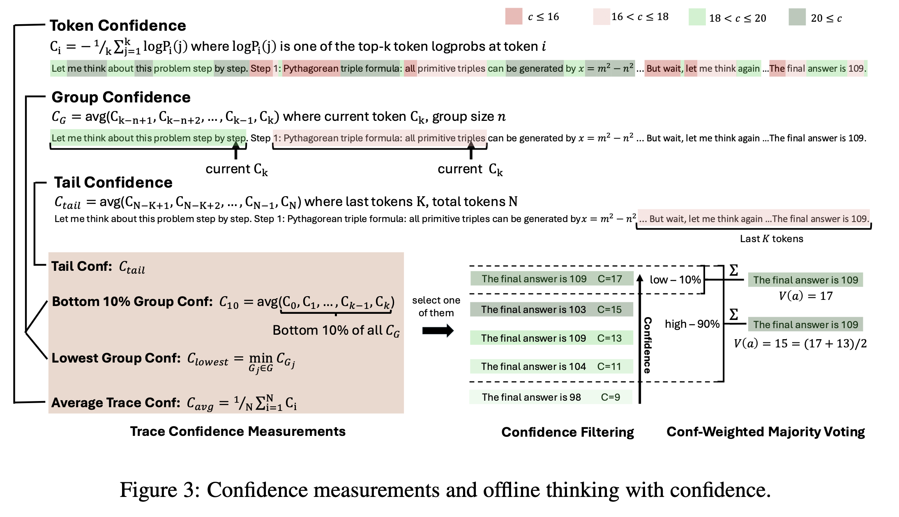
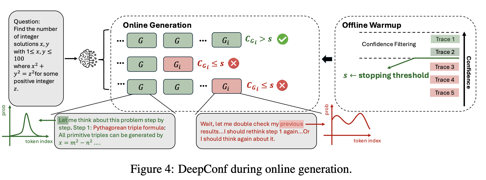

### 🤦🏻‍♂️ 들어가기에 앞서...
이번 논문은 제가 예전부터 읽어보려고 했던 논문인데 이제서야.. 리뷰하게 되네요. 이런 의미에서 블로그가 좋은 것 같기는 합니다. Gpt나 여러 모델들은 자신이 생성한 답변에 대한 '자신감'이라는 수치적 값을 가지고 있습니다. 기존 여러 모델들이 답변을 생성할 때, 자신감이 낮은 답변이 자신감이 높은 답변들에게 묻혀 잘못된 답변을 생성하는 것을 막기 위해 해당 논문이 등장하게 되었습니다. 

### 📺 논문의 전반적인 소개(About. Abstract)
대규모 언어 모델은 ==다수결 투표==(Self-consistency)와 같은 ==추론 시간 확장==(Test-time scaling) 방법을 통해 추론 능력을 보여주었지만, 이는 ==정확도의 수확 체감==(Diminishing Returns) 문제와 ==높은 계산 비용==을 초래합니다. 이 논문에서는 **DeepConf라는 간단하면서도 강력한 방법**을 소개합니다. 이 방법은 추가적인 훈련 없이 모델 내부의 자신감 신호를 활용하여 ==생성 중 또는 생성 후에 품질이 낮은 추론 과정을 동적으로 필터링==합니다. AIME 2025와 같은 벤치마크에서 DeepConf@512 설정은 전체 병렬 사고 대비 생성 토큰 수를 ==최대 84.7% 줄이면서도 최대 99.9%의 정확도==를 달성했습니다

:::tip
자, 엄청나게 어려운 수학문제가 있다고 가정해보죠. 이 문제를 AI에게 일반적으로 1번 문제를 풀게 할 수도 있겠지만, **다수결 투표에 의해서 총 100번** 풀게할겁니다. 만약 정답이 8이라는 것에 20번, 10이라는것에 80번이 나왔다면 ==AI는 정답이 10일 확률이 높다고 판단==할겁니다. 하지만 여기서 문제가 발생합니다. 너무 비효율적이라는거죠. 문제를 5번에서 10번 푼다면 점수가 오를 수 있죠. 근데 문제를 ==1000번에서 10000번 푼다고 해서 성능이 10배 증가하지는 않다는==거죠.이걸 **Diminishing Returns**라고 합니다.
:::

### 💵 논문이 세상에 나오게 된 이유

기존의 추론 방식, 특히 다수결 투표를 활용한 병렬 사고 방식은 3가지 문제점을 가집니다. 먼저, 추론 정확도를 높이기 위해 수많은 추론 경로를 생성해야 하며, 이는 비용을 증가시킵니다. 여기서 추론 경로는 위의 예제에서 설명했던 ==문제를 푸는 것==이라고 이해하시면 됩니다. 그리고 **기존 방식은 모든 추론 경로를 균등하게 취급하여 품질이 낮은 경로가 투표 과정에 섞이게 되고, 경로 수가 늘어날수록 성능 향상폭이 줄어들거나 오히려 감소**합니다. 문제를 풀 때, 잘못 풀어낸 문제가 투표 과정에 섞이게 된다면 성능이.. 감소하겠죠? 마지막으로 기존의 전역적 자신감 측정 방식은 전체 토큰의 평균을 내기 때문에, 추론 과정 중간에 발생하는 ==국소적인 논리적 실패==를 감지하지 못합니다. 

이 말은 조금 어렵죠.. 쉽게 설명을 할께요. 예를 들어야 이해하기 쉬울 것 같으니, 예시를 한번 들어볼게요. 엄청나게 단단한 사슬 99개와 종이로 만들어진 사슬 1개가 서로 연결되어 있습니다. ==강철은 단단하니깐 자신감 점수를 100==점을 주고 ==종이는 강철에 비해서 약하니깐, 자신감 점수를 10점== 줄게요. 그러면 평균 자신감은 어떻게 되나요? $(99x100 + 1x10)/100=99.1$이 되겠죠? ==평균 자신감이 99.1%==이기 때문에, **자신감이 굉장히 높겠죠?** 하지만 실제 결과는 어떻게 되나요? 종이로 된 사슬을 당기면 결국 끊어지겠죠. 이 종이로 된 사슬 하나 때문에 다 망가지게 되는거죠. 여기서 **종이로 된 사슬이 끊어지는걸 국소적 실패라고 합니다.**

그럼 이번에는 실제 AI 환경에서 이해해볼까요? 일반적으로 AI가 답변을 생성할 때는 조사(은/는/이/가)나 당연한 말들(나, 너, 우리, 그들...)에 대해서는 강한 자신감을 가집니다. 그러나 정작 문제를 푸는 순간에, 'x의 값은 5이다'에서 낮은 자신감을 갖는다고 해보죠. 이렇게 되면 ==AI는 정말 중요한 부분이 틀렸음에도 불구하고 강한 자신감을 가지는 말들이 더 많기 때문에 '이 답에 자신이 있다'고 생각하는거죠==. 또한 전체 생성이 완료되어야만 계산이 가능하므로 **조기 종료**(Early stopping)를 통한 비용 절감이 불가능합니다.

### 📻 논문에서의 제안

이 논문에서는 **DeepConf**라는 방법론을 제안하며, 핵심은 ==가장 낮은 그룹 자신감==을 지표로 사용합니다. 앞에서 전체 평균을 사용했더니, ==자신감이 낮은 부분이 묵살==되는 문제가 있었죠? 그래서 전체 평균 대신, 슬라이딩 윈도우으로 토큰 그룹의 자신감을 측정합니다. 또한 추론 경로 내에서 ==가장 자신감이 낮았던 구간==의 점수를 해당 경로의 품질 점수로 사용합니다. 이는 "wait", "let me think again"과 같이 **모델이 확신을 잃는 구간이 전체 추론의 실패를 암시한다는 점**에 착안했습니다. 

이에 따라 두 가지 방식을 실행하는데, 먼저 ==오프라인(Offline) 방식==에 대해서 살펴보죠. 오프라인 방식은 이미 생성된 여러 추론 경로 중, 자신감 점수가 높은 상위 $\eta\%$ 경로만 남기고 나머지는 필터링한 후 가중치 투표를 진행합니다. 쉽게 설명하면 100명의 사람들에게 10분동안 각자 가장 자신있는 음식을 하라고 이야기합니다. 각자 요리를 하겠죠? 시간이 다 지나갔습니다. 각자 테이블 위에 있는 요리를 살펴보니, 자신감이 낮은 음식(탄 음식, 맛없어 보이는 음식)도 보이고, 자신감이 높은 음식(맛있어 보이는 음식)도 보이네요. 오프라인 방식이란, **자신감이 낮은 음식을 다 버리고, 자신감이 높은 음식만 남기는 겁니다.** 자신감이 높은 음식을 시식단이 먹었을 때, 만족도가 당연히 높겠죠. 여기서는 '음식'으로 표현했는데, 실제 AI에서는 '답변'입니다.

요즘 노래 심사하는 프로그램들을 많이 하더라고요. 가수가 꿈인 사람들이 나와서 노래를 하는데, 첫 소절을 들었을때 너무 별로인겁니다. 그래서 심사위원들이 마이크를 꺼버리는... 이 상황을 ==온라인(Online) 방식==으로 볼 수 있습니다. 이 방식은 추론 생성 중에 특정 구간의 자신감이 임계값 $s$보다 떨어지면 즉시 생성을 중단하여 토큰 낭비를 막습니다. 

:::warning
네.. 실제로는 잘하시는 분들만 나오고 제가 한건 하나의 예시..입니다. 진지하게 받아들이지 말아주세요. 😊
:::

### 📡 실험은 어떻게 진행되었는가?
* **비교 대상:** 표준 다수결 투표(Self-consistency with majority voting).
* **실험 모드**
    * **Offline:** 4,096개의 미리 생성된 추론 풀(Pool)에서 샘플링하여 필터링 효과 검증
    * **Online:** 실시간 생성 환경을 시뮬레이션하며, $N_{init}=16$개의 초기 추론(Warmup)을 통해 멈춤 임계값 $s$를 설정하고 적응형 샘플링(Adaptive sampling)을 수행
* **평가 지표:** 정확도(Pass@1, Cons@K 등)와 총 생성 토큰 수
* **변수 통제:** Temperature 0.6~1.0, Top-p 0.95 등으로 설정하고, 자신감 필터링 비율($\eta$)을 10%(공격적 필터링)와 90%(보수적 필터링)로 나누어 테스트 진행

### 🔬 사용한 데이터 & 모델
* **모델 (Models):**
    * DeepSeek-8B (Distilled from R1)
    * Qwen3-8B, Qwen3-32B
    * GPT-OSS-20B, GPT-OSS-120B
* **데이터셋 (Benchmarks):**
    * AIME 2024, AIME 2025
    * BRUMO 2025, HMMT 2025
    * GPQA-Diamond

:::warning
별도의 모델 훈련 없이, 기존의 오픈소스 모델과 벤치마크 데이터를 그대로 사용했습니다.
:::

### 🛢️ 이 논문만의 독창성
이 논문은 모델 답변의 자신감의 전체 평균이 아닌, 추론 과정 중 ==가장 자신 없는 구간==이 전체 품질을 결정한다는 발견을 통해 더 정밀한 필터링을 가능하하게 만들었습니다. 또한, 전체 생성을 기다릴 필요 없이, ==생성 도중 품질이 낮다고 판단되면 즉시 중단==하는 메커니즘을 통해 정확도 저하 없이 토큰 사용량을 최대 84.7%까지 줄였습니다. 마지막으로 추가적인 모델 훈련이나 하이퍼파라미터 튜닝 없이, ==추론 단계에서 즉시 적용 가능한 플러그 앤 플레이 방식==으로 사용 가능하다는 장점을 가지고 있습니다.

### ⏰ 향후 연구 방향

* 자신감 기반의 조기 종료(Early stopping)를 RL 훈련 과정의 탐색 효율성을 높이는 데 활용할 수 있습니다.
* 모델이 틀린 답에 대해 높은 자신감을 갖는 경우를 식별하고 완화하는 연구가 필요합니다.
* 더 정교한 불확실성 정량화 방법을 통해 필터링의 신뢰도를 높일 수 있습니다.

### ❤️‍🔥 결론

DeepConf는 추론 성능을 유지하거나 향상시키면서 ==계산 비용을 크게 절감할 수 있는 방법==일 뿐만 아니라 GPT-OSS-120B 모델을 사용한 실험에서 AIME 2025 벤치마크의 정확도를 99.9%까지 끌어올렸으며, 이는 ==기존 방식 대비 압도적인 결과==를 보여주고 있습니다. 8B부터 120B 파라미터 모델까지 다양한 규모에서 일관된 성능 향상을 보였으며, 이는 Test-time compute 압축이 LLM 추론의 확장 가능하고 실용적인 방법임을 나타냅니다. 제가 생각했을 때, 가장 좋았던 점은 모델 학습 과정에서 적용시키는 것이 아닌, ==추론 과정에서 적용시킬 수 있다는점==이 좀 대단하다고 생각한 부분인 것 같네요.