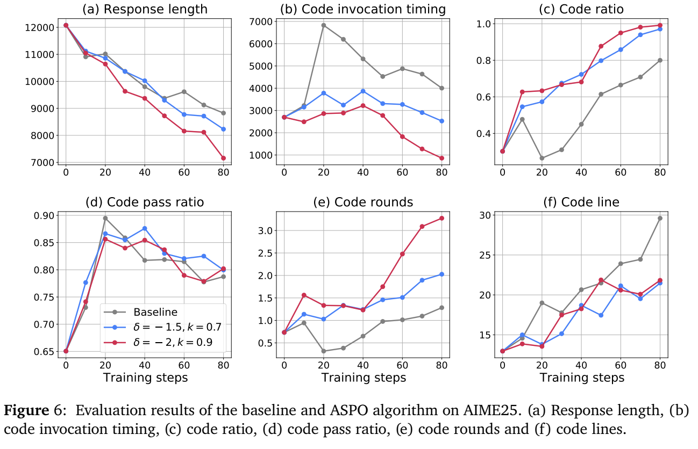

### 🤦🏻‍♂️ 들어가기에 앞서...
언제부턴가 Gemini나, Gpt를 쓰면 데이터를 분석해달라고 하면 python을 coT에서 사용해서 결과를 해석해주더라고요. 네. 모델이 python이나 외부 도구들을 사용하는것을 ==도구 통합 추론==이라고 하는데요, 여기서 제안하는 알고리즘이 어떤 장점이 있고 기존 강화 학습 모델보다 어떤 장점이 있는지 보면 좋을 것 같습니다!

### 🧯 논문의 전반적인 요약
이 연구는 ==도구 통합 추론==(Tool Integrated Reasoning, TIR)이 왜 대규모 언어 모델의 능력을 근본적으로 향상시키는지에 대한 이유를 설명합니다. 논문의 저자들은 TIR이 ==순수 텍스트 모델(Pure-Text Model)의 한계인 '보이지 않는 끈'==(Invisible Leash)을 끊고, 모델의 ==경험 및 실행, 생성 가능한 궤적의 범위==(Support)를 엄격하게 확장시킨다는 것을 최초로 증명했습니다. 이게 한국어로 번역하는 과정이 좀 어렵네요. 

==Invisible Leash==라는 표현이 논문에서 등장하는데, 왜 이런 표현을 썼냐면요.. 여기서 ==Leash==는 강아지 목줄을 의미하거든요? 순수 텍스트 모델의 한계는 바로 저 Invisible Leash에 얽매여있다는 뜻입니다. 강아지가 목줄에 ==길이만큼만 움직일 수 있잖아요?== 이와 마찬가지로 ==순수 텍스트 모델==은 자신이 **원래 알고 있던 지식이나 문장 패턴 안에서 정답을 말할 뿐이지, 아예 몰랐던 새로운 해결 방법을 창조해내지는 못한다는 이론**입니다. 그리고 Support를 확장한다는 것은, 실제로 만들어 낼 수 있는 모든 답변의 집합들을 늘린다는거죠. 이 말은 도구를 쓰면 과거에는 불가능했던 답변이 가능해진다는 뜻입니다.

*(위 사진은 ASPO 알고리즘을 사용한 TIR이 Pure-text 보다 향상된 정확도를 가짐을 보여주는 그래프입니다.)*

또한, 학습 안정성을 해치지 않으면서 모델의 도구 사용 행동을 유도하기 위해 ==ASPO==(Advantage Shaping Policy Optimization)라는 새로운 알고리즘을 제안합니다. 수학 벤치마크 실험 결과, TIR 모델은 순수 텍스트 모델을 압도하였으며, 단순 계산뿐만 아니라 추상적인 통찰력이 필요한 문제에서도 뛰어난 성능을 보였습니다.

:::important

*(위 이미지는 python 코드를 사용할 때와, 텍스트를 사용하는 경우의 차이를 보여줍니다..)*

여기서 ==도구 통합 추론==이 뭘까요? 도구 통합 추론은 대규모 언어 모델이 텍스트 생성에만 의존하지 않고, ==Python 인터프리터와 같은 외부 도구를 활용하여 문제 해결 능력을 확장하는 패러다임==을 말합니다. 

쉽게 설명하면, 사용자가 .csv 파일에 대한 분석을 요청했습니다. 이 .csv 파일을 단순한 텍스트로 분석하면 과연 좋은 성능을 낼 수 있을까요? 물론 좋은 성능을 보일 수 있겠지만, Python에 Pandas등과 같은 외부 도구를 사용하면 보다 ==정확하게 사용자의 요청에 대해 대답==할 수 있는거죠. 정확한 답변만 할 수 있는게 아닙니다. 만약 10000개의 행이 프롬프트에 입력된다면, 아마 텍스트 모델은 이를 하나하나 읽고 처리하느라 ==토큰 제한을 넘어버리거나 중간에 까먹고 실수할 가능성==이 큽니다. 따라서 도구 통합 추론을 사용하는거죠.
:::

### 🧅 논문이 나오게 된 이유
외부 도구를 통합한 모델들이 경험적으로는 성공적이지만, 왜 효과적인지, 그 ==근본적인 메커니즘과 한계는 무엇인지 설명하는 원칙적인 이론이 부재==했습니다. 그리고 기존 강화 학습 이론에 따르면, 순수 텍스트 환경에서의 강화 학습은 기본 모델이 가진 기존 능력 범위 내에서 확률을 재조정하는 것에 불과하며, 근본적으로 새로운 추론 경로를 발견하는 데에는 한계가 있다는 점이였습니다. 마지막으로 모델이 도구를 더 일찍 사용하도록 유도하기 위해 기존의 보상 기반 강화 학습을 적용할 경우, GRPO와 같은 알고리즘에서는 ==학습 불안정성(Training Instability)이 발생==하여 **성능 저하**로 이어지는 문제가 있었습니다.

### ⭐️ 논문에서의 제안
#### **A. 이론적 증명**
먼저 결정론적(Deterministic) 도구를 사용하면 순수 텍스트 모델에서는 확률이 0에 수렴하여 생성할 수 없는 해결 경로를 생성할 수 있음을 증명했습니다. 논문에서는 암호학적 해시 함수의 결과값을 맞히는 상황을 가정합니다. 

예를 들어, SHA-256 함수에 'Hello'라는 입력값을 넣었을 때 출력되는 암호문을 구하라면 어떻게 해야할까요? 순수 텍스트 모델은 직접 계산할 능력이 없기 때문에 다음 글자를 그냥 예측해야합니다. 문자열이 256bit라고 가정하면, 모델이 우연히 이 정답을 한 글자씩 정확하게 맞힐 확률은 $\frac{1}{2^{256}}$입니다. 말도 안되는 값이죠. 즉, 수학적으로 0에 수렴합니다. 따라서 이 정답 경로는 모델의 생성 가능한 답변 범위에 사실상 존재하지 않습니다. 반면 결정론적인 도구를 사용한다면 어떻게 될까요? TIR 모델은 정답을 찍는게 아니라, 코드를 생성하고 실행된 정답을 내놓습니다. 따라서 ==순수 텍스트 모델에게는 확률이 0이였던 결과가, 도구를 거치면 확률이 확실한 결과로 바뀌게 되는거죠.==

:::tip
여기서 결정론적인 도구는 파이썬 인터프리터와 같은 도구를 나타냅니다. 결정론적이라는건 ==같은 입력을 넣으면 언제나 똑같은 결과가 나온다는 뜻==입니다.
:::

그리고 텍스트로 시뮬레이션할 경우 엄청나게 길어지는 알고리즘도 코드로 표현하면 $O(1)$의 비용으로 압축됩니다. 따라서 제한된 토큰 예산 내에서 순수 텍스트 모델은 접근 불가능한 문제 해결 전략을 TIR 모델은 실행할 수 있게 됩니다.

#### **B. ASPO(Advantage Shaping Policy Optimization) 알고리즘 제안**
기존의 보상(Reward) 함수를 수정하는 대신, 이점(Advantage) 함수를 직접 수정하여 모델의 행동을 유도합니다. 정답을 맞힌 경우에 한해, ==코드를 일찍 호출할수록 추가적인 이점==(Advantage)을 부여하되, 이를 ==클리핑==(clipping)하여 학습의 주 목표를 해치지 않으면서 ==안정적으로 조기 코드 실행==(early code invocation)을 유도합니다.

기존의 AI를 학습시키는 방식은 GRPO(Group Relative Policy Optimization)등인데 이름에서도 알 수 있듯이 상대 평가를 사용합니다. 이 상대 평가가 왜 문제인지 살펴볼까요? 

예를 들어, AI에게 하나의 문제에 대해서 5개의 답변을 반환하도록 하겠습니다. 근데 웬일로 AI가 생성한 모든 답변이 정답인 겁니다! 여기서 만약 코드를 빨리 쓰면 보너스 점수를 준다고 하면, 문제가 발생합니다. ==모두 정답을 맞췄기 때문에 변별력이 사라집니다.== 이제 점수 차이는 오직 '누가 코드를 빨리 썼나?'로만 판단되는거죠. 결국 정답을 맞췄음에도 불구하고 ==다른 답변들보다 코드를 조금 늦게 썼다는 이유로 낙제점==(Minus Advantage)를 받게됩니다. 그렇다면 AI는 혼란에 빠지게 되겠죠. 이에 따라 학습 불안정이  발생합니다.

따라서, ASPO는 보상 자체를 건들이지 않고, 최종 성적표인 이점 함수를 직접 수정합니다. 일단 정답을 맞췄는지, 확인하여 기본 점수를 확정합니다. 그리고 정답을 맞춘 답변에게만 코드 생성도 빨리 했다면, ==추가 점수==(Bias)를 줍니다. 이렇게 하면 다른 답변보다 코드 생성이 늦었더라도 일단 정답을 맞췄으니 긍정적인 점수를 유지할 수 있는거죠. 따라서 억울하게 낙제점을 받는 경우가 사라져 학습이 안정적이게 됩니다.

하지만, 코드를 빨리 쓴 것에 대해서 너무 높은 추가 점수를 주게 된다면 AI는 정답이 틀리더라도 코드부터 빨리 실행하려고 ==꼼수==(Reward Hacking)를 사용하기 시작합니다. 따라서 ASPO의 클리핑은 코드를 빨리 쓴 가산점은, ==정답 점수의 k%를 절대 넘을 수 없다고 못 박아두는거죠.== 이를 통해 보상 자체를 왜곡하지 않고, 최종 평가 단계에서 가산점만 안전하게 부여하는 학습 방법인거죠.

### ⏰ 실험은 어떻게 진행되는가?
* **비교군 설정:** 동일한 기본 모델(Qwen3-8B)을 사용하여 **TIR 모델**과 **순수 텍스트 RL 모델**을 비교함
* **평가 지표:** 모델의 잠재적 능력을 평가하기 위해 **pass@k** 지표를 사용
* **심층 분석**
    * **알고리즘 친화도(Algorithmic Friendliness):** 문제가 얼마나 계산 집약적인지 혹은 추상적인지에 따라 문제를 5단계로 분류하여, TIR의 효과가 단순히 '계산기' 역할에 그치는지 분석함
    * **인지 패턴 분석:** 모델이 도구를 어떻게 사용하는지 정성적으로 분석하여 3가지 인지 패턴(통찰 후 계산, 탐색 및 검증, 계산 오프로딩)을 도출
    * **ASPO 검증:** ASPO 알고리즘 적용 시 학습 안정성과 코드 호출 타이밍의 변화를 측정함

### 논문에 사용된 데이터나 모델
* **기본 모델:** **Qwen3-8B**
* **학습 데이터:** **DAPO 데이터셋**에서 무작위로 추출한 10,000개의 수학 문제
* **평가 벤치마크**
    * AIME24, AIME25
    * Omni-MATH-512
* **도구 환경:** Python Code Interpreter

### 📡 이 논문만의 독창성

*(위 사진은 TIR이 Pure-text 보다 향상된 정확도를 가짐을 보여주는 그래프입니다.)*

TIR이 단순히 경험적으로 좋은 것이 아니라, ==LLM의 '실행 가능 Support'를 수학적으로 엄격하게 확장==시킴을 증명하여, 텍스트 모델의 한계를 이론적으로 규명했고, 보상 해킹이나 학습 붕괴 없이 모델의 행동을 제어할 수 있는 안정적인 알고리즘을 제안했습니다.  TIR 모델이 단순 계산기가 아니라, **'통찰을 계산으로 변환(Insight-to-computation)'**하거나 **'코드를 통한 탐색(Exploration via code)'**과 같은 고차원적인 사고 전략을 학습한다는 것을 밝혀냈다는 점이 이 논문만이 가지고 있는 독창성이 되겠네요!

### 🔬 향후 연구 방향
* 본 연구의 이론적 틀은 Python뿐만 아니라 검색 엔진, 검증 도구, 외부 메모리, 구체화된 환경 등 다양한 도구 통합 시나리오에도 적용될 수 있습니다.
* ASPO의 원리는 코드 조기 실행뿐만 아니라, 모델의 다른 바람직한 행동이나 스타일을 유도하는 데에도 광범위하게 적용될 수 있습니다.

### ❤️‍🔥 결론

*(위 그래프(Figure 2)는 TIR 모델이 모든 벤치마크(AIME24, AIME25, Omni-MATH)에서 순수 텍스트 모델보다 압도적인 성능(pass@k)을 보임을 증명합니다.)*

TIR은 LLM의 능력 한계를 상쇄시킵니다. 이는 도구가 '새로운 상태 전이'를 가능하게 하고, 제한된 토큰 내에서 복잡한 알고리즘을 실행할 수 있게 하기 때문입니다. ==외부 도구를 사용하면 복잡한 문제도 해결할 수 있죠.== TIR의 이점은 계산이 많은 문제에만 국한되지 않고, 추상적인 통찰력이 필요한 문제에서도 뚜렷하게 나타난다는 점입니다. 모델은 도구를 사용하여 가설을 검증하고 탐색하는 능력을 갖게 됩니다. 제안된 ASPO 알고리즘은 학습의 안정성을 더할 뿐 아니라, LLM을 단순한 문제 해결자가 아니라, ==특화된 도구에게 계산 작업을 지능적으로 위임하고 조율하는 '추론 엔진'==으로 바라봅니다.