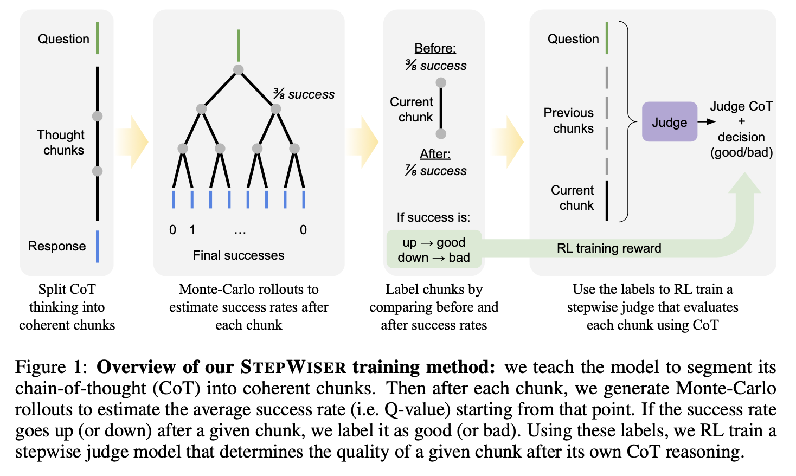
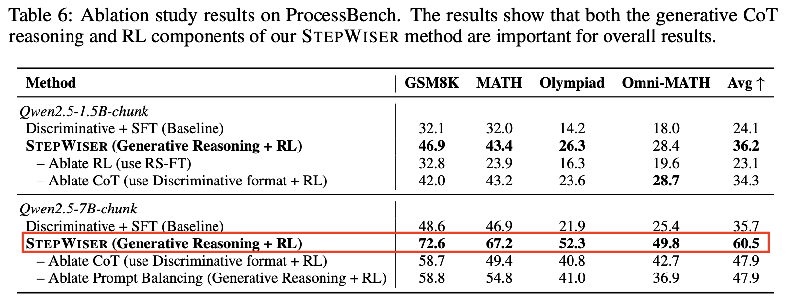
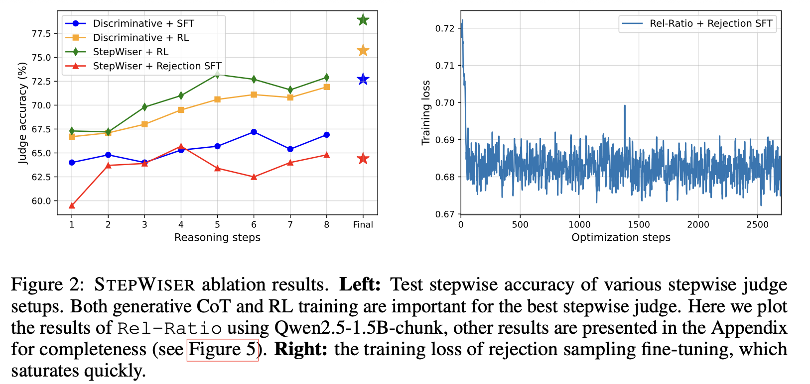

### 🤦🏻‍♂️ 들어가기에 앞서...
기존에는 ==노란색== 하이라이팅 하나만 사용했었는데, 제가 어떻게 뚝딱뚝딱 코딩하다 보니, ??파란색??, ++초록색++, !!빨간색!! 하이라이팅도 추가하게 되서, 이번 포스팅부터는 각 하이라이팅을 좀 구분해서 사용하도록 할게요. 먼저 노란색은 지금처럼 ==핵심 개념, 정의, 주제 문장==에 사용할 예정입니다. 다음으로 파란색은 ??세부적인 내용들, 예시, 근거??, 초록색은 ++용어 정의, 참고 자료++, 빨간색은 !!중요한 변화로 주목해야하는 부분!!에 하이라이팅 할 예정입니다.

일단 원래 저는 NotebookLM을 사용 안했었는데, 이번에 Gemini pro 3가 나왔다고 해서 네.. 써봤습니다. 논문 하나를 넣고 영상을 만드는 기능이 있더라고요? 그래서 만들어봤는데 영상의 퀄은 잘 모르겠는데 설명 하나는 정말 잘하더라고요. 그래서 이제 매 포스팅 초반부에 영상을 첨부할까 합니다. 아마 영상을 보고, 글을 읽으시면 아마 더 도움이 될겁니다!

<video controls width="100%">
  <source src="/videos/2025-11-29/stepwiser_video.mp4" type="video/mp4">
</video>

### 🧯 논문의 전반적인 요약

*(위 이미지는 STEPWISER의 전반적인 학습 과정을 시각화한 사진입니다.)*

이 논문은 복잡한 문제를 해결하기 위한 모델의 ++다단계 추론++(Multi Step Reasoning) 과정을 감독하는 새로운 방법론인 ==STEPWISER==를 제안합니다. 여기서 다단계 추론이란, 어려운 수학 문제를 AI에게 풀게 할 때 AI가 문제에 대한 정답을 바로 내놓는게 아니라, ++문제를 여러 단계로 쪼개서 논리적으로 풀어가는 과정++을 의미합니다. 우리가 흔히 아는 다단계 추론 기법에는 ??CoT(Chain of Thought)라고 불리는 기법??이 있습니다. 

기존의 ++과정 보상 모델++(Process Reward Models, PRMs)은 단순히 분류기로서 작동하며 ==설명이 부족하고 정적인 데이터셋에 의존하여 일반화에 한계==가 있었습니다. 왜냐하면 기존의 과정 보상 모델은 문제를 풀었을 때, 정답이 맞다와 그렇지 않다 이 두 가지로만 평가했기 때문이죠. 하지만 이 과정은 명백하게 문제점이 있었습니다. 기존의 방식은 '모로 가도 서울만 가면 된다'는 말과 일맥상 통하기 때문입니다. 

따라서 저자들은 단계별 보상 모델링을 분류 작업이 아닌 ++메타 추론++(Meta Reasoning)으로 재정의하여, 판단을 내리기 전에 Thinking Tokens을 생성하는 ++생성형 심판++(Generative Judge) 모델을 제안합니다. 여기서 말하는 메타 추론이란, ++추론 과정 그 자체에 대해서 한번 더 추론하는 것을 의미++합니다. 기존의 추론은 단순히 문제를 풀기 위한 공식을 세우고, 계산하는 것이였다면 ??메타 추론은 AI 모델이 내놓은 청크를 보고 이 계산 과정이 논리적으로 타당한지를 확인??하죠. 

이 모델은 강화학습을 통해 훈련되며, 기존 방법보다 높은 판단 정확도를 보이고 정책 모델의 성능을 훈련 및 추론 단계에서 모두 향상시킬 수 있음을 보였습니다.

### 🧅 논문이 나오게 된 이유
기존 PRM은 추론 단계가 올바른지 그른지에 대한 점수나 라벨만 제공할 뿐,!!"왜" 그런지에 대한 설명은 제공하지 못했고!!, 지도 미세 조정(Supervised Fine Tuning, SFT)에 의존하는 기존 방식은 !!고정된 데이터셋을 사용하므로 새로운 추론 패턴에 대한 일반화 능력이 떨어졌습니다.!! 이 부분은 이전에 나왔던 TIR 논문에서도 제기되었던 문제였죠. 아마 사전학습된 LLM 모델의 일반적인 단점으로 보입니다. 마지막으로 결과 중심의 보상 모델(Outcome Reward Models, ORM)은 최종 정답에만 의존하므로 !!중간 단계에 대한 피드백이 희소하다는 단점!!이 있었습니다. 아무래도 ??이 문제의 풀이 과정이 맞는가?? 보다는 ??이 문제의 정답이 맞는가??에 집중해서 발생된 사건이라고 생각합니다.

### ⭐️ 논문에서의 제안

*(위 사진은, 기존 청크 분할과 대비되는 방식을 보여줍니다.)*

1. **CoT 자체 분할 (Self-Segmentation):**
기존의 줄바꿈(\\n\\n) 기반 분할 대신, 모델이 ==논리적으로 완결된 단위인 CoT로 자신의 추론 과정을 스스로 분할==하도록 훈련합니다.
2. **롤아웃의 상대적 결과를 이용한 라벨링 (Stepwise Data Annotation):**
각 청크의 품질을 평가하기 위해 ++몬테카를로 롤아웃++(Monte Carlo Rollout)을 수행합니다. 특정 단계 이전과 이후의 성공률 변화를 비교하여 해당 단계가 성공 확률을 높였는지 낮췄는지를 기준으로 상대적인 보상 라벨(Relative Reward Label)을 생성합니다. 

먼저 몬테카를로 롤아웃 (Monte Carlo Rollout)이란, 간단히 말해 ==현재 시점에서 가능한 여러 미래를 미리 시뮬레이션해 보는 것==입니다. 쉽게 예시를 들어볼까요? AI 모델이 수학 문제를 풀고 있는데, 중간 단계(청크 $a_i$)가 맞는지 틀린지 모르는 상황입니다.이 중간 단계 $a_i$에서 시작하여, 모델에게 끝까지 문제를 풀게 시킵니다.(이 부분을 롤아웃이라고 합니다.) 이때 한 번만 풀게 하는 것이 아니라, $M$번(논문에서는 16번을 하네요.😊) 반복하여 서로 다른 풀이 경로를 생성합니다. 먼저 성공률(Q value)을 측정합니다. 생성된 16개의 최종 답변 중 정답과 일치하는 비율을 계산합니다. 예를 들어, 16번 중 8번 정답을 맞혔다면, 이 시점에서의 성공률은 50\%가 됩니다. 그리고 단순히 성공률이 높다고 해서 좋은 단계라고 단정 짓지 않고, ==이 단계를 거침으로써 상황이 얼마나 좋아졌는가?==를 봅니다. 이를 위해 이전 단계의 성공률과 현재 단계의 성공률을 비교합니다.

다음으로 이 변화를 측정하기 위해 주로 ==비율==(Rel-Ratio)이나 ==유효 보상==(Rel-Effective) 방식을 사용합니다.
- 상황 A (좋은 단계)
  - 이전 단계 성공률: 30% (아직 갈피를 못 잡음)
  - 이번 단계 수행 ($a_i$): 결정적인 공식을 올바르게 유도함.
  - 롤아웃 결과(성공률): 70%로 상승
  - 판단: 성공률이 크게 올랐으므로 이 단계는 "Positive(정답)" 라벨을 받습니다
- 상황 B (나쁜 단계)
  - 이전 단계 성공률: 80% (거의 다 맞혀감)
  - 이번 단계 수행 ($a_i$): 계산 실수를 저지름.
  - 롤아웃 결과(성공률): 20%로 급락
  - 판단: 성공률을 떨어뜨렸으므로 이 단계는 "Negative(오답)" 라벨을 받습니다
이 부분에서 ==절대적인 성공률(Abs-Q)==만 보면 10%에서 50%로 만든 훌륭한 단계와, 90%에서 60%로 만든 나쁜 단계를 ==구분하기 어렵다는 점을 지적합니다.== 따라서 몬테카를로 롤아웃을 통해 ??미래를 예측해보고, 이 단계 덕분에 정답에 더 가까워졌는가?를 기준으로 보상을 주는 것??입니다.

3. **RL을 통한 온라인 학습:**
생성된 라벨을 바탕으로 심판 모델을 강화학습, 구체적으로는 ++GRPO++(Group Relative Policy Optimization, GRPO) 알고리즘을 사용하여 훈련합니다. 여기서 GRPO는 이전 논문에서 본 적 있죠? 생성된 답변들에 대해서 상대 점수를 부여하는거죠? 하지만 !!이런 상대 점수의 평균을 구하는 것은 최소 Confidence를 가지는 부분을 묵살시킬 수 있다!!고, [이전 논문](https://pxxguin.github.io/posts/2025-11-27-confidence/)에서 언급한적이 있습니다. 따라서 심판 모델은 단순히 O/X를 맞추는 것이 아니라, 먼저 해당 단계에 대해 CoT를 수행한 후 최종 판결을 내리도록 학습됩니다.

### ⏰ 실험은 어떻게 진행되는가?
* **심판 정확도 평가:**
   * GSM8K, MATH, Olympiad 등 다양한 데이터셋이 포함된 ProcessBench를 사용하여, 심판 모델이 추론의 첫 번째 오류 단계를 얼마나 정확하게 식별하는지 측정함
   * RL 훈련 여부, CoT 사용 여부, 데이터 밸런싱 여부 등에 대한 제거 연구를 통해 각 구성 요소의 기여도를 분석함
* **추론 시 검색 성능 평가:**
   * **Chunk-Reset Reasoning:** 추론 시 심판 모델이 현재 청크를 평가하고, 오류라고 판단되면 해당 청크를 버리고 다시 생성하는 방식을 적용함
* **데이터 선별 및 모델 훈련:**
   * STEPWISER 심판을 사용하여 정책 모델이 생성한 데이터 중 고품질 데이터를 선별하고, 이를 다시 정책 모델 훈련에 사용하여 성능이 향상되는지 검증을 진행

### 📊 논문에 사용된 데이터나 모델
  * **Base Models:** Qwen2.5-1.5B-it & Qwen2.5-7B-it
  * **훈련 데이터:** NuminaMath-CoT
  * **검증 도구:** Math-Verify
  * **알고리즘:** **GRPO**
  * **자체 분할 훈련 데이터 생성:** Llama-3.1-70B-it 모델을 프롬프팅하여 기존 CoT를 논리적 청크로 분할하는 데이터를 생성하고 이를 기반 모델에 학습

### 📡 이 논문만의 독창성
심판 모델이 단순히 분류만 하는 것이 아니라, 메타 추론을 하도록 설계하여 평가의 정확도와 투명성을 높였습니다. 앞에서 설명했듯, ==추론 과정 중에서 생성된 답변을 논리적으로 맞는지 다시 추론한다는거죠==. 그리고 정적인 SFT 데이터에 의존하는 기존 방식과 달리, 몬테카를로 롤아웃을 통해 얻은 단계별 신호를 사용하여 심판 모델을 온라인 강화학습으로 훈련시켰습니다. 또한 단계의 절대적인 품질뿐만 아니라, 해당 단계가 ==성공 확률을 얼마나 변화시켰는지를 반영하는 라벨링 방식==을 도입하여 더 효과적인 학습 신호를 제공했고, 추론 단계를 임의의 토큰이 아닌 논리적 완결성을 가진 청크 단위로 나누도록 모델을 훈련시켜 평가의 단위를 명확히 했습니다. 기존에는 ??철수가 밥을 ...?? 이렇게 끊겼다면 지금은 ??철수가 밥을 먹습니다.??로 완결된 청크를 가질 수 있게 되었죠.

### 🔬 향후 연구 방향
* 현재 실험은 상대적으로 짧은 추론 과정에 집중되어 있으나, 연구진은 이 방법론이 수천 토큰 이상의 긴 추론 과정을 거치는 모델에 더욱 유용할 것으로 예상하며 이를 향후 과제로 남겼습니다.
* 이진 분류 문제에서 RL 훈련 시 엔트로피가 급격히 낮아지는 문제를 해결하기 위해 현재는 ++Clip Higher++ 기술을 사용했으나, 더 발전된 기법, 예를 들어 Diverse Preference Optimization를 적용하여 훈련 안정성을 높일 수 있을 것으로 기대합니다.

### ❤️‍🔥 최종 결론

*(위 사진은 STEPWISER를 적용시킨 결과를 표 형태로 나타냅니다.)*

먼저 ==사고의 청크 분할, 롤아웃의 상대적 결과에 기반한 보상 할당, RL을 이용한 생성형 심판 훈련으로 이어지는 일련의 과정이 매우 효과적임이 입증==되었습니다. 그리고 STEPWISER는 기존의 SFT 기반 분류기나 결과 중심의 RL 모델보다 ==ProcessBench 평가에서 월등히 높은 정확도==를 보였습니다. 마지막으로 이 심판 모델은 추론 시 탐색을 통해 더 나은 답변을 생성하게 하거나, 더 나은 훈련 데이터를 선별하여 정책 모델 자체를 개선하는 데에도 유용하게 사용될 수 있습니다. 

*(위 사진은 STEPWISER를 적용시킨 결과를 그래프 형태로 나타냅니다.)*

쉽게 말해, ++문제를 의미 있는 청크로 나누고 미래 결과를 예측해 논리적으로 설명하도록 훈련된 STEPWISER++는 기존의 단순한 채점 방식보다 훨씬 더 ==정확하게 오류를 잡아낼 수 있다는 것이 증명==되었습니다 . 마치 과외 선생님처럼, 이 모델은 AI가 문제를 풀 때 실시간으로 틀린 길을 바로잡아 더 나은 답변을 내놓게 돕거나, 학습에 필요한 고품질 데이터만 골라내어 AI의 전반적인 실력을 크게 향상시키는 데에도 매우 유용하게 쓰일 수 있다는 장점까지 가지고 있네요.