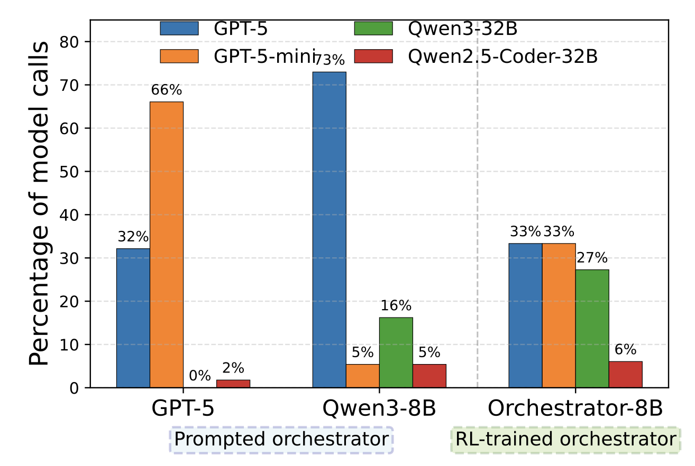
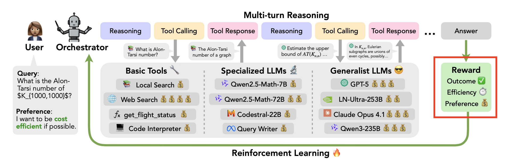
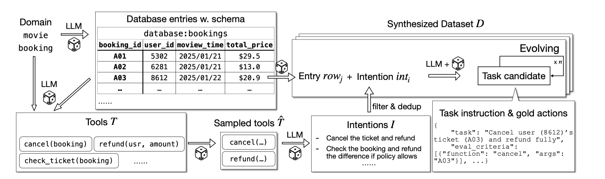

### 🤦🏻‍♂️ 들어가기에 앞서...
이번 논문을 보니깐, 10페이지 정도 되는 비교적 짧은 논문입니다. 보니깐 딱히 수학적으로 서술하기 어려운 내용들도 없어보이고, 작은 모델이 Gpt-5보다 좋은 성능을 냈다는 말에 이끌려서.. 이번 논문을 리뷰하게 되었습니다. TMI이긴한데, 시간이 갈수록 대단해보이는 논문이 많이 나오네요.. 일단 시작해보죠.

<video controls width="100%">
  <source src="/videos/2025-12-02/toolorchestra.mp4" type="video/mp4">
</video>

### 🧯 논문의 전반적인 요약
LLM 모델은 강력하지만, ??Humanity's Last Exam??(HLE)과 같은 복잡하고 깊이 있는 문제를 해결하는 데에는 여전히 개념적으로 어려움과 높은 비용 문제가 발생합니다. 본 논문은 작은 지휘자(Orchestrator) 모델이 다양한 도구와 다른 모델들을 관리함으로써 지능의 상한선을 높이고 효율성을 개선할 수 있음을 보여줍니다. 

논문의 저자들은 지능형 도구를 조정하는 작은 지휘자를 훈련하기 위한 방법론인 ++ToolOrchestra++를 소개합니다. 이 방법은 결과, 효율성, 사용자 선호도를 고려한 보상을 통해 강화 학습을 수행합니다. 그 결과 ==Orchestrator-8B== 모델은 HLE, $\tau^{2}$-Bench, FRAMES 벤치마크에서 ==Gpt-5보다 높은 정확도를 달성하면서도 비용은 훨씬 절감하고 사용자 선호도를 잘 따르는 성능을 보였습니다.==

### 🧅 논문이 나오게 된 이유
기존 접근법은 주로 하나의 강력한 모델에 웹 검색이나 계산기와 같은 유틸리티 도구만 장착하는 방식이었습니다. 이는 도구들의 강점을 충분히 활용하지 못하는 것이며, 인간이 전문가나 정교한 소프트웨어 시스템 등 자신보다 뛰어난 자원을 활용하여 문제를 해결하는 방식과 대조됩니다. 우리는 ==하나의 모델에게 모든 것을 잘하도록 요구==합니다. 하나의 LLM 모델이 수학, 법, 과학 등 모든 걸 잘하도록 요구하죠. 하지만, 하나의 모델에게 모든 것들을 잘하기는 좀 힘든게 현실입니다.

++사전 모델++(Off-the-shelf LLM)을 단순히 프롬프팅하여 지휘자로 사용할 경우, ++자기 고양 편향++(Self-Enhancement Bias)으로 인해 ==자신의 변형 모델을 지나치게 자주 호출하거나, 비용 효율성을 고려하지 않고 무조건 가장 강력한 도구만 선택하는 경향==이 나타납니다. 또한 비용 효율성과 사용자 선호도라는 두 가지 축에서 기존 에이전트들의 제어 능력은 충분히 탐구되지 않았습니다. 위의 그래프를 보시면 알 수 있듯이, ??Gpt-5로 만든 지휘자는 Gpt-5-mini를 많이 호출??하고 ??Qwen3-8B 지휘자도 Gpt-5를 많이 호출??하죠.(Qwen은 조금 이상하긴 하네요. 원래 자기 고양 편향에 의해서 Qwen 모델을 호출해야 맞기는 한데..)

### ⭐️ 논문에서의 제안
본 논문은 **ToolOrchestra**라는 방법론을 통해 이질적인 도구 사용 에이전트의 두뇌 역할을 하는 작은 언어 모델을 훈련시킬 것을 제안합니다. 본 논문에서는 지휘자 패러다임이라고 설명하는데, ==지능이 단일 모델에서 나오는 것이 아니라, 다양한 모델과 도구로 구성된 복합 시스템에서 창발하도록 설계==했습니다. 8B 크기의 작은 모델이 더 지능적인 모델이나 전문화된 도구를 호출합니다.

웹 검색, 코드 인터프리터 같은 기본 도구뿐만 아니라, 수학 특화 모델이나 코딩 모델, 범용 LLM 등 도메인 특화 모델까지 모두 ==도구==로 간주하여 단일 인터페이스로 통합했습니다. 

모델 훈련 시, 다음 3가지 보상을 중요하게 여깁니다.
1. **결과 보상 (Outcome):** 최종 결과의 정확성
2. **효율성 보상 (Efficiency):** 계산 비용 및 지연 시간 최소화
3. **선호도 보상 (Preference):** 사용자가 원하는 도구 사용 비용이나 특정 도구 선호도에 대한 정렬

### ⏰ 실험은 어떻게 진행되는가?
* **훈련 방법:**  GRPO(Group Relative Policy Optimization)를 사용하여 오케스트레이터 모델을 미세 조정함

* **데이터 합성:** 검증 가능한 도구 사용 데이터가 부족하기 때문에, ++ToolScale++이라는 데이터 합성 파이프라인을 구축이는 도메인별 데이터베이스와 도구 API를 시뮬레이션하고, 이를 바탕으로 다양한 사용자 작업과 정답 궤적을 생성하는 방식임

* **평가 벤치마크**
    * **HLE (Humanity's Last Exam):** 복잡한 추론과 다분야 지식을 요구하는 벤치마크
    * **$\tau^{2}$-Bench:** 도구 스케줄링 및 함수 호출 능력을 평가
    * **FRAMES:** 사실적 추론(Factuality reasoning) 및 다중 턴(Multi-turn) 검색 능력을 평가
* **비교군:** 도구가 없는 모델, 기본 도구만 사용하는 모델, 그리고 단순 프롬프팅으로 도구를 사용하는 대형 모델과 비교 실험을 진행

### 📊 논문에 사용된 데이터나 모델
* **Backbone Model:** **Qwen3-8B**을 기반으로 Orchestrator-8B 훈련
* **훈련 데이터:**
    * **General Thought-430K:** 일반적인 사고 능력을 위한 데이터셋
    * **ToolScale (Synthetic Data):** 본 논문에서 생성한 합성 데이터로, 10개 도메인에 걸친 복잡한 환경과 수천 개의 검증 가능한 멀티 턴 도구 사용 예제를 포함함
* **사용된 도구 세트 (Tools):**
    * **기본 도구:** Tavily, Python Sandbox, Faiss
    * **전문화된 LLM:** Qwen2.5-Math-72B/7B, Qwen2.5-Coder-32B 등
    * **범용 LLM:** GPT-5, GPT-5-mini, Llama-3.3-70B, Qwen3-32B 등

### 📡 이 논문만의 독창성
단순히 API를 호출하는 것을 넘어, ==다른 LLM을 도구로서 호출하고 관리==한다는 점이 기존 연구와 차별화됩니다. 그리고 정확도뿐만 아니라 비용, 지연 시간, 사용자 선호도를 동시에 최적화하는 보상 설계를 도입하여 실용적이고 제어 가능한 에이전트를 구현했습니다. 마지막으로 8B 파라미터 크기의 작은 모델도 ==적절한 훈련을 통해 GPT-5와 같은 거대 모델보다 더 효율적이고 정확하게 복잡한 작업을 수행할 수 있음을 증명==했습니다.

### 🔬 향후 연구 방향
* 더 정교한 재귀적 시스템을 통해 지능의 상한선을 더욱 높이고, 점점 더 복잡해지는 에이전트 작업을 해결하는 데 있어 효율성을 강화하는 방향을 제시하고 있습니다.

### ❤️‍🔥 최종 결론
다양한 도구와 전문화된 모델들을 통합 관리할 수 있는 작은 오케스트레이션 모델을 훈련하는 방법론인 ++ToolOrchestra++를 제안했습니다. 강화 학습을 통해 ==오케스트레이터가 결과의 품질, 효율성, 그리고 인간의 선호도 보상에 따라 적응형 도구 사용 전략을 계획할 수 있음을 보였습니다.== 이는 정적인 규칙이나 단순한 지도 학습에 의존하는 기존 방식과 달리, 에이전트가 성능과 비용 사이의 균형을 동적으로 조절할 수 있게 합니다. 실험 결과, Orchestrator-8B는 훨씬 적은 비용으로 대형 모델 대비 !!SOTA!! 성능을 달성했습니다. 마지막으로 연구 커뮤니티를 위해 복잡한 사용자->에이전트->도구 상호작용을 포함하는 합성 데이터셋인 ToolScale을 제공한다는 점이 좋아보이네요.
