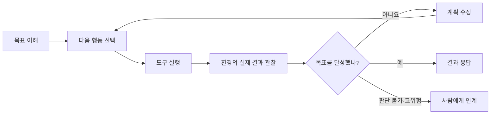

## 🤖 들어가기에 앞서

고객이 “지난주에 산 운동화를 환불하고 싶어요”라고 문의했습니다. 챗봇은 환불 규정을 찾아 친절하게 설명할 수 있습니다. 주문 조회 API까지 연결하면 주문 상태도 보여줄 수 있고요. 그렇다면 이 시스템은 이제 AI 에이전트일까요?

저도 처음에는 LLM에 도구 몇 개를 붙이면 에이전트라고 생각했습니다. 뭔가 API도 호출하고, 검색도 하고, 혼자서 답변까지 만들어내면 충분히 에이전트처럼 보이잖아요? 요즘은 검색, 요약, 자동화 어디에나 ‘에이전트’라는 이름이 붙으니 더 헷갈렸고요.

그런데 책을 읽으면서 계속 걸리는 게 하나 있었습니다. 정해진 순서대로 API 세 개를 호출하는 프로그램과, 결과를 보고 다음 행동을 바꾸는 프로그램을 정말 같은 에이전트라고 불러도 될까요? 예.. 아무래도 다른 친구였습니다. 둘의 경계를 가르는 건 도구의 개수가 아니라 ==누가 다음 행동을 결정하는지==였습니다.

이번 글부터 「AI 에이전트 엔지니어링」을 바탕으로 총 24편의 시리즈를 시작합니다. 온라인 쇼핑몰의 주문·환불 처리 시스템을 글마다 조금씩 확장하면서, 데모가 실제 운영 시스템이 되려면 무엇이 필요한지 알아보겠습니다.

:::important
이번 글의 질문은 하나입니다. ==AI 에이전트는 일반 챗봇이나 자동화와 무엇이 다르고, 우리는 언제 그 복잡성을 감수해야 할까요?==
:::

## 🧭 에이전트라는 이름보다 결정권을 보자

먼저 에이전트(Agent)라는 단어부터 조금 애매합니다. 워낙 넓게 쓰이다 보니 프로그램이 사용자 대신 무언가만 해도 에이전트라고 부르는 경우가 있습니다. 그러면 백신 프로그램의 모니터링 Agent도 에이전트고, 주문 상태를 주기적으로 확인하는 Batch도 에이전트입니다. 틀린 표현은 아니지만 우리가 이번 시리즈에서 이야기할 AI 에이전트와는 거리가 있습니다.

NIST는 AI 에이전트를 환경과 상호작용하고, 정보를 받아 외부에서 주어진 목표를 위해 스스로 행동할 수 있는 소프트웨어로 설명합니다.[^1] 여기까지 읽으면 또 “그럼 자동화 Script도 목표를 받아 행동하는 것 아닌가요?”라는 생각이 듭니다. 맞습니다. 그래서 LLM 기반 에이전트는 행동한다는 사실만으로 구분하기 어렵습니다.

LLM 기반 에이전트로 범위를 좁히면 한 가지가 더 중요해집니다. 모델이 답변의 문장만 만드는 것이 아니라, ==목표를 이루기 위한 작업 흐름과 도구 사용을 동적으로 결정한다==는 점입니다. OpenAI의 실무 가이드도 LLM이 워크플로 실행을 관리하고 도구를 선택하지 않는 단순 챗봇이나 단발성 LLM 응답은 에이전트로 보지 않습니다.[^2]

주문·환불 사례로 비교해볼까요?

```text
사용자: 지난주에 산 운동화를 환불하고 싶어요.

챗봇
  → 환불 규정을 설명한다.

고정 워크플로
  → 주문 번호를 받는다.
  → 정해진 API 순서대로 조회한다.
  → 정해진 조건문으로 환불 가능 여부를 계산한다.

에이전트
  → 요청에서 주문을 특정할 단서를 찾는다.
  → 주문 조회가 필요한지 스스로 판단한다.
  → 배송 상태와 환불 규정을 확인한다.
  → 정보가 부족하면 사용자에게 다시 묻는다.
  → 예외 주문이면 사람에게 승인을 요청한다.
  → 도구 결과를 보고 계획을 고쳐 이어간다.
```

세 시스템 모두 AI를 사용할 수 있습니다. 차이는 자연어 화면의 유무가 아닙니다. ==미리 작성한 코드가 경로를 고르면 워크플로이고, 모델이 관찰한 결과에 따라 다음 경로를 고르면 에이전트==에 가깝습니다. Anthropic 역시 워크플로를 미리 정의된 코드 경로로 도구와 모델을 연결한 시스템, 에이전트를 모델이 과정과 도구 사용을 동적으로 지휘하는 시스템으로 구분합니다.[^3]

그러니 “도구를 호출했으니 에이전트”도 아니고, “여러 단계를 거쳤으니 에이전트”도 아닙니다. 이 부분이 제가 처음에 가장 헷갈렸던 지점입니다. 겉으로 보면 둘 다 주문을 조회하고 환불 결과를 알려주니까요.

하지만 고정된 세 단계가 차례로 실행된다면 도구를 쓰는 워크플로일 수 있습니다. 반대로 모델 하나만 사용하더라도 주문 조회 결과를 보고 계획을 수정하고, 다음에 필요한 도구를 직접 고른다면 에이전트가 될 수 있습니다. ==에이전트다움은 겉으로 보이는 기능보다 실행 도중에 가진 결정권에서 나옵니다.==

## 🪜 코드부터 자율 에이전트까지, 계단으로 이해하기

책에서는 현실의 선택지를 코드, 워크플로, 챗봇·RAG, 자율 에이전트로 나눕니다. 처음에는 이것도 그냥 AI 시스템의 발전 단계처럼 보였습니다. 코드를 쓰다가, RAG를 붙이고, 마지막에는 에이전트로 가는 식으로 말이죠.

그런데 그렇게 보면 모든 서비스가 언젠가는 자율 에이전트가 되어야 한다는 이상한 결론이 나옵니다. 날짜 한 줄 파싱하는 프로그램까지 스스로 계획을 세워야 할까요? 아니잖아요??? 저는 이 구분을 발전 단계가 아니라 ==필요한 결정권을 한 칸씩 모델에게 넘기는 계단==으로 이해했습니다. 필요한 층에서 내리면 됩니다.

예를 들어 날짜 형식이 항상 일정한 로그를 파싱한다고 해보겠습니다. 일반 코드로 충분합니다. 빠르고 싸고, 같은 입력에는 같은 결과가 나오니 나중에 확인하기도 쉽습니다. 여기에 LLM을 호출하면 정규식보다 느리고 비싸지는 데다가 결과가 매번 똑같으리라는 보장도 없습니다. 굳이.. 사용할 이유가 없습니다.

분기가 몇 가지 있지만 미리 알 수 있다면 결정적 워크플로가 어울립니다. 주문을 조회하고, 출고 전이면 취소하고, 이미 출고됐다면 반품 접수를 안내하는 식입니다. 코드가 다음 행동을 고르기 때문에 예외와 재시도, 승인 시점을 우리가 통제하기 쉽습니다. 대신 분기가 계속 늘어나면 조건문을 관리하기 귀찮아지겠죠.

“환불 규정이 어떻게 돼?”처럼 문서에서 근거를 찾아 답하기만 하면 된다면 챗봇·RAG로도 충분합니다. 모델은 자연스러운 답변을 만들지만 외부 행동을 스스로 이어갈 필요는 없습니다.

그러면 자율 에이전트는 언제 사용할까요? 입력이 계속 달라지고, 도구의 결과를 보기 전에는 다음 경로를 정할 수 없을 때입니다. 모델이 계획과 도구를 직접 고르니 새로운 상황에는 유연하지만, 그만큼 지연과 비용, 비결정성까지 함께 가져옵니다. 오른쪽으로 갈수록 무조건 더 좋은 시스템이 아니라 ==모델에게 더 많은 결정권과 운영 비용을 함께 넘기는 구조==인 것입니다.

환불 조건이 법과 회사 정책으로 완전히 고정되어 있다면 그 판정까지 모델에게 맡길 이유도 없습니다.

반대로 고객 메일은 참 변화무쌍합니다. “신발이 안 맞아요”, “선물 받은 건데 주문 번호를 몰라요”, “교환하려다 품절이라 환불할래요”처럼 입력이 흔들리고, 조회 결과에 따라 다음 질문도 달라집니다. 이런 구간에서는 자연어 이해와 동적 계획이 가치를 만듭니다.

:::tip
처음부터 하나를 고를 필요도 없습니다. ==정책 판정과 금액 계산은 코드로 고정하고, 요청 해석과 정보 수집 순서만 에이전트에게 맡기는 혼합 구조==가 실제 서비스에서는 더 자연스럽습니다.
:::

## 🔁 자율성은 ‘알아서 한다’보다 관찰 루프에 가깝다

에이전트가 사람처럼 모든 것을 알아서 한다고 생각하면 설계가 금방 막힙니다. 솔직히 “자율 에이전트”라는 말부터 조금 거창합니다. 뭔가 목표만 던져주면 밤새 알아서 일하고, 다음 날 완성된 결과를 가져올 것 같잖아요? ㅎㅎ

제가 이해한 에이전트의 핵심은 천재적인 한 번의 답이 아니라 꽤 끈질긴 확인 과정에 가깝습니다. 일단 하나를 해보고, 실제 결과를 확인하고, 안 됐으면 계획을 고쳐 다시 움직이는 루프입니다.



고객센터 직원으로 생각하면 편합니다. 고객이 주문 번호를 잘못 말했을 때 직원은 바로 “주문 없음”이라고 통화를 끊지 않습니다. 구매 날짜를 다시 묻고, 상품명으로 조회하고, 혹시 비회원 주문인지 확인합니다. 에이전트도 비슷합니다. 주문 조회 도구가 실패했을 때 사용자가 말한 날짜와 상품명으로 범위를 좁히거나, 다른 계정으로 주문했는지 다시 물을 수 있습니다.

물론 이 비유에는 한계가 있습니다. 사람은 회사의 규정과 책임을 이해하지만 모델은 그럴듯한 다음 행동을 계산할 뿐입니다. 따라서 환불 금액이 정책 한도를 넘으면 에이전트가 자신 있게 처리하도록 둘 게 아니라 사람에게 넘겨야 합니다.

이때 계획은 모델 머릿속의 이야기만으로 완성되지 않습니다. ==도구가 돌려준 실제 결과를 다음 판단에 반영해야 합니다.== Anthropic도 에이전트가 각 단계에서 도구 실행 같은 환경의 실제 정보를 확인하고, 완료·중단 조건과 사람의 개입 지점을 두어야 한다고 설명합니다.[^3]

흠... 그러면 한 번 실패하고 다른 방법을 시도하는 시스템은 모두 에이전트일까요? 꼭 그렇지는 않습니다. ??HTTP 503이면 세 번 재시도한다??처럼 대응이 미리 정해졌다면 여전히 워크플로입니다. 모델이 실패 이유와 현재 목표를 함께 보고 “다시 조회할지, 다른 도구를 쓸지, 사용자에게 물을지”를 선택할 때 에이전트다운 결정이 생깁니다.

## 🛒 주문·환불 업무를 네 방식으로 판정해보기

이제 작은 설계 실습을 해보겠습니다. 아직 프레임워크를 설치하거나 코드를 작성하지 않습니다. 먼저 업무를 보고 어떤 수준의 자율성이 필요한지 판정하는 편이 순서에 맞기 때문입니다.

다음 요청들을 같은 ‘환불 기능’으로 뭉뚱그리지 말고, 입력이 얼마나 달라지는지와 중간 판단이 필요한지를 살펴봅니다.

먼저 “ORD-1004 주문 취소해줘”라는 요청이 들어왔습니다. 주문 번호가 이미 있고, 주문 조회와 출고 여부 확인, 취소라는 순서도 분명합니다. 이런 작업은 결정적 워크플로로 시작하는 편이 낫습니다. 모델이 새로운 경로를 찾아야 할 부분이 거의 없으니까요.

“환불 규정이 어떻게 돼?”는 더 단순합니다. 정책 문서를 검색해서 답하면 끝입니다. 외부 상태를 바꿀 필요가 없으니 RAG 챗봇이면 충분합니다.

그런데 “지난주 운동화가 작아서 바꾸고 싶어”는 조금 다릅니다. 어떤 주문인지부터 찾아야 하고, 재고와 교환 조건을 확인한 뒤 품절이라면 환불 같은 다른 선택지도 제안해야 합니다. 조회 결과에 따라 필요한 질문과 도구의 순서가 계속 달라집니다. 여기서는 제한된 에이전트가 꽤 매력적으로 보입니다.

마지막으로 “어머니 계정으로 산 선물인데 환불해서 제 카드로 보내줘”는 어떨까요? 더 복잡하니 더 똑똑한 에이전트에게 맡기면 될 것 같지만, 오히려 반대입니다. 소유권과 결제수단, 부정 사용 가능성을 확인해야 하므로 모델의 유연성보다 권한과 규정 준수가 먼저입니다. 사람 인계를 중심으로 둔 워크플로가 맞습니다.

결과를 보면 에이전트가 필요한 요청은 세 번째뿐입니다. 첫 번째는 순서가 뻔하고, 두 번째는 문서만 잘 찾으면 되며, 네 번째는 애초에 모델이 재치 있게 해결해서는 안 되는 문제입니다.

“그래도 에이전트가 알아서 규정을 보고 안전하게 처리하면 되지 않을까요?” 저도 기능만 생각했을 때는 그렇게 만들고 싶었습니다. 그런데 환불은 답변 생성이 아니라 실제 돈을 움직이는 작업입니다. 틀린 문장은 다시 생성하면 되지만, 다른 카드로 돈을 보낸 뒤에는 이야기가 달라집니다. 제가 첫 버전을 만든다면 다음처럼 경계를 긋겠습니다.

```text
에이전트가 해도 되는 일
  - 사용자의 의도와 빠진 정보 파악
  - 본인 계정의 주문·배송·재고 읽기
  - 정책에 근거한 선택지 설명
  - 승인 요청서 초안 작성

코드와 정책이 결정할 일
  - 환불 가능 기간 계산
  - 환불 금액과 수수료 계산
  - 호출 횟수와 실행 시간 제한

사람의 승인이 필요한 일
  - 다른 계정의 주문 접근
  - 원래 결제수단이 아닌 곳으로 송금
  - 정책 밖의 예외 환불
```

이렇게 나누면 정상 경로에서는 에이전트가 주문을 찾고 선택지를 빠르게 제안합니다. 주문 번호가 없거나 재고가 품절된 실패 경로에서도 대화를 이어갈 수 있고요. 반면 중복 환불, 권한 없는 조회, 잘못된 계좌로의 송금처럼 피해가 큰 행동은 결정적 정책과 사람의 승인에 막힙니다.

:::warning
!!자율성은 권한과 같은 말이 아닙니다.!! 다음 행동을 유연하게 고를 수 있어도, 읽을 수 있는 데이터와 실행할 수 있는 도구의 범위는 별도로 제한해야 합니다. “모델이 알아서 조심하겠지”는 접근 제어가 아닙니다.
:::

## ⚖️ 에이전트를 도입하기 전에 물어볼 네 가지

책에서 제시한 선택 기준을 주문·환불 업무에 맞춰 다시 질문으로 바꿔보겠습니다. 저는 새로운 기술을 보면 일단 “어디에 쓸 수 있지?”부터 생각하는 편인데요. 에이전트는 반대로 “정말 여기까지 필요해?”를 먼저 묻는 편이 안전했습니다.

### 1. 입력이 얼마나 달라지는가?

주문 번호와 사유 코드가 항상 정해진 JSON으로 들어온다면 일반 코드가 낫습니다. 이메일, 채팅, 이미지처럼 표현이 계속 달라지고 필요한 정보도 매번 다르다면 모델의 자연어·멀티모달 이해가 도움이 됩니다.

### 2. 중간에 새로운 판단이 필요한가?

모든 분기를 순서도로 그릴 수 있다면 워크플로가 더 투명합니다. 반대로 도구 결과를 본 뒤 다음 조사 방법을 새로 정해야 하고, 가능한 경로를 미리 열거하기 어렵다면 에이전트를 검토할 수 있습니다.

### 3. 틀렸을 때 피해와 복구 비용은 얼마인가?

상품 추천 문구가 조금 어색한 것과 실제 환불을 두 번 실행하는 것은 전혀 다른 실패입니다. 읽기 작업은 재시도하기 쉽지만 결제, 삭제, 외부 전송은 되돌리기 어렵습니다. 피해가 큰 행동일수록 고정 규칙, 멱등성, 승인 절차를 앞에 둬야 합니다.

### 4. 지연·비용·운영 부담을 감당할 수 있는가?

에이전트는 한 번 답하고 끝나지 않습니다. 계획하고, 도구를 호출하고, 결과를 읽고, 필요하면 다시 시도합니다. 그래서 단발성 챗봇보다 응답 시간이 길고 모델·도구 호출 비용도 커질 수 있습니다. Anthropic도 에이전틱 시스템이 더 나은 수행 능력을 얻는 대신 지연과 비용을 치르는 구조라고 설명하며, 필요한 만큼만 복잡성을 높이라고 권합니다.[^3]

네 질문에 답해보니 입력도 고정되어 있고, 분기도 열 개 안쪽이며, 결과까지 완전히 결정적이어야 한다고 해봅시다. 예.. 그러면 에이전트를 만들 이유가 거의 없습니다. 작은 워크플로가 더 빠르고, 싸고, 고치기도 쉽습니다.

솔직히 저는 “에이전트가 멋있으니까”보다 “코드로 모든 유효 경로를 관리하는 비용이 더 커졌으니까”가 훨씬 좋은 도입 이유라고 생각합니다. 기술 이름이 아니라 기존 방식이 실제로 어디서 깨지는지부터 보여야 합니다.

## 🏗️ 데모를 운영 시스템으로 바꾸는 다섯 원칙

책에서 확장성(Scalability), 모듈성(Modularity), 지속 학습(Continuous Learning), 회복탄력성(Resilience), 미래 대비(Future-proofing)라는 원칙이 나왔을 때는 조금 당연하게 느껴졌습니다. 이런 게 중요하지 않은 시스템도 있나 싶었거든요.

그런데 환불 API를 호출하는 장면에 대입하니 바로 이해됐습니다. 데모에서는 주문 하나만 잘 처리하면 됩니다. 운영에서는 오전에 10건이던 요청이 행사 날 1,000건으로 늘고, 주문 API가 타임아웃 나고, 환불 정책도 바뀝니다. 심지어 타임아웃이 났다고 한 번 더 호출했는데 첫 요청도 처리된 상태라면, 고객에게 환불을 두 번 해줄 수도 있습니다. 예.. 이제 전혀 당연한 이야기가 아닙니다.

먼저 요청이 갑자기 늘어도 처리량과 대기열을 통제할 수 있어야 합니다. 호출이 폭증할 때 에이전트가 무작정 도구를 다시 호출한다면 지연과 비용도 같이 튑니다. 이것이 확장성의 문제입니다.

그렇다면 파일만 여러 개로 나누면 모듈성이 생길까요? 주문·정책·결제 도구를 각각 교체할 수 있어야 하고, 주문 조회가 실패했을 때 “주문이 없음”과 “서버가 잠시 죽음”도 서로 다른 결과로 돌려줘야 합니다. 작은 API 하나가 바뀌었다고 전체 에이전트를 다시 고쳐야 한다면 나눠놓은 의미가 없습니다.

실패와 사용자 피드백을 남기지 않으면 같은 오판을 계속 반복합니다. 지속 학습은 모델을 매번 다시 학습시킨다는 뜻보다, 먼저 실패를 평가 데이터로 바꿔 다음 변경에 사용할 수 있게 만드는 과정에 가깝습니다.

회복탄력성은 실패하지 않는 시스템을 만든다는 말이 아닙니다. 주문 API의 타임아웃이나 중복 호출이 생겨도 안전하게 복구할 수 있어야 한다는 뜻입니다. 재시도 기능이 있다고 안전한 게 아니라, 같은 환불을 두 번 실행하지 않도록 요청마다 같은 멱등성 키를 보내야 합니다. 최대 시도 횟수와 사람에게 넘길 조건도 따로 정해야 하고요.

마지막으로 모델이나 공급자가 바뀌었을 때 시스템 전체가 함께 묶여 움직이지 않도록 경계를 둬야 합니다. 지금 선택한 모델의 응답 형식과 기능에 모든 도구가 직접 의존한다면, 나중에 모델 하나를 교체하는 일도 꽤 큰 작업이 됩니다. 책에서 말하는 미래 대비를 저는 이 정도의 현실적인 질문으로 이해했습니다.

조직 운영도 비슷합니다. 초기에 팀마다 자유롭게 실험하면 좋은 사용 사례를 빨리 찾을 수 있지만, 시간이 지나도 각자 다른 도구와 평가 기준을 쓰면 중복 비용과 보안 구멍이 생깁니다. 반대로 첫날부터 하나의 거대한 표준을 강제하면 실험 자체가 느려집니다.

그래서 ==초기에는 작은 범위에서 탐색하고, 성공 패턴이 보이면 공통 도구·평가·보안 경계만 표준화하는 방식==이 현실적입니다. 지식도 코드 저장소에만 남기지 말고 성공·실패 사례와 선택 기준을 함께 공유해야 다음 팀이 같은 실수를 반복하지 않습니다.

## 🚫 에이전트를 쓰지 않아도 되는 순간

에이전트가 필요 없는 조건을 마지막에 분명히 정리해보겠습니다.

- 입력 스키마와 출력이 고정되어 있습니다.
- 모든 분기와 오류 처리를 미리 열거할 수 있습니다.
- 밀리초 단위 지연이나 매우 낮은 건당 비용이 중요합니다.
- 같은 입력에는 항상 같은 결과가 나와야 하고 전체 판단 과정을 엄격히 감사해야 합니다.
- 문서에서 근거를 찾아 답하기만 하면 되고 외부 행동은 필요하지 않습니다.
- 잘못된 행동의 피해가 큰데 실행 전 검증이나 사람의 승인 경계를 만들 수 없습니다.

이 조건에서는 코드, 워크플로, RAG가 ‘덜 발전한 대안’이 아닙니다. 오히려 문제에 정확히 맞는 도구입니다. 모든 자동화를 에이전트로 만들 필요는 없습니다. 망치가 새로 나왔다고 집 안의 모든 것을 못으로 고정할 수는 없으니까요.(문도 못 엽니다..)

에이전트는 입력의 변동성과 중간 판단이 충분히 커서, 추가 지연과 비용과 운영 부담을 상쇄할 때 선택해야 합니다.

## 😮‍💨 마무리

처음 질문으로 돌아가 보겠습니다. 챗봇에 주문 조회 도구를 붙였다고 바로 에이전트가 되는 것은 아닙니다. ==모델이 목표를 향해 다음 행동을 선택하고, 실제 결과를 관찰해 계획을 수정할 때 에이전트다운 루프가 생깁니다.==

그렇다고 모든 판단을 모델에게 넘겨야 하는 것도 아닙니다. 예측 가능한 문제는 일반 코드가 가장 빠르고 투명합니다. 분기와 예외를 미리 알 수 있다면 워크플로가 낫고, 문서를 찾아 답하기만 한다면 챗봇·RAG로 충분합니다. 경로를 미리 정하기 어려운 부분에서만 에이전트의 유연성을 사용하고, 정책 판정과 고위험 실행은 코드와 사람에게 남겨두면 됩니다.

제가 남기고 싶은 판단 기준은 이것입니다. ==에이전트는 자동화의 최종 단계가 아니라, 문제의 불확실성이 고정된 코드로 관리할 수 있는 범위를 넘어설 때 꺼내는 선택지입니다.==

다음 글에서는 모델이나 프레임워크부터 고르기 전에, 주문·환불 에이전트의 목표와 경계, 도구, 데이터, 평가 기준을 어떤 순서로 설계해야 하는지 알아보겠습니다.

[^1]: NIST, [Agent - Glossary](https://csrc.nist.gov/glossary/term/Agent) 및 [Agentic AI](https://www.nist.gov/agentic-ai).
[^2]: OpenAI, [A practical guide to building agents](https://openai.com/business/guides-and-resources/a-practical-guide-to-building-ai-agents/).
[^3]: Anthropic, [Building effective agents](https://www.anthropic.com/engineering/building-effective-agents).
