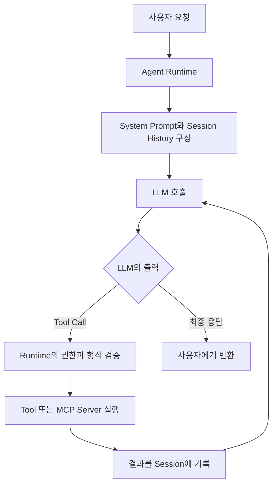

## 🐧 들어가기에 앞서

제가 Codex에게 “AGENTS.md 좀 읽고 와”라고 했습니다. 그런데 Codex가 실제 파일을 읽지 않고 “확인했습니다”라고 답했습니다. 그래서 다시 “읽어오라니깐”이라고 하니 그제야 현재 Directory에서 AGENTS.md를 찾고, 파일을 읽은 뒤 내용을 설명했습니다.

여기서 갑자기 궁금해졌습니다. 처음에 대답한 것도 Codex고, 두 번째에 파일을 찾은 것도 Codex입니다. 그런데 ==파일을 읽어야겠다고 결정한 친구와 실제로 파일을 읽은 친구도 같은 친구일까요?==

우리는 보통 이 모든 과정을 보고 “Agent가 AGENTS.md를 읽었다”고 말합니다. 틀린 말은 아닙니다. 하지만 안쪽을 열어보면 LLM이 직접 File System을 뒤지는 것도 아니고, Shell 명령을 실행하는 것도 아닙니다. LLM은 어떤 도구가 필요한지 정하고, 실제 실행은 다른 녀석이 담당합니다.

예.. Agent라는 단어 하나로 묶어서 부르던 안쪽에는 생각보다 여러 친구가 있었습니다.

이번 글에서는 Agent, Agent Runtime, Tool, MCP, Session History, Agent Memory가 각각 무엇인지 알아보겠습니다. 마지막에는 Claude Code와 Codex를 Agent라고 불러도 되는지, 그리고 회사에서는 왜 LLM 앞에 Gateway까지 두는지도 정리해보겠습니다.

## 🪁 Agent는 LLM 이름이 아니다

Agent를 검색하면 “목표를 가지고 환경과 상호작용하는 주체”라는 설명이 자주 나옵니다. 여기에 LLM을 붙이면 조금 더 구체적으로 말할 수 있습니다.

==LLM Agent는 목표와 현재 상태를 바탕으로 다음 행동을 결정하고, 도구를 이용해 환경에 영향을 주며, 그 결과를 다시 관찰하는 논리적인 주체입니다.== Anthropic도 Agent를 정해진 Script를 따르는 대신 Model이 자신의 과정과 Tool 사용을 동적으로 지휘하는 시스템으로 구분합니다.[^1]

여기서 중요한건 Agent가 단순히 LLM 하나를 가리키는 말이 아니라는 점입니다. 같은 Model을 사용하더라도 어떤 System Prompt를 주는지, 어떤 Tool을 연결하는지, 과거 대화를 얼마나 전달하는지에 따라 할 수 있는 행동이 완전히 달라집니다.

제가 Agent 하나를 구성한다면 대략 다음 정보가 필요합니다.

- 어떤 목표와 규칙을 따를지 정하는 System Prompt
- 다음 행동을 선택할 LLM
- 사용할 수 있는 Tool과 MCP Server
- 현재 대화와 작업 결과를 담은 Session 상태
- 세션이 끝난 뒤에도 다시 불러올 Memory
- 읽기, 쓰기, 삭제, 외부 전송을 제한하는 권한과 정책
- 언제 완료하고, 실패하고, 사람에게 다시 물을지 정하는 종료 조건

그렇다면 이 정보를 가진 Agent가 직접 LLM API를 호출하고 Shell까지 실행하는걸까요?

아닙니다. Agent가 하나의 직원이라면 ++Agent Runtime++은 그 직원이 실제로 일할 수 있도록 책상, 전화, 출입증, 업무 기록을 준비하고 행동을 실행하는 회사 시스템에 가깝습니다. Agent는 논리적인 주체이고, Runtime은 그 주체를 실제 Process로 움직이는 실행 환경입니다.

둘의 경계가 구현마다 완전히 같지는 않습니다. 어떤 Framework는 Agent 설정 객체와 Runtime을 명확하게 나누고, 어떤 제품은 둘을 모두 묶어 그냥 Agent라고 부릅니다. 그래서 이름만 보고 구분하기보다 ==누가 다음 행동을 선택하고, 누가 실제 환경에서 실행하는지==를 보는게 편합니다.

## 🐤 가장 큰 파일을 찾는 동안 생기는 일

이제 다음 요청을 Agent에게 보냈다고 생각해봅시다.

```text
현재 Directory에서 가장 큰 파일 찾아줘.
```

처음에는 사용자의 Prompt를 LLM이 바로 받는다고 생각했습니다. 하지만 정확히는 ++Runtime++이 먼저 요청을 받습니다. Runtime은 Agent의 System Prompt, 현재 Session History, 사용 가능한 Tool 정의, 권한 같은 정보를 모아서 LLM이 읽을 Context를 만듭니다.



### 1. Runtime이 Context를 구성한다

Runtime은 사용자가 입력한 한 문장만 LLM에게 보내지 않습니다. “현재 Directory”가 어디인지, 어떤 Shell Tool을 쓸 수 있는지, 실행 전에 승인이 필요한지, 이전에 어떤 대화를 나눴는지 같은 정보를 함께 구성합니다.

이 단계가 빠지면 LLM은 현재 Directory가 어딘지도 모르고, 자신에게 파일을 읽을 수 있는 도구가 있는지도 알 수 없습니다. Model이 아무리 똑똑해도 보지 못한 환경을 갑자기 알아낼 수는 없으니깐요.

### 2. LLM이 다음 행동을 고른다

Context를 받은 LLM은 바로 가장 큰 파일의 이름을 만들어내는 대신, 먼저 Directory의 파일 크기를 확인해야한다고 판단할 수 있습니다. 그리고 Runtime이 이해할 수 있는 구조로 Tool Call을 반환합니다.

```json
{
  "name": "run_shell",
  "arguments": {
    "command": "find . -type f -exec du -k {} + | sort -nr | head -n 1"
  }
}
```

이 JSON은 실행 결과가 아닙니다. ==LLM이 Runtime에게 “이 도구를 이 인자로 실행해줘”라고 보낸 요청==입니다. OpenAI의 Function Calling도 Model이 Tool Call을 반환하면 Application이 해당 함수를 실행하고, 결과를 다시 Model에 보내는 흐름으로 설명합니다.[^2]

구조화된 형식이라고 해서 내용까지 항상 맞는 것은 아닙니다. JSON Schema에 맞는 Tool Call을 만들었다는 사실은 이름과 인자의 모양이 맞다는 뜻이지, 그 명령이 사용자 의도에 맞고 안전하다는 보장은 아닙니다.

### 3. Runtime이 검증하고 실행한다

Tool Call을 받은 Runtime은 이름과 인자를 Parsing합니다. Tool이 실제로 존재하는지, 현재 Agent가 사용할 권한이 있는지, 사용자 승인이 필요한 행동인지도 확인합니다. 통과한다면 그제야 Shell Process를 실행합니다.

여기서 LLM은 직접 ??du??를 실행하지 않습니다. LLM API가 사용자 Computer의 Disk에 접근하는 것도 아닙니다. 실제 OS Process를 만들고 결과를 수집하는 주체는 Runtime 또는 Runtime이 연결한 Tool입니다.

그러면 MCP는 어디에 들어갈까요? ++MCP(Model Context Protocol)++는 Agent에 외부 Tool과 Resource를 연결하는 공통 통신 규약입니다. MCP Host인 Agent Application이 Client를 관리하고, 각 Client가 MCP Server와 연결됩니다. 실제 기능은 Server가 제공하고 Host가 권한과 Context 경계를 관리합니다.[^3]

쉽게 생각하면 일반 Tool은 회사 내부 직원에게 바로 일을 시키는 방식이고, MCP는 외부 업체와 정해진 업무 양식으로 요청과 결과를 주고받는 방식에 가깝습니다. 그렇다고 MCP 자체가 Agent인 것은 아닙니다. MCP Server는 도구를 제공할 뿐, 일반적으로 전체 목표를 보고 다음 행동을 선택하지는 않습니다.

### 4. 결과를 다시 LLM에게 넣는다

Shell Tool이 다음과 같은 결과를 반환했다고 해봅시다.

```text
428032    ./node_modules/some-package/binary
```

Runtime은 이 결과를 Tool Result Event로 Session에 기록하고 LLM에게 다시 전달합니다. LLM은 이제야 가장 큰 파일을 찾았다고 판단하고 사용자에게 답할 수 있습니다. 만약 명령이 실패했다면 다른 명령을 선택하거나, 권한이 없다면 사용자에게 물을 수도 있습니다.

결과를 보면 우리가 “Agent가 파일을 찾았다”고 부른 한 문장 안에서 역할이 나뉩니다.

- LLM은 무엇을 할지 결정하고 Tool Call을 만듭니다.
- Runtime은 Context를 구성하고 Tool Call을 검증·실행합니다.
- Tool은 실제 환경을 읽거나 변경합니다.
- Tool Result는 다음 LLM 호출의 새로운 관찰이 됩니다.

이 과정이 목표를 달성하거나 종료 조건에 도달할 때까지 반복됩니다. ==LLM이 결정하고 Runtime이 실행하며, 실행 결과를 다시 LLM이 보는 Loop==가 Agent의 행동을 만드는 것입니다.

## 🦦 Runtime은 정말 생각을 안 할까?

여기까지 보면 “LLM은 생각하고 Runtime은 시키는대로 실행한다”고 정리할 수 있습니다. 저도 처음에는 이렇게 이해했습니다. 큰 방향은 맞지만, 조금 애매한 부분이 있습니다.

Runtime은 자연어의 의미를 이해해서 다음 행동을 고르는 주체는 아닙니다. 하지만 아무 생각 없이 Tool Call을 그대로 실행하는 전달자도 아닙니다. Runtime에는 개발자가 미리 구현한 결정적인 제어 로직이 들어갑니다.

예를 들어 다음과 같은 판단은 Runtime의 코드와 정책이 담당할 수 있습니다.

- 이 Tool 이름이 등록되어 있는가?
- 입력이 정해진 Schema와 맞는가?
- 현재 Directory 밖의 파일을 읽어도 되는가?
- 삭제나 외부 전송 전에 사용자 승인이 필요한가?
- 같은 Tool Call을 몇 번까지 재시도할 것인가?
- 최대 실행 시간과 Token 예산을 넘었는가?
- 이제 종료할 것인가, 다시 LLM을 호출할 것인가?

Runtime도 조건에 따라 분명히 무언가를 결정합니다. 다만 그것은 LLM처럼 열린 문제의 의미를 해석한 결과가 아니라, 사람이 작성한 규칙에 따른 판단입니다.

:::important
==LLM은 목표와 관찰을 보고 다음 행동을 선택하고, Runtime은 그 선택이 실제로 어떻게 실행될지 통제합니다.== 둘 중 하나만 있어서는 Agent가 행동할 수 없습니다.
:::

물론 실제 제품은 이것보다 복잡합니다. Tool Call을 별도의 안전 Model이 한 번 더 검사하거나, 여러 Agent가 역할을 나누거나, Runtime이 오래된 대화를 요약하는 경우도 있습니다. 그러면 의미 기반 판단이 Runtime 안쪽에서도 일어나는 것처럼 보입니다. 이때도 중요한 것은 “Runtime은 절대 Model을 사용하지 않는다”가 아니라, ==Runtime이 Agent의 실행 Loop와 상태를 관리하는 계층==이라는 점입니다.

## 🧠 그래서 Agent Memory에는 정확히 뭐가 저장될까?

Runtime까지 구분하고 나니 이번에는 Memory가 헷갈렸습니다. 우리가 지금까지 대화한 내용도 Memory고, AGENTS.md도 Memory고, Agent가 기억해 둔 사용자 취향도 전부 Memory라고 부를 수 있을까요?

문제는 ++Agent Memory++가 하나의 고정된 저장소 이름이 아니라는 것입니다. Framework와 제품마다 범위가 다릅니다. 그래서 저는 저장 기간과 다시 불러오는 방법을 기준으로 나누는게 가장 이해하기 편했습니다.

### 1. 현재 Context는 작업대 위에 펼쳐둔 자료다

LLM이 한 번 호출될 때 실제로 볼 수 있도록 전달된 System Prompt, 사용자 요청, 대화 일부, Tool 정의, Tool Result가 ++Context++입니다. 현재 문제를 풀기 위해 작업대 위에 펼쳐둔 자료라고 생각하면 편합니다.

LLM은 이 Context 밖에 있는 Session 기록이나 Disk의 파일을 자동으로 알 수 없습니다. Runtime이 다시 넣어주거나, Tool을 통해 읽게 해야합니다.

### 2. Session History는 이번 업무의 사건 기록이다

사용자 메시지, LLM 응답, Tool Call, Tool Result는 일반적으로 Runtime이 관리하는 Session 상태나 Event Log에 들어갑니다. 이 기록을 바탕으로 Runtime이 다음 LLM 호출의 Context를 구성합니다.

그렇다고 Session History 전체가 매번 그대로 들어간다는 뜻은 아닙니다. Context Window보다 대화가 길어지면 오래된 내용을 자르거나 요약하고, 필요한 부분만 다시 넣을 수 있습니다. OpenAI Responses API도 Conversation에 속한 입력과 출력을 다음 요청 앞에 붙이거나, ??previous_response_id??로 이전 응답을 이어가는 상태 관리 방식을 제공합니다.[^4]

즉 우리가 “LLM이 아까 한 말을 기억한다”고 느끼는 이유는, Model 안에 대화가 계속 새겨지기 때문이 아닙니다. ==Runtime이나 API가 이전 기록을 보관했다가 다음 호출에 다시 연결하기 때문==입니다.

### 3. 장기 Memory는 다음 업무에도 다시 꺼내는 기록이다

Session이 끝난 뒤에도 남아 있고, 새로운 Session에서 다시 조회되어 행동에 영향을 주는 정보가 장기 Memory입니다. 사용자가 선호하는 Package Manager, 자주 틀리는 Build 명령, Project의 중요한 설계 결정 같은 내용이 들어갈 수 있습니다.

여기서 중요한건 모든 대화를 장기 Memory에 저장하지 않는다는 점입니다. 오늘 실행한 Tool Result 하나까지 다음 달의 모든 Session에 넣으면 Context만 커지고 오래된 정보가 현재 판단을 방해할 수 있습니다. 장기 Memory는 저장할 정보와 유효 범위, 다시 불러올 조건을 따로 설계해야 합니다.

그래서 “LLM 출력은 Agent Memory에 저장된다”라고 한 줄로 말하면 조금 위험합니다. 먼저 Session History에 기록될 수 있고, 그중 다시 사용할 가치가 있는 일부만 장기 Memory로 선별될 수 있습니다. 제품에 따라 자동으로 선별하기도 하고, 사용자가 직접 저장을 요청하기도 합니다.

## 🦕 AGENTS.md도 장기 Memory일까?

이 질문이 개인적으로 가장 재미있었습니다. AGENTS.md는 그냥 Markdown 파일입니다. Vector Database도 아니고, Embedding Search를 하는 것도 아닙니다. 그런데 저는 방금 이 파일 하나로 Codex의 행동을 바꿨습니다.

OpenAI 공식 문서에 따르면 Codex는 작업을 시작하기 전에 AGENTS.md를 읽고, 전역 범위부터 현재 작업 Directory까지 Instruction Chain을 구성합니다.[^5] 파일이 Session 밖의 Disk에 계속 남아 있고, 새로운 실행에서 다시 Context에 들어와 행동에 영향을 줍니다.

그렇다면 AGENTS.md는 장기 Memory일까요?

파일 형식만 보면 그냥 문서입니다. 하지만 기능을 보면 ==세션이 끝난 뒤에도 지속되고, 다음 세션에서 다시 조회되어 Agent의 행동을 바꾸는 외부 기억==으로 볼 수 있습니다. 장기 Memory의 본질은 Markdown인지 Vector DB인지가 아니라 지속성과 재사용에 있기 때문입니다.

다만 AGENTS.md와 사용자 취향을 자동으로 축적하는 Memory를 완전히 같은 것으로 부르면 또 헷갈립니다. AGENTS.md는 사람이 작성한 지속적인 ++Instruction Source++에 가깝고, Auto Memory는 Agent가 경험에서 선별해 저장한 기록에 가깝습니다. 둘 다 넓은 의미에서는 장기 Context 또는 Memory 역할을 하지만 생성 주체와 목적이 다릅니다.

Claude Code도 비슷한 구조를 가집니다. 다만 Claude Code는 AGENTS.md를 직접 읽는 것이 아니라 CLAUDE.md를 읽으며, 필요하다면 CLAUDE.md에서 AGENTS.md를 Import할 수 있습니다. 그리고 사람이 작성한 CLAUDE.md와 별도로 Claude가 직접 기록하는 Auto Memory도 구분합니다.[^6]

:::tip
==Instruction 파일은 “항상 기억해야 할 규칙”, Auto Memory는 “일하면서 새로 알게 된 내용”으로 나누면 이해하기 편합니다.== 둘 다 다음 Session에 다시 들어올 수 있지만 같은 저장소일 필요는 없습니다.
:::

## 🐙 Claude와 Codex는 Agent인가, LLM인가?

Claude와 Codex라는 이름을 말할 때 계속 헷갈리는 이유가 있습니다. Model과 Product를 같은 이름으로 부르는 경우가 있기 때문입니다.

API로 Model에 Prompt 하나를 보내고 Text 응답 하나만 받는다면 그것은 LLM 호출에 가깝습니다. 하지만 API를 사용했더라도 우리가 System Prompt, Tool, Session 상태, 실행 Loop를 구성해서 Model이 다음 행동을 고르게 만들었다면 전체 시스템은 Agent가 될 수 있습니다. ==API를 호출했다는 사실이 Agent와 LLM을 나누는 기준은 아닙니다.==

반대로 Claude Code나 Codex처럼 File을 읽고, Shell을 실행하고, 결과를 관찰한 뒤 작업을 이어가는 제품은 Agent System으로 볼 수 있습니다. 그 안에는 Claude나 GPT 같은 Model이 있고, Tool과 권한, Session을 관리하는 Runtime이 함께 있습니다.

그러니 다음처럼 구분하면 됩니다.

```text
Claude 또는 GPT Model
  → 다음 Token과 구조화된 Tool Call을 생성하는 LLM

Claude Code 또는 Codex
  → LLM, Runtime, Tool, 권한, Session을 묶어 실제 작업을 수행하는 Agent System
```

물론 사용자가 모든 단계를 하나씩 지시하면 자율성이 낮은 Agent고, 목표만 받고 여러 단계를 스스로 이어가면 자율성이 높은 Agent입니다. Agent인지 아닌지와 얼마나 자율적인지는 또 다른 축입니다.

## 🚪 회사에서는 LLM Gateway를 왜 쓸까?

Agent Runtime이 LLM API를 호출할 수 있다면 바로 OpenAI나 Anthropic으로 요청을 보내면 되지 않을까요? 작은 Service 하나라면 충분히 가능합니다. 그런데 회사 안에서 여러 팀이 서로 다른 Agent와 Model을 사용하기 시작하면 문제가 생깁니다.

결제 팀은 정확도가 높은 Model을 사용하고, 사내 검색은 작은 Model을 사용한다고 해봅시다. 각 팀이 Provider별 인증, Rate Limit, 장애 처리, 비용 기록, 개인정보 Masking을 전부 따로 구현하면 같은 코드가 여러 Service에 흩어집니다. Model을 바꿀 때마다 Client도 함께 고쳐야하고요. 귀찮겠죠. 당연히.

++LLM Gateway++는 여러 Application과 Model Provider 사이에 놓이는 공통 진입점입니다. 일반적인 Reverse Proxy처럼 요청을 받아 적절한 Backend로 전달하지만, LLM 요청에 필요한 기능을 더 많이 가집니다.

- 사용자와 Service의 인증·인가
- 팀별 Request와 Token 사용량 제한
- 요청의 성격, 비용, 장애 상태에 따른 Model Routing
- Prompt와 응답의 민감 정보 Masking 및 안전성 검사
- 호출 비용, Latency, 오류, Token 사용량 기록
- Provider 장애 시 다른 Region이나 Model로 Failover
- 반복 요청의 Cache와 공통 Header 변환

Microsoft의 AI Gateway 설계 문서도 인증, Rate Limiting, 여러 Model로의 Routing, Monitoring, Load Balancing, Cache를 Gateway에서 공통으로 처리할 수 있다고 설명합니다.[^7]

여기서 Agent Runtime과 Gateway를 섞으면 안 됩니다. Runtime은 하나의 Agent가 Tool을 호출하고 결과를 관찰하는 Loop를 관리합니다. Gateway는 여러 Service의 LLM 요청이 Provider로 나가는 길목에서 공통 정책을 적용합니다. 일반적으로 Gateway가 “이 Agent의 목표가 끝났는가?”를 판단하거나 Tool을 대신 실행하지는 않습니다.

물론 Gateway Product에 Agent Orchestration 기능까지 들어가면 경계가 흐려질 수 있습니다. 그래서 제품 이름보다는 맡은 책임을 보는게 낫습니다.

그리고 Gateway가 무조건 정답도 아닙니다. 모든 Prompt와 응답이 한곳을 통과하므로 Gateway 자체가 민감 정보를 다루는 새로운 보안 경계가 됩니다. 장애가 나면 여러 AI Service가 동시에 멈추는 Single Point of Failure가 될 수 있고, Latency와 운영 비용도 추가됩니다.[^7]

Service가 하나인데 유행이라는 이유만으로 Gateway부터 만들 필요는 없습니다. 여러 팀이 인증, Routing, 비용, 보안 정책을 반복해서 구현하기 시작할 때 공통 계층의 가치가 생깁니다.

## 🐳 그래서 LLM은 Stateless인가요?

네. ==Model의 한 번의 추론만 놓고 보면 Stateless라고 생각하는게 맞습니다.== 새로운 요청을 보낼 때 이전 대화가 자동으로 Model 내부에서 이어지는 것은 아닙니다.

그런데 우리가 Claude Code나 Codex와 대화하면 분명히 아까 한 말을 기억합니다. 이건 제품 전체가 Stateless라는 뜻은 아닙니다. Runtime이나 API가 Session History를 저장하고 다음 호출의 Context에 다시 넣기 때문입니다. OpenAI Responses API처럼 Server가 Conversation 상태를 관리할 수도 있고, Application이 직접 이전 Input, Output, Tool Result를 다시 전달할 수도 있습니다.[^4]

```text
Stateless한 Model 호출
  + Session History를 관리하는 Runtime
  + 세션 밖에서도 남는 장기 Memory
  = 기억하는 것처럼 동작하는 Agent System
```

처음에는 “LLM에 Memory가 있다”와 “LLM은 Stateless다”가 서로 반대되는 말처럼 느껴졌습니다. 하지만 주어가 달랐습니다. LLM 호출은 Stateless할 수 있고, 그 LLM을 감싼 Agent System은 State를 관리할 수 있습니다.

처음의 AGENTS.md 이야기로 돌아가보겠습니다. 제가 “AGENTS.md를 읽어와”라고 말했을 때 다음 행동을 고른 것은 LLM입니다. 실제 파일을 찾고 읽은 것은 Runtime이 실행한 Tool입니다. 읽은 결과는 Session History에 들어갔고, AGENTS.md 자체는 다음 Session에도 다시 불러올 수 있는 외부의 지속적인 Instruction으로 남았습니다.

우리는 이 전체를 편하게 “Codex가 기억하고 파일을 읽었다”고 말합니다. 이제 그 말이 틀리지는 않지만, 안에서 누가 무엇을 했는지는 구분할 수 있을 것 같습니다.

==Agent는 목표를 향해 행동하는 전체 주체이고, LLM은 다음 행동을 선택하며, Runtime은 그 선택을 실제 환경에서 안전하게 실행합니다. Memory는 그 다음 선택에 필요한 상태를 다시 제공하고요.==

예.. 이제 Agent가 무슨 마법을 부리는지는 조금 알 것 같습니다.

[^1]: Anthropic, [Building effective agents](https://www.anthropic.com/engineering/building-effective-agents). Workflow는 미리 정의한 Code Path를 따르고, Agent는 Model이 과정과 Tool 사용을 동적으로 지휘하는 시스템으로 구분합니다.
[^2]: OpenAI, [Function calling](https://developers.openai.com/api/docs/guides/function-calling). Model이 Tool Call을 반환한 뒤 Application이 함수를 실행하고 그 결과를 다시 Model에 전달하는 흐름을 설명합니다.
[^3]: Model Context Protocol, [Architecture](https://modelcontextprotocol.io/specification/2025-06-18/architecture). MCP의 Host, Client, Server 역할과 Context·권한 경계를 설명합니다.
[^4]: OpenAI, [Create a model response](https://developers.openai.com/api/reference/cli/resources/responses/methods/create). Conversation과 이전 Response를 이용한 상태 관리, Stateless 방식의 Context 전달을 확인할 수 있습니다.
[^5]: OpenAI, [Custom instructions with AGENTS.md](https://learn.chatgpt.com/docs/agent-configuration/agents-md). Codex가 실행마다 Instruction Chain을 구성하고 Project의 AGENTS.md를 읽는 순서를 설명합니다.
[^6]: Anthropic, [How Claude remembers your project](https://code.claude.com/docs/en/memory). CLAUDE.md와 Auto Memory, Session마다 Context를 다시 구성하는 방식을 설명합니다.
[^7]: Microsoft, [Access Foundry Models and Other Language Models Through a Gateway](https://learn.microsoft.com/en-us/azure/architecture/ai-ml/guide/azure-openai-gateway-guide). AI Gateway의 Routing, 인증, Rate Limit, Monitoring과 운영상 Trade-off를 설명합니다.
