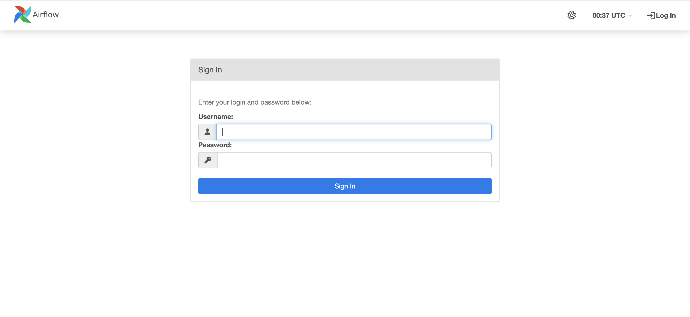
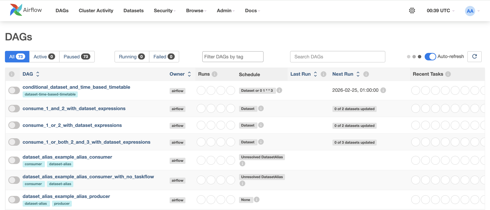
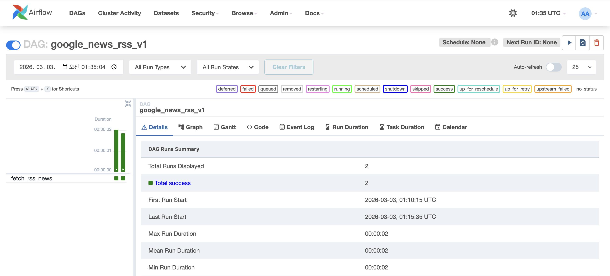
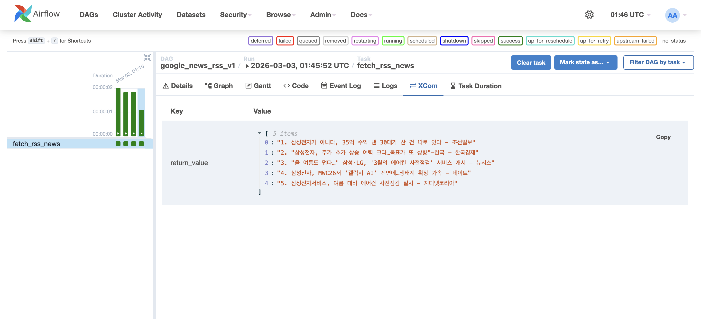

## 🤔 Apache Airflow란?
MLOps를 배우다보면, Apache Airflow에 대해서 들어볼 수 있습니다. Apache Airflow는 어떤 도구일까요?

> 단순하게 특정한 파이썬 코드를 일정 시간마다 실행시키겠다면 Window의 작업 스케줄러나, 리눅스의 Crontab을 사용하면 됩니다. 여기서의 Crontab이 단순히 특정 시간에 작업을 진행하는 알람시계라면, Airflow는 공장 전체의 작업을 관리하는 공장장이라고 할 수 있죠.

데이터 처리나, ML 파이프라인에서는 순서가 정말 중요합니다. 만약, 경제뉴스의 호재/악재를 판단하는 MLOps를 구축한다고 합시다. ++뉴스 수집 -> 텍스트 전처러 -> 호재/악재 판단 -> DB 저장++ 순서대로 진행되겠죠? 하지만 여기서 뉴스를 수집하는데 네트워크 오류나, 뉴스 서버가 점검중인 오류가 발생하면 어떻게 될까요? Crontab의 경우 오류인 상태에도 불구하고 그냥 뉴스 수집을 진행합니다.(당연히 결과는 !!에러!!입니다.) 반면에, Airflow의 경우 앞 작업이 실패했으니 다음 작업은 대기하라고 똑똑하게 멈추고, 개발자에게 알림을 보냅니다. 이게 바로 Airflow를 사용하는 이유입니다.

## 🪈 Airflow에서 꼭 알아야하는 것
먼저 Airflow에서 가장 중요한 단위는 ??DAG(Directed Acyclic Graph)??입니다. 각각의 단어를 풀어서 설명하자면, Directed는 작업들이 일정한 방향으로 흐른다는 것을 나타냅니다.==(예시: 수집 ➡️ 분석 ➡️ 저장)== Acyclic은 작업이 거꾸로 돌아가 무한 루프에 빠지지 않도록 합니다. 마지막으로 Graph는 노드(작업)와 엣지(연결)로 이루어진 구조를 말합니다.

## 🐳 docker compose로 Airflow 실행하기
> 뭐, Airflow를 시작하는 방법이야 많지만 우린 Airflow에서 제공하는 docker compose를 사용해서 실행시켜볼겁니다. 우리의 목적은 가장 잘 알려져있는 requests, beautifulsoup4를 사용해서 "삼성전자"에 대한 네이버 뉴스 기사를 크롤링 자동화를 시켜볼겁니다.

### 1️⃣ 실습 환경 구성하기
그냥 아래 명령어들을 따라가면 됩니다.
```bash
# 1. 실습 폴더 생성 및 이동
mkdir airflow-mlops && cd airflow-mlops

# 2. Airflow 공식 docker-compose 파일 다운로드
curl -LfO https://airflow.apache.org/docs/apache-airflow/2.10.2/docker-compose.yaml

# 3. 필요한 폴더 생성 (DAG 코드, 로그, 플러그인이 저장될 곳)
mkdir -p ./dags ./logs ./plugins ./config

# 4. Airflow 실행 시 필요한 환경 변수 설정 (.env 파일 생성)
echo -e "AIRFLOW_UID=$(id -u)" > .env
```

### 2️⃣ Airflow 데이터베이스 초기화
반.드.시 데이터베이스를 초기화하는 과정을 가져야합니다.
```bash
docker compose up airflow-init

# 결과
> docker ps -a
# CONTAINER ID   IMAGE                   COMMAND                   CREATED         STATUS                     PORTS      NAMES
# e0a13ad8b1f9   apache/airflow:2.10.2   "/bin/bash -c 'if [[…"   3 minutes ago   Exited (0) 2 minutes ago              airflow-mlops-airflow-init-1
# 705d7cb81b58   redis:7.2-bookworm      "docker-entrypoint.s…"   3 minutes ago   Up 3 minutes (healthy)     6379/tcp   airflow-mlops-redis-1
# b27aa48deb8c   postgres:13             "docker-entrypoint.s…"   3 minutes ago   Up 3 minutes (healthy)     5432/tcp   airflow-mlops-postgres-1
```

### 3️⃣ 서비스 실행하기
```bash
docker compose up -d

# 결과
> docker ps -a
# CONTAINER ID   IMAGE                   COMMAND                   CREATED         STATUS                            PORTS                                         NAMES
# 96d7daf2e9d8   apache/airflow:2.10.2   "/usr/bin/dumb-init …"   9 seconds ago   Up 3 seconds (health: starting)   8080/tcp                                      airflow-mlops-airflow-scheduler-1
# 65a3be3585be   apache/airflow:2.10.2   "/usr/bin/dumb-init …"   9 seconds ago   Up 3 seconds (health: starting)   0.0.0.0:8080->8080/tcp, [::]:8080->8080/tcp   airflow-mlops-airflow-webserver-1
# 72b715e80695   apache/airflow:2.10.2   "/usr/bin/dumb-init …"   9 seconds ago   Up 3 seconds (health: starting)   8080/tcp                                      airflow-mlops-airflow-triggerer-1
# 11a27199cd2f   apache/airflow:2.10.2   "/usr/bin/dumb-init …"   9 seconds ago   Up 3 seconds (health: starting)   8080/tcp                                      airflow-mlops-airflow-worker-1
```
> 여기서 -d는 demon으로 백그라운드에서 실행하도록 하는 옵션입니다.

### 4️⃣ localhost:8080에 접속하기

> username, password 모두 airflow입니다.


> 엄청나게 많은 DAGS가 있는것을 확인할 수 있습니다.

### 5️⃣ my_first_dag.py 파일 작성하기
이제 알게된 내용이지만, 원래 네이버 뉴스나, 구글 뉴스 제목이나 내용을 추출할 수 있었거든요? 근데 오랜만에 크롤링을 해보니, class, id 부분이 djks eews qwcs 이렇게 ++다이나믹 클래스(Dynamic Class)++로 바뀌어있더라고요. 그래서 어쩔 수 없이 google rss를 활용하도록 하겠습니다.

```bash
import requests
from bs4 import BeautifulSoup
from airflow import DAG
from airflow.operators.python import PythonOperator
from datetime import datetime

def crawl_google_rss():
    # '삼성전자' 키워드에 대한 구글 뉴스 RSS 주소
    rss_url = "https://news.google.com/rss/search?q=삼성전자&hl=ko&gl=KR&ceid=KR:ko"
    response = requests.get(rss_url)
    # lxml 파서를 사용하여 RSS 피드 파싱
    soup = BeautifulSoup(response.text, "lxml")
    # RSS 구조에서 뉴스 제목은 <item> 태그 안의 <title>에 들어있습니다.
    items = soup.find_all("item")
    
    results = []
    for i, item in enumerate(items[:5]):
        title = item.title.text
        link = item.link.text
        results.append(f"{i+1}. {title}")
    return results

with DAG(
    dag_id='google_news_rss_v1',
    start_date=datetime(2024, 1, 1),
    schedule_interval=None,
    catchup=False
) as dag:

    task1 = PythonOperator(
        task_id='fetch_rss_news',
        python_callable=crawl_google_rss
    )
```

### 6️⃣ google_news_rss_v1 실행하기
검색창에 google_news_rss_v1를 입력하면 아래와 같이 뜹니다.

> 오른쪽 위쪽에 실행 버튼이 있는데, 이 부분을 누르면 실행이 됩니다. 자동으로 실행할 수 있지만, 실습을 위해 수동으로 실행하도록 하겠습니다. 


실행 결과를 보려면 Graph에 들어가서, fetch_rss_news를 누르고, XCom을 누르면 아래와 같은 결과가 보이게 됩니다.


## 👌 마무리
지금까지 데이터 수집의 기본 과정에 대해서 살펴봤습니다. 일단, 어떻게 동작하는지 기본을 아는것이 가장 중요합니다.