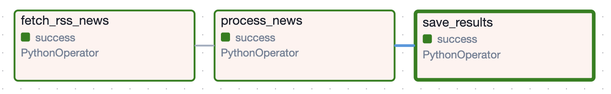

## 🏗️ Airflow 아키텍처 이해하기
> 앞에 포스팅에서 설명했던 부분이 부족한 부분이 많아서, 이번 포스팅에서 더 자세히 설명하지 않은 부분까지 설명하겠습니다.

`docker compose up -d`를 실행하면 컨테이너가 여러 개 뜨는 걸 볼 수 있습니다. 각각이 무슨 역할인지 알아야 Airflow를 제대로 이해할 수 있습니다.

| 컴포넌트 | 역할 |
|---|---|
| **Webserver** | 우리가 접속하는 UI (`localhost:8080`) |
| **Scheduler** | DAG 파일을 읽고, 실행 시점이 되면 Worker에게 작업을 넘겨줌 |
| **Worker** | 실제로 태스크를 실행하는 주체 |
| **Metadata DB** | DAG 실행 기록, 상태 등을 저장하는 PostgreSQL DB |
| **Redis** | Scheduler가 Worker에게 작업을 전달할 때 사용하는 메시지 큐 |

> 쉽게 말해, Scheduler는 어떤 작업을 할지 지시하고, Worker는 실제로 작업을 진행하는 역할을 합니다.


## 🔗 `>>`연산자로 Task 의존성 설정하기

지금까지 실습한 DAG은 태스크가 하나뿐이라 Airflow의 진짜 강점이 잘 안 보였습니다. Airflow의 핵심은 ==태스크 간의 순서(이걸 의존성이라고 합니다.)를 정의하는 것==입니다.

`>>` 연산자를 사용하면 ==태스크 실행 순서(수집 ➡️ 전처리 ➡️ 저장)==를 직관적으로 표현할 수 있습니다.

```python
import requests
from bs4 import BeautifulSoup
from airflow import DAG
from airflow.operators.python import PythonOperator
from datetime import datetime

# 1단계: 뉴스 크롤링
def crawl_google_rss(**context):
    rss_url = "https://news.google.com/rss/search?q=삼성전자&hl=ko&gl=KR&ceid=KR:ko"
    response = requests.get(rss_url)
    soup = BeautifulSoup(response.text, "lxml")
    items = soup.find_all("item")

    results = []
    for i, item in enumerate(items[:5]):
        title = item.title.text
        results.append(f"{i+1}. {title}")

    # XCom에 결과를 저장 (다음 태스크에서 사용 가능)
    context['ti'].xcom_push(key='news_titles', value=results)
    print("✅ 크롤링 완료")

# 2단계: 데이터 전처리 (뉴스 제목 정제)
def process_news(**context):
    ti = context['ti']
    titles = ti.xcom_pull(task_ids='fetch_rss_news', key='news_titles')

    processed = [title.split('. ', 1)[-1] for title in titles]  # 번호 제거
    ti.xcom_push(key='processed_titles', value=processed)
    print(f"✅ 전처리 완료: {processed}")

# 3단계: 결과 출력 (실제로는 DB 저장 등으로 대체 가능)
def save_results(**context):
    ti = context['ti']
    titles = ti.xcom_pull(task_ids='process_news', key='processed_titles')

    for title in titles:
        print(f"📰 {title}")
    print("✅ 저장 완료")

with DAG(
    dag_id='google_news_pipeline_v1',
    start_date=datetime(2024, 1, 1),
    schedule_interval='0 9 * * *',  # 매일 오전 9시 실행
    catchup=False
) as dag:

    task1 = PythonOperator(
        task_id='fetch_rss_news',
        python_callable=crawl_google_rss,
        provide_context=True
    )

    task2 = PythonOperator(
        task_id='process_news',
        python_callable=process_news,
        provide_context=True,
        retries=2,           # 실패 시 2번 재시도
        retry_delay=30       # 30초 간격으로 재시도
    )

    task3 = PythonOperator(
        task_id='save_results',
        python_callable=save_results,
        provide_context=True
    )

    # 태스크 실행 순서 정의: 크롤링 → 전처리 → 저장
    task1 >> task2 >> task3
```

이제 Airflow UI의 Graph 탭에서 아래처럼 태스크 흐름이 시각적으로 보이게 됩니다.



만약 `fetch_rss_news`가 실패하면, Airflow는 자동으로 뒤의 태스크들을 실행하지 않습니다. 포스팅 초반에 설명했던 ++공장장++ 역할이 바로 이겁니다.


## 📦 XCom이란?

위 코드에서 `xcom_push`와 `xcom_pull`을 사용했는데, 이게 무엇인지 짚고 넘어가겠습니다.

++XCom(Cross-Communication)++ 은 태스크 간에 데이터를 주고받는 Airflow의 메커니즘입니다.

- `xcom_push(key, value)` : 데이터를 저장
- `xcom_pull(task_ids, key)` : 다른 태스크가 저장한 데이터를 가져옴

> 단, XCom은 ==작은 데이터==(문자열, 리스트 등)를 전달하는 용도입니다. 대용량 데이터는 S3, DB 등 외부 저장소를 활용하는 것이 좋습니다.


## ⏰ schedule_interval 설정하기

앞서 실습에서는 `schedule_interval=None`으로 설정해 수동 실행만 가능했습니다. 실제 자동화를 위해서는 ==Cron 표현식==을 사용합니다.

```python
# Cron 표현식: '분 시 일 월 요일'
schedule_interval='0 9 * * *'    # 매일 오전 9시
schedule_interval='0 9 * * 1'    # 매주 월요일 오전 9시
schedule_interval='0 */6 * * *'  # 6시간마다
schedule_interval='@daily'       # 매일 자정 (편의 표현식)
schedule_interval='@hourly'      # 매 시간
```

Cron 표현식이 낯설다면 [crontab.guru](https://crontab.guru) 사이트에서 쉽게 확인해볼 수 있습니다.


## 🔄 실패 시 재시도 설정

==PythonOperator==에 `retries`와 `retry_delay`를 설정하면, 태스크 실패 시 자동으로 재시도합니다.

```python
task2 = PythonOperator(
    task_id='process_news',
    python_callable=process_news,
    retries=3,          # 최대 3번 재시도
    retry_delay=60      # 60초 간격으로 재시도
)
```

네트워크 오류처럼 일시적인 문제라면 재시도만으로 해결되는 경우가 많습니다. 포스팅 초반에 "뉴스 서버가 점검 중이라면?"이라는 질문을 던졌는데, 이 옵션이 그 답입니다.

## 🤔 마무리
앞에 포스팅에서 설명한 부분은, 빙산의 일각에 불과했는데 이번에 포스팅한 내용은 다소 어려울 수 있습니다. 여러번 반복해서 읽어보세요!