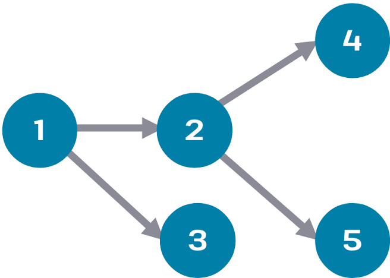

## ⭐️ Apache Airflow란?
머신러닝, 딥러닝 개발자라면 한 번쯤 들어봤을 것 같은데, Apache Airflow는 워크플로우 관리 도구이다. Airflow는 기본적으로 DAG(Directed Acyclic Graph)로 이루어져있다. DAG는 아래와 같은 모습을 보인다.

Apache Airflow는 다음과 같은 순서로 동작한다. DAG 이름에서 알 수 있듯이, Cyclic(순환형) 대신 Acyclic(비순환형)이 사용되는데, 이는 Apache Airflow가 Linear하게 동작하기 때문이다. 

우리가 그림에서 확인할 수 있듯이, 1, 2, 3, 4, 5를 노드라고 부르고, 사이에 선을 간선이라고 부른다. 여기서 1번의 결과가 2번, 3번으로 이어지고 2번의 결과가 4번, 5번으로 전달되는 것을 확인할 수 있다. 가장 중요한 부분은, 2번, 3번은 1번에 의존적이고, 4번, 5번은 2번에 의존적이라고 설명할 수 있다는 점이다.

요즘 MLOps 환경에서는 Kubeflow를 사용하는 경향이 강하지만, 결국 어떤 도구를 쓰느냐가 중요하는 것이 아니라 각 도구들이 비슷한 기능을 하기 때문에 어떤 도구로 배우더라도 사실 거의 비슷하다.

그렇다면, 왜 Apache Airflow를 사용하는걸까? 일반적으로 Apache Airflow를 사용하는 경우는 하나다. MLOps 과정에서 지속적인 학습 파이프라인을 구축하는 경우다. 지속적인 학습을 자동화하려면, 데이터를 자동으로 수집하고 전처리를 한 다음, 학습하는 과정을 거친다. 이 부분을 사람이 수동적으로 처리하기에는 번거롭기도 하고, 기업의 입장에서는 자동화할 수 있는 업무를 사람이 진행함으로써 인적자원을 낭비한다는 점에서 Apache Airflow와 같은 서비스를 도입하지 않을 이유가 없는 것이다.

## 🎽 

## 👒 

## 🔦 

## 🌒