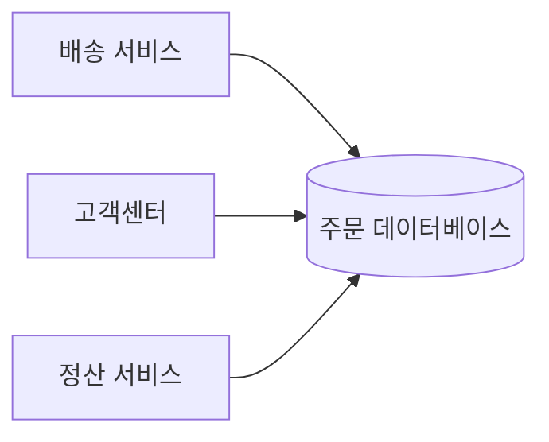
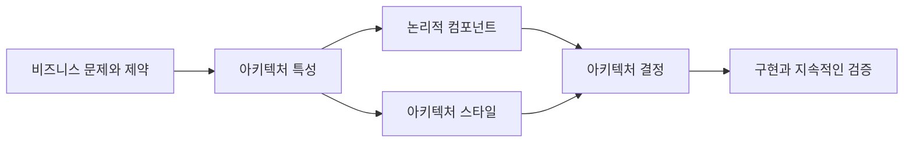
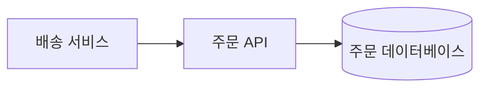
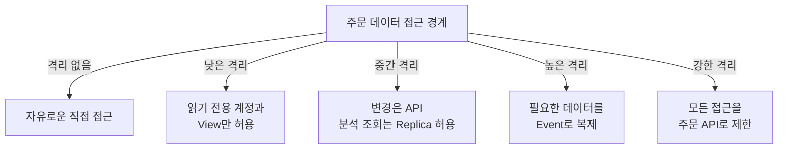

## 🏗️ 들어가기에 앞서

예를 들어, 우리가 주문 서비스가 하나 운영하고 있다고 가정해봅시다. 처음에는 주문 애플리케이션 하나만 데이터베이스를 사용했습니다. 그런데 서비스가 커지면서 배송팀도 주문 주소가 필요하고, 고객센터도 주문 상태를 조회해야 하고, 정산팀도 결제 금액을 가져가야 합니다.

가장 빠른 방법은 무엇일까요? ==각 애플리케이션에 주문 데이터베이스 접속 정보를 주면 됩니다.==

이렇게 하면 간단하고 빠릅니다. 원격 API를 한 번 더 호출할 필요도 없으니 성능도 좋아 보입니다. 그런데 주문팀이 테이블 이름을 바꾸면 어떻게 될까요? 권한이 너무 넓어 고객센터에서 결제 정보까지 읽을 수 있다면요? 어느 서비스가 주문 데이터를 잘못 수정했는지 알 수 없다면요?

흠... 갑자기 단순했던 선택이 단순하지 않아집니다.

처음에는 저도 소프트웨어 아키텍트라면 이런 상황에서 가장 좋은 기술을 골라주는 사람이라고 생각했습니다.(약간 아키텍처 그려주는 사람??) React와 Vue 중 하나를 정하고, Monolith와 Microservice 중 정답을 알려주는 사람 말입니다. 그런데 ++소프트웨어 아키텍처 The Basics++의 1장을 읽으며 저의 생각을 바뀌게 한 문장은 따로 있었습니다.

:::important
==아키텍처는 가장 멋진 기술을 고르는 일이 아니라, 주어진 맥락에서 무엇을 얻고 무엇을 포기할지 결정하는 일입니다.==
:::

이번 글에서는 주문 데이터를 다른 서비스에 어떻게 제공할지 결정하는 과정을 따라가며 소프트웨어 아키텍처가 무엇인지, 왜 모든 결정에 트레이드오프가 생기는지 알아보겠습니다.

## 🧩 구조도만 그리면 아키텍처일까?

소프트웨어 아키텍처라고 하면 가장 먼저 네모와 화살표가 가득한 구조도가 떠오릅니다. 부끄럽지만 얼마전의 저도 그랬습니다. 하핳.. 하지만 구조도는 시스템의 한 장면만 보여줄 뿐입니다. 데이터베이스 앞에 API를 하나 그렸다고 해서 왜 그렇게 나눴는지, 시스템이 무엇을 보장해야 하는지까지 알 수는 없습니다.

책에서는 소프트웨어 아키텍처를 네 가지 차원으로 설명합니다.

| 차원 | 주문 서비스에서 던질 질문 | 예시 |
| --- | --- | --- |
| 아키텍처 특성 | 시스템은 무엇을 잘해야 할까요? | 보안, 가용성, 성능, 변경 용이성 |
| 논리적 컴포넌트 | 어떤 책임과 흐름이 필요할까요? | 주문 조회, 주문 변경, 권한 검사 |
| 아키텍처 스타일 | 큰 구조를 어떻게 나눌까요? | 계층형 구조, 분산 서비스 구조 |
| 아키텍처 결정 | 팀이 지켜야 할 규칙은 무엇일까요? | 주문 데이터는 주문 API로만 접근 |

네 가지는 따로 노는 목록이 아닙니다. 먼저 주문 데이터가 안전해야 하고 변경의 영향을 줄여야 한다는 ==아키텍처 특성==을 찾습니다. 그 요구를 만족하기 위해 주문 조회와 권한 검사라는 ==논리적 컴포넌트==를 나눕니다. 그런 다음 컴포넌트를 배치할 ==아키텍처 스타일==을 선택하고, 마지막으로 개발팀이 지켜야 할 ==아키텍처 결정==을 남깁니다.

여기서 순서를 너무 엄격한 절차로 받아들일 필요는 없습니다. 실제 설계에서는 스타일을 검토하다가 빠뜨린 특성을 발견하고, 구현 중에 결정의 비용을 알게 되어 다시 돌아오기도 합니다. 중요한 것은 ==구조의 모양만 보는 것이 아니라 그 구조를 만든 요구사항과 결정까지 함께 보는 것==입니다.

## 🎯 기술 선택과 아키텍처 결정은 무엇이 다를까?

그렇다면 “프런트엔드에 React를 사용한다”는 아키텍처 결정일까요?

항상 그런 것은 아닙니다. 책은 특정 기술을 고르는 일과 기술 선택의 지침을 만드는 일을 구분합니다. 예를 들어 다음 두 문장은 비슷해 보이지만 팀에 주는 자유의 범위가 다릅니다.

| 결정 | 팀에 남는 선택 | 주의할 점 |
| --- | --- | --- |
| 모든 웹 화면은 React를 사용한다 | React 안에서만 선택 가능 | 일관성은 높지만 필요 없는 곳까지 종속될 수 있음 |
| 웹 화면은 상태 변화를 처리할 수 있는 반응형 프레임워크를 사용한다 | 요구를 만족하는 도구를 팀이 선택 | 선택의 이유와 검증 기준을 더 명확히 해야 함 |
| UI는 정적 문서로 충분한 경우 프레임워크를 요구하지 않는다 | 문제에 따라 사용하지 않을 수도 있음 | 팀별 구현 편차를 관리해야 함 |

아키텍트가 해야 할 일은 인기 순위에서 1등인 기술을 찍어주는 것이 아닙니다. 팀이나 조직의 기술 선택에 지침이 될 경계를 만드는 일입니다. 주문 서비스라면 다음과 같은 결정이 될 수 있습니다.

> ==주문 데이터는 주문 서비스가 소유하며, 다른 애플리케이션은 공개된 주문 API를 통해서만 접근한다.==

이 문장은 PostgreSQL을 쓸지 MySQL을 쓸지 정하지 않습니다. REST와 gRPC 중 하나를 강제하지도 않습니다. 대신 누가 데이터를 소유하고 어떤 경계를 넘어야 하는지는 분명하게 정합니다.

물론 특정 기술을 직접 지정해야 할 때도 있습니다. 처리량이나 복구 목표처럼 구체적인 아키텍처 특성을 검증한 결과 특정 기술만 요구를 만족할 수도 있기 때문입니다. ==핵심은 기술을 절대로 지정하지 않는 것이 아니라, 기술 자체와 그 기술을 선택한 이유를 혼동하지 않는 것입니다.==

## ⚖️ 모든 아키텍처 결정에는 계산서가 따라온다

주문 데이터베이스를 API 뒤에 숨기면 모든 문제가 해결될까요? 예.. 그랬으면 아키텍처가 훨씬 쉬웠을 겁니다.

직접 접근 방식과 API 방식의 계산서를 나란히 놓아보겠습니다.

| 기준 | 데이터베이스 직접 접근 | 주문 API로 접근 |
| --- | --- | --- |
| 응답 경로 | 짧음 | 네트워크 호출이 하나 늘어남 |
| 데이터 구조 변경 | 여러 서비스와 결합됨 | API 계약으로 영향을 제한할 수 있음 |
| 권한 관리 | 클라이언트별 DB 권한 필요 | 주문 서비스에서 통제 가능 |
| 장애 영향 | DB가 공통 장애 지점이 됨 | 주문 API 장애와 Timeout을 고려해야 함 |
| 데이터 활용 | 자유롭게 조회 가능 | 필요한 기능을 API로 추가해야 함 |
| 운영 복잡도 | 초기에는 낮음 | 배포, 관측, 용량 관리가 더 필요함 |

==API를 두면 보안과 변경 격리에는 유리하지만 호출 지연, 장애 처리, 운영 비용==이 생깁니다. 직접 접근은 빠르고 자유롭지만 여러 서비스가 데이터베이스 구조에 결합됩니다. 어느 한쪽이 모든 기준에서 이기지 않습니다.

이 지점에서 이 책에서 말하는 소프트웨어 아키텍처의 첫 번째 법칙이 등장합니다.

> ==소프트웨어 아키텍처의 모든 것은 트레이드오프입니다.==

처음 이 문장을 보면 조금 아름다웠는데, 다시 보니 허무하네요.... “그래서 뭘 고르라는 거죠???”라는 생각이 들 수 있습니다. 그런데 저는 이 말이 결정을 피하라는 뜻이 아니라, ==장점만 적힌 선택지는 아직 분석이 끝나지 않은 선택지==라는 경고에 가깝다고 이해했습니다.

예를 들어 작은 사내 도구인데 사용자가 세 명이고 데이터 구조도 거의 바뀌지 않는다면 별도의 주문 API가 과할 수 있습니다. 반대로 수십 개의 서비스가 민감한 주문 데이터를 공유하고 각자 다른 주기로 배포된다면 직접 접근의 장기 비용이 훨씬 커집니다.

즉 정답은 기술 이름 안에 있지 않고 현재의 맥락 안에 있습니다. 그래서 아키텍처를 설계하는 사람들은 돈을 많이 버나봅니다 ㅎㅎ

## 🧭 “어떻게”보다 “왜”를 남겨야 하는 이유

몇 달 뒤 새로운 개발자가 아키텍처를 보면 무엇을 알 수 있을까요?

이 그림만 보면 호출 경로는 알 수 있습니다. 하지만 왜 배송 서비스가 데이터베이스를 직접 조회하면 안 되는지는 알 수 없습니다. 원칙을 모르면 API가 느린 어느 날 “성능 최적화”라는 이름으로 직접 접근이 다시 생길 수 있습니다.

책이 제시하는 두 번째 법칙은 ==어떻게보다 왜가 더 중요하다==는 것입니다. 아키텍처 결정은 결과만 기록해서는 부족합니다. 당시의 맥락, 검토한 선택지, 선택한 이유, 감수한 비용을 함께 남겨야 합니다.

주문 API 결정이라면 다음 정도는 설명할 수 있어야 합니다.

- 민감한 주문 데이터의 접근 권한을 한곳에서 통제해야 합니다.
- 데이터베이스 스키마 변경이 다른 애플리케이션에 직접 전파되지 않아야 합니다.
- 그 대가로 원격 호출의 지연과 주문 API 장애 가능성을 감수합니다.
- 조회 트래픽이 병목이 되면 Cache나 읽기 전용 모델을 별도로 검토합니다.
- 서비스가 아주 작아 이 비용이 이점보다 크다면 결정을 다시 평가합니다.

이렇게 이유를 남기면 이후의 팀은 결정을 맹목적으로 따르는 대신 ==전제가 여전히 유효한지 검토할 수 있습니다.== 반대로 “무조건 API로 접근한다”만 남기면 아키텍처는 원칙이 아니라 출처를 알 수 없는 금지 목록이 됩니다.

:::tip
결정을 기록할 때는 Architecture Decision Record, 줄여서 ADR 같은 짧은 문서를 사용할 수 있습니다. 형식보다 중요한 것은 결정 당시의 맥락, 선택지, 결과와 감수한 트레이드오프가 함께 남는 것입니다.
:::

## 🌈 결정은 둘 중 하나가 아니라 스펙트럼에 있다

데이터베이스를 직접 열어줄 것인가, API로 완전히 막을 것인가. 얼핏 보면 둘 중 하나만 선택해야 할 것 같습니다. 하지만 실제 결정은 그 사이의 여러 지점에 놓일 수 있습니다.

이것이 세 번째 법칙과 연결됩니다. ==대부분의 아키텍처 결정은 양자택일이 아니라 양극단 사이 스펙트럼의 한 지점입니다.==

예를 들어 운영 애플리케이션의 변경 요청은 주문 API로 제한하되, 대규모 분석은 별도의 읽기 모델이나 Event Stream으로 제공할 수 있습니다. 보안과 변경 격리는 유지하면서 분석 트래픽이 주문 API를 압박하는 문제를 줄이는 선택입니다. 대신 데이터 복제 지연과 별도 저장소 운영이라는 새로운 계산서가 생깁니다. 트레이드오프가 사라진 것이 아니라 모양이 바뀐 셈입니다.

그래서 아키텍처 토론에서 “Monolith냐 Microservice냐”처럼 양끝만 놓고 싸우면 중요한 선택지를 놓치기 쉽습니다. 모듈 경계를 가진 Monolith로 시작할 수도 있고, 변경 빈도가 높은 일부 기능만 분리할 수도 있습니다. 제가 이해한 좋은 아키텍처 결정은 유행하는 극단을 고르는 것이 아니라, ==현재 필요한 만큼만 경계를 세우는 일==에 가깝습니다.

## 🪴 한 번 정한 아키텍처는 언제까지 유효할까?

좋은 결정을 내렸다면 이제 끝일까요?

처음에는 주문 API의 트래픽이 초당 20건이었는데, 제휴사가 늘어 초당 2만 건이 될 수 있습니다. 개인정보 규정이 바뀌어 조회 기록을 더 오래 보관해야 할 수도 있고요. 반대로 하나였던 조직이 여러 팀으로 나뉘면서 배포 독립성이 더 중요해질 수도 있습니다.

책은 변화 속에서도 아키텍처가 얼마나 살아 있는지를 ==아키텍처 활력==이라는 관점으로 설명합니다. 아키텍트는 처음의 구조를 지키는 사람이 아니라, 현재도 그 구조가 비즈니스와 기술 환경에 맞는지 지속적으로 분석하는 사람입니다.

이 검토를 멈추면 작은 예외가 쌓입니다.

1. 주문 API가 느려 한 서비스가 데이터베이스를 직접 조회합니다.
2. 비슷한 예외가 하나둘 늘어납니다.
3. 주문팀은 테이블을 바꾸기 전에 모든 소비자에게 물어봐야 합니다.
4. 어느 서비스가 어떤 데이터에 의존하는지 아무도 모르게 됩니다.
5. 처음 세운 경계는 그림에만 남습니다.

이처럼 구현이 의도한 구조에서 서서히 멀어지는 현상을 책에서는 ==구조적 부패==라고 설명합니다. 거창한 재설계 한 번보다 작은 예외가 반복될 때 더 조용히 발생합니다.

그렇다고 모든 예외를 사람의 코드 리뷰만으로 막을 수도 없습니다. 계층 간 의존성 검사, API 계약 테스트, 허용되지 않은 데이터베이스 연결 탐지처럼 결정의 준수 여부를 자동으로 확인할 수 있습니다. 중요한 것은 문서를 잘 써두는 데서 끝나지 않고 ==아키텍처의 의도가 실제 코드와 운영 환경에서도 유지되는지 측정하는 것==입니다.

## 🧑‍🤝‍🧑 결국 아키텍처도 사람 문제다

여기서 또 하나의 문제가 생깁니다. 주문 API 방식이 기술적으로 타당하다고 해서 모든 팀이 좋아할까요?

주문팀은 데이터 소유권과 보안을 얻습니다. 하지만 배송팀은 API 호출 코드와 장애 처리를 추가해야 합니다. 분석팀은 자유롭게 SQL을 실행할 수 없고, 필요한 필드가 생길 때마다 주문팀과 협의해야 합니다. ==결정의 이익을 얻는 팀과 비용을 내는 팀이 다를 수 있습니다.==

“아키텍처 원칙이니까 따르세요”라고 말하면 구현은 될지 몰라도 협력은 오래가지 않습니다. 왜 이 경계가 필요한지 설명하고, 다른 팀이 부담할 비용을 듣고, API의 응답 시간이나 지원 범위를 함께 약속해야 합니다.

책에서 말하는 아키텍트의 기대 역할을 제가 이해한 방식으로 묶으면 다음 네 가지입니다.

| 역할 | 실제로 하는 일 |
| --- | --- |
| 결정 | 팀의 기술 선택에 지침이 될 원칙과 경계를 정함 |
| 검증 | 구조와 기술 환경을 지속적으로 분석하고 결정 준수를 확인함 |
| 이해 | 여러 기술의 장단점과 비즈니스 문제를 함께 이해함 |
| 조율 | 팀을 이끌고 이해관계자에게 이유를 설명하며 합의를 만듦 |

==모든 프레임워크의 전문가가 될 필요는 없습니다.== 한 가지 Cache 제품만 완벽하게 아는 것보다 여러 제품을 경험하고 차이를 설명할 수 있는 폭이 중요할 때도 있습니다. 동시에 주문 취소와 환불이 어떻게 다른지도 모른다면 기술적으로 멋진 구조가 비즈니스 문제를 해결하기 어렵습니다.

그리고 아키텍처 결정은 대부분 누군가의 작업 방식을 바꿉니다. 결국 아키텍트에게 대인 관계와 리더십이 필요한 이유입니다.

## 🔍 제가 실제로 결정한다면

저라면 새로운 기술부터 고르기 전에 다음 질문을 순서대로 적어볼 것 같습니다.

1. 지금 해결하려는 비즈니스 문제는 무엇인가요?
2. 반드시 지켜야 할 아키텍처 특성은 무엇인가요?
3. 이 선택으로 무엇을 얻고 무엇을 포기하나요?
4. 선택하지 않은 대안은 무엇이며, 왜 지금은 제외했나요?
5. 결정의 이익과 운영 비용은 각각 어느 팀이 부담하나요?
6. 이 결정이 지켜지는지 어떻게 확인할 수 있나요?
7. 어떤 조건이 바뀌면 결정을 다시 검토해야 하나요?

주문 데이터 사례에서도 ==“Microservice가 좋으니까 API”==라고 결론 내리지 않을 겁니다. 민감정보 통제와 변경 격리가 정말 필요한지, 예상 트래픽과 장애 허용 범위가 어느 정도인지 먼저 확인해야 합니다. 세 명이 쓰는 내부 도구라면 직접 접근이 가장 합리적일 수 있습니다. 대신 왜 지금은 그 비용을 감수하지 않는지 기록하고, 소비자가 늘어나는 시점에 다시 검토할 조건을 남길 수 있습니다.

:::warning
!!트레이드오프가 있다는 말은 아무 선택이나 해도 된다는 뜻이 아닙니다.!! 요구사항과 제약을 확인하고, 감수할 비용을 명시하고, 결과를 검증할 수 있어야 비로소 설명 가능한 결정이 됩니다.
:::

## 😮‍💨 마무리

처음에는 아키텍처가 시스템의 가장 위에 있는 거대한 구조도(flow?)라고 생각했습니다. 그런데 1장을 읽고 나니 중요한 것은 구조도의 복잡함이 아니라 그 안에 담긴 질문이었습니다. 왜 이 경계가 필요한지, 무엇을 포기했는지, 환경이 바뀐 지금도 여전히 유효한지 말입니다.

- 소프트웨어 아키텍처는 아키텍처 특성, 논리적 컴포넌트, 스타일, 결정으로 바라볼 수 있습니다.
- 특정 기술을 고르는 것보다 팀이 선택할 수 있는 지침과 경계를 만드는 일이 중요합니다.
- 모든 아키텍처 결정에는 얻는 것과 포기하는 것이 함께 존재합니다.
- 결정은 양자택일보다는 여러 선택지 사이의 한 지점인 경우가 많습니다.
- 아키텍처는 한 번 정하고 끝나는 결과물이 아니라 지속적으로 검증해야 하는 가설에 가깝습니다.
- 좋은 결정을 실제로 구현하려면 기술뿐 아니라 비즈니스 이해와 사람 사이의 조율이 필요합니다.

결국 좋은 아키텍처를 판단하는 기준은 “가장 최신 기술을 사용했는가?”가 아닙니다. ==현재의 문제와 제약을 설명하고, 우리가 감수한 트레이드오프를 책임질 수 있는가==가 더 중요한 질문입니다.
