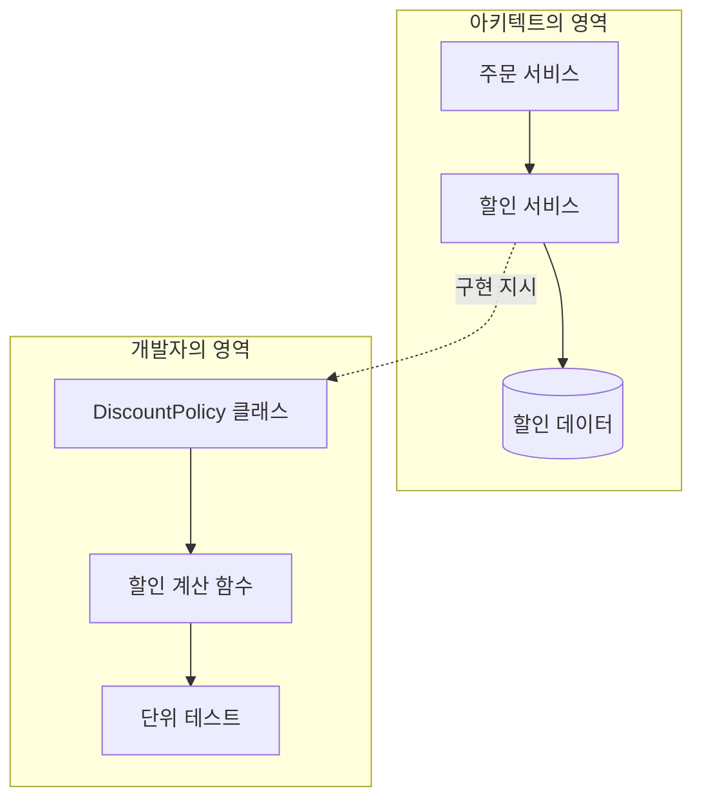
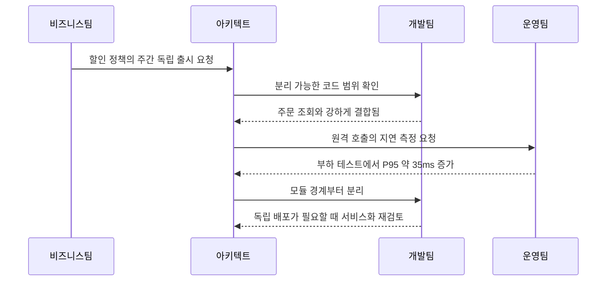
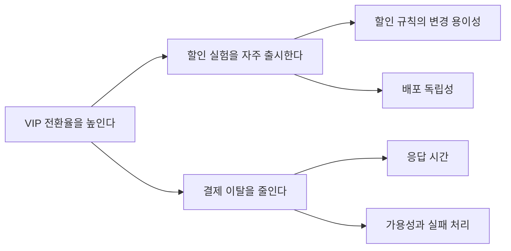

## 🤔 들어가기에 앞서

[지난 글](/39/) 에서는 좋은 아키텍처가 하나의 정답이라기보다, 현재의 요구사항과 제약 속에서 무엇을 얻고 무엇을 포기할지 결정하는 일에 가깝다고 이야기했습니다.

그런데 실제 프로젝트 내에서 개발하다 보면 조금 ==많이 애매한== 질문이 생깁니다.

> ==아키텍트는 큰 구조만 정하고, 세부 구현은 개발자에게 넘기면 되는 걸까요?==

주문 서비스에 “VIP 고객은 상품별 할인과 쿠폰 중 더 큰 할인 하나만 받을 수 있다”라는 요구사항이 들어왔다고 해보겠습니다. 얼핏 보면 ??if??문 몇 개로 끝날 것 같습니다. 하지만 ==할인 계산을 주문 API 안에 둘지, 별도 서비스로 분리==할지, ==할인 이력을 어디에 저장할지에 따라 배포 방식과 장애 범위가 달라집니다.==

반대로 아키텍트[^1]가 클래스 이름과 함수 하나하나까지 전부 정하면 어떨까요? 전체 구조는 잘 지켜질지 몰라도 ==개발팀은 결정을 기다리느라 느려지고, 실제 코드에서 발견한 정보를 설계에 반영하기 어려워집니다.==

처음에는 저도 아키텍처와 설계 사이에 명확한 선이 있다고 생각했습니다. 위쪽의 네모와 화살표는 아키텍트, 아래쪽의 클래스와 코드는 개발자의 일이라고 말입니다. 그런데 이 책에서는 아키텍처 사고를 단순히 ==“아키텍처에 관해 생각하는 것”==과 구분합니다.

:::important
==아키텍처 사고는 큰 그림만 보는 능력이 아니라, 비즈니스 목표와 구현 사이를 오가며 결정의 파급 효과를 보는 능력입니다.==
:::

이번 글에서는 앞에서 이야기했던 할인 정책을 변경하는 과정을 따라가며 아키텍처와 설계가 어떻게 연결되는지, 아키텍트에게 왜 넓은 기술 지식과 실전 감각이 모두 필요한지 알아보겠습니다.

## 🏠 아키텍처는 어디서 끝나고 설계는 어디서 시작할까?

우리가 집을 짓는다고 생각해봅시다. 방의 수, 층수, 하중을 받는 벽은 집의 전체 구조에 가깝습니다. 벽지 색과 가구 배치는 그 안의 설계에 더 가깝고요. 그렇다면 소프트웨어도 이처럼 깔끔하게 나눌 수 있을까요?

주문 시스템에 적용하면 대략 다음처럼 보입니다.

| 구분 | 할인 기능에서 다루는 질문 | 변경이 미치는 범위 |
| --- | --- | --- |
| 아키텍처 | 할인 책임을 어느 경계에 둘까요? | 서비스, 데이터 소유권, 배포와 장애 범위 |
| 설계 | 할인 규칙을 어떤 객체와 함수로 표현할까요? | 모듈 내부의 코드와 테스트 |
| 구현 | 소수점 반올림과 우선순위를 어떻게 계산할까요? | 개별 로직과 실행 결과 |

표만 보면 선이 분명해 보입니다. 하지만 “할인 서비스 분리”라는 아키텍처 결정을 구현하려면 API 계약과 오류 처리 방식이 필요하고, 개발자가 코드를 작성하다가 모든 할인 규칙이 주문 데이터에 강하게 묶여 있다는 사실을 발견하면 서비스 경계 자체를 다시 검토해야 합니다.

즉 아키텍처에서 설계로 정보가 한 방향으로만 내려가는 것이 아닙니다. ==구현에서 얻은 현실적인 정보가 다시 아키텍처를 수정하는 피드백 루프==가 필요합니다.

==아키텍트가 “할인은 별도 서비스로 만드세요”라고 던지고 떠나버리면 개발팀은 응답 지연, 부분 장애, 데이터 정합성 문제를 혼자 떠안습니다. 반대로 개발팀이 전체 시스템에 미치는 영향을 공유하지 않은 채 구현만 바꾸면 처음 의도했던 경계가 조용히 무너질 수 있습니다.==

제가 이해한 차이는 직급보다 ==결정의 영향 반경==에 가깝습니다. 여러 팀과 시스템의 품질 속성에 오래 영향을 주고 되돌리기 어려운 결정일수록 아키텍처에 가깝습니다. 그렇다고 그 경계가 고정되어 있는 것은 아닙니다. 서비스 규모와 조직 구조가 바뀌면 어제의 구현 세부사항이 오늘의 아키텍처 결정이 되기도 합니다.

## 🔁 전달이 아니라 양방향 협업이어야 한다

그렇다면 실제로는 어떻게 협업해야 할까요?

할인 기능을 별도 서비스로 분리하는 안을 검토한다고 해보겠습니다. 아키텍트가 먼저 확인할 것은 “요즘은 Microservice가 대세인가?”가 아닙니다.

1. 기획자와 할인 변경 빈도, 출시 일정, 매출 목표를 확인합니다.
2. 개발팀과 현재 주문 코드의 결합도와 테스트 범위를 살펴봅니다.
3. 운영팀과 호출 지연, 장애 대응, 배포와 관측 비용을 확인합니다.
4. 후보 구조를 작은 실험으로 구현하고 실제 수치를 측정합니다.
5. 결과를 바탕으로 경계를 유지하거나 결정을 수정합니다.

여기서 중요한 점은 아키텍트가 모든 답을 미리 가지고 있어야 하는 것이 아니라는 점입니다. 아키텍트는 시스템 전체에 영향을 주는 질문을 놓치지 않고, 각 역할이 가진 정보를 하나의 결정으로 연결해야 합니다.

저라면 이 사례에서 곧바로 서비스를 분리하지 않을 것 같습니다. 출시 일정은 급하지만 ==현재 할인 규칙이 주문 데이터에 강하게 결합되어 있고, 아직 트래픽과 조직이 작다==면 ++모듈형 Monolith++ 안에서 경계를 먼저 만들겠습니다. 이후 할인팀의 독립 배포가 실제 병목이 되거나 부하 특성이 뚜렷하게 달라졌을 때 서비스 분리를 다시 검토할 수 있습니다.

이 선택은 “Monolith가 더 좋다”는 일반론이 아닙니다. ==지금 확인한 비즈니스 목표에는 물리적 분리보다 빠른 변경과 명확한 코드 경계가 먼저 필요하다==는 판단입니다!!!

## 🧠 한 기술의 전문가면 충분하지 않을까?

아키텍트가 모든 기술을 깊게 알아야 한다면 사실상 불가능합니다. 운영체제, 네트워크, 데이터베이스, 보안, 프런트엔드, Cloud를 전부 같은 깊이로 파고들 수는 없으니까요.

책에서는 아키텍트에게 특정 분야의 깊이만큼 기술적 폭(Technical Breadth)이 중요하다고 설명합니다. 처음 이 부분을 읽었을 때는 “결국 이것저것 다 공부하라는 이야기 아닌가요???” 싶었습니다. 하지만 핵심은 모든 기술을 구현 수준으로 외우는 데 있지 않았습니다.

| 지식 상태 | 할인 시스템의 예 | 필요한 행동 |
| --- | --- | --- |
| 알고 있는 것 | 현재 주문 코드와 데이터 구조 | 직접 설계하고 검증합니다 |
| 안다는 사실을 아는 것 | Redis로 결과를 Cache할 수 있음 | 필요할 때 세부사항을 다시 확인합니다 |
| 존재만 아는 것 | 규칙 엔진이라는 선택지가 있음 | 후보로 비교할 만큼 학습합니다 |
| 존재조차 모르는 것 | 아직 접하지 못한 기술과 실패 방식 | 동료, 글, 실험으로 영역을 줄입니다 |

==개발자는 맡은 문제를 정확히 구현하기 위해 특정 영역의 깊이가 중요==합니다. 아키텍트는 여기에 더해 ==“다른 선택지가 존재한다”는 사실==을 알아야 합니다. 선택지를 모르면 비교도 할 수 없기 때문입니다.

예를 들어 할인 규칙이 복잡하다고 해서 곧바로 규칙 엔진을 도입할 필요는 없습니다. 하지만 규칙 엔진, 결정 테이블, Strategy Pattern, 별도 서비스 같은 선택지의 존재와 대략적인 비용을 알아야 현재 방식이 언제 한계에 도달하는지 판단할 수 있습니다.

:::warning
!!기술적 폭은 제품 이름을 많이 외우는 것과 다릅니다.!! “Kafka를 안다”보다 어떤 전달 보장이 필요할 때 후보가 되는지, 운영 비용과 실패 방식은 무엇인지 설명할 수 있어야 결정에 사용할 수 있습니다.
:::

## ⚖️ 장단점 목록만으로는 결정할 수 없다

이제 할인 모듈을 별도 서비스로 분리할지 비교해보겠습니다.

| 기준 | 주문 서비스 내부 모듈 | 별도 할인 서비스 |
| --- | --- | --- |
| 호출 성능 | 프로세스 내부 호출이라 유리함 | 네트워크 지연과 Timeout이 생김 |
| 배포 | 주문 서비스와 함께 배포 | 할인 정책만 독립 배포 가능 |
| 장애 격리 | 할인 오류가 주문 프로세스에 직접 영향 | 격리할 수 있지만 원격 장애 처리가 필요 |
| 데이터 정합성 | 같은 Transaction을 사용하기 쉬움 | 분산 데이터와 실패 복구를 설계해야 함 |
| 운영 비용 | 상대적으로 낮음 | 배포, 관측, 용량, 보안 관리가 늘어남 |
| 팀 자율성 | 코드 소유권이 충돌할 수 있음 | 책임과 소유권을 분리하기 쉬움 |

여기까지 적고 “장점이 세 개씩이니 무승부”라고 할 수는 없습니다.... 트레이드오프 분석에서 중요한 것은 항목의 개수가 아니라 현재 비즈니스에 각 항목이 얼마나 중요한지입니다.

이번 분기의 목표가 할인 실험을 매주 출시해 전환율을 높이는 것이라면 ==변경 속도와 팀 자율성의 가중치가 커집니다.== 반대로 결제 직전 계산이 50ms 안에 끝나야 하고 할인 규칙이 거의 바뀌지 않는다면 ==호출 성능과 단순성이 더 중요==할 수 있습니다.

$$
Score(option) = \sum_{i=1}^{n} weight_i \times evidence_i(option)
$$

이 식은 정답을 자동으로 계산하려는 공식이 아닙니다. ==무엇을 중요하게 봤고 어떤 근거로 평가했는지 드러내기 위한 대화 도구==입니다. 근거가 없는 칸은 높은 점수를 주는 대신 “측정 필요”라고 남기는 편이 정직합니다.

==기술의 장점은 맥락 없이 점수가 되지 않습니다.== 독립 배포가 필요하지 않은 팀에서 “독립 배포 가능”은 큰 이점이 아니며, 초당 요청이 열 건인 서비스에서 극단적인 확장성은 오히려 비용일 수 있습니다.(어떤 분께서 말씀하신 건데, 닭 잡는 데 소 잡는 칼을 쓴다...)

## 💼 비즈니스 언어를 기술 결정으로 번역하기

“매출을 높여주세요”라는 말만으로는 아키텍처를 정할 수 없습니다. 그렇다고 아키텍트가 “정확한 RPS부터 주세요”라고 되묻기만 해서도 안 됩니다. 비즈니스 목표를 측정 가능한 기술 관심사로 번역해야 합니다.

예를 들어 “할인 캠페인을 빠르게 바꾸고 싶다”는 요구는 다음 질문으로 구체화할 수 있습니다.

- 한 달에 몇 번 정책을 변경하나요?
- 개발자 배포 없이 운영자가 직접 변경해야 하나요?
- 잘못된 할인이 적용되었을 때 허용 가능한 금액과 복구 시간은 얼마인가요?
- 할인 계산이 실패하면 주문을 막을까요, 할인 없이 계속할까요?
- 새 정책을 전체 고객에게 적용하기 전에 일부 트래픽으로 검증해야 하나요?

이 답이 있어야 변경 용이성, 감사 가능성, 응답 시간, 가용성 같은 아키텍처 특성의 우선순위를 정할 수 있습니다. “안정적이고 빠르게 만들어주세요”라는 문장을 그대로 두면 모든 특성이 중요해지고, 결국 아무것도 우선하지 못합니다.

제가 실제 회의에 들어간다면 기술 용어부터 꺼내기보다 실패했을 때의 장면을 물어볼 것 같습니다. “금요일 저녁에 할인 서비스가 멈추면 주문도 막아야 하나요?”라는 질문은 가용성과 일관성이라는 말보다 이해하기 쉽고, 선택의 실제 비용도 빨리 드러냅니다.

## ⌨️ 아키텍트가 코드를 놓으면 생기는 일

아키텍트가 되면 코드를 작성하지 않아도 될까요?

완전히 손을 놓으면 문서 속 결정과 실제 구현 사이의 거리가 점점 벌어집니다. 할인 서비스를 분리하자는 결정은 간단하지만, 직접 작은 Prototype을 만들어보면 Serialization 비용, Timeout 전파, SDK 사용성, 로컬 테스트의 불편함이 보입니다. 코드가 아키텍처 가정에 현실 검사를 해주는 셈입니다.

그렇다고 핵심 기능을 아키텍트 혼자 모두 구현하는 것도 위험합니다. 회의와 분석 때문에 작업이 자주 끊기고, 팀은 중요한 코드의 병목이 된 아키텍트를 기다리게 됩니다.

| 참여 방식 | 얻는 것 | 주의할 점 |
| --- | --- | --- |
| Prototype과 Spike | 기술 위험과 가정을 빠르게 검증 | 그대로 운영 코드가 되지 않게 범위를 명시 |
| 핵심 경로 Pair Programming | 결정과 구현 사이의 피드백 | 팀의 선택을 대신하지 않기 |
| 코드 리뷰 | 여러 영역을 보며 구조적 일관성 확인 | 문법 취향보다 아키텍처 영향에 집중 |
| 운영 장애 분석 | 실제 실패 방식과 병목 학습 | 사후 비난이 아니라 결정 개선으로 연결 |
| 작은 기능 구현 | 도구와 코드베이스 감각 유지 | 장기적인 핵심 경로의 단독 소유자가 되지 않기 |

저는 아키텍트의 Hands-on을 “코딩 시간을 몇 퍼센트로 유지해야 한다”는 규칙보다 ==결정에 필요한 현실 감각을 잃지 않을 정도로 구현과 운영에 접촉하는 것==으로 이해했습니다. 팀과 시스템의 상황에 따라 가장 적절한 방식은 달라지겠지만요!

## 📝 제가 실제로 판단한다면

할인 기능을 검토할 때는 다음 한 장부터 채워볼 것 같습니다.

| 항목 | 이번 사례의 답 |
| --- | --- |
| 비즈니스 목표 | VIP 할인 실험의 출시 주기를 한 달에서 일주일로 줄임 |
| 중요한 특성 | 변경 용이성, 응답 시간, 감사 가능성 |
| 현재 제약 | 개발팀 한 개, 주문 데이터와 강한 결합, 운영 인력 부족 |
| 후보 | 기존 코드 유지, 내부 모듈 분리, 별도 서비스, 규칙 엔진 |
| 가장 큰 불확실성 | 규칙 증가 속도와 원격 호출이 결제 지연에 미치는 영향 |
| 검증 방법 | 모듈 경계 Prototype, 부하 테스트, 운영 담당자 인터뷰 |
| 현재 결정 | 내부 모듈로 먼저 분리하고 API처럼 명확한 인터페이스를 둠 |
| 재검토 조건 | 전담 팀 구성, 독립 배포가 월 4회 이상 막힘, 부하 특성 분리 필요 |

이 정도면 “왜 Microservice를 안 했나요?”라는 질문에도 답할 수 있습니다. 아직 독립 서비스의 운영 비용을 감수할 근거가 부족하고, 현재 목표는 내부 모듈만으로도 검증할 수 있기 때문입니다.

:::important
좋은 아키텍처 판단은 거대한 문서보다 ==목표, 제약, 근거, 불확실성, 재검토 조건==을 한 흐름으로 설명할 수 있는 데서 시작합니다.
:::

참 아름다운 말입니다... ㅎ

## 😮‍💨 마무리

처음에는 아키텍트가 개발자보다 더 위에서 더 큰 결정을 하는 사람이라고 생각했습니다. 하지만 이번 장을 읽고 나니 위와 아래의 문제라기보다 시선의 범위와 왕복의 문제에 가까웠습니다. 큰 구조를 보고도 코드에서 드러난 현실로 돌아올 수 있어야 하고, 기술을 알아도 비즈니스 목표로 다시 설명할 수 있어야 합니다.

- 아키텍처와 설계는 고정된 선으로 분리되기보다 구현의 피드백으로 계속 연결됩니다.
- 아키텍트에게는 한 분야의 깊이뿐 아니라 여러 해결책을 발견할 수 있는 기술적 폭이 필요합니다.
- 트레이드오프는 장단점의 개수가 아니라 비즈니스 목표와 제약에 따른 중요도로 비교해야 합니다.
- 비즈니스 요구는 변경 용이성, 응답 시간, 가용성처럼 검증 가능한 관심사로 번역해야 합니다.
- 아키텍트의 Hands-on은 팀의 구현을 독점하는 것이 아니라 결정의 가정을 코드와 운영에서 확인하는 일입니다.

결국 아키텍처처럼 생각한다는 것은 멀리서 큰 그림만 바라보는 일이 아닙니다. ==비즈니스의 이유와 코드의 현실 사이를 계속 왕복하며, 지금의 근거로 가장 책임질 수 있는 결정을 만드는 일==입니다.

다음 글에서는 시스템을 작게 나눈다는 말이 실제로 무엇을 뜻하는지, ++모듈성(Modularity)++과 응집도, 결합도를 중심으로 알아보겠습니다.

[^1]: 혹시 여기서 아키텍트(Architect)가 뭐지? 하는 분이 있을까 봐 설명드립니다. 아키텍트는 기술 선택의 트레이드오프를 분석하고 시스템의 구조적 뼈대를 설계하는 기술적 책임자입니다. PM이 제품의 목표와 우선순위를 주로 다룬다면, 아키텍트는 그 목표를 만족할 시스템의 구조와 기술적 방향에 더 집중한다고 생각하면 편합니다.
