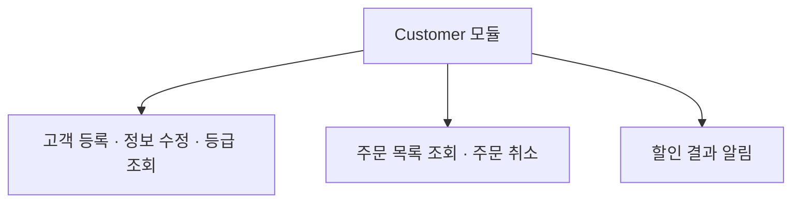
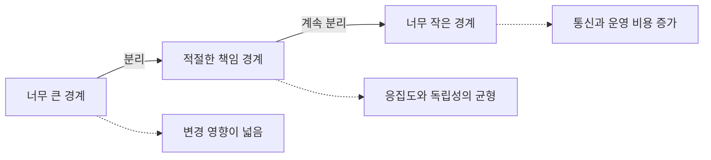
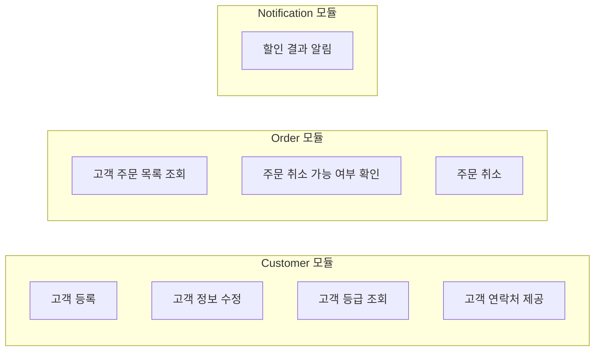
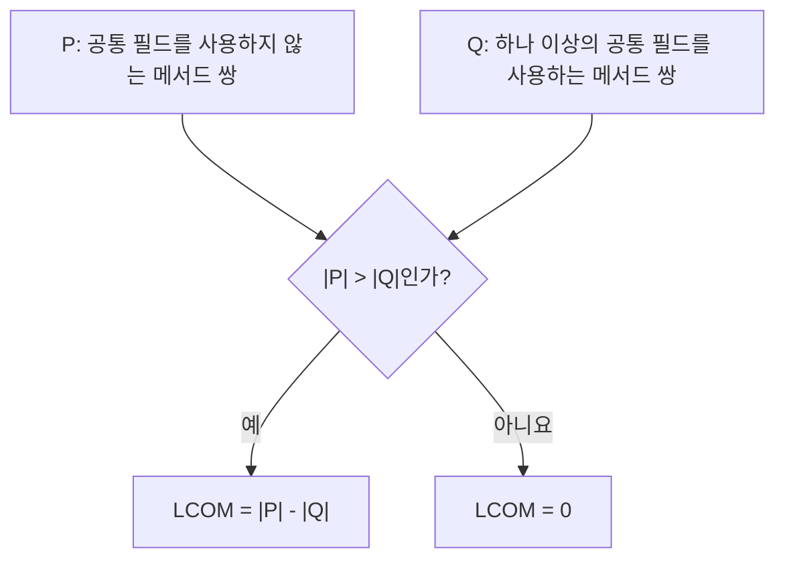
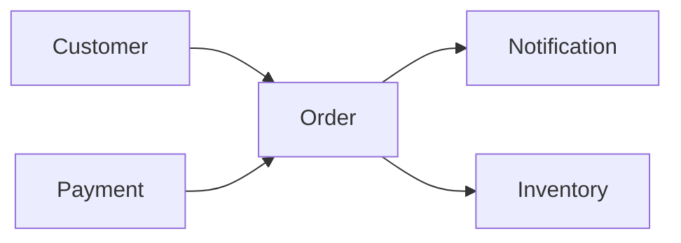
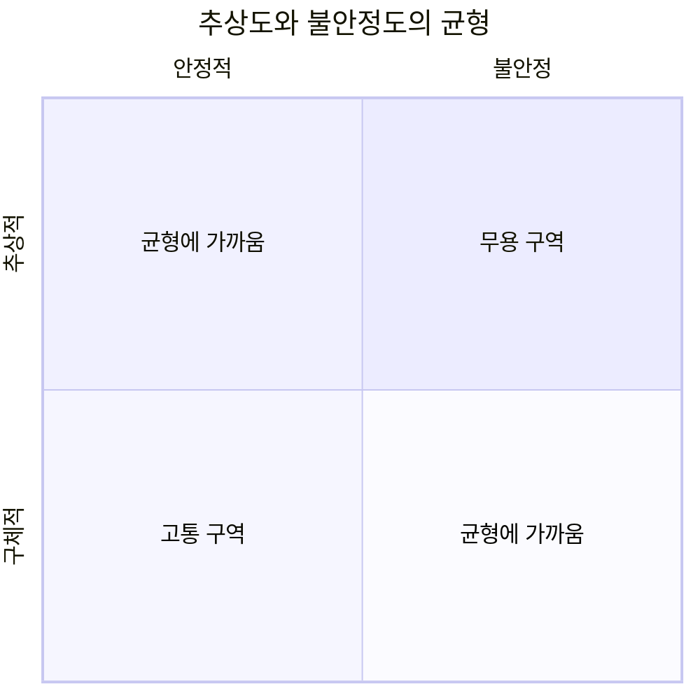

## 📦 들어가기에 앞서

[지난 글](/41/) 에서는 할인 기능을 곧바로 별도 서비스로 떼어내기보다, 먼저 ++모듈형 Monolith++ 안에서 경계를 만들어보자는 결정을 내렸습니다.

그런데 여기서 슬쩍 넘어간 질문이 하나 있습니다.

> ==그래서 모듈은 도대체 어디서부터 어디까지 나눠야 할까요?==

주문 시스템에 고객을 관리하는 모듈이 있다고 해보겠습니다. 이곳에는 고객 등록, 정보 수정, 등급 조회가 들어 있습니다. 여기까지는 꽤 자연스럽습니다. 그런데 고객에게 할인 결과를 알리는 기능은요? 고객의 주문 목록을 조회하고 주문을 취소하는 기능은 같은 곳에 두어도 될까요?



전부 “고객”이라는 단어가 들어가니 하나로 묶어도 될 것 같습니다. 파일도 하나라 찾기 쉽고요. 하지만 주문 취소 정책이 바뀔 때마다 고객 모듈을 수정해야 하고, 주문 데이터가 필요해 고객 모듈이 주문 모듈 내부까지 들여다보기 시작하면 이야기가 달라집니다.

처음에는 저도 파일과 폴더를 잘게 나누면 모듈성이 좋아진다고 생각했습니다. 작으면 단순하고, 단순하면 변경하기 쉬울 것 같았거든요. 예... 반만 맞는 생각이었습니다.

:::important
모듈성(Modularity)은 코드를 무조건 작게 자르는 일이 아니라, ==함께 바뀌어야 할 코드는 모으고 따로 바뀌어야 할 코드는 분리하는 일입니다.==
:::

이번 글에서는 고객과 주문 기능의 경계를 다시 나누어보며 모듈성과 세분도, 응집도와 결합도가 무엇인지 알아보겠습니다. 마지막에는 숫자로 표현하기 어려운 결합까지 ++동형성(Connascence)++이라는 관점으로 살펴보겠습니다.

## 🔪 모듈성과 세분도는 같은 말일까?

먼저 비슷하게 들리는 두 단어부터 구분해야 합니다. 모듈성은 “어떤 코드를 논리적으로 함께 묶을까?”에 대한 이야기입니다. 주문 취소와 취소 정책처럼 같이 바뀌는 코드를 같은 경계에 두는 것이죠.

반면 세분도(Granularity)는 그 묶음을 얼마나 작게 나눌지에 대한 이야기입니다. 주문 전체를 하나로 둘 수도 있고 결제와 배송까지 나눌 수도 있습니다. 그러니 모듈성과 세분도는 같은 말이 아닙니다. 모듈성으로 경계를 찾고, 세분도로 그 경계의 크기를 결정한다고 생각하면 편합니다.

클래스, 함수, Java의 Package, .NET의 Namespace처럼 언어마다 모듈을 표현하는 도구는 다르지만 핵심은 같습니다. ==관련된 코드를 묶고, 바깥에는 필요한 부분만 보여주는 것==입니다.

여기서 ++“그렇다면 잘게 나눌수록 좋은 것 아닌가요?”++라는 질문이 생깁니다.

고객 등록, 고객 수정, 고객 조회를 각각 별도 서비스로 만들면 각 서비스는 정말 작아집니다. 그러나 고객 한 명을 등록하는 과정에도 서비스 여러 개를 호출해야 하고, 배포와 관측, 장애 처리까지 따로 관리해야 합니다. 작은 조각 사이의 통신이 늘면서 오히려 시스템 전체는 복잡해질 수 있습니다.(과도하게 쪼개면 너무 복잡해집니다.)



반대로 모든 기능을 주문 모듈 하나에 넣으면 통신 비용은 줄지만 작은 변경도 거대한 모듈 전체에 영향을 줍니다. 모듈이 너무 크면 분리하기 어렵고, 너무 작으면 조각을 연결하는 비용이 커집니다.(코드 하나 수정하면, 너무 많은 부분을 변경해야합니다.)

그래서 저는 세분도를 ++칼의 크기++로 이해했습니다. 재료에 맞는 칼을 골라야지, 가장 작은 칼로 모든 재료를 다듬는다고 요리가 쉬워지는 것은 아니니까요.(양파 하나 써는데 메스가 필요하진 않잖아요???)

==모듈성은 세분도의 전제 조건이고, 세분도는 모듈 사이 결합에 영향을 줍니다.== 경계를 먼저 이해하지 않은 채 크기부터 줄이면 분산된 진흙 덩어리(Distributed Big Ball of Mud)[^1]를 만들 수도 있습니다.

## 🧲 응집도는 무엇을 함께 둘지 묻는다

응집도(Cohesion)는 한 모듈 안의 코드가 얼마나 하나의 목적을 향하는지 나타냅니다. 쉽게 말하면 ==“이 친구들이 정말 한 팀이어야 하는가?”==를 묻는 기준입니다.

이 책에서는 응집도를 강한 순서부터 ==기능적, 순차적, 통신적, 절차적, 시간적, 논리적, 우발적 응집==으로 구분합니다. 이름만 보면... 예, 헷갈립니다. 결국 “왜 이 코드들이 같이 있지?”에 대한 대답이 얼마나 설득력 있는지를 나눈 것입니다.

주문 취소 가능 여부를 확인하고 실제로 취소하는 코드는 하나의 기능을 함께 완성합니다. 이것이 가장 강한 기능적 응집입니다. 결제 승인 결과가 다음 주문 확정의 입력이 되는 것처럼 앞의 출력이 다음 과정으로 이어지면 순차적 응집이라고 합니다. 둘 다 함께 있어야 하는 이유가 비교적 분명합니다.

주문을 저장한 뒤 같은 주문 데이터로 완료 Event를 발행한다면 통신적 응집으로 볼 수 있습니다. 그런데 마감 작업이라는 이유로 서로 다른 기능을 순서대로 묶었다면 절차적 응집입니다. 실행 순서는 같지만 목적까지 같은지는 다시 확인해야 합니다.

서비스가 시작될 때 Cache와 Connection을 초기화하는 코드는 같은 시점에 실행된다는 이유로 모였습니다. 이것이 시간적 응집입니다. 문자, 메일, Push를 전부 “알림”이라는 이름의 Utility에 넣으면 논리적 응집에 가깝습니다. 비슷해 보이기는 하지만 각 채널이 바뀌는 이유는 다를 수 있겠죠.

마지막으로 넣을 곳이 애매한 함수를 misc 파일에 모았다면 우발적 응집입니다. 그냥 우연히 같은 파일에 있는 것입니다. 가장 설명하기 어려운 묶음이죠.(misc 파일이 커지고 있다면... 뭔가 잘못되고 있는 겁니다.)

여기서 중요한 것은 ==응집도가 높다고 언제나 더 잘게 나누라는 뜻은 아니라는 점==입니다.

고객 주문 조회와 주문 취소만 떼어 ++OrderMaintenance++라는 작은 모듈을 만들 수 있습니다. 그런데 두 기능이 앞으로도 함께 바뀔까요? 별도 팀이 소유할까요? 고객 화면을 만들 때 항상 같이 사용될까요? 이 질문에 대한 답이 없다면 작은 모듈 하나만 더 생기고 호출 경로만 복잡해질 수 있습니다.

제가 실제로 경계를 정한다면 명사의 유사성보다 ==변경 이유==를 먼저 보겠습니다.



이렇게 나누면 고객 정책, 주문 정책, 알림 채널이 각자 바뀔 때 수정할 경계가 분명해집니다. 단어가 아니라 ==업무 책임과 변화의 축==으로 다시 묶은 것입니다.

### 1. LCOM 점수가 낮으면 좋은 설계일까?

응집도를 수치로 보고 싶을 때 ++LCOM(Lack of Cohesion in Methods)++이라는 지표를 사용할 수 있습니다. Chidamber와 Kemerer가 제안한 초기 방식은 클래스의 메서드 쌍이 같은 Instance 변수를 사용하는지 비교합니다.[^2]



예를 들어 한 클래스의 주문 조회 메서드는 ++orderRepository++만 사용하고, 고객 알림 메서드는 ++messageSender++만 사용한다면 두 메서드는 상태를 공유하지 않습니다. 이런 관계가 많을수록 LCOM이 커지고, 서로 다른 책임을 한 클래스에 넣었을 가능성을 의심할 수 있습니다.

하지만 LCOM이 0이라고 완벽한 클래스는 아닙니다. 모든 메서드가 의미 없는 공통 Logger 필드 하나를 사용해도 점수는 좋아질 수 있고, 상태를 거의 사용하지 않는 함수형 코드에는 이 기준이 잘 맞지 않을 수 있습니다.

:::warning
!!지표는 분리 명령이 아니라 질문을 시작하는 신호입니다.!! LCOM이 높으면 “왜 이 메서드들이 한 클래스에 있지?”라고 살펴볼 수 있지만, 숫자만으로 업무 경계를 결정할 수는 없습니다.
:::

## 🔗 결합도는 무엇이 함께 끌려오는지 묻는다

응집도가 모듈 내부를 본다면 결합도(Coupling)는 모듈 사이의 연결을 봅니다. 주문 모듈의 코드를 한 줄 바꿨는데 고객, 결제, 배송 모듈까지 함께 수정하고 배포해야 한다면 결합도가 높은 상태입니다.

결합을 방향에 따라 나누면 구조가 조금 더 잘 보입니다.



Order를 기준으로 보면 Customer와 Payment에서 들어오는 의존성은 ++구심 결합도(Ca, Afferent Coupling)++입니다. Order가 Notification과 Inventory를 향해 나가는 의존성은 ++원심 결합도(Ce, Efferent Coupling)++입니다.

Ca는 이 모듈에 의존하는 바깥 모듈의 수를 셉니다. 값이 크다면 Order를 변경했을 때 영향을 받을 소비자가 많다는 뜻입니다. Ce는 반대로 이 모듈이 의존하는 바깥 모듈의 수를 셉니다. 값이 클수록 Order가 다른 모듈의 변화에 끌려갈 가능성이 큽니다.

그렇다면 Ca와 Ce가 낮을수록 무조건 좋은 걸까요? 아닙니다. 여러 모듈이 사용하는 주문 계약은 Ca가 높을 수밖에 없습니다. 대신 자주 깨지지 않도록 안정적인 계약과 호환성 정책이 필요합니다. Ce가 높은 조정 모듈도 여러 기능을 연결하는 역할 때문에 그럴 수 있습니다. 이 경우에는 외부 변경이 한꺼번에 전파되지 않도록 Interface나 Adapter를 검토하면 됩니다. 숫자만 보고 의존성을 없애면 시스템이 아무 일도 못 하겠죠???

### 1. 불안정도는 이름과 달리 장애율이 아니다

Ca와 Ce를 이용하면 불안정도(Instability)를 계산할 수 있습니다.

$$
I = \frac{Ce}{Ce + Ca}
$$

불안정도는 0에서 1 사이의 값을 가집니다. 0에 가까우면 나가는 의존성보다 들어오는 의존성이 많아 다른 모듈이 이 모듈에 기대고 있다는 뜻입니다. 바꾸기 어려운 ++안정적인 위치++인 셈입니다. 1에 가까우면 이 모듈을 사용하는 곳보다 이 모듈이 의존하는 곳이 많아 변화에 민감합니다.

제가 처음 이 이름을 봤을 때는 “값이 높으면 서버가 자주 죽는다는 뜻인가?”라고 생각했습니다. 하지만 여기서 안정성은 가용성이 아니라 ==변경에 대한 저항==입니다. 안정적인 모듈은 좋은 모듈, 불안정한 모듈은 나쁜 모듈이라는 뜻도 아닙니다. 화면이나 Workflow처럼 자주 바뀌는 모듈은 불안정해도 괜찮습니다. 문제는 핵심 정책이 수많은 구현 세부사항에 끌려다니는 구조입니다.

## ⚖️ 안정적인 코드는 얼마나 추상적이어야 할까?

여기서 또 문제가 생깁니다. 많은 모듈이 Order에 의존해 Order의 Ca가 아주 높다고 해보겠습니다. 그런데 Order가 구체적인 구현만 가득한 거대한 덩어리라면 어떨까요? 누구나 사용하지만 아무도 쉽게 바꾸지 못하는 코드가 됩니다.

이를 함께 보기 위한 값이 추상도(Abstractness)입니다.

$$
A = \frac{N_a}{N_a + N_c}
$$

여기서 $N_a$는 추상 클래스와 Interface의 수, $N_c$는 구체 클래스의 수입니다. 추상도가 0이면 모두 구체적인 구현이고, 1이면 모두 추상적인 요소입니다. 추상도 역시 높을수록 무조건 좋은 점수가 아닙니다. 모든 것을 Interface로 만들면 실제 동작을 찾기 위해 파일을 끝없이 따라가야 합니다. 반대로 모든 것이 구체적이면 확장 지점이 사라집니다.

불안정도 I와 추상도 A를 함께 놓으면 두 값이 균형을 이루는 지점을 생각할 수 있습니다.

$$
D = |A + I - 1|
$$

이 값을 ++주 시퀀스로부터의 거리(Distance from the Main Sequence)++라고 부릅니다. D가 0에 가까우면 안정적인 모듈은 충분히 추상적이고, 구체적인 모듈은 비교적 쉽게 바꿀 수 있는 균형선에 가깝다는 뜻입니다.



왼쪽 아래는 매우 안정적이지만 구체적인 ++고통 구역++입니다. 많은 코드가 의존해 바꾸기 어려운데 확장할 추상화도 부족합니다. 오른쪽 위는 추상적인 요소만 많지만 아무도 사용하지 않는 ++무용 구역++입니다.

이름이 조금 무섭지만, 실제 코드가 어느 구역에 들어갔다고 바로 리팩터링할 필요는 없습니다. 생성된 코드, 단순한 데이터 모델, 작은 애플리케이션은 의도적으로 균형선에서 멀어질 수도 있습니다. ==전체 맥락 없이 좌표 하나만 보고 좋은 아키텍처를 판정할 수는 없습니다.==

## 🧬 함수 호출이 없어도 결합될 수 있다

결합도를 Import나 함수 호출 개수로만 측정하면 놓치는 관계가 있습니다.

```python title="discount_client.py"
apply_discount("VIP", 20, True)
```

이 코드에서 20은 할인율일까요, 최대 할인 금액일까요? True는 중복 할인을 허용한다는 뜻일까요? 호출하는 쪽과 함수가 ==인자의 위치와 의미를 똑같이 알고 있어야만== 코드가 동작합니다.

이처럼 한 요소가 바뀌었을 때 전체의 정확성을 유지하기 위해 다른 요소도 함께 바뀌어야 하는 관계를 동형성(Connascence)이라고 합니다.[^3] 저는 이 용어를 ++“같이 변해야 하는 정도”++라고 이해했습니다.

가장 쉽게 보이는 것은 이름과 타입입니다. 함수명이나 Event 이름이 바뀌면 사용하는 곳도 같은 이름으로 바꿔야 합니다. orderId를 문자열로 주고받기로 했다면 Client와 Server가 같은 타입을 알아야 하고요. 각각 이름 동형성과 타입 동형성입니다.

그런데 결합은 이렇게 눈에 잘 보이는 형태로만 생기지 않습니다. 0은 실패이고 1은 성공이라는 규칙을 코드 양쪽이 몰래 알고 있다면 의미 동형성이 생깁니다. 위 코드처럼 할인율과 한도를 정해진 인자 순서로 전달해야 한다면 위치 동형성입니다. Client와 Server가 같은 서명 알고리즘을 구현해야 하는 경우에는 알고리즘 동형성이라고 합니다.

실행되는 과정에도 결합이 숨어 있습니다. 제목과 수신자를 설정한 뒤에만 메일을 보낼 수 있다면 실행 순서를 함께 알아야 합니다. 두 작업이 특정 시점에 실행되거나 반드시 동시에 끝나야 한다면 타이밍까지 맞춰야 하고요.

주문 총액과 결제 합계처럼 두 값이 항상 일치해야 하는 관계도 있습니다. 여러 Consumer가 반드시 같은 분산 Lock 객체를 참조해야 할 수도 있습니다. 앞은 값 동형성, 뒤는 신원 동형성입니다. 함수 호출 한 줄이 없어도 서로의 사정을 꽤 많이 알고 있는 셈입니다.

동형성의 종류를 전부 외우는 것이 목적은 아닙니다. 저도 이 이름들을 외우는 것보다 세 가지를 먼저 볼 것 같습니다. 함께 바꾸기 얼마나 어려운 관계인지, 결합된 코드가 같은 함수에 있는지 다른 서비스에 있는지, 그리고 하나의 변경에 몇 개의 요소가 영향을 받는지 말입니다. 이것을 각각 결합의 ++강도, 지역성, 정도++라고 합니다.

같은 함수 안에서 두 줄의 실행 순서가 결합된 것은 크게 문제 되지 않을 수 있습니다. 하지만 서로 다른 팀이 운영하는 서비스가 인자의 위치나 마법의 숫자에 의존한다면 작은 변경도 큰 장애로 이어집니다.

그러면 이 결합을 어떻게 해야 할까요? 일단 강한 동형성을 이름이나 타입처럼 더 약한 동형성으로 바꿀 수 있습니다. 위치 인자 대신 이름이 있는 객체를 전달하고, 마법의 숫자 대신 명시적인 타입을 사용하는 것입니다.

약하게 바꿀 수 없다면 가능한 가까운 곳에 둡니다. 같은 변경이 필요한 코드를 같은 모듈 안에 모으고, 서비스 경계를 넘을 때는 안정적인 계약을 사용합니다. ==결합을 무조건 없애는 게 아니라, 약하게 만들고 가까이 두는 것입니다.==

```python title="discount_client.py"
from dataclasses import dataclass


@dataclass(frozen=True)
class DiscountRequest:
    customer_grade: str
    rate_percent: int
    allow_stacking: bool


apply_discount(DiscountRequest(
    customer_grade="VIP",
    rate_percent=20,
    allow_stacking=True,
))
```

여전히 Client와 Server는 필드 이름과 타입에 합의해야 합니다. 결합이 사라진 것은 아닙니다. 다만 순서와 숨은 의미에 의존하던 강한 결합을 도구가 검사하기 쉬운 형태로 바꿨습니다.

:::tip
“마법의 숫자를 상수로 바꿔주세요”보다 “의미 동형성을 이름 동형성으로 약화해봅시다”라고 말하면 특정 코드 한 줄을 넘어 반복해서 사용할 수 있는 설계 원칙이 됩니다.
:::

## 📝 만약, 제가 실제로 모듈을 나눈다면?

고객, 주문, 알림 기능을 다시 나눈다면 저는 일단 폴더부터 만들지는 않을 것 같습니다. 먼저 기능마다 왜 바뀌는지, 누가 변경을 요청하는지를 적어봅니다. 그다음 같은 데이터와 Workflow를 사용하면서 실제로 함께 바뀌는 코드를 찾습니다.

여기까지만 보면 모듈 안쪽만 확인한 셈입니다. 이제 바깥도 봐야겠죠? 모듈이 의존하는 대상과 이 모듈을 사용하는 소비자를 그려보고, 경계를 넘는 계약에 위치나 의미, 타이밍 같은 강한 동형성이 숨어 있는지 확인합니다.

LCOM, Ca, Ce 같은 지표는 이 과정에서 이상한 지점을 찾는 데 사용합니다. 점수가 나쁘다고 바로 파일을 쪼개지는 않습니다. 독립 배포와 확장이 정말 필요한지 운영 비용까지 비교한 뒤 경계를 정할 것입니다. 그리고 변경 이력을 보면서 다시 조정합니다. 처음부터 완벽한 경계를 맞힌다면 좋겠지만... 그건 좀 어렵습니다.

이 과정에서 주문 취소는 고객 화면에서 시작되더라도 Order 모듈에 둘 가능성이 큽니다. 취소 가능 여부, 재고 복구, 환불 정책과 함께 바뀌기 때문입니다. 고객 모듈에는 주문 조회에 필요한 고객 식별자만 계약으로 제공합니다. 알림은 채널과 Template 변경의 이유가 다르므로 Notification 모듈로 분리할 수 있습니다.

하지만 팀이 세 명이고 기능이 거의 바뀌지 않는 작은 서비스라면 물리적인 서비스 세 개로 나누지는 않을 겁니다. 하나의 배포 단위 안에서 논리적인 경계부터 만들고, 독립적인 확장이나 배포가 필요해질 때 컴포넌트 또는 서비스 분리를 검토하는 편이 비용을 설명하기 쉽습니다.

==좋은 모듈 경계는 현재 코드의 모양이 아니라 미래에 함께 바뀔 가능성을 담습니다.== 다만 미래를 정확히 예측할 수는 없으니 변경 기록과 팀의 업무 경계를 근거로 계속 고쳐가야 합니다.

## 😮‍💨 마무리

처음에는 모듈성을 "극한으로 쪼개는 것!" 정도로 생각했습니다. 그런데 3장을 읽고 나니 모듈은 코드 정리보다 변화의 비용에 가까웠습니다. 무엇을 같은 상자에 넣느냐에 따라 다음 변경에서 열어야 할 상자의 수가 달라지기 때문입니다.

응집도는 같은 상자 안의 코드가 정말 같은 목적과 변경 이유를 가지는지 보여줍니다. 결합도는 그 상자를 고쳤을 때 다른 상자가 얼마나 같이 끌려오는지 보여주고요. LCOM이나 불안정도, 추상도 같은 숫자는 정답을 내려주지 않습니다. “여기 조금 이상한데?”라고 다시 볼 곳을 알려주는 정도입니다.

함수 호출만 멀쩡하다고 끝도 아닙니다. 이름, 의미, 순서, 타이밍처럼 코드 사이에 숨은 약속도 함께 바뀌어야 한다면 결합입니다. 이런 강한 결합은 더 약하고 명시적인 형태로 바꾸고, 피할 수 없다면 가까운 경계 안에 둬야 합니다.

결국 코드를 잘 나눈다는 것은 조각의 개수를 늘리는 일이 아닙니다. ==같이 변해야 하는 코드는 가까이 두고, 따로 변해야 하는 코드는 서로의 사정을 덜 알게 만드는 일==입니다. 작게 나누는 건 그다음 문제입니다.

다음 글에서는 좋은 구조가 무엇을 잘해야 하는지, 성능과 가용성, 보안, 변경 용이성 같은 ++아키텍처 특성(Architectural Characteristics)++을 중심으로 알아보겠습니다.

[^1]: 이 부분은, 책에서 표현한 원문 그대롭니다. 진흙? 이렇게 표현하더라구요.
[^2]: Shyam R. Chidamber와 Chris F. Kemerer, [A Metrics Suite for Object Oriented Design](https://doi.org/10.1109/32.295895), IEEE Transactions on Software Engineering, Vol. 20, No. 6, pp. 476–493, 1994. 본문에서 사용한 P와 Q의 차이로 계산하는 LCOM 정의는 이 논문에서 제안한 초기 LCOM 방식입니다.
[^3]: 동형성은 Meilir Page-Jones가 객체 지향 설계의 결합을 설명하며 발전시킨 개념입니다. 유형과 강도, 지역성에 대한 간단한 정리는 [Connascence](https://connascence.io/pages/about.html)에서 확인할 수 있습니다.
