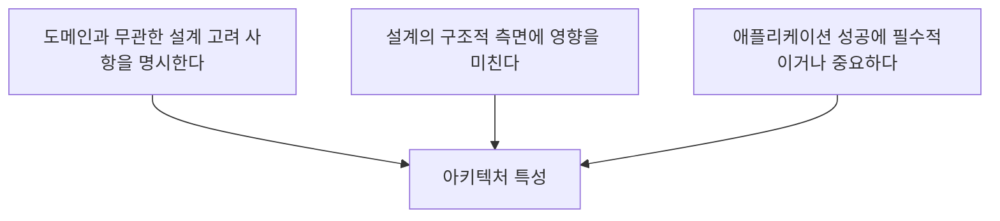

## 🎫 들어가기에 앞서

[지난 글](/42/) 에서는 같이 변해야 하는 코드는 가까이 두고, 따로 변해야 하는 코드는 서로의 사정을 덜 알도록 모듈 경계를 나눠봤습니다.

이번에는 공연 티켓을 예매하는 서비스를 만든다고 해보겠습니다. 사용자는 공연을 고르고, 좌석을 선택하고, 결제할 수 있어야 합니다. 개발 환경에서 직접 실행해보니 좌석도 잘 선택되고 결제도 성공합니다. 기능은 전부 동작하네요. 그러면 이 서비스는 잘 만든 서비스일까요?

그런데 예매가 열리는 오후 8시에 수십만 명이 동시에 접속하자 화면이 30초 동안 멈춥니다. 간신히 결제했더니 같은 좌석이 두 명에게 판매됐고, 한 서버가 고장 나자 예매 서비스 전체가 내려갔습니다.

기획서에 적힌 “사용자는 좌석을 예매할 수 있다”라는 기능은 분명 구현했습니다. 다만 사용자가 몰려도 버텨야 한다는 ++확장성(Scalability)++, 빠르게 응답해야 한다는 ++성능(Performance)++, 장애가 발생해도 사용할 수 있어야 한다는 ++가용성(Availability)++은 놓쳤습니다.

처음에는 저도 이런 항목을 “기능을 다 만든 다음에 성능 개선할 때 보는 것” 정도로 생각했습니다. 하지만 기능이 있어도 정작 예매가 열리는 순간 사용할 수 없다면... 그 기능은 성공했다고 말하기 어렵겠죠?

:::important
==아키텍처 특성(Architectural Characteristics)은 시스템이 무엇을 하는지가 아니라, 성공하기 위해 그것을 어떻게 수행하고 어떤 조건을 지켜야 하는지를 설명합니다.==
:::

이번 글에서는 ++소프트웨어 아키텍처 The Basics 2판++의 4장을 바탕으로 아키텍처 특성이 무엇인지 알아보겠습니다. 그리고 성능, 보안, 유지보수성 같은 단어를 전부 챙기려 할 때 왜 “최고의 아키텍처”가 아니라 “가장 덜 나쁜 아키텍처”를 선택하게 되는지도 티켓 예매 서비스를 통해 확인해보겠습니다.[^1]

## 🧩 기능 요구사항과 무엇이 다를까?

기능 요구사항은 애플리케이션이 ++무엇을 해야 하는지++ 말합니다.

- 사용자는 공연을 검색할 수 있습니다.
- 사용자는 남은 좌석을 선택할 수 있습니다.
- 사용자는 선택한 좌석을 결제할 수 있습니다.

반면 아키텍처 특성은 같은 기능이 성공했다고 판단할 기준을 만듭니다. 검색 결과가 몇 초 안에 보여야 하는지, 한꺼번에 몇 명이 접속할 수 있어야 하는지, 결제 도중 서버가 고장 나면 얼마나 빨리 복구해야 하는지 같은 조건입니다.

그렇다고 기능이 아닌 요구사항을 전부 아키텍처 특성이라고 부를 수는 없습니다. 책에서는 어떤 요구사항이 아키텍처 특성이 되려면 세 가지 기준을 모두 만족해야 한다고 설명합니다.

먼저 ++도메인과 무관한 설계 고려 사항++이어야 합니다. 좌석을 선택하고 결제하는 규칙은 티켓 예매라는 문제 영역의 행동입니다. 하지만 응답 시간, 보안, 복구 가능성은 티켓 서비스뿐 아니라 쇼핑몰이나 은행 시스템에서도 고민합니다.

두 번째로 ++구조에 영향을 미쳐야 합니다.++ “비밀번호는 안전하게 저장해야 한다”는 일반적인 코딩 고려 사항으로 해결될 수 있습니다. 그런데 공격이 발생해도 결제 정보가 노출되지 않도록 망을 분리하고, 인증 서비스를 별도 경계로 두고, 모든 서비스 사이의 통신을 보호해야 한다면 이야기가 달라집니다. 보안을 만족시키기 위해 시스템 구조를 바꿔야 하므로 아키텍처 특성이 됩니다.

마지막으로 ++애플리케이션 성공에 중요해야 합니다.++ 사내에서 다섯 명만 사용하는 좌석 관리 도구에 초당 수십만 건을 처리하는 확장성은 필요하지 않을 수 있습니다. 반대로 인기 공연 예매 서비스에서는 이 특성이 빠지면 기능이 아무리 정확해도 서비스가 실패합니다.

여기서 조금 이상한 점이 있습니다. 그렇게 중요하다면 요구사항 문서에 당연히 적혀 있어야 하지 않을까요?

## 🕵️ 적혀 있지 않아도 필요한 특성이 있다

“예매 시작 시 최대 10만 명이 동시에 접속하며, 좌석 조회는 2초 안에 응답해야 한다”처럼 문서에 직접 적힌 것은 ++명시적 특성(Explicit Attribute)++입니다. 팀 전체가 무엇을 지켜야 하는지 비교적 쉽게 알 수 있습니다.

하지만 가용성, 신뢰성, 보안처럼 대부분의 시스템에 당연히 필요하다고 여겨져 문서에서 빠지는 특성도 있습니다. 이것이 ++암묵적 특성(Implicit Attribute)++입니다. 기획서에 “결제 정보를 다른 사람에게 보여주면 안 된다”라고 쓰지 않았다고 정말 보여줘도 되는 것은 아니잖아요???

암묵적이라는 말은 중요하지 않다는 뜻이 아닙니다. 오히려 너무 당연하게 생각해서 놓치기 쉽다는 뜻에 가깝습니다. 증권사의 고빈도 거래 시스템이라면 낮은 지연 시간이 핵심이라는 사실을 도메인 관계자들이 이미 알고 있어 요구사항에서 생략할 수도 있습니다. 문제는 개발팀도 똑같이 알고 있을 것이라 가정하는 순간입니다.

책에서는 명시적 특성과 암묵적 특성이 서로 상호작용하며 전체 설계를 지탱한다고 설명합니다. 저는 이 부분을 건물의 사용 목적과 안전 기준처럼 이해했습니다. “이 건물은 공연장이다”라는 목적만으로는 출입구의 폭이나 비상구의 수를 결정할 수 없습니다. 관객 수, 대피 시간, 접근성 같은 조건이 구조를 바꿉니다. 소프트웨어도 똑같습니다.

다만 어떤 특성을 찾아내고 우선순위를 정할지는 5장의 내용입니다. 이번 글에서는 일단 우리가 어떤 종류의 특성을 놓칠 수 있는지부터 보겠습니다.

## 🚦 운영 중에 드러나는 특성

++운영 아키텍처 특성(Operational Architectural Characteristics)++은 시스템을 실제로 실행했을 때 드러나는 능력입니다. 티켓 예매가 열리는 오후 8시가 되어서야 문제가 보이는 친구들이라고 생각하면 편합니다.

가장 먼저 성능을 떠올릴 수 있습니다. 성능은 시스템이 얼마나 빠르게 실행되는지를 나타냅니다. 좌석 조회의 응답 시간, 결제 처리량, 특정 기능이 얼마나 자주 사용되는지 등을 살펴볼 수 있습니다.

그런데 응답이 빠르다고 사용자가 몰려도 버틸 수 있는 것은 아닙니다. 평소에는 100ms 만에 응답하던 서버가 접속자 10만 명 앞에서 멈춘다면 ++확장성++이 부족한 것입니다. 확장성은 사용자나 요청이 증가할 때 시스템이 수행 능력을 늘릴 수 있는지를 묻습니다.

서버를 늘렸는데 한 대가 고장 나자 서비스 전체가 내려간다면 이번에는 ++가용성++과 ++복구성(Recoverability)++을 봐야 합니다. 가용성은 시스템이 얼마나 오랫동안 사용 가능한 상태를 유지하는지, 복구성은 재해나 장애 이후 얼마나 빨리 다시 온라인 상태가 되고 데이터를 되살릴 수 있는지에 가깝습니다.

비슷하게 들리는 ++신뢰성(Reliability)++은 지정된 조건과 기간 동안 시스템이 의도한 대로 동작하는지를 묻습니다. 서비스 화면이 열려 있다고 해서 결제가 정확히 한 번만 처리된다는 보장은 없습니다. 접속은 되는데 같은 좌석을 두 명에게 판매한다면 가용성은 있어 보여도 신뢰할 수 있는 예매 시스템은 아닙니다.

:::warning
++가용성++, ++신뢰성++, ++복구성++은 서로 관련되지만 같은 말이 아닙니다. “서버가 떠 있다”와 “올바르게 동작한다”, “고장 뒤 원래 상태로 돌아온다”를 한 단어로 섞으면 팀마다 성공 기준이 달라집니다.
:::

운영 특성에는 이 밖에도 재해 복구 능력을 보는 연속성, 오류와 경계 조건을 처리하는 견고성, 사람의 안전과 회사의 큰 손실까지 고려하는 안전성 등이 있습니다. 전부 외울 필요는 없습니다. 중요한 것은 “기능 테스트를 통과했다”만으로는 이 조건들을 확인할 수 없다는 점입니다.

## 🧱 실행하기 전부터 구조에 남는 특성

운영 특성이 실행 중인 시스템을 바라본다면 ++구조적 아키텍처 특성(Structural Architectural Characteristics)++은 코드를 만들고 바꾸는 과정에 더 가깝습니다.

공연마다 할인 정책이 달라져서 개발자가 규칙을 수정한다고 해보겠습니다. 할인 코드 한 줄을 바꿀 때 좌석, 결제, 알림 모듈까지 전부 고쳐야 한다면 유지보수성이 낮습니다. [지난 글](/42/) 에서 응집도와 결합도를 보며 모듈 경계를 나눈 이유가 여기서 다시 연결됩니다.

++유지보수성(Maintainability)++은 변경 사항을 적용하고 시스템을 개선하기 얼마나 쉬운지를 나타냅니다. 새로운 할인 유형을 기존 구조에 자연스럽게 추가할 수 있는지는 ++확장 능력(Extensibility)++, 다른 운영체제나 데이터베이스 환경으로 옮길 수 있는지는 ++이식성(Portability)++으로 볼 수 있습니다.

사용자가 설정 화면에서 알림 방식이나 언어를 쉽게 바꿀 수 있다면 ++설정성(Configurability)++과도 연결됩니다. 새 버전으로 얼마나 쉽고 빠르게 올릴 수 있는지는 ++업그레이드성(Upgradeability)++이고요.

이 특성들은 사용자가 예매 버튼을 누르는 순간에는 잘 보이지 않습니다. 그래서 일정이 급하면 뒤로 밀기 쉽습니다. 하지만 매주 새로운 공연과 정책을 추가해야 하는 서비스라면 변경하기 어려운 구조 자체가 사업 속도를 막습니다. 기능을 빨리 만들기 위해 구조를 무시했는데, 다음 기능부터 느려지는 상황입니다. 예.. 익숙합니다.

## ☁️ 클라우드에 올리면 자동으로 해결될까?

책의 2판에서는 별도로 ++클라우드 특성(Cloud Characteristics)++을 다룹니다. 클라우드를 사용하는 시스템이 늘어나면서 기존 운영 특성만으로는 표현하기 어려운 제공업체의 능력이 설계에 직접 영향을 미치기 때문입니다.

예매 시작 전에는 서버 두 대만 사용하다가 접속자가 몰리는 순간 자원을 늘리고, 예매가 끝나면 다시 줄이고 싶습니다. 수요에 따라 자원을 동적으로 늘릴 수 있는 제공업체의 능력이 ++온디맨드 확장성(On-demand Scalability)++입니다. 수요가 급증했을 때 얼마나 유연하게 대응하는지는 ++온디맨드 탄력성(On-demand Elasticity)++과 연결됩니다.

그냥 클라우드에 배포했다고 장애에 강해지는 것은 아닙니다. 여러 가용 영역(Availability Zone)에 자원을 분리해야 ++존 기반 가용성(Zone-based Availability)++을 활용할 수 있습니다. 애플리케이션이 여전히 하나의 데이터베이스와 하나의 영역만 바라본다면 클라우드 대시보드에 로그인했다는 사실은 별로 도움이 되지 않겠죠.

데이터를 어느 국가와 지역에 저장할 수 있는지도 구조를 바꿉니다. ++지역 기반 개인정보보호와 보안++은 데이터 저장 위치를 규제하는 법과 관련됩니다. 이 조건이 있다면 백업 위치, 복제 방식, 사용하는 관리형 서비스까지 달라질 수 있습니다.

그러니 클라우드는 특성을 공짜로 완성해주는 상자가 아닙니다. 필요한 능력을 제공할 수는 있지만, 그 능력을 사용하도록 애플리케이션과 데이터를 설계해야 합니다.

## 🕸️ 한 범주에 넣기 어려운 특성도 있다

보안은 운영 특성일까요, 구조적 특성일까요? 사용자 인증은 실행 중에 필요하지만, 권한 경계와 데이터 암호화는 시스템 구조에도 영향을 줍니다. 법적 요구사항은 배포 지역과 데이터 보관 기간까지 바꿀 수 있고요.

이처럼 여러 범주를 가로지르는 것을 ++횡단적 아키텍처 특성(Cross-cutting Architectural Characteristics)++이라고 합니다.

티켓 예매 서비스에서 사용자가 본인임을 확인하는 것은 ++인증(Authentication)++입니다. 로그인한 사용자가 다른 사람의 예매 내역을 볼 수 없도록 기능 접근을 제한하는 것은 ++권한 부여(Authorization)++입니다. 두 단어를 모두 “인증”이라고 부르면 구현 단계에서 슬쩍 섞이기 쉽지만, 확인하는 대상은 다릅니다.

시각이나 청각 장애가 있는 사용자도 좌석을 예매할 수 있게 하는 ++접근성(Accessibility)++, 거래 기록을 정해진 기간 보관하거나 삭제하는 ++보관성(Archivability)++, 운영자가 오류를 추적할 수 있게 하는 ++지원성(Supportability)++도 한 모듈에만 넣고 끝낼 수 없습니다.

여기서 책이 꽤 솔직한 이야기를 합니다. 아키텍처 특성을 완벽하게 정의한 표준 목록은 없고, 같은 단어도 조직과 도메인에 따라 다르게 사용될 수 있다는 것입니다. 상호운용성과 호환성이 비슷하게 사용되기도 하고, 학습성은 사용자가 프로그램을 배우기 쉬운 정도를 뜻할 수도 있지만 시스템이 환경을 스스로 학습하는 능력을 뜻할 수도 있습니다.

ISO/IEC 25010도 소프트웨어 제품의 품질을 명세하고 측정·평가하기 위한 품질 모델을 제공하지만, 현재 2023년 판은 아홉 가지 특성과 그 하위 특성을 제시하는 참고 모델입니다.[^2] 이것만 가져와 체크하면 우리 서비스에 필요한 아키텍처 특성이 자동으로 결정되는 것은 아닙니다.

:::tip
같은 단어를 사용했다고 같은 뜻으로 이해한 것은 아닙니다. 팀 안에서 “가용성”, “보안”, “확장성”이 구체적으로 무엇을 뜻하는지 합의한 ++보편 언어(Ubiquitous Language)++를 만드는 편이 특성 목록을 더 길게 적는 것보다 중요합니다.
:::

## ⚖️ 그러면 좋은 특성을 전부 넣으면 되지 않을까?

성능도 최고, 보안도 최고, 가용성도 최고, 유지보수성도 최고로 만들면 되지 않을까요? 저도 처음에는 중요하다는 특성을 전부 넣으면 더 좋은 시스템이 된다고 생각했습니다. 돈과 시간이 무한하다면 조금 가까워질 수는 있겠지만, 현실에서는 그렇지 않습니다.

먼저 아키텍처 특성을 지원하는 일은 공짜가 아닙니다. 가용성을 높이기 위해 서버와 데이터베이스를 여러 영역에 복제하면 장애에는 강해지지만 비용과 운영 복잡성이 늘어납니다. 모든 요청을 암호화하고 권한을 세밀하게 확인하면 보안은 좋아지지만 처리 시간이 늘 수 있습니다.

특성끼리 항상 싸우기만 하는 것은 아닙니다. 모듈 경계를 잘 나누면 유지보수성과 테스트성이 함께 좋아질 수 있고, 장애를 격리한 구조가 가용성과 확장성을 동시에 도울 수도 있습니다. 하지만 하나를 바꾸면 연결된 다른 특성과 도메인 설계 요소도 영향을 받습니다.

책에서는 헬리콥터 조종 장치를 비유로 듭니다. 조종 장치 하나를 움직이면 다른 장치에도 영향이 생기기 때문에 조종사는 계속 균형을 맞춰야 합니다. 아키텍처 특성도 비슷합니다. 성능만 위로 당긴다고 나머지가 그 자리에 가만히 있지 않습니다.

티켓 예매 서비스로 돌아가 보겠습니다. 접속자가 갑자기 몰릴 때 요청을 Queue에 넣으면 시스템이 무너지는 것은 막을 수 있습니다. 대신 사용자는 즉시 좌석을 받지 못하고 기다려야 합니다. 여러 지역에 데이터를 복제하면 가용성은 좋아질 수 있지만 좌석 상태를 동시에 맞추는 문제가 어려워지고 비용도 늘어납니다.

그렇다면 무엇을 선택해야 할까요?

예매가 열린 짧은 시간에 사용자가 몰리고 같은 좌석을 두 명에게 팔면 안 되는 서비스라면, 저는 일단 순간적인 확장성과 좌석 데이터의 정확성을 우선하겠습니다. 대신 모든 화면을 똑같이 빠르게 만들려는 욕심은 내려놓을 수 있습니다. 공연 설명 이미지는 조금 늦게 보여도 결제와 좌석 선점이 정확한 편이 낫기 때문입니다.

반대로 사내 직원 몇 명이 사용하는 공연 등록 도구라면 다중 지역 배포와 자동 확장을 넣지 않을 것 같습니다. 한 번 멈췄을 때 복구하는 절차가 충분하다면 단순한 구조가 더 싸고 변경하기 쉽습니다.

==좋은 아키텍처는 모든 특성을 최대화한 아키텍처가 아니라, 이 시스템에서 중요한 특성을 지키면서 감당할 수 있는 단점을 선택한 아키텍처입니다.==

## 🥪 가장 좋은 것보다 가장 덜 나쁜 것

책에서는 이를 ++가장 덜 나쁜(Least Worst) 아키텍처++라고 표현합니다. 조금 이상하게 들립니다. 좋은 아키텍처를 만들려고 공부하는데 갑자기 덜 나쁜 것을 목표로 하라니깐요.

하지만 앞의 선택을 보면 이해가 됩니다. 높은 가용성은 비용을 가져오고, 강한 보안은 성능이나 사용 편의성과 부딪힐 수 있으며, 많은 특성을 한꺼번에 지원하면 설계가 금세 다루기 어려워집니다. 완벽한 선택지는 없으니 문제에 가장 치명적인 실패를 피하고, 나머지 단점 중 감당할 수 있는 것을 고르는 것입니다.

그리고 처음 선택이 영원한 정답일 필요도 없습니다. 아키텍처를 변경하기 어렵게 만들수록 첫 시도에서 정답을 맞혀야 한다는 부담이 커집니다. 반대로 작게 시작하고 관측한 결과에 따라 바꿀 수 있다면, 실제 접속량과 장애 기록을 보며 특성의 우선순위를 다시 조정할 수 있습니다.

처음부터 모든 미래를 예측하려는 설계보다 ++반복(Iteration)이 가능한 아키텍처++가 필요한 이유입니다. 물론 “나중에 바꾸면 되죠”라고 아무렇게나 만들자는 뜻은 아닙니다. 지금 중요하다고 합의한 특성은 지키되, 근거가 바뀌었을 때 되돌리기 어려운 선택을 줄이는 것입니다.

## 😮‍💨 마무리

기능이 동작하면 시스템 개발이 끝난다고 생각했는데, 4장을 읽고 나니 기능은 시작점에 가까웠습니다. 사용자가 좌석을 선택할 수 있어도 예매 시간에 접속할 수 없거나, 같은 좌석이 두 번 팔리거나, 작은 정책 변경에 시스템 전체를 고쳐야 한다면 성공한 서비스라고 하기 어렵습니다.

아키텍처 특성은 이런 실패를 설명하는 언어입니다. 운영 특성은 실행 중인 시스템이 빠르고 안정적으로 버티는지를 보고, 구조적 특성은 코드를 바꾸고 확장하기 쉬운지를 봅니다. 클라우드와 횡단적 특성은 제공업체의 능력, 보안, 접근성, 법처럼 여러 경계를 가로지르는 조건을 드러냅니다.

그렇다고 특성 이름을 전부 기획서에 복사하면 해결되는 것은 아닙니다. 팀이 같은 단어를 같은 뜻으로 사용해야 하고, 이 서비스의 성공에 중요한 특성만 골라야 합니다. 전부 최고로 만들려는 순간 비용과 복잡성이 우리를 기다리고 있으니깐요.(진짜 빠르게 옵니다.)

결국 아키텍트가 하는 일은 최고 점수의 구조를 찾는 일이 아니라, ==무엇을 지키고 무엇을 감수할지 근거를 가지고 결정하는 일==에 더 가깝습니다.

그런데 여기서 질문이 하나 남습니다. 수많은 특성 중에서 우리 서비스에 필요한 것은 어떻게 찾고, 서로 중요하다는 특성에는 어떤 순서로 우선순위를 붙여야 할까요?

다음 글에서는 도메인 관심사에서 아키텍처 특성을 도출하고, 명시적·암묵적 특성을 제한하고 우선순위를 정하는 방법을 알아보겠습니다.

[^1]: 마크 리처즈, 닐 포드, 《소프트웨어 아키텍처 The Basics 2판》, 한빛미디어, 2025, 4장 “아키텍처 특성의 정의”. 영문판의 [Chapter 4: Architectural Characteristics Defined](https://www.oreilly.com/library/view/fundamentals-of-software/9781098175504/ch04.html) 에서도 장의 구성과 용어를 확인할 수 있습니다.
[^2]: 국제표준화기구, [ISO/IEC 25010:2023 - Product quality model](https://www.iso.org/standard/78176.html). 2011년 판의 8개 상위 특성에서 2023년 판은 안전성을 포함한 9개 상위 특성으로 개정되었습니다.
