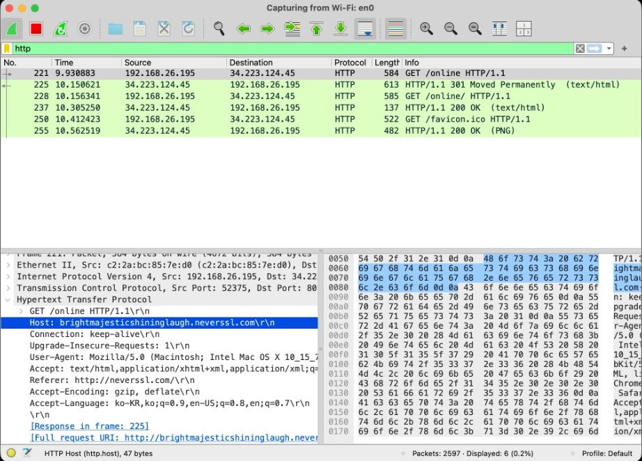
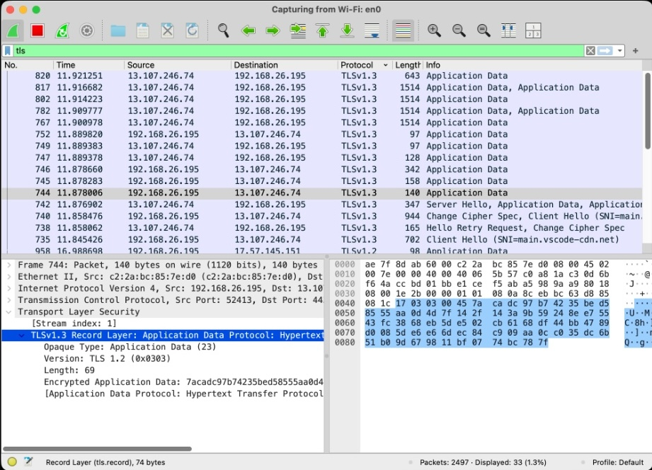

:::objective[🎯 학습 목표]
- HTTP와 HTTPS의 개념과 차이점을 이해합니다.
- Wireshark를 사용하여 실제 HTTP 및 HTTPS 통신을 비교 분석합니다.
:::

## 🤔 우리는 왜 패킷을 암호화해야하는가?
일단, ++패킷(Packet)++에 대해서 알아야합니다. 나중에 네트워크 포스팅에서 더 자세하게 올리겠지만 패킷에 대해서 간단히 설명하고 넘어가겠습니다. 

일반적으로 서버와 클라이언트 사이에서 데이터를 주고받을 때, 패킷을 사용합니다. 만약 인터넷에서 300Mb .flac 확장자를 가진 음악 파일을 다운로드 받는다고 합시다. 300Mb의 크기를 가진 파일을 한명의 사용자가 다운로드를 받는다면 괜찮겠지만 만약 ==같은 네트워크를 사용하는 100명, 1000명의 사람이 동시에 다운로드를 받는다==면 어떻게 될까요? 

인터넷 속도가 엄청 느려지겠죠?(실제로는 속도 뿐만 아니라, 전송 오류 발생시 재전송 할 수 있다는 장점도 있습니다.) 이러한 문제를 방지하기 위해서 클라이언트와 서버 등이 통신을 할 때, 300Mb의 파일을 ==특정한 크기(여기서는 패킷)==로 쪼개어 나누어 전송을 하죠. 이게 바로 패킷입니다.

정보보안기사를 공부하다보면 제일 먼저 등장하는게 있습니다. 앨리스(Alice)와 밥(Bob)이 있죠. 앨리스와 밥은 우리처럼 평범한 사용자입니다. 이렇게 평범한 사용자들이 서로 문자를 주고 받습니다. 이 둘 사이의 통신을 비교해보면 ==서버와 클라이언트==와의 관계라고 볼 수 있겠죠? 하지만 이 둘 사이에 이브(Eve)라는 악성 사용자가 ++스니핑(Sniffing)++ 공격을 하게 됩니다. 여기서 스니핑 공격은 앨리스와 밥 사이에 전달되는 문자를 가로채서 읽어보는 공격이죠. ++앨리스가 밥에게, 밥이 앨리스에게 어떤 이야기를 하는지 도청하는 역할++을 한다는 겁니다. 여기서의 이브는 앨리스와 밥 사이의 문자 내용을 변경하지는 않고 감시만 하기 때문에 간접적인 공격이라고 하는데 일단 스니핑 공격이란 상대의 패킷을 감시하는 공격이다고 이해하시면 편할 것 같습니다.

이브가 감시하는걸 막으려면 어떻게 해야할까요? ==패킷을 암호화==하면 되겠죠. 앨리스와 밥만이 아는 암호 알고리즘을 사용하여 암호화 하면 이브의 접근을 막을 수 있겠군요!

## 🐈‍⬛ Http와 Https의 개념
- ++Http(HyperText Transfer Protocol)++: 암호화 되지 않는 평문 데이터를 전송합니다.
  - 데이터를 주고받기 위한 가장 기본적인 약속이지만, 평문 데이터를 전송하기 때문에 스니핑같은 공격에 취약합니다.
- ++Https(HyperText Transfer Protocol over Secure Socket Layer)++: Http에 ==SSH(Secure Socket Layer)== 또는 ==TLS(Transport Layer Security)== 프로토콜을 더해서 데이터를 암호화합니다.
  - 위에서의 예시처럼 앨리스와 밥이 통신을 할 때, 둘만 아는 암호로 데이터를 보냅니다.

## 👻 Https는 어떻게 데이터를 보호하는가?

1. 악수 (Handshake): 클라이언트와 서버가 서로 인사하며 =="우리 어떤 암호 방식을 쓸까?"==라고 정합니다.
2. 신분 확인 (Certificate): 서버가 "난 믿을 만한 서버야"라며 ==인증서(SSL Certificate)==를 보여줍니다.
3. 암호 키 생성: 둘만 사용할 비밀 열쇠를 안전하게 나누어 가집니다.
4. 데이터 전송: 이제 이 열쇠로 패킷을 암호화해서 주고받습니다.

## 🐳 실제 Http와 Https 통신 비교 실습하기
wireshark를 실행해서 현재 사용중인 인터넷에 접속해주세요.

### 1️⃣ http 접속하기 
가장 먼저 http 통신을 살펴보죠. http://neverssl.com/ 에 접속하고, 위쪽에 필터링을 http로 설정해주세요.

> Host, User-Agent 등 모든 내용을 패킷 캡쳐를 통해서 확인할 수 있고 ==어떤 내용을 주고받는지 도청==할 수 있습니다.

### 2️⃣ https 접속하기
다음으로 https 통신을 살펴봅시다. https://www.naver.com 에 접속하고, 위쪽 필터링을 tls로 설정해주세요. https 아닙니다 ㅠ

> 결과를 보면 Encrypted라는 내용이 보이죠? 이렇게 https의 경우 암호화된 통신을 한다는 것만 알고 있으면 좋을 것 같습니다.

## 💁 마무리
이번에는 http와 https의 차이에 대해서 알아봤습니다. 직접 wireshark로 해보다보면 아마 학습 능률이 더 올라갈껍니다!