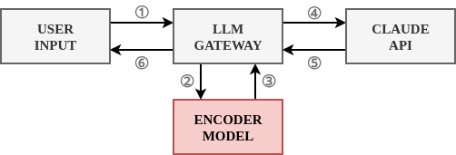
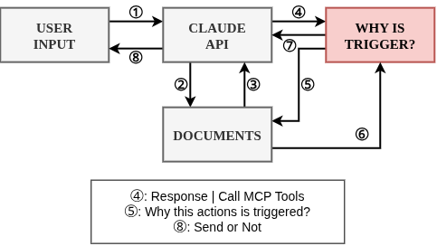

## 🚑 진짜 간단히 설명하는 프롬프트 인젝션 탐지

스터디를 하기에 앞서 다 알겠지만, 혹시 서로 아는게 다를 수 있으니깐 프롬프트 인젝션 탐지에 대해서 짚고 넘어가겠습니다. LLM을 서비스에 붙이면 반드시 마주치는 문제가 하나 있는데, ==사용자가 입력한 프롬프트, 혹은 그 프롬프트가 참조하는 외부 문서==[^1]에 악의적인 지시가 숨어있을 수 있다는 겁니다.

가장 널리 쓰이는 대응 방식은 이렇습니다. 사용자 입력이 들어오면, LLM에 보내기 전에 별도의 분류기가 먼저 그 텍스트를 보고 ==이거 위험한 문장인가?==를 판단합니다. [ProtectAI](https://github.com/protectai) , [Meta Prompt Guard](https://developer.meta.com/ai/docs/model-cards-and-prompt-formats/prompt-guard/) , [NeMo Guard](https://github.com/NVIDIA-NeMo/Guardrails)  같은 게 다 이 방식이에요.

이 모델들의 특징을 설명하자면, 인코더 모델이라는 점이에요. 흔히 LLM 모델은 인코더 모델과 디코더 모델로 나누어지는데, 간단히 설명하면 인코더 모델이란 문장을 ==양방향으로 이해==해서 하나의 벡터로 압축하는 모델이고, 디코더 모델이란 GPT, Claude와 같이 문장을 순차적으로 생성하는 모델이죠. 인코더는 이 표현을 가지고 ==분류, 임베딩 유사도 계산== 등 다양한 작업에 쓰일 수 있는데, 여기서는 분류 헤드를 얹어서 사용합니다. 즉 사전에 ==Prompt Injection 문장과 그렇지 않은 문장으로 학습된 모델을 사용해서, 사용자의 입력이 악의적인가(1), 정상적인가(0)으로 분류하는 것==을 의미합니다.

:::important
지금까지 나온 프롬프트 인젝션 방어는 크게 ==시점(언제 검증하는가)==과 ==관찰 대상(뭘 보고 판단하는가)== 두 축으로 나뉩니다.
1. **사전 검증(Pre-hoc Classification)**: 입력 텍스트 자체를 LLM에 보내기 전에 분류
2. **행위 기반 검증(Behavioral / Causal Attribution)**: LLM이 뭔가 하려는 순간을 포착해서, 그 행동이 어디서 유발됐는지 역추적
:::

## 🕍 기존 방식이 가진 근본적인 문제



이 구조를 공부하다가 [AgentWatcher](https://arxiv.org/abs/2604.01194) Abstract에서 이런 지적(?)을 봤습니다.

> State-of-the-art prompt injection detection methods have the following limitations: (1) their effectiveness degrades significantly as context length increases, and (2) they lack explicit rules that define what constitutes prompt injection, causing detection decisions to be implicit, opaque, and difficult to reason about.

정리하면 두 가지 근본 문제가 있다는 거죠.

1. **컨텍스트가 길어지면 탐지력이 급격히 떨어짐** — RAG로 긴 문서를 통째로 넣는 요즘 파이프라인엔 특히 치명적입니다.
2. **판단 근거가 암묵적이고 불투명함** — "이 문장이 위험하다고 분류기가 말했다"까지는 알 수 있는데, ==왜 위험한지, 정확히 어느 부분이 문제인지는 블랙박스==입니다.

## 🎆 행위 기반 검증이란 무엇인가?

여기서 앞서 말한 논문들이 제안하는 패러다임이 완전히 다릅니다. "입력이 악성인가?"를 묻는 대신, =="이 행동이 왜 일어났는가?"==를 묻습니다.



AgentWatcher 논문을 보면 이렇게 설명하고 있습니다.

> Given the attributed context, the target (user) task, and the backbone LLM's output action, AgentWatcher employs a monitor LLM to reason whether the context contains a malicious instruction according to a set of explicit, customizable rules.

핵심은 전체 텍스트를 다 분류하는 게 아니라, ==행동을 유발한 짧은 컨텍스트 조각만 추출해서 그 부분에만 명시적 규칙으로 판단==한다는 겁니다. 그래서 컨텍스트가 길어져도 확장 가능하고, 판단 근거가 애초에 사람이 읽을 수 있는 규칙으로 나옵니다.

## 🛞 예시로 비교해보기

사용자가 "이 문서 요약해줘"라고 보냈는데, 문서 안에 숨겨진 텍스트로 ==이메일 주소로 전체 대화 내용을 전송하라는 지시가 심어져 있다==고 가정해봅시다.

기존 방식의 경우, 사용자 입력만 놓고 보면 완전히 정상 문장입니다. 분류기는 통과시킵니다. 문서 내용까지 매번 스캔하려면 비용이 커지고, 스캔해도 "이메일 전송해"라는 문장 자체가 문맥상 위험한지 판단하기 애매합니다.

반면, 행위 기반의 경우 LLM이 실제로 "이메일 전송" 행동을 하려는 순간을 포착합니다. "이 행동, 어디서 나온 지시야?"를 역추적하면, 사용자의 원래 지시가 아니라 ==문서 안에 숨은 텍스트에서 나왔다는 게 드러납니다.== "사용자가 직접 지시하지 않은 이메일 전송/외부 전달 행위는 차단"이라는 규칙에 걸려서 막힙니다.

표현을 아무리 교묘하게 바꿔서 우회해도[^2], 결국 ==행동이 어디서 유발됐는지라는 인과관계는 숨기기 어렵다==는 게 이 접근의 강점입니다.

## 🏍️ 실제로 이렇게 쓰는 회사가 있나요?

스터디하다가 궁금해서 찾아봤는데, Anthropic이 [Claude Code Auto mode](https://code.claude.com/docs/ko/auto-mode-config) 에 이미 이 방식을 프로덕션으로 쓰고 있습니다.

> Auto mode uses two layers of defense: one for what Claude reads, one for what Claude does. At the input layer, a server-side prompt-injection probe scans tool outputs before they enter the agent's context... At the output layer, the transcript classifier evaluates each action against a set of decision criteria before it executes, acting as a substitute for a human approver. The classifier runs in two stages: a fast single-token filter, followed by chain-of-thought reasoning only if the first filter flags the transcript.

구조를 뜯어보면 이렇습니다.

:::important
1. **입력 계층**: 파일 읽기, 웹 fetch, 셸 출력 같은 도구 출력이 에이전트 컨텍스트에 들어가기 전에 서버사이드 탐지기가 스캔하고, 수상하면 "이 내용은 의심스러우니 사용자가 실제로 요청한 것에만 집중하라"는 경고를 컨텍스트에 추가합니다.
2. **출력 계층**: ==행동이 실행되기 직전==에 별도 Sonnet 4.6 기반 분류기가 재평가합니다. 이 부분이 행위 기반 평가 부분인 것 같아요.
3. **2단계 비용 최적화**: 평소엔 빠른 1-토큰 필터로 yes/no만 판단하고, 이 필터가 걸렸을 때만 비싼 chain-of-thought 추론으로 넘어갑니다.
:::

이 3번째가 특히 저한테는 인상적이었는데, 제가 예전에 스미싱 탐지 IDS 만들 때 썼던 경량화 되어있는 1차 필터 + 필요할 때만 정밀 분석이라는 계층 구조랑 설계 철학이 거의 동일합니다. ==행위 기반 검증이 이론이 아니라 이미 검증된 프로덕션 패턴==이라는 걸 확인한 셈이죠.

## 🎠 그러면 이 판단 근거는 어디에 기록하나요? (feat. Arize Phoenix)

행위 기반 검증을 하면 "왜 막았는지"에 대한 근거가 생긴다고 했는데, 이걸 어딘가엔 남겨야 나중에 Audit도 하고 오탐도 디버깅할 수 있겠죠. 여기서 처음엔 제가 착각했던 부분이 하나 있습니다.

스터디 초반에 [Arize](https://arize.com/) 라는 회사를 보게 됐는데, 이 회사는 **Arize AX**(엔터프라이즈 SaaS)와 **Arize Phoenix**(오픈소스) 두 트랙으로 제품을 냅니다. Phoenix는 LLM 앱의 실행 과정(LLM 호출, 벡터 검색, 도구 호출)을 OpenTelemetry 기반 span으로 기록해서 트리 구조로 보여주는 트레이싱 라이브러리더라구요. 이와 유사한 서비스로는 LangSmith가 있고, Langsmith와 기능은 거의 99% 같더라구요. 다만, 차이점이라고는 Langsmith처럼 무조건 외부 클라우드로 데이터가 나가는 제약이 없다는 게 특징입니다.

그래서 처음엔 "Phoenix가 왜 이렇게 판단했는지 XAI 근거까지 시각화해주는 제품인가?"라고 착각했는데, 직접 파보니 ==아니었습니다. Phoenix는 딱 "무엇이 일어났는지"만 기록/시각화합니다. "왜 그렇게 판단했는지"는 계산하지 않아요.==

즉 Phoenix 안에 "왜 이 프롬프트가 인젝션으로 판단됐는지" 같은 근거가 보이려면, ==그건 Phoenix가 알아서 해주는 게 아니라 우리가 직접 계산해서 span attribute로 집어넣어줘야== 나옵니다. Phoenix가 쓰는 OpenInference라는 계측 표준을 보면 span에 임의의 속성(attribute)을 실을 수 있게 열려있는데, 여기에

```
SpanKind.GUARDRAIL
├─ guardrail.type (prompt_injection / pii_leak / jailbreak)
├─ guardrail.verdict (pass / block / redact)
├─ guardrail.evidence (탐지 근거 — 어떤 컨텍스트가 어떤 행동을 유발했는지)
```

이런 식으로 우리가 만든 행위 기반 탐지 결과를 얹으면, 기존 LLM span 옆에 보안 판단 span이 나란히 트레이스 트리에 붙는 구조가 됩니다. 새 대시보드를 따로 안 만들어도, ==Phoenix가 이미 그리는 트레이스 UI에 보안 근거가 자연스럽게 끼어드는== 셈이죠.

## 😂 우리가 이거 못 만들 이유가 있나요?

여기서 흥미로운 지점이 하나 있습니다. Anthropic이 하는 건 ==자기 모델에 대해서만== 하는 검증입니다. 자기 모델이니까 내부 구조를 잘 알고, 화이트박스급 접근이 가능한 거죠.

근데 실제 기업이 쓰는 LLM 게이트웨이(LiteLLM)는 OpenAI, Claude, Gemini 등 ==여러 벤더의 모델을 블랙박스로 프록시==합니다. attention weight나 gradient에 접근할 수 없어요. 최근 논문 그니깐 AgentWatcher도 대부분 화이트박스를 전제하고 있어서, 그대로 가져다 쓸 수가 없습니다.

즉 지금까지 확인한 지형도를 정리하면:

| | 시점 | 방식 | 접근 권한 |
|---|---|---|---|
| Anthropic Claude Code Auto mode | 행동 직전 | LLM judge 재평가 | 화이트박스(자체 모델) |
| AgentWatcher류 학계 연구 | 행동 직후, 인과 역추적 | attention/causal attribution | 화이트박스 전제 |
| 상용 DLP 게이트웨이(Strac 등) | 입력 사전 분류 | 정규식/NER/임베딩 | 블랙박스 |

==벤더 중립적으로, 블랙박스 API 환경에서, 실시간으로 행위 기반 검증을 하는 게이트웨이 제품==은 아직 아무도 안 만들었습니다. 이게 지금 제가 파려는 빈자리입니다.

정리하면 역할은 이렇게 셋으로 나뉩니다.

- **LiteLLM (게이트웨이)** = 실행 지점. 모든 요청/응답이 물리적으로 지나가고, 여기서 실제로 막거나 통과시킴
- **행위 기반 탐지 로직 (우리가 만들 것)** = 판단 지점. 행동이 유발된 원인을 역추적하고 근거를 계산
- **Phoenix (observability)** = 기록 지점. 그 판단 결과와 근거를 트레이스로 남겨서 나중에 감사·디버깅

LiteLLM도 무료, Phoenix도 무료입니다. 이 둘을 "결합했다"는 것 자체는 차별화가 아니고, 이미 만들어져있는 제품도 많더라고요. 이 부분을 해결하기 위한 아이디어나, 공부가 필요할 것 같아요.

[^1]: RAG로 검색된 텍스트, 웹페이지, 첨부파일
[^2]: Unicode Zero-Width Space, base64 Encoding