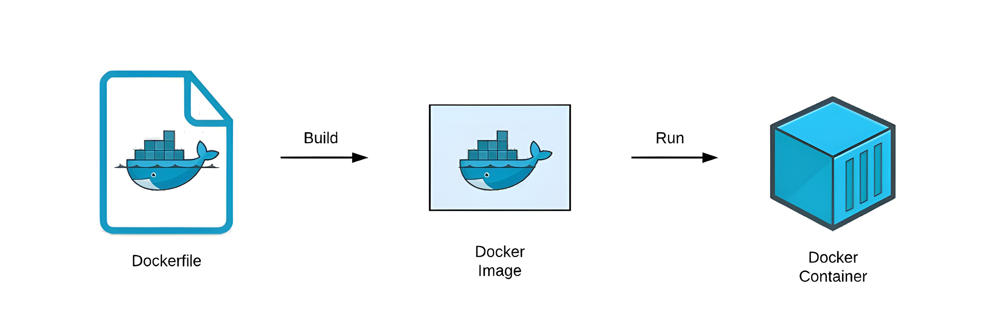

## 🌟 Dockerfile을 사용하는 이유
> Dockerfile은 왜 사용하는걸까요? 우리가 앞에서 배웠던 것처럼, Docker engine으로 ubuntu 컨테이너를 생성해서 SSH(Secure Shell)로 접속을 해서 개발을 진행하면 될 수 있지 않을까요? 

이 질문에 대한 답은 약 3가지로 추려볼 수 있겠네요.
- 직접 SSH로 접속해서, 명령어를 입력해야하므로 불편합니다. 반면 Dockerfile은 docker build 딸.깍 하면 되버리죠.
- ==Docker는 Layer라는 개념을 사용==하는데 SSH로 접속해서 이것저것 설치하게 되면, 엄청 커지게 됩니다. 반면에 ==Dockerfile은 각 명령어(RUN, COPY)가 하나의 층으로 쌓입니다. 만약 소스코드 한줄만 수정했다면, Docker는 OS나 라이브러리 설치는 건너뛰고 수정된 Layer만 다시 빌드합니다.== 당연히 속도가 훨씬 빠르겠죠?
- 현대 개발체계에서는 컨테이너를 수정해서 사용하는게 아니라, 버리고 새로 만드는것을 원칙으로 합니다. 만약 컨테이너 내부 설정을 내 마음대로 설정하거나, 위에서처럼 이것저것 설치하다보면 이 구조는, 나만 아는 복잡한 구조가 됩니다. 이를 Snowflake Server라고 하는데, Dockefile은 그냥 build 하면 됩니다.

## 🪜 Dockerfile을 작성하기 전에 해야하는 것
Dockerfile을 작성해서, build하기 위해서는 우리가 작업하는 프로젝트가 있어야합니다. 뭐 예를 들어 웹사이트를 만들거나, 백엔드 API를 만드는 등의 프로젝트를 해야하는데, 거창한 프로젝트를 하자니 이번 실습이 길어지므로 간단하게 ==Python의 FastAPI를 사용해서 실습==을 진행해도록 합시다.

FastAPI를 사용하는 방법은 차차 다른 포스팅에서 설명하겠지만, 일반적으로 MLOps에서 가장 많이 사용되는 라이브러리입니다.(Flask, Django도 많이 사용되긴하지만, 요즘은 Async를 사용하는 FastAPI의 인기가 좋다고 합니다!)

### 1️⃣ Python 3.11 설치
```bash
brew install python3.11
```
이 코드 하나면, MacOS에서 python을 설치하는건 끝납니다.

### 2️⃣ Python 가상환경 만들기
```bash
mkdir myfirstapp
python3.11 -m venv .venv
source .venv/bin/activate
```
원래 Python뿐만 아니라, 여러 언어에서 버전관리가 굉장히 중요해서 poetry나 uv를 자주 사용하지만, uv나 poetry를 사용할 경우에 ??Dockerfile에서 uv나 poetry를 설치하는 명령어가 추가되어 다소 복잡할 수 있을 것 같아 버전관리를 신경쓰지 않았습니다.??

### 3️⃣ 가상환경에서 필수 라이브러리 설치하기
```bash
pip install uvicorn fastapi
```
FastAPI를 사용하기 위해서 반드시 필요한 라이브러리가 uvicorn입니다. 자세한 사용법은 다른 포스팅에서 설명할게요.

### 4️⃣ FastAPI 코드 작성하기
```python title="main.py"
from fastapi import FastAPI

app = FastAPI()

@app.get('/')
async def root():
  return {"message":"Hello, MLOps!"}
```
위와 같은 코드를 작성하게 되면, 준비는 모두 끝났습니다.

:::tip
혹시, 어려워하실 분들을 위해서 FastAPI의 기본 디렉토리 구조를 첨부합니다.
```bash
my-fastapi-app/
├── src/
│   └── myfirstapp/
│       └── main.py          # FastAPI 앱 객체(app)가 있는 곳
├── Dockerfile               # 도커 빌드 설정 파일
└── requirements.txt         # 가상 환경 설정
```
==requirements.txt==의 경우 ==pip freeze > requirements.txt==를 작성하게 되면 자동으로 생성됩니다!
:::

### 🤔 Dockerfile 작성 방법
```bash title="Dockerfile"
FROM python:3.11-slim
WORKDIR /app
COPY requirements.txt .
RUN pip install --no-cache-dir -r requirements.txt
COPY . .
CMD ["uvicorn", "src.myfirstapp.main:app", "--host", "0.0.0.0", "--port", "8000"]
```
- FROM 부분에는 ==Docker 저장소에 저장된 이미지 중 어떤 이미지를 사용할건지를 작성==합니다. 저희는 python3.11 버전으로 코딩을 했기 때문에 Docker 저장소에서 제공되는 python:3.11-slim 이미지를 사용하도록 합시다.
- WORKDIR은 저희가 작성한 FastAPI 프로젝트가 복사될 위치를 지정합니다. 한마디로 ==일반 터미널에서 mkdir -p /app을 실행하고, 이후에 cd /app을 실행하는것과 같습니다.==
- COPY는 로컬에 저장된 requirememts.txt 파일을 저희가 생성한 컨테이너에 복사한다는 내용입니다.
- RUN 부분은 리눅스 명령어를 실행하는 부분인데, 이 부분을 통해서 ==apt update, apt upgrade== 이런 기본 리눅스 명령어를 실행할 수 있을 뿐 아니라, 저희가 작성한것처럼 복사한 라이브러리들을 설치할 수 있습니다.
- COPY 명령어를 통해 전체 FastAPI 프로젝트를 복사합니다.
- CMD 부분은 컨테이너가 실행될 때, 가장 먼저 실행되는 명령어입니다.

:::important
여기서 많은 사람들이 의문을 가질 부분이, RUN과 CMD의 차이점이라고 생각합니다. 둘은 어떤 차이를 가지고 있을까요?

위 그림은 Dockerfile이 컨테이너가 될때까지의 과정을 나타낸 그림입니다. ==RUN 명령어는 build를 했을때 실행되는 명령어고 CMD 명령어는 run을 했을 때 실행되는 명령어입니다.== 실행되는 시점이 다르기때문에 이 부분 주의해주세요!
:::

### Dockerfile build하기
```bash
docker build -t pxxguin/myfirstapp:v1.0 .
````
여기서 -t는 태그를 의미하는데, 태그를 붙이지 않으면 이상한 숫자들로 보이므로 태그를 꼭 붙입시다! 대부분 태그 이름을 정할 때, ==사용자이름/이미지이름:버전== 이렇게 입력합니다. ==마지막에 .을 적은 이유는 build할 Dockerfile의 위치를 알려주기 위함입니다.==


### 👀 Docker Image 컨테이너화하기
```bash
docker run -d -p 8000:8000 --name myfirstapp pxxguin/myfirstapp:v1.0
```
여기서 -d는 Detach의 약자로 ==해당 컨테이너를 백그라운드에서 실행==시키겠다는 의미입니다. 앞서 -it의 옵션과 비교했을때 대화형 인터페이스가 실행되지 않는것을 볼 수 있습니다. 

-p의 경우 포트를 적어주는 부분인데 아까 CMD 명령어 부분에서 --port를 8000으로 설정했잖아요? 이게 ==컨테이너의 포트 8000번을 열어준다는 의미인데, HostOS에서 이 컨테이너에 열린 포트로 접근하려면 8000:8000으로 설정==해야겠죠? HostOS포트:Docker포트입니다. HostOS는 변해도 상관없는데, Docker포트의 경우 앞에서 8000으로 지정했기때문에 반드시 8000으로 작성해야합니다.

### 🥱 마무리
이제 마지막으로 터미널창에 아래 명령어를 작성해보죠.
```bash
curl -X GET http://localhost:8000 | jq

# 실행결과
#   % Total    % Received % Xferd  Average Speed   Time    Time     Time  Current
#                                  Dload  Upload   Total   Spent    Left  Speed
# 100    27  100    27    0     0   7311      0 --:--:-- --:--:-- --:--:--  9000
# {
#   "message": "Hello, mlops!"
# }
```
이렇게 작성하면 저희가 작성한 Hello, mlops가 보이는것을 확인할 수 있습니다!