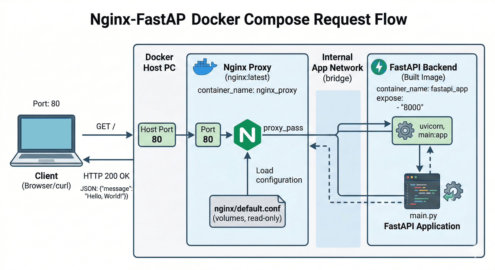

## 🐐 docker-compose.yml은 어떤 역할을 하는가?
++docker-compose++는 여러개의 컨테이너를 하나의 서비스 단위로 묶어서 관리할 때 사용합니다. 앞으로 예제에서 사용하겠지만, 일반적으로 FastAPI 서버를 바로 호스팅하지는 않습니다. FastAPI뿐만 아니라 다른 호스팅을 해야하는 프로젝트에서도 마찬가지입니다. ??반드시 Nginx 뒤에 FastAPI를 두는데요??, 보안적인 이유가 강합니다. 만약 Fastapi로 구동된 서버 주소나, 포트를 공개하면 해킹의 위협이 있기 때문에 Nginx를 거치도록 한다고 일단 알아두시면 됩니다. 자세한 내용은 Nginx부분에서 더 자세히 다룰 예정입니다.

## 🩸 FastAPI & Nginx 구성
> ==Nginx는 클라이언트의 요청을 받아서 FastAPI로 전달하는 역할==을 합니다. 이걸 ++Reverse Proxy++ 역할이라고하는데, 간단히 비유하자면 Nginx는 호텔 카운터입니다. 손님이 카운터로 오면 손님이 사전에 예약한 방으로 안내하잖아요? 정확히 이 역할을 하는게 Nginx라고 보면 됩니다. 쉽죠?

:::warning
이번에는 FastAPI의 설명은 하지 않을겁니다. 이전 포스팅에서 설명했기 때문이죠. 대신, 디렉토리 구조를 남겨둘테니 보고 따라서 구성하시면 될 것 같습니다.
:::

### 1️⃣ Directory의 구성
```bash
MYFIRSTAPP/
├── backend/
│   ├── .venv/
│   ├── Dockerfile
│   ├── main.py
│   └── requirements.txt
├── nginx/
│   └── default.conf
└── docker-compose.yml
```

### 2️⃣ docker-compose.yml 작성하기
docker-compose를 작성하는건, 정말 어렵지 않습니다. Dockerfile이랑, docker-compose의 차이가 뭔지 궁금해하는 사람을 위해서 아래 부분에 따로 설명해두겠습니다. 
```bash title="docker-compose.yml"
services: # docker-compose의 시작 부분
  backend: # FastAPI 부분으로 임의 수정 가능
    build: # fastapi 프로젝트를 build할껀데, 위치가 어디인가?
      context: ./backend # Dockerfile 위치
      dockerfile: Dockerfile # dockerfile 이름
    expose: # 내부 컨테이너에서 접근할 수 있는 포트
    - "8000"
    networks: # 컨테이너들이 서로를 인식하고, 안전하게 대화할 수 있는 가상 통신망 역할
    - app_network
  nginx: # Nginx 부분으로 임의 수정 가능
    image: nginx:latest # 앞에서와 달리 Docker 저장소의 이미지를 사용
    ports: # 외부 사용자의 접근 포트 구성
      - "80:80"
    volumes: # 호스트 PC의 파일이나 폴더를 컨테이너 내부의 특정 경로와 실시간으로 연결하는 역할
      - ${PWD}/nginx/default.conf:/etc/nginx/conf.d/default.conf:ro
    depends_on: # Nginx가 실행되기 전에 backend가 먼저 실행되어야함
      - backend
    networks:
      - app_network
networks:
  app_network:
    driver: bridge
```

:::important
🤔 왜 Dockerfile도 작성하고 docker-compose도 적어야하는걸까요?

++Dockerfile++과 ++docker-compose++는 서로 하는 역할이 다릅니다. 제가 실습하고 있는 프로젝트에서 Dockerfile은 어떤 역할을 하고 있나요? ==FastAPI 프로젝트를 이미지화 해서, 컨테이너화를 시킬 수 있도록 도움==을 줍니다. 하지만 FastAPI를 주로 MLOps에서 자주 사용하는데 이럴 경우, Grafana, Prometheus라고 하는 모니터링 도구들과 함께 사용되게 됩니다. Grafana, Promethus의 경우 이미 Docker 저장소에 이미지가 저장되어있기 때문에 ==docker-compose를 사용하여 3가지를 연결해서 사용할 수 있는거죠!==
:::

### 3️⃣ docker-compose에서 expose와 port의 차이

주석처리를 하기는 했지만, 이 부분을 명확히 짚고 넘어가야할 것 같습니다. 위의 그림이 거의 docker-compose의 모든 내용을 설명하고 있습니다. 그 전에 가장 기본적인 내용부터 짚고 넘어갈게요.

우리는 FastAPI를 이용하여 이미지를 분류하는 백엔드 서버를 운영하고 있습니다. 만약 사용자가 백엔드 서버에 이미지를 보내서 어떤 이미지인지 파악하려면 어떻게 데이터가 흘러가야할까요? ==사용자가 입력하는 이미지는 http://1.1.1.1이라는 주소로 보내진다고 합시다.== http 통신을 하기 때문에, 브라우저는 80번 포트로 안내를 하기 시작합니다. ==Nginx는 80번 포트에서 대기하고 있다가 nginx/default.conf파일을 확인해서 해당 규칙에 따라 FastAPI의 8000번 포트로 데이터를 전송==합니다. 8000번 포트 접속한 이후에 서버 내에 운영중인 ML 모델을 거쳐 해당 이미지가 어떤 종류인지 결과를 출력하여 진행된 역순으로 다시 사용자에게 반환합니다.

> !!http는 80번 포트!!를, !!https는 443!!번 포트를 사용합니다. 우리가 일반적으로 웹사이트, 예를 들어 "https://www.naver.com"과 같은 특정 사이트에 접근할 때 https://www.naver.com:443이라고 붙이지는 않죠? 이건 브라우저가 프로토콜(HTTP/HTTPS)에 따라 규약된 기본 포트(80/443)를 자동으로 할당하기 때문입니다. 여기서 중요한 차이는 보안입니다. ==HTTP는 데이터를 평문으로 전송하여 보안에 취약==하지만, ==HTTPS는 SSL/TLS 인증서를 통해 데이터를 암호화합니다. ==그래서 HTTPS를 사용하지 않는 사이트는 브라우저에서 !!'안전하지 않음' 경고!!를 띄우게 됩니다.

### 🧱 마무리
만약, MLOps에서 자주 사용하는 Grafana나, Promethus를 추가로 사용한다면 위에서의 Nginx처럼 depends를 backend로 설정하고 docker-compose.yml 추가로 작성하면 되겠죠? 꼭 이해했으면 좋겠는게 위에서 나온 그림입니다. Nginx와 FastAPI, Docker에 대해서 한눈에 알아볼 수 있는 그림이기 때문에 이해가 안되면 계속 반복해서 읽었으면 좋겠습니다.