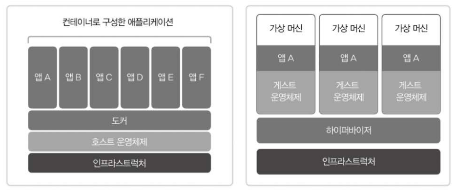
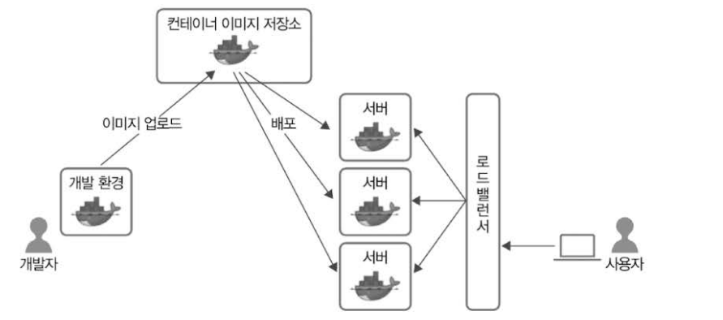
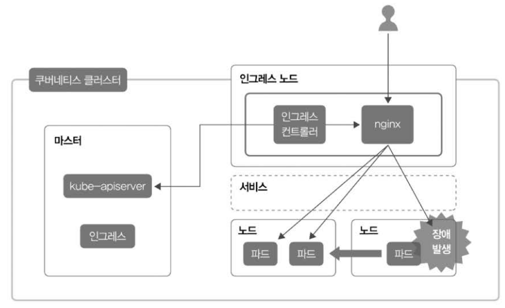

### 컨테이너 구조와 가상 머신의 차이

왼쪽에 보이는 구조는 컨테이너의 구조이고, 오른쪽에 보이는 구조는 가상 머신 구조입니다. 컨테이너는 호스트 운영체제 위에 도커가 위치하고, 그 위에 앱이 위치하는 구조입니다. 하지만 가상머신의 경우, 하이퍼바이저 위에 가상 머신마다 게스트 운영체제가 존재하고, 그 위에 앱이 존재합니다. 컨테이너로 구성한 애플리케이션의 경우 각 앱마다 게스트 운영체제가 존재하지 않으므로, 더 가볍다고 생각할 수 있습니다.

### 기존 컨테이너 시스템의 한계

우리가 실제 서버를 운영해야하는 경우에는, 절대로 NEVER 하나의 서버만을 운영하지 않습니다. 여러개의 서버를 운영하죠. Docker를 이용하거나, Docker Compose를 사용한다면, 각각의 의존성에 따라 서버를 띄울 수 있지만, 오직 하나의 컨테이너만 생성할 수 있다는 단점이 있습니다. 만약, 작은 서비스(트래픽이 몰리지 않는 서비스)의 경우 Docker Compose를 사용하는것만으로 충분히 메리트가 있습니다. 하지만, 조금만 트래픽이 몰리거나, 복잡한 비즈니스 로직을 돌리거나, 인공지능 모델의 추론 결과를 반환해야 한다면, 과연 이 서비스가 정상적으로 운영될 수 있을까요? 하나의 컨테이너가 존재하는데, 이 컨테이너가 사망(?)한다면 어떻게 될까요? 당연히 해당 서버는 터지겠죠. 그런 문제가 발생했을 때를 대비해서 여러개의 서버로 증설을 한다고 했을 때, 우리는 각각의 서버에 업데이트된 도커 이미지를 재배포하는 과정을 거쳐야합니다. 귀찮겠죠. 당연히. 이런 문제를 해결하기 위해서 우리는 K8S(Kubernetes)를 사용합니다.

### 쿠버네티스의 구조

쿠버네티스와 같은 컨테이너 오케스트레이션 시스템을 사용한다면, 한 번의 명령어로 여러개의 서버에 배포할 수 있으며, 하나의 서버로 트래픽이 몰려서 사망하더라도 살아있는 나머지 파드들이 사용자의 요청을 받아들여서 처리할 수 있는거죠. 이게 쿠버네티스를 써야하는 이유입니다.

쿠버네티스의 가장 큰 특징은 '선언적'이라는겁니다. 만약, 처음에 어떤 앱의 컨테이너를 10개 유지하고 싶다고 칩시다. 하지만 서비스 도중에 트래픽 과부화로 2개의 컨테이너가 사망했습니다. 일반 서비스라면, 관리자가 직접 해당 컨테이너 2개를 살려야겠지만, 쿠버네티스는 선언적인 특징 덕분에 해당 컨테이너들을 주시하고 있고, 2개의 컨테이너가 사망한 경우 이 2개의 컨테이너를 자동으로 복구합니다. 이것만으로도 쿠버네티스가 얼마나 대단한 서비스인지 알 수 있는 부분입니다.

