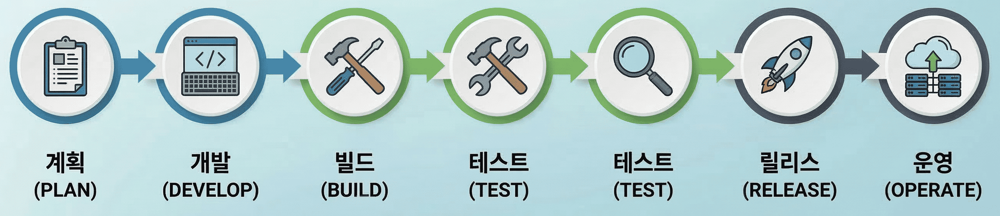

:::objective[🎯 학습 목표]
- [CI와 CD에 대해서 설명할 수 있습니다.](#obj-1)
- [Github CLI의 기본적인 명령어를 작성할 수 있습니다.](#obj-2)
:::

<h2 id=obj-1 class="objective-target">🚒 CI/CD란 무엇인가?</h2>
소프트웨어는 소프트웨어 개발 수명 주기(Sofware Development Life Cycle, SDLC)를 통해서 사용자에게 가치를 전달합니다.



CI/CD는 위의 그림에서 ++빌드++부터 ++릴리즈++까지를 자동화합니다. 여기서 CI/CD는 무엇을 의미할까요?

- CI: 코드의 변경사항을 자주 코드베이스와 통합하고 제대로 실행되는지 반복해서 검증한다.
- CD: 언제나 안전하게 릴리스할 수 있는 상태를 유지하고 소프트웨어를 반복해서 개선한다.

:::important
> 지속적인 통합(Continuous Integration, CI): 통합이란 변경한 코드를 코드베이스에 반영하고 ==검증==하는 것을 의미한다. 코드의 통합 빈도를 늘리면 충돌이 줄어든다. 반복해서 검증하다보면 버그를 발견하게 되고, 이를 빨리 수정할 수 있기 때문에 소프트웨어가 안정적으로 실행되어 사용자의 만족도가 상승한다.

> 지속적인 전달(Continuous Delivery, CD): 소프트웨는 코드로부터 생성이 됩니다. 하지만 소프트웨어를 생성한다고 해서 사용자가 바로 사용할 수 있는게 아닙니다. 어떤 방법으로든 사용자에게 전달을 해야하는데 이때 필요한것이 바로 릴리스(Release)다. 릴리스 과정은 소프트웨어에 따라서 필요한 작업이 다르며, 순서도 복잡하기 때문에 사람의 실수가 가장 많이 발생하는 과정이다. 
:::

## 🏫 Github CLI 기본 명령어 파악하기
아래 명령어를 따라 쳐보면서, 어떤 명령어인지 이해하는게 가장 중요합니다.

### 1️⃣ Github CLI 설치
```bash
# brew를 활용한 설치
brew install gh

# 설치 확인
gh --version

# Github 로그인하기
gh auth login
```

### 2️⃣ 리포지터리 작성하기
```bash
# Public상태의 리포지터리를 생성하고, 현재 폴더에 clone, README.md 파일 추가
gh repo create <Repo-Name> --public --clone --add-readme
```

### 3️⃣ 다른 사용자 리포지터리 확인하기
```bash
# 만약 다른 사용자가 올린 리포지터리의 설명을 확인하고 싶다면, 아래 명령어를 사용하세요.
gh repo view pxxguin/my-repo
```

## 🦐 마무리
이렇게 CI/CD가 어떤건지 살펴봤는데요, MLOps로 활동하다보면 꼭 알아야하는 내용입니다. 앞으로 차근차근 배워나가도록 하죠!