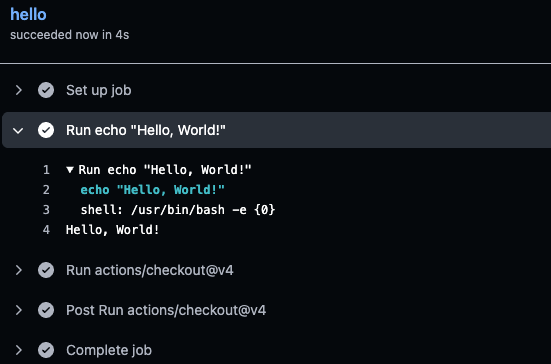
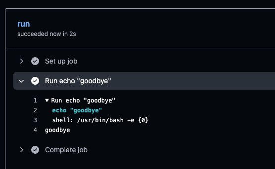

:::objective[🎯 학습 목표]
- [Github Actions를 사용해서 어떤 태스크를 자동화할 수 있는지 설명할 수 있습니다.](#obj-1)
- [워크플로의 구문에서 각각의 코드 역할을 설명할 수 있습니다.](#obj-2)
- [Github Host Runner와 Self Host runner에 차이를 설명할 수 있습니다.](#obj-3)
- [Ephemeral의 정의에 대해서 설명할 수 있습니다.](#obj-4)
:::

## 💰 Github Actions란?
<span id="obj-1" class="objective-target">++Github Actions++은 ==Github가 제공하는 범용 워크플로 엔진==으로, Github의 각 기능과 잘 연동됩니다.</span> 예를 들어, 아래와 같은 태스크를 자동화할 수 있습니다.

- Pull Requests가 작성되면 ==빌드와 테스트를 진행==한다.
- 릴리스 태그가 작성되면 ==컨테이너 이미지를 배포==한다.
- 이슈가 작성되면 무작위로 멤버를 할당한다.

## 🦮 Workflow 파일
Github Actions를 시작하는 방법은 어렵지 않습니다. YAML 파일을 리포지터리에 추가만 하면 됩니다. 이 YAML 파일을 워크플로 파일이라고 합니다. 워크플로 파일은 아래와 같은 규칙을 가지고 있습니다.

- 파일 확장자는 ==.yml, .yaml==을 사용합니다.
- YAML 파일은 !!.github/workflows 디렉터리 바로 아래에 저장합니다.!!
- 디렉터리와 확장자 외에는 임의의 파일명을 가질 수 있습니다.

:::warning
주의할 점은, 워크플로 파일은 디렉터리를 나누어서 관리할 수 없습니다. !!다른 디렉터리에 워크플로 파일을 두게 되면, 실행되지 않기 때문에 반드시 주의해주시기 바랍니다.!!
:::

### 1️⃣ 워크플로 파일 작성하기
```bash
mkdir -p .github/workflows                                     
touch .github/workflows/hello.yml
```

<h3 id="obj-2" class="objective-target"> 2️⃣ 워크플로 구문</h3>

```bash title=".github/workflows/hello.yml"
name: Hello # 워크플로 이름
on: push # 푸시 이벤트가 발생할 때마다 워크플로 실행
jobs: # 해야할 일 정의
  hello: # 일의 ID
    runs-on: ubuntu-latest # 워크플로가 실행될 환경
    steps: # 일의 단계 정의
      - run: echo "Hello, World!" # 명령어 실행
      - uses: actions/checkout@v4 # 액션 호출
```
- `name: Hello`: 워크플로 명은 다음과 같이 `name` 키를 지정하며, 생략할 수도 있습니다. !!단, 생략하면 워크플로 실행 로그를 분석하기 어려워지므로 항상 지정하도록 합시다.!!
- `on: push`: 워크플로 실행의 시작이 되는것이 이벤트입니다. 다음과 같이 `on` 키에 push, pull request를 지정할 수 있습니다. 그리고 `on: [push, pull_request]`처럼 배열을 지정해서 여러 개의 이벤트를 지정할 수도 있습니다.
- `jobs: hello:`: 잡은 워크플로의 실행단위입니다. 잡은 여러 개를 정의할 수 있으며 각각의 잡을 구분하기 위해서 잡의 ID를 설정합니다. 
- `runs-on: ubuntu-latest`: 다음은 잡의 실행 환경인 러너다. `runs-on` 키 아래에 기술하게 된다. 말 그대로 잡을 실행할 환경을 지정한다.
- `steps: run: echo "Hello, World!"`: 스텝은 워크플로의 최소 처리단위입니다. `steps` 키 아래에 기술하며 여러 개를 정의할 수 있습니다. 처리 순서는 위에서 아래 순서대로 진행됩니다.
- `uses: actions/checkout@v4`: `uses` 키에서는 액션을 호출합니다. 액션은 Github Actions에서 사용하는 모듈의 일정입니다. `with` 키를 사용하면 입력 파라미터도 지정할 수 있습니다. 예를 들어 `with: ref: main` 코드에는 입력파라미터 `ref` 에 `main` 이라는 값을 지정하고 있다.

:::tip
```bash
- run: |
    git log -1
    tree -a .
```
위의 코드처럼 여러 줄의 스크립트도 구현할 수 있다.
:::

### 3️⃣ 실행시킨 결과

다음과 같이 결과를 확인할 수 있습니다.

## 🤲 워크플로 수동실행
다음은 수동으로 실행할 수 있는 방법입니다.

### 1️⃣ 워크플로 코드
```bash title=".github/workflows/manual.yml"
name: Manual
on: # 수동 실행 이벤트
  workflow_dispatch: # 수동 실행 이벤트
    inputs:
      greeting: # 입력 파라미터명
        type: string # 데이터형
        default: Hello # 입력 파라미터의 기본값
        required: true # 입력 파라미터의 필수 플래그
        description: A cheerful word # 입력 파라미터의 개요
jobs:
  run:
    runs-on: ubuntu-latest
    steps:
      - run: echo "${{inputs.greeting}}" # 입력 파라미터의 greeting값 출력
```

### 2️⃣ 수동 실행 방법
```bash
gh workflow run manual.yml -f greeting=goodbye
```
위의 명령어를 실행하면, 아래의 결과가 나오는것을 확인할 수 있습니다. 여기서 -f는 입력 파라미터를 설정합니다.

### 3️⃣ 결과



## 💁‍♂️ 정기 실행
on 키에 schedule 이벤트를 지정하면 워크플로를 정기적으로 실행할 수 있다. 워크플로의 시작 타이밍은 cron 형식으로 기술한다.

###  1️⃣ 워크플로 코드
```bash
name: Schedule
on:
  schedule: # 정기 실행 이벤트
    - cron: '*/15 * * * *' # 매 시간 15분마다 실행하는 cron 식
jobs:
  run:
    runs-on: ubuntu:latest
    steps:
      - run: date
```
> 참고로 분 단위의 일시 지정이 가능하지만, 시간에 정확히 맞춰 실행되지 않을 수 있다. 따라서 정확한 시간을 요하는 처리에는 적합하지 않으며 하루에 여러 번 반복적으로 실행해야하는 처리에 알맞은 방식이다.


## 🧸 잡 실행 환경
잡 실행 환경을 러너라고 하는데, 러너에 의해서 OS나 머신 사양이 달라집니다. Github Actions의 러너는 크게 두가지로 분류할 수 있습니다. Github Host Runner와 Self host runner입니다.

### 1️⃣ Github Host Runner
<span id="obj-3" class="objective-target">++Github Host Runner++는 깃허브가 제공하는 실행 환경이다.</span> 귀찮은 운영은 Github가 담당하므로 편리하다는 이점이 있다. 또한 러너에는 여러가지 소프트웨어가 설치되어있기 때문에 더 편합니다. 참고로 표준 사양의 러너 외에도 Larger Runner라고 하는 러너도 존재합니다. 이 러너의 경우 유료이지만 머신 사양이 좋아서 잡을 실행하는 시간이 오래걸리는 경우 좋은 선택으로 불립니다.

### 2️⃣ Self Host Runner
사용자가 직접 실행 환경을 준비하는 것입니다. OS나 머신 사양을 자유롭게 설정할 수 있다는 점이 이점이며, 프라이빗 네트워크에서 운영하고 싶은 경우에도 적합합니다. 하지만, 러너를 직접 관리해야한다는 점이 단점으로 불립니다.

### 3️⃣ Supported OS
| OS | runs-on 키에 저장할 수 있는 버전 |
|---|---|
| **Linux(Ubuntu)** | ubuntu-latest, ubuntu-22.04, ubuntu-20.0 등 |
| **Windows** | windows-latest, windows-2022, windows-2019 등 |
| **MacOS** | macos-latest, macos-14, macos-13 등 |

## 🏡 Ephemeral이란?
<span id="obj-4" class="objective-target">==Github Host Runner에서는 매번 초기 상태의 환경에서 잡을 실행합니다. 러너는 잡 실행 시에 시작되며 종료되면 파기==됩니다.</span> 이것을 바로 Ephemeral이라고 합니다. 이 특성 때문에 잡의 일관성을 유지할 수 있습니다. 

단, 워크플로 실행 중에 생성된 데이터도 러너와 함께 파기됩니다. 워크플로 종료 후에도 데이터가 필요한 경우에는 설정이 필요하며, 이를 위해서 캐시나 아티팩트 등의 기능을 제공하는데 자세한 내용은 이후에 배우도록 하겠습니다.


## 🦓 마무리
직접 워크플로 파일을 생성해서, 실행하는 과정까지 살펴봤는데 위 과정을 이해해야 CI/CD를 잘 다룰 수 있으므로 열심히.. 열심히 해봅시다.