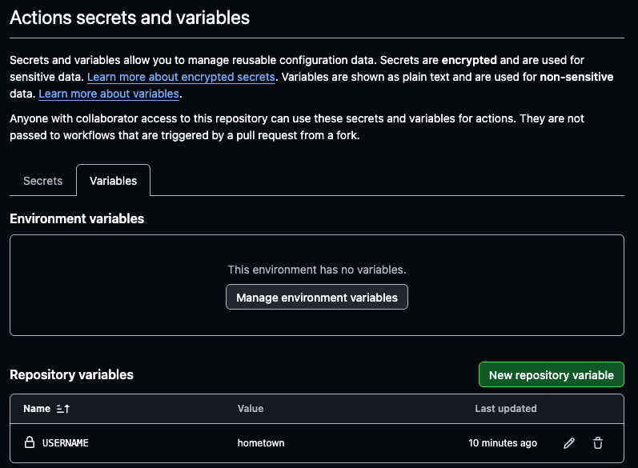

## Github Variables 사용법
Gihub에서 Repository를 만들고, Repository 내에서 Settings > Secrets and variables > Actions에 들어가면 Secrets와 Variables가 있는데, 이번에 실습할 내용은 Variables에 대한 사용법입니다.
아래의 그림과 같이 New repository variable를 누르면 변수명을 추가할 수 있는데, USERNAME이라는 변수에 hometown이라는 값을 대입하도록 할게요!

## 