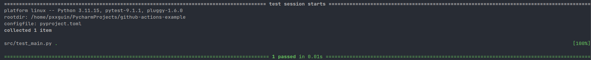
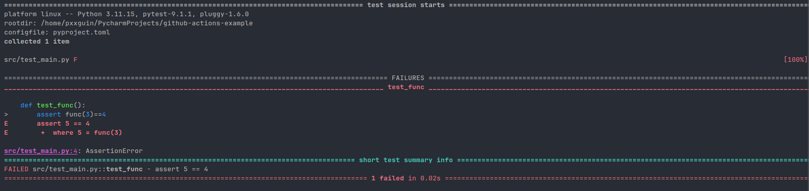

## 🗂️ CI/CD의 기본 개념
개발을 한다면 정말 많이 등장하는 부분이 CI/CD에 대한 부분이다. 시니어 개발자들의 경우 CI/CD의 개념이 다소 생소할 수 있는데, ==지속적인 통합(Continuous Integration, CI)과 지속적인 배포(Continuous Delivery, CD)==에 대해서 설명한다.

이 개념에 대해서 쉽게 이해하기 위해서는 하나의 가정을 한다. 우리는 총 10명으로 구성된 하나의 팀이고, 실제 서비스를 운영하고 있는 하나의 조직이다. 우리의 코드는 Github Repository에 관리되고 있으며 해당 Repository에 총 10명의 직원들이 Contributors로 되어있다.

10명의 팀원이 매일 새로운 기능을 구현하기 위해서 코드를 작성하고, ==구현한 코드를 Pull Request 한 이후에 Project Manager와 Tech Leader가 각 팀원들이 작성한 코드에 대하여 리뷰를 진행하고 Merge를 수행==한다.

서비스가 작을때는 팀원들이 개발한 코드들을 직접 로컬에서 실행했고, 문제가 없다면 Merge를 진행했다. 하지만, 서비스가 점차 커지고 사용자들이 몰리게 되면서 PM과 Tech Leader의 일이 많아졌다. 그래서 코드가 정상적으로 동작하는지 매번 확인하는게 매우 번거로운 일이 되었다.

이럴 때, 다소 일이 적은 개발자에게 코드 리뷰를 맡겨도 되지만 별로 믿음직스럽지 않기 때문에 최소한 ==팀원들이 개발한 코드가 문법상 문제가 없는지, 반드시 동작해야하는 기능들이 작동하는지를 확인하는 로직을 구성==하고 싶다. 이럴 때 사용하는게 CI다. 정말 반드시 필요한 기능이고, 팀의 규모와는 상관없이 반드시 CI 로직은 프로젝트를 진행하는 과정에 필수적으로 있어야한다. 아마 테스트 코드를 작성하는 것보다 더 먼저 선행되어야하는 작업이라고 생각한다.

### 1. CI가 어떻게 동작하는가?
앞에서 설명했듯이, 팀원들이 코드를 작성을 하면 ==1. 코드의 문법상 이상이 있는지 확인하고, 2. 반드시 동작해야 하는 기능이 동작하는지 확인하고, 이상이 없다면 PR을 Open한 상태로 유지==한다. 여기에 더 관리가 잘되는 레포지토리의 경우, ==3. SAST 도구를 도입해서 해당 코드의 취약점이 존재하는지까지 판단==한다.

미리 CD에 대해서 설명한다면, 위의 CI 과정에서 문제가 발생하지 않는다면 자동으로 ==테라폼이나 도커와 같은 도구를 actions로 사용해서 현재 운영중인 서버에 배포==할 수 있다. 이 과정이 우리가 프로젝트나 실제 서비스에서 사용하는 CI/CD 전부다.

### 2. Github Actions를 선택해야하는 이유
일반적으로 CI/CD 파이프라인을 구축할 때 사용하는 도구가 대략 두개가 있는데 젠킨스와 Github Actions다. 지금도 젠킨스를 사용하고 있는 기업도 있지만, 젠킨스는 보다 자유롭다는 장점을 가지고 있지만 만약 실제 서비스로 운용한다면 ==별도의 EC2로 젠킨스를 띄워야한다는 점==과 Github Actions보다는 간편하지 않다는 조건으로 요즘 트렌드는 Github Actions를 쓰는 추세라고 보면 된다.

### 3. Github Actions를 사용하는 방법
Github Actions를 사용하는 방법은 작업을 진행할 레포지토리 내에서 ==.github/workflows/== 안에 ==.yml 또는 .yaml의 확장자==를 가지는 파일을 작성하면 된다. 해당 디렉토리 외에 파일을 작성한다면 동작하지 않기 때문에 반드시 참고하길 바란다.

## 💻 Github Actions의 기본 틀
Github Actions를 사용한다면, 정확히 7가지만 알면 된다. 
```bash
name: <워크플로우 이름>
on: <트리거 방법>
jobs:
  <잡 이름>:
    runs-on: <실행할 환경>
    steps:
      - uses: <사용할 액션>
      - run: <실행할 명령어>
```

### 1. name
.github/workflows 안에 존재하는 .yml과 .yaml로 끝나는 파일 하나를 ++워크플로우++라고 부른다. name은 이 워크플로우의 이름을 지정할 수 있다. 대부분 CI workflow와 같은 방식으로 해당 워크플로우의 목적을 적는다.

### 2. on
??on??은 어떤 행동에 해당 워크플로우가 trigger가 되는지를 정의한다. 자주 사용되는 on은 크게 두가지가 있는데 ??pull_request, push??가 있다. 만약 on을 push로 설정한다면, 해당 레포지토리에 push가 들어온다면 동작하게 되고, pull_requst라면 해당 레포지토리에  pr이 들어올 때 동작하게 된다.

### 3. jobs
Github Actions의 워크플로우는 기본적으로 Job 단위로 동작하는데 여러개의 jobs로 구성된다. 각각의 ==job은 독립적인 환경으로 동작되며 각각의 job에 여러 step을 정의==하여 실행시킬 수 있다.

### 4. steps
각 job에 실행시킬 동작을 여러개의 step으로 나눌 수 있고, 각각의 step은 uses, run, env, id 등으로 구성된다. uses에는 Github actions를 지정할 수 있으며, 각각의 run은 일반적인 linux에서 쓰는 명령어를 사용할 수 있다. env는 변수에서 알 수 있듯이, 환경변수를 불러올 수 있는 기능이고 id는 B라고 하는 태스크가 A라고 하는 태스크에 의존한다면 id를 작성해서 needs에 연결시키는 방식으로 사용할 수 있다.

## 🎀 간단한 예시
간단한 예제를 통해서 실제로 Github Actions가 어떻게 동작할 수 있는지 확인해보겠다.

### 1. 함수 생성
일단 전달받은 정수 값에서 2를 더해서 return하는 함수를 정의한다.
```python
def func(x: int) -> int:
    return x + 2
```

### 2. 테스트 함수 생성
파이썬 환경에서 테스트를 진행할 때, ??pytest?? 라이브러리를 사용할 예정이다.
```python
from main import func

def test_func():
    assert func(3)==5
```
위와 같은 코드를 실행시켜보면, 아래와 같은 결과가 나온다.
```bash
> uv run pytest src/test_main.py
```


반면, 만약 테스트가 잘못된다면 어떤 결과를 반환하는지 확인해본다.
```python
from main import func

def test_func():
    assert func(3)==4
```

만약, 이 과정을 CI 워크플로우에 도입한다면, ==프로젝트 내에서 중요한 기능을 테스트로 미리 구현해두고 해당 테스트가 실패한다면 PR을 막는 로직을 구현할 수 있을 것이다.==

### 3. CI 워크플로우 생성
그렇다면, 이제 이 로직을 어떻게 Github Actions에서 동작하게 할것인가?
```bash
name: This is CI test # 이름을 지정
on: push # push가 되었을 때 이 워크플로우를 동작
jobs:
  build: # Job 이름 지정
    runs-on: ubuntu-latest # ubuntu 사용
    steps:
    - name: Install the latest version of checkout
      uses: actions/checkout@v7 # 뒤에서 설명하겠지만, checkout 사용
    - name: Install the latest version of uv
      uses: astral-sh/setup-uv@c771a70e6277c0a99b617c7a806ffedaca235ff9 # uv 설치
    - name: Install uv package
      run: uv sync # 의존성 설치
    - name: Test defined function
      run: uv run src/test_main.py # 테스트 진행
```
이 로직을 [직접](https://github.com/Pxxguin-Dev/github-actions-example/actions/runs/30255226760/job/89942136327) 볼 수 있다. 성공할 경우에는 초록색 체크 표시가 뜨지만, 실패한다면 빨간색 X 표시가 뜰 것이다.

## 😄 마무리
지금까지는 기본적인 로직을 살펴봤다. 사실 이게 Github Actions 워크플로우의 기본이다. 이 기본 토대를 바탕으로 여러 조건이나, 로직이 추가되는것 말고는 없기때문에 기본을 잘 익혀두면 앞으로 읽는 내용에 대한 이해가 훨씬 더 빠를 것이다. 다음 포스팅에서는 uses에 대해서 더 자세히 살펴볼 예정이다.