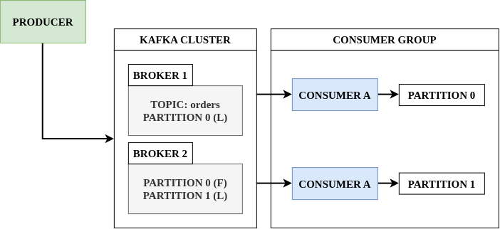

## 🌊 들어가기에 앞서
모든 기업은 데이터로 움직입니다. 우리는 정보를 얻고, 분석하고, 가공하고, 그 이상의 것을 결과물로 산출합니다. 로그 메시지, 지표, 사용자 행동, 외부로 나가는 메시지, 그 외의 어떠한 것이 되었건 모든 애플리케이션은 데이터를 생성합니다.

문제는 이 데이터를 ==누가, 언제, 얼마나 안전하게 옮기느냐==입니다. 서비스가 커지면 데이터를 만들어내는 쪽[^1]과 그  데이터를 써야 하는 쪽[^2]이 점점 늘어나는데, 이 둘을 직접 연결해버리면 시스템 전체가 하나의 거미줄처럼 얽혀버립니다. 이 문제를 풀기 위해 등장한 게 바로 ==Kafka==입니다.

## 🧩 Kafka란 무엇인가?
Kafka는 한마디로 ==분산 이벤트 스트리밍 플랫폼==입니다. 말이 조금 어렵죠? 쉽게 말하면, ==데이터를 만드는 쪽과 쓰는 쪽 사이에 껴서, 데이터를 임시로 쌓아뒀다가 순서대로 흘려보내주는 거대한 로그 저장소==라고 생각하면 됩니다.

### 1. 왜 그냥 직접 호출하면 안 될까?
가장 단순한 방법은 Producer가 Consumer의 API를 직접 호출하는 것입니다. 서비스가 3개, 4개 정도라면 이 방식도 나쁘지 않습니다. 하지만 서비스가 10개, 20개로 늘어나고, 그 중 하나라도 응답이 느려지거나 죽어버리면 어떻게 될까요? ==Producer는 Consumer가 살아있는지, 응답 속도가 어떤지까지 신경 써야 하고, Consumer가 하나 추가될 때마다 Producer 코드를 고쳐야== 합니다. 이걸 Tight Coupling이라고 부릅니다.

:::important
1. **Producer**: 데이터를 만들어서 Kafka로 보내는 주체입니다.
2. **Consumer**: Kafka에 쌓인 데이터를 읽어서 처리하는 주체입니다.
3. **Broker**: Kafka 서버 한 대를 의미하며, 실제로 데이터를 저장하는 역할을 합니다.
4. **Topic**: 데이터를 종류별로 구분해두는 논리적인 채널입니다. 게시판이라고 생각하면 편합니다.
:::

### 2. Topic 안에는 뭐가 들어있나?
Topic 하나는 그냥 저장 공간이 아니라, ==Partition==이라는 단위로 쪼개져 있습니다. 하나의 Topic에 여러 개의 Partition을 두는데, 이유는 간단합니다. ==하나의 Broker만 데이터를 처리하면 결국 Bottleneck이 생기니, 여러 Partition에 데이터를 나눠 담아서 여러 Broker가 동시에 처리==하게 만들기 위해서입니다.

각 Partition 안에서 데이터는 들어온 순서대로 차곡차곡 쌓이고, 각 데이터에는 ==Offset==이라는 일련번호가 매겨집니다. Consumer는 이 Offset을 기준으로 "나는 여기까지 읽었다"를 기억해두기 때문에, ==한 번 읽은 데이터라도 Offset만 되돌리면 다시 읽을 수 있습니다.== 이게 나중에 진짜 중요한 특징이 됩니다.

여기서 가장 중요한 부분은, Producer와 Consumer 사이에 Broker가 붙는데 Producer가 데이터를 생성하면, ==Broker는 해당 데이터의 Offset을 붙이고, Consumer가 데이터를 요청하면 Broker가 데이터를 주는 역할==을 한다는 부분만 이해를 하시면 편합니다.

## ⚖️ Kafka의 대안과 장점
### 1. 기존 방식들
Kafka가 나오기 전에도 서비스 간 데이터를 주고받는 방법은 있었습니다.

- **직접 API 호출**: 가장 단순하지만 서비스가 늘어날수록 서로가 서로를 알아야 하는 Tight Coupling 구조가 강제됩니다.
- **DB 폴링**: Consumer가 주기적으로 DB를 조회해서 새 데이터가 있는지 확인하는 방식입니다. 구현은 쉽지만, ==실시간성이 떨어지고 DB에 불필요한 부하==가 계속 걸립니다.
- **RabbitMQ**: Producer와 Consumer를 분리한다는 개념은 Kafka와 같지만, ==메시지를 한 번 소비하면 큐에서 사라지는 구조==라 여러 Consumer가 같은 데이터를 각자의 속도로 다시 읽는 것이 어렵습니다.

:::tip
RabbitMQ와 Kafka를 자주 비교하는데, RabbitMQ는 ==정확히 한 번, 순서 상관없이 빠르게 전달==에 강하고, Kafka는 ==대용량을 순서대로, 여러 번 다시 읽을 수 있게 오래 보관==하는 데 강합니다. 둘 중 뭐가 더 좋다기보다, 메시지를 소비하고 나면 버려도 되는지, 나중에 다시 읽어야 하는지에 따라 선택이 갈립니다.
:::

### 2. Kafka가 주는 것
- **Decoupling**: Producer는 Kafka에만 데이터를 보내면 끝입니다. 그 데이터를 누가, 몇 명이, 언제 읽는지는 전혀 신경 쓰지 않아도 됩니다.
- **높은 처리량**: Partition 단위로 병렬 처리가 가능해서, Broker를 늘리면 늘릴수록 처리량이 함께 늘어납니다.
- **Replay**: Offset을 되돌리기만 하면 과거 데이터를 몇 번이고 다시 처리할 수 있습니다. 로직에 버그가 있어서 다시 계산해야 하는 상황에서 이것 만큼 좋은게 없습니다.
- **순서 보장**: 정확히는 ==하나의 Partition 안에서만 순서가 보장==됩니다. Topic 전체의 순서를 보장하는 게 아니라는 점은 꼭 기억해야 합니다.

## 🕳️ Kafka 없이는 안 될까? (feat. Redis)
### 1. Kafka가 없는 주문 시스템
이커머스 주문 서비스를 하나 만든다고 가정해보겠습니다. 주문이 들어오면 ==재고 차감, 결제 처리, 배송 시스템 등록, 알림 발송, 추천 시스템 갱신==까지 최소 5개의 서비스를 건드려야 합니다. Kafka 없이 이걸 구현한다면 가장 쉬운 방법은 주문 서비스가 이 5개 서비스의 API를 순서대로 직접 호출하는 것입니다.

```bash
Order Service
   ├──► Inventory Service      # 재고 차감
   ├──► Payment Service        # 결제 처리
   ├──► Shipping Service       # 배송 등록
   ├──► Notification Service   # 알림 발송
   └──► Recommendation Service # 추천 갱신
```

문제는 이 중 ==하나라도 느려지거나 죽으면 주문 전체가 영향을 받는다==는 겁니다. 알림 서비스가 3초 동안 응답을 안 하면, 유저는 주문 버튼을 눌러놓고 3초를 기다려야 합니다. 심하면 알림 서비스 장애가 ==결제까지 끝난 주문을 실패로 되돌리는== 상황도 벌어질 수 있습니다. 게다가 나중에 재입고 알림과 같은 서비스를 하나 더 추가하려면, 주문 서비스 코드에 호출 한 줄을 또 추가해야 합니다. 서비스가 늘어날수록 ==주문 서비스는 점점 더 많은 걸 알아야 하는 존재==가 되어버립니다.

Kafka를 끼워 넣으면 이야기가 달라집니다. 주문 서비스는 ==주문이 생성됨! 이라는 이벤트 하나만 Kafka에 던지고 끝==냅니다. 재고/결제/배송/알림/추천 서비스는 각자 알아서 이 이벤트를 구독해서 처리합니다. 따라서 알림 서비스가 죽어도 주문 자체는 영향을 받지 않고, 만약 죽었다면 알림 서비스가 살아난 뒤에 밀린 이벤트를 그대로 다시 읽으면 됩니다.

### 2. 그래서, 왜 굳이 Kafka여야 할까?
사실 위 문제는 Kafka가 아니어도 풀 수 있습니다. Nginx와 같은 로드밸런서를 앞단에 두거나, 재시도 로직을 더 촘촘히 짜거나, 그냥 RabbitMQ 같은 메시지 큐를 써도 어느 정도는 해결됩니다. 그래서 우리가 Kafka를 쓰려고 했다면, ==왜 굳이 Kafka여야 하는가?==라는 질문에 대해서 더 냉정하게 생각해야합니다. 저는 아래 네 가지 중 ==하나라도 해당된다면 Kafka를 진지하게 고려==하는 편입니다.

1. **Consumer가 여러 개이고, 각자 다른 속도로 같은 데이터를 소비해야 할 때**: 추천 시스템은 실시간으로, 데이터 웨어하우스는 하루에 한 번 배치로 같은 주문 이벤트를 읽어야 하는 경우처럼요.
2. **데이터를 며칠~몇 주씩 보관하면서 몇 번이고 재처리해야 할 때**: 집계 로직에 버그가 있었다는 걸 뒤늦게 발견해도, Offset만 되돌리면 처음부터 다시 계산할 수 있어야 합니다.
3. **초당 수만 건 이상의 이벤트가 쏟아질 때**: Partition으로 나눠서 여러 Broker가 동시에 처리해야 감당이 됩니다.
4. **순서 자체가 의미를 가지는 데이터일 때**: 계좌의 입출금 이벤트처럼, 순서가 뒤바뀌면 잔액 계산이 틀어지는 경우입니다.

:::tip
반대로 말하면, Consumer가 하나뿐이고, 데이터를 오래 보관할 필요도 없고, 트래픽도 크지 않다면 Kafka는 과합니다. 이럴 땐 차라리 더 가벼운 선택지가 낫습니다.
:::

### 3. Kafka vs Redis, 언제 뭘 써야 할까?
이 지점에서 가장 많이 비교되는 게 ==Redis==입니다. Redis도 Pubisher/Subscriber와 Streams라는 기능으로 비슷한 걸 할 수 있거든요.

|비교 항목|Kafka|Redis (Streams)|
|---|---|---|
|데이터 저장 위치|디스크(로그 파일)|메모리(RAM) 우선|
|보관 기간|설정한 기간(며칠~몇 주) 동안 유지|메모리 용량에 좌우, 보통 짧게 유지|
|Replay|Offset을 되돌려 언제든 가능|가능은 하지만 데이터가 살아있을 때만|
|처리량/확장성|Partition + Broker로 수평 확장에 특화|단일 인스턴스 기준으로는 빠르지만 확장은 Kafka보다 부담|
|지연 시간|ms 단위|보통 Kafka보다 더 낮음(sub-ms)|
|운영 복잡도|Broker Cluster 운영이 필요해 복잡함|이미 Redis를 쓰고 있다면 추가 비용이 적음|

:::warning
Redis에는 이름이 비슷한 두 기능이 있어서 헷갈리기 쉽습니다. ==Pub/Sub==은 구독 중인 Consumer가 없으면 메시지가 그냥 사라지는 완전한 휘발성 방식이고, ==Streams==는 Kafka처럼 Consumer Group과 Offset 개념이 있어서 재처리가 가능합니다. Redis로 Kafka 흉내를 내고 싶다면 Pub/Sub이 아니라 Streams를 봐야 합니다.
:::

쉽게 설명하자면, ==이미 캐시나 세션 저장용으로 Redis를 쓰고 있고, 데이터량이 크지 않고, 조금 유실돼도 큰 문제가 없다면 Redis Streams로 충분==합니다. 하지만 ==여러 팀이 같은 이벤트를 각자 다른 목적으로 오래 두고 재처리해야 하거나, 트래픽이 감당 안 될 정도로 커진다면 그때는 Kafka로 넘어가는 게== 맞다고 생각합니다.


## 🏗️ Kafka 아키텍처 파헤치기
지금까지 배운 개념들이 실제로 어떻게 맞물려서 동작하는지, 구조를 한 번 그려보겠습니다.



### 1. Broker와 Cluster
Broker는 Kafka 서버 한 대, Cluster는 이 Broker 여러 대가 묶인 집합입니다. ==실제 운영 환경에서는 최소 3대 이상의 Broker로 Cluster를 구성==하는 게 일반적인데, 이유는 바로 다음에 나오는 Replication 때문입니다.

### 2. Partition Replication: Leader와 Follower
Broker 한 대가 죽어버리면 그 안에 있던 Partition의 데이터는 어떻게 될까요? 이걸 대비해서 Kafka는 ==같은 Partition을 여러 Broker에 Replication==해둡니다. 이 복제본 중 딱 하나만 ==Partition Leader==가 되어서 모든 읽기/쓰기 요청을 처리하고, 나머지는 ==Follower==가 되어 Partition Leader의 데이터를 그대로 복제만 하고 있습니다. Partiton Leader가 있는 Broker가 죽으면, Follower 중 하나가 새로운 Leader로 승격[^3]됩니다.

### 3. Consumer Group
Consumer는 혼자 일하지 않고, ==Consumer Group==이라는 단위로 묶여서 일합니다. 같은 Group 안에 있는 Consumer들은 ==하나의 Topic에 있는 Partition들을 서로 나눠서 담당==합니다. 위 그림처럼 Partition이 2개, Consumer가 2개면 하나씩 나눠 갖지만, ==Partition보다 Consumer가 많아지면 남는 Consumer는 그냥 놀게 되겠죠??== Partition 개수가 곧 그 Topic의 최대 병렬 처리 한계인 셈입니다.

:::warning
Consumer Group을 늘려서 처리 속도를 올리고 싶다면, 먼저 Partition 개수부터 확인해야 합니다. Consumer만 늘리고 Partition은 그대로라면, 놀고 있는 Consumer만 늘어날 뿐 처리량은 전혀 늘어나지 않습니다.
:::

### 4. ZooKeeper에서 KRaft로
예전 Kafka는 Cluster의 메타데이터[^4]를 관리하기 위해 ==ZooKeeper==라는 별도의 시스템에 의존했습니다. 하지만 최근 Kafka는 ==KRaft(Kafka Raft)==라는 자체 합의 프로토콜을 도입해서, ==Kafka 혼자서도 메타데이터를 관리==할 수 있게 됐습니다. 별도의 ZooKeeper Cluster를 운영/관리할 필요가 없어졌다는 것만으로도 운영 부담이 크게 줄었습니다. 하지만, 제가 공부하는 책에서는 ZooKeeper를 사용하기 때문에 미안하지만 ZooKeeper를 사용할 예정입니다..

## 😮‍💨 마무리
지금까지 Kafka가 왜 등장했는지, 기존 방식과 뭐가 다른지, 그리고 Broker/Partition/Consumer Group이 어떻게 동작하는지를 개념 위주로 정리해봤습니다.

사실 트래픽이 크지 않은 작은 서비스라면 Kafka는 오히려 과한 선택일 수 있습니다. Broker를 최소 3대는 띄워야 하고, Partition과 Replication을 신경 써야 하는 순간부터 운영 복잡도가 확 올라가니까요. ==데이터를 한 번 쓰고 버려도 되는지, 아니면 나중에 다시 읽어야 하는 상황이 반드시 생기는지== 먼저 고민해보고 도입하는 게 맞는 것 같습니다.


[^1]: 우리는 Kafka에서 데이터를 만들어내는 존재를 Producer/Publisher/Writer라고 합니다.
[^2]: 반대로 Kafka에서 데이터를 쓰는 존재를 Consumer/Subscriber/Reader라고 합니다.
[^3]: 이 과정을 Leader Election이라고 하는데, 현재 리더와 데이터가 동기화된 팔로워 그룹(In-Sync Replicas, ISR)에 속한 Follower 중에서 가장 우선순위가 높은 브로커를 새로운 리더로 승격시킵니다.
[^4]: 어떤 Broker가 살아있는지, 어떤 Partition의 Leader가 누구인지를 기록한 정보