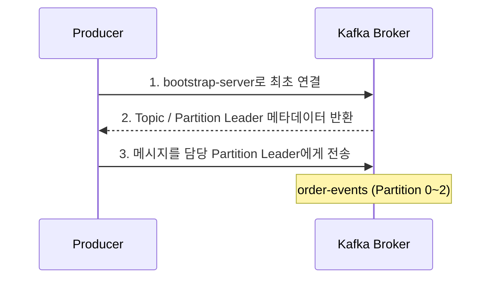
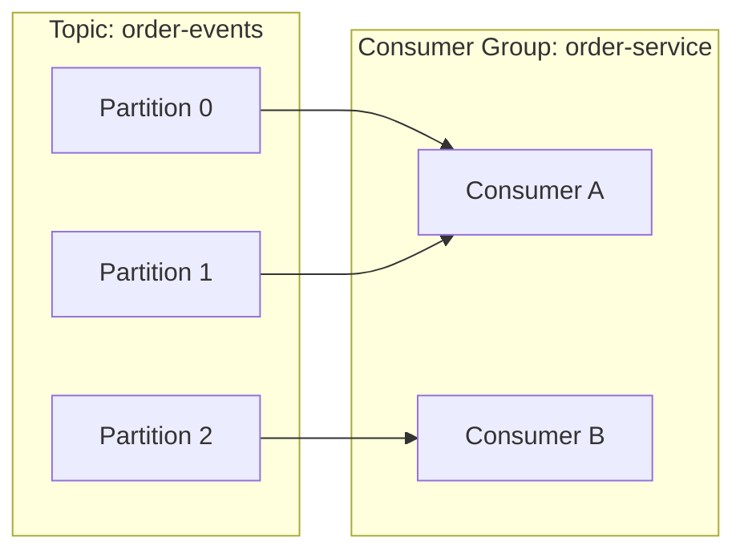
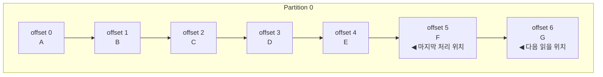
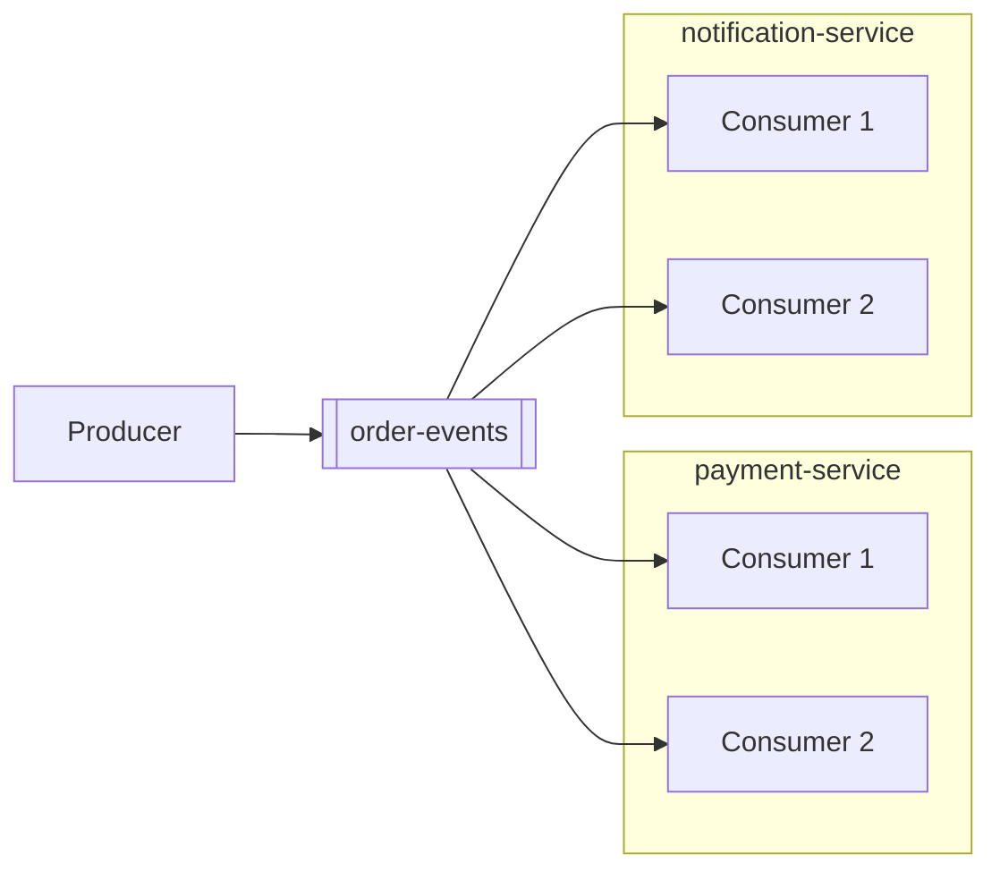

## 🌊 들어가기에 앞서

[첫 번째 글](/27/) 에서는 Kafka의 기본 구조를, [두 번째 글](/29/) 에서는 RabbitMQ와 Kafka의 차이를 설명했습니다. 지금까지의 내용을 한 문장으로 정리하면, ==Producer는 Topic에 메시지를 보내고 Consumer는 필요한 시점에 메시지를 가져간다==는 겁니다.

그런데 여기서 궁금한 점이 하나 생깁니다. Consumer가 메시지를 읽다가 죽어버리면, 다시 살아났을 때 어디서부터 읽어야 할까요? 처음부터 모든 메시지를 다시 읽으면 중복 처리가 발생하고, 가장 최근 메시지부터 읽으면 장애가 발생한 동안 쌓인 메시지를 놓치게 됩니다.

Kafka는 이 문제를 ==Offset==과 ==Consumer Group==으로 해결합니다. 이번 글에서는 Docker로 Kafka를 직접 실행하고, 메시지를 보내고, Consumer를 여러 개 띄워보면서 이 두 개념이 실제로 어떻게 동작하는지 확인해보겠습니다.

:::important
이번 글에서 확인할 질문은 하나입니다.

==Producer가 보낸 메시지를 여러 Consumer가 읽을 때, Kafka는 누가 어디까지 읽었는지를 어떻게 기억하는가?==
:::

## 🐳 Kafka 실행하기

이번 실습에서는 Kafka 공식 Docker 이미지인 `apache/kafka:4.3.1`을 사용합니다.[^1] 이전 Kafka는 Cluster의 메타데이터를 관리하기 위해 ZooKeeper를 별도로 실행해야 했지만, 현재 Kafka는 KRaft를 사용하기 때문에 단일 컨테이너만으로 실습할 수 있습니다.

### 1. docker-compose.yml 작성하기

```yaml name="docker-compose.yml"
services:
  kafka:
    image: apache/kafka:4.3.1
    container_name: kafka
    ports:
      - "9092:9092"
```

```bash
docker compose up -d
docker compose ps

# 실행 결과
NAME      IMAGE                 STATUS          PORTS
kafka     apache/kafka:4.3.1    Up              0.0.0.0:9092->9092/tcp
```

:::tip
이번 구성은 Producer, Consumer, Offset의 동작을 확인하기 위한 ==로컬 단일 Broker 환경==입니다. 실제 운영 환경처럼 장애에 대비하려면 여러 Broker와 Replication 구성이 필요합니다.
:::

### 2. Topic 생성하기

이번에는 주문 이벤트를 처리한다고 가정하고 `order-events`라는 Topic을 생성합니다. Consumer Group의 동작까지 확인하기 위해 Partition은 3개로 지정하겠습니다.

```bash
docker exec kafka /opt/kafka/bin/kafka-topics.sh \
  --create \
  --topic order-events \
  --partitions 3 \
  --replication-factor 1 \
  --bootstrap-server localhost:9092
```

생성된 Topic의 정보를 확인하면 Partition 0, 1, 2가 만들어진 것을 볼 수 있습니다.

```bash
docker exec kafka /opt/kafka/bin/kafka-topics.sh \
  --describe \
  --topic order-events \
  --bootstrap-server localhost:9092

# 실행 결과 일부
Topic: order-events  PartitionCount: 3  ReplicationFactor: 1
Topic: order-events  Partition: 0  Leader: 1
Topic: order-events  Partition: 1  Leader: 1
Topic: order-events  Partition: 2  Leader: 1
```

## 📤 Producer로 메시지 보내기

Producer는 메시지를 만들어서 Kafka의 Topic으로 보내는 주체입니다. 아래 명령을 실행하면 터미널이 입력을 기다리는 상태로 바뀌는데, 한 줄을 입력할 때마다 하나의 메시지가 Kafka로 전송됩니다.

```bash
docker exec -it kafka /opt/kafka/bin/kafka-console-producer.sh \
  --topic order-events \
  --bootstrap-server localhost:9092

>order-1001: payment-completed
>order-1002: payment-completed
>order-1003: payment-failed
>order-1004: payment-completed
>order-1005: payment-completed
>order-1006: payment-canceled
```

Producer가 Broker에 연결할 때는 전체 Broker의 주소를 전부 알고 있을 필요가 없습니다. `bootstrap-server`에 연결 가능한 Broker 하나 이상을 전달하면, Producer가 Cluster의 메타데이터를 받아서 어떤 Partition Leader에게 메시지를 전송해야 하는지 알아냅니다.



:::warning
Offset은 Topic 전체에서 하나씩 증가하는 번호가 아닙니다. ==각 Partition 내부에서 독립적으로 증가==합니다. 따라서 Partition 0의 Offset 1과 Partition 1의 Offset 1은 서로 다른 메시지입니다.
:::

## 📥 Consumer로 메시지 읽기

이제 다른 터미널을 열고 Consumer를 실행해보겠습니다.

```bash
docker exec -it kafka /opt/kafka/bin/kafka-console-consumer.sh \
  --topic order-events \
  --from-beginning \
  --bootstrap-server localhost:9092

order-1001: payment-completed
order-1002: payment-completed
order-1003: payment-failed
order-1004: payment-completed
order-1005: payment-completed
order-1006: payment-canceled
```

`--from-beginning`은 이름 그대로, 읽을 위치가 저장되어 있지 않은 Consumer가 Partition의 가장 오래된 Offset부터 메시지를 읽도록 만드는 옵션입니다. Kafka는 메시지를 Consumer에게 강제로 보내지 않습니다. Consumer가 Broker에게 ==새로운 메시지가 있나요?==라고 요청하고, Broker가 해당 Offset 이후의 메시지를 반환합니다. 지난 글에서 Kafka를 Pull 방식이라고 설명한 이유가 바로 이것입니다.

## 👥 Consumer Group을 적용하면 뭐가 달라질까?

실제 서비스에서는 Consumer 하나만 두지 않습니다. 주문 이벤트가 계속 쌓이는데 Consumer 하나가 모든 결제 후처리를 담당한다면, 처리 속도가 Producer의 생성 속도를 따라가지 못할 수 있기 때문입니다.

이때 같은 역할을 하는 Consumer들을 ==Consumer Group==으로 묶습니다. 첫 번째 터미널에서 아래 Consumer를 실행합니다.

```bash
docker exec -it kafka /opt/kafka/bin/kafka-console-consumer.sh \
  --topic order-events \
  --group order-service \
  --bootstrap-server localhost:9092
```

두 번째 터미널에서도 완전히 같은 명령을 실행합니다.

```bash
docker exec -it kafka /opt/kafka/bin/kafka-console-consumer.sh \
  --topic order-events \
  --group order-service \
  --bootstrap-server localhost:9092
```

이 상태에서 Producer로 메시지를 계속 보내보면, 하나의 메시지가 두 Consumer에 모두 나타나는 것이 아니라 ==둘 중 하나의 Consumer에서만 처리==되는 것을 확인할 수 있습니다. 같은 Group 안에서는 Partition을 서로 나눠서 담당하기 때문입니다.



※ 실제 Partition 할당 결과는 Rebalance에 따라 달라질 수 있음

Consumer가 하나 더 들어오거나, 기존 Consumer가 죽으면 Kafka는 Partition 담당자를 다시 나눕니다. 이 과정을 ==Rebalance==라고 합니다. 위 그림에서 Consumer A가 죽는다면 Consumer B가 Partition 0, 1, 2를 모두 담당하게 되고, 새로운 Consumer C가 들어오면 다시 Partition을 나눠 갖습니다.

:::important
같은 Consumer Group 안에서 ==하나의 Partition은 동시에 하나의 Consumer에게만 할당==됩니다. Partition이 3개인데 Consumer를 4개 실행하면, 3개는 Partition을 하나씩 맡고 나머지 Consumer 하나는 아무 일도 하지 못합니다.

따라서 Consumer의 개수를 늘리기 전에 Partition 개수를 먼저 확인해야 합니다.
:::

## 🧭 Kafka는 어디까지 읽었는지 어떻게 기억할까?

Consumer가 Partition 0의 Offset 0부터 5까지 처리했다고 가정해보겠습니다. 정상적으로 처리한 위치를 Kafka에 Commit하면, Kafka는 `order-service`라는 Group이 다음에 읽어야 할 위치를 기억합니다.



Consumer Group: `order-service` / Committed Offset: `6`

여기서 자주 헷갈리는 부분이 있습니다. Commit된 Offset은 ==마지막으로 처리한 메시지 번호==가 아니라, 일반적으로 ==다음에 읽을 메시지의 위치==를 의미합니다. Offset 5까지 처리했다면 Commit 값은 6이 되는 식입니다.

Consumer Group이 어디까지 읽었는지는 아래 명령으로 확인할 수 있습니다.

```bash
docker exec kafka /opt/kafka/bin/kafka-consumer-groups.sh \
  --bootstrap-server localhost:9092 \
  --describe \
  --group order-service

# 실행 결과 형태
GROUP          TOPIC          PARTITION  CURRENT-OFFSET  LOG-END-OFFSET  LAG
order-service  order-events   0          2               2               0
order-service  order-events   1          2               2               0
order-service  order-events   2          2               2               0
```

- `CURRENT-OFFSET`: Consumer Group이 다음에 읽을 위치
- `LOG-END-OFFSET`: 해당 Partition에 저장된 마지막 위치의 다음 값
- `LAG`: 아직 처리하지 못하고 밀려있는 메시지 수

따라서 ==LAG가 계속 증가한다는 것은 Producer가 메시지를 만드는 속도를 Consumer가 따라가지 못하고 있다는 신호==입니다. 이때 Consumer를 무작정 늘릴 것이 아니라, Partition 개수와 Consumer의 처리 시간부터 함께 확인해야 합니다.

## ⏪ Offset을 되돌리면 메시지를 다시 읽을 수 있을까?

Kafka를 사용하는 가장 큰 이유 중 하나는 Replay입니다. 예를 들어 Consumer 로직에 버그가 있어서 주문 이벤트를 잘못 처리했다면, Offset을 과거로 되돌린 뒤 수정된 로직으로 다시 처리할 수 있습니다.

먼저 `order-service` Group으로 실행 중인 Consumer를 모두 종료합니다. 이후 Offset을 가장 처음으로 되돌립니다.

```bash
docker exec kafka /opt/kafka/bin/kafka-consumer-groups.sh \
  --bootstrap-server localhost:9092 \
  --group order-service \
  --topic order-events \
  --reset-offsets \
  --to-earliest \
  --execute
```

다시 같은 Group으로 Consumer를 실행하면, 이전에 처리했던 메시지가 처음부터 다시 출력됩니다.

```bash
docker exec -it kafka /opt/kafka/bin/kafka-console-consumer.sh \
  --topic order-events \
  --group order-service \
  --bootstrap-server localhost:9092
```

:::warning
Offset Reset은 Consumer가 실행 중인 상태에서 진행하면 안 됩니다. Consumer Group을 먼저 중지한 뒤 Offset을 변경해야 합니다. 또한 실제 서비스에서 결제나 알림 같은 작업을 Replay하면 같은 동작이 두 번 실행될 수 있으므로, Consumer 로직은 ==같은 메시지를 여러 번 처리해도 결과가 달라지지 않는 멱등성==을 갖도록 설계해야 합니다.
:::

## 🕰️ earliest와 latest의 차이

Consumer Group에 저장된 Offset이 없을 때, 어디서부터 읽을지를 결정하는 설정이 `auto.offset.reset`입니다.

- `earliest`: 현재 보관 중인 메시지 중 가장 오래된 Offset부터 읽음
- `latest`: Consumer가 실행된 이후에 들어오는 새로운 메시지부터 읽음

```bash
# 가장 오래된 메시지부터 읽기
docker exec -it kafka /opt/kafka/bin/kafka-console-consumer.sh \
  --topic order-events \
  --group new-order-service \
  --consumer-property auto.offset.reset=earliest \
  --bootstrap-server localhost:9092
```

:::tip
이미 Commit된 Offset이 존재하는 Consumer Group은 `earliest`나 `latest`보다 ==저장된 Offset을 우선==합니다. 이 설정은 Group에 초기 Offset이 없거나, 기존 Offset이 Kafka의 보존 기간을 지나 사라졌을 때 적용됩니다.
:::

## 🚦 실제 서비스에서는 어떻게 선택해야 할까?

지금까지의 실습을 실제 주문 시스템에 대입하면 다음과 같습니다.

1. 주문 서비스인 Producer가 `order-events` Topic에 이벤트를 저장합니다.
2. `payment-service` Consumer Group은 결제 상태를 처리합니다.
3. `notification-service` Consumer Group은 사용자에게 알림을 보냅니다.
4. 두 Group은 같은 메시지를 읽지만, 서로 다른 Offset을 저장합니다.
5. 같은 Group 내부의 Consumer들은 Partition을 나눠서 처리합니다.



payment-service와 notification-service는 같은 메시지를 읽지만 Offset은 Group별로 따로 관리함

여기서 중요한 건 ==Consumer를 여러 개 실행한다고 무조건 같은 메시지를 나눠 처리하는 것은 아니라는 점==입니다. 같은 Group ID를 사용하면 일을 나눠서 처리하고, 서로 다른 Group ID를 사용하면 각 Group이 같은 메시지를 독립적으로 읽습니다.

## 😮‍💨 마무리

Producer는 Topic에 메시지를 보내고, Consumer는 자신에게 할당된 Partition에서 메시지를 Pull합니다. Kafka는 각 Partition에 Offset을 부여하고, Consumer Group별로 Commit된 Offset을 저장해서 누가 어디까지 읽었는지를 기억합니다.

이번 글에서 가장 중요한 부분을 정리하면 다음과 같습니다.

- Offset은 Topic 전체가 아니라 ==Partition별로 독립적으로 증가==합니다.
- 같은 Consumer Group의 Consumer들은 Partition을 나눠서 처리합니다.
- Partition보다 Consumer가 많으면 남는 Consumer는 아무 일도 하지 못합니다.
- 서로 다른 Consumer Group은 같은 메시지를 각자의 Offset으로 읽을 수 있습니다.
- Offset을 되돌리면 메시지를 Replay할 수 있지만, 중복 처리에 대비해야 합니다.

결국 Kafka의 Consumer를 설계할 때는 Consumer 개수만 보는 것이 아니라, ==Partition 개수, 처리 속도, LAG, 중복 처리 가능성==을 함께 봐야 합니다. 다음 글에서는 Python으로 Producer와 Consumer를 직접 구현하면서, 메시지 Key에 따라 Partition이 어떻게 결정되는지 알아보겠습니다.

[^1]: [Apache Kafka Quickstart](https://kafka.apache.org/quickstart/)
