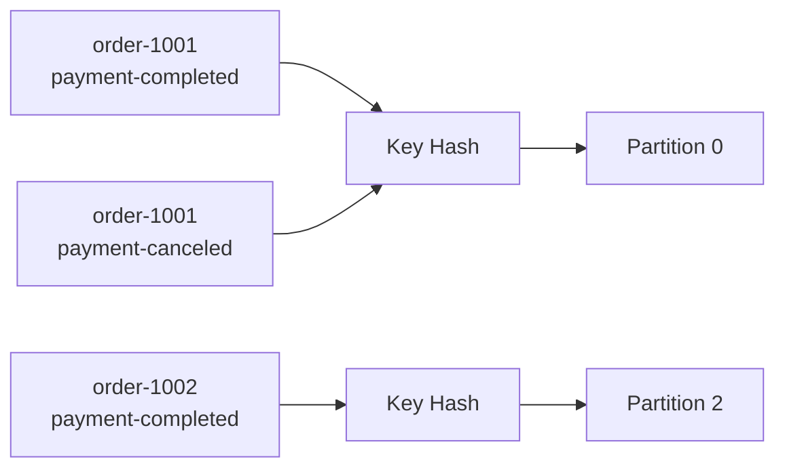
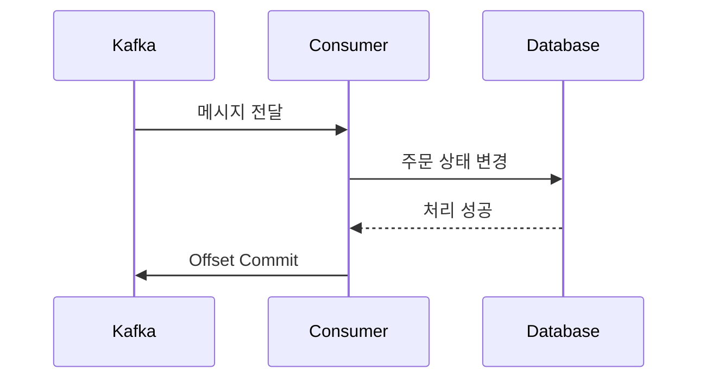

## 🌊 들어가기에 앞서

[지난 글](/30/) 에서는 Console Producer와 Consumer를 직접 실행하면서 Consumer Group과 Offset의 동작을 확인했습니다. 하지만 실제 서비스에서 터미널에 메시지를 한 줄씩 입력할 수는 없습니다. 애플리케이션 코드가 이벤트를 만들고, 다른 애플리케이션이 그 이벤트를 읽어서 처리해야 합니다.

이번에는 Python으로 주문 이벤트를 전송하는 Producer와 처리하는 Consumer를 구현해보겠습니다. 이 과정에서 단순히 메시지를 보내고 받는 것보다 더 중요한 질문도 함께 다룹니다.

:::important
같은 주문에서 `결제 완료`와 `결제 취소` 이벤트가 차례로 발생했다면, Consumer도 반드시 그 순서대로 읽을 수 있을까요?
:::

Kafka는 Topic 전체가 아니라 ==하나의 Partition 안에서만 순서를 보장==합니다. 따라서 서로 연관된 이벤트를 같은 Partition에 넣어야 하고, 이때 사용하는 것이 ==메시지 Key==입니다.

## 🐍 Python 실습 환경 구성하기

Kafka는 [지난 글](/30/) 과 동일하게 `apache/kafka:4.3.1` Docker 이미지를 사용합니다. 먼저 컨테이너가 실행 중인지 확인합니다.

```bash
docker compose up -d
docker compose ps
```

Python에서는 `confluent-kafka` 라이브러리를 사용하겠습니다.[^1] 내부적으로 `librdkafka`를 사용하기 때문에 처리량이 높고, Producer와 Consumer 설정도 Kafka의 개념과 비교적 직접적으로 연결됩니다.

```bash
python -m venv .venv
source .venv/bin/activate
pip install confluent-kafka
```

### Topic 준비하기

메시지가 여러 Partition으로 나뉘는 모습을 확인하기 위해 `order-events` Topic을 3개의 Partition으로 생성합니다. 지난 실습에서 이미 만들었다면 이 단계는 건너뛰어도 됩니다.

```bash
docker exec kafka /opt/kafka/bin/kafka-topics.sh \
  --create \
  --if-not-exists \
  --topic order-events \
  --partitions 3 \
  --replication-factor 1 \
  --bootstrap-server localhost:9092
```

## 📤 Python Producer 구현하기

주문 상태가 변경될 때마다 아래와 같은 이벤트를 Kafka에 보낸다고 가정해보겠습니다.

```json
{
  "order_id": "order-1001",
  "status": "payment-completed"
}
```

Producer 코드를 `producer.py`에 작성합니다.

```python name="producer.py"
import json

from confluent_kafka import Producer


producer = Producer({
    "bootstrap.servers": "localhost:9092",
    "client.id": "order-api",
})


def delivery_report(error, message):
    if error is not None:
        print(f"전송 실패: {error}")
        return

    print(
        f"전송 성공: partition={message.partition()}, "
        f"offset={message.offset()}, key={message.key().decode()}"
    )


def send_order_event(order_id, status):
    event = {
        "order_id": order_id,
        "status": status,
    }

    producer.produce(
        topic="order-events",
        key=order_id.encode("utf-8"),
        value=json.dumps(event).encode("utf-8"),
        callback=delivery_report,
    )

    # 완료된 전송의 callback을 실행할 기회를 줍니다.
    producer.poll(0)


send_order_event("order-1001", "payment-completed")
send_order_event("order-1002", "payment-completed")
send_order_event("order-1001", "payment-canceled")

# 아직 전송 대기 중인 모든 메시지가 처리될 때까지 기다립니다.
producer.flush()
```

실행하면 메시지가 저장된 Partition과 Offset을 확인할 수 있습니다.

```bash
python producer.py

# 실행 결과 예시
전송 성공: partition=0, offset=0, key=order-1001
전송 성공: partition=2, offset=0, key=order-1002
전송 성공: partition=0, offset=1, key=order-1001
```

실제 Partition 번호와 Callback 출력 순서는 실행 환경에 따라 달라질 수 있습니다. 여기서 봐야 할 부분은 ==`order-1001`을 Key로 가진 두 메시지가 같은 Partition에 저장되었다==는 점입니다.

:::warning
`produce()`가 예외 없이 끝났다고 해서 Broker에 메시지가 저장된 것은 아닙니다. 전송은 비동기로 이루어지므로 Callback에서 성공 여부를 확인하고, 프로그램을 종료하기 전에는 `flush()`로 대기 중인 메시지를 처리해야 합니다.
:::

## 🔑 메시지 Key는 Partition을 결정한다

Producer가 메시지를 보낼 때 Partition 번호를 직접 지정하지 않으면 ==Partitioner==가 메시지를 어느 Partition에 넣을지 결정합니다.[^2] 이때 Key가 있으면 같은 Key는 같은 해시 결과를 만들기 때문에 같은 Partition으로 전달됩니다.



결제 완료 이벤트가 먼저 발생하고 결제 취소 이벤트가 나중에 발생했다고 가정해보겠습니다. 두 이벤트가 서로 다른 Partition으로 들어가면 서로 다른 Consumer가 동시에 처리할 수 있고, 결제 취소가 먼저 끝날 가능성도 생깁니다.

반대로 `order_id`를 Key로 지정하면 같은 주문의 이벤트가 같은 Partition에 저장됩니다. 하나의 Partition은 Consumer Group 안에서 한 Consumer만 담당하므로, 해당 주문의 이벤트는 저장된 순서대로 읽을 수 있습니다.

:::important
Kafka에서 메시지 Key는 단순한 식별자가 아닙니다. ==어떤 이벤트를 같은 Partition에 묶어서 순서를 지킬 것인지 결정하는 기준==입니다.
:::

### Key가 없으면 어떻게 될까?

Key를 생략해도 메시지는 정상적으로 전송됩니다.

```python
producer.produce(
    topic="order-events",
    value=json.dumps(event).encode("utf-8"),
)
```

이 경우 Partitioner는 메시지를 Partition에 분산해서 처리량을 활용합니다. 하지만 어떤 메시지가 어느 Partition으로 갈지 도메인 기준으로 제어할 수 없기 때문에, ==같은 주문에 속한 이벤트의 순서를 기대해서는 안 됩니다.==

Key가 필요 없는 로그 수집이나 독립적인 알림 이벤트라면 문제가 없을 수 있습니다. 반면 주문 상태, 계좌 거래, 사용자별 활동처럼 같은 대상의 처리 순서가 중요하다면 Key를 명시해야 합니다.

### Partition 수를 늘리면 주의해야 한다

Key의 해시값을 Partition 수에 맞춰 계산하므로 Topic의 Partition 수가 바뀌면 같은 Key가 이전과 다른 Partition으로 배치될 수 있습니다. Partition을 늘리는 작업은 처리량만의 문제가 아니라 ==Key 기반 순서 보장에도 영향을 주는 변경==입니다.

또한 모든 메시지에 같은 Key를 사용하면 모든 이벤트가 하나의 Partition으로 몰립니다. 이를 ==Hot Partition==이라고 하며, 나머지 Partition과 Consumer가 놀고 있어도 특정 Partition의 LAG만 계속 증가할 수 있습니다.

:::tip
좋은 Key는 두 조건 사이에서 균형을 잡아야 합니다.

- 순서를 지켜야 하는 이벤트는 같은 Key를 사용합니다.
- 트래픽이 특정 Key에 과도하게 몰리지 않도록 충분히 다양한 값을 사용합니다.

주문 이벤트라면 `order_id`, 사용자별 활동이라면 `user_id`가 일반적인 출발점입니다.
:::

## 📥 Python Consumer 구현하기

이제 Producer가 보낸 메시지를 읽는 Consumer를 `consumer.py`에 작성합니다.

```python name="consumer.py"
import json

from confluent_kafka import Consumer, KafkaError, KafkaException


consumer = Consumer({
    "bootstrap.servers": "localhost:9092",
    "group.id": "order-worker",
    "auto.offset.reset": "earliest",
    "enable.auto.commit": False,
})

consumer.subscribe(["order-events"])

try:
    while True:
        message = consumer.poll(timeout=1.0)

        if message is None:
            continue

        if message.error():
            if message.error().code() == KafkaError._PARTITION_EOF:
                continue
            raise KafkaException(message.error())

        key = message.key().decode("utf-8") if message.key() else None
        event = json.loads(message.value().decode("utf-8"))

        print(
            f"수신: partition={message.partition()}, "
            f"offset={message.offset()}, key={key}, event={event}"
        )

        # 실제 서비스에서는 비즈니스 처리가 성공한 뒤 Commit합니다.
        consumer.commit(message=message, asynchronous=False)
except KeyboardInterrupt:
    pass
finally:
    consumer.close()
```

Consumer를 실행한 뒤 Producer를 다시 실행합니다.

```bash
# 첫 번째 터미널
python consumer.py

# 두 번째 터미널
python producer.py
```

Consumer 출력에서 `order-1001`의 두 이벤트가 같은 Partition의 연속된 Offset에 위치하는 것을 확인할 수 있습니다.

```text
수신: partition=0, offset=0, key=order-1001, event={'order_id': 'order-1001', 'status': 'payment-completed'}
수신: partition=0, offset=1, key=order-1001, event={'order_id': 'order-1001', 'status': 'payment-canceled'}
수신: partition=2, offset=0, key=order-1002, event={'order_id': 'order-1002', 'status': 'payment-completed'}
```

Partition별 메시지는 병렬로 읽기 때문에 서로 다른 Partition의 출력 순서는 달라질 수 있습니다. Kafka가 보장하는 것은 Topic 전체의 출력 순서가 아니라 ==Partition 내부의 저장 순서==입니다.

## 🧭 Offset은 언제 Commit해야 할까?

Consumer 설정에서 `enable.auto.commit`을 `False`로 지정하고, 메시지 처리가 끝난 뒤 직접 Commit했습니다.

```python
process_order(event)
consumer.commit(message=message, asynchronous=False)
```

Commit 시점은 장애가 발생했을 때 메시지를 놓칠지, 다시 처리할지를 결정합니다.



- **처리 전에 Commit**: Commit 직후 Consumer가 죽으면 아직 처리하지 않은 메시지를 다시 읽지 못할 수 있습니다.
- **처리 후 Commit**: 비즈니스 처리는 성공했지만 Commit 전에 죽으면 같은 메시지를 다시 읽을 수 있습니다.

데이터 유실보다 중복 처리를 허용하는 편이 안전하기 때문에, 일반적으로는 ==처리가 성공한 뒤 Commit==합니다. 다만 이 방식도 처리와 Commit 사이에서 장애가 발생하면 중복을 완전히 피할 수 없습니다.

:::warning
Kafka Consumer를 사용한다고 해서 비즈니스 로직이 자동으로 Exactly Once가 되는 것은 아닙니다. 결제 요청, 재고 차감, 알림 발송처럼 외부 시스템에 영향을 주는 작업은 같은 이벤트를 다시 처리해도 결과가 달라지지 않도록 멱등성을 갖춰야 합니다.
:::

예를 들어 이벤트 ID를 DB에 함께 저장하고, 이미 처리한 이벤트 ID라면 작업을 건너뛰는 방법을 사용할 수 있습니다.

```python
def process_order(event):
    if event_repository.exists(event["event_id"]):
        return

    order_repository.update_status(
        order_id=event["order_id"],
        status=event["status"],
    )
    event_repository.mark_as_processed(event["event_id"])
```

실제로 적용할 때는 주문 상태 변경과 이벤트 처리 기록을 하나의 DB Transaction으로 묶어야 합니다. 그렇지 않으면 상태만 바뀌고 처리 기록은 남지 않는 또 다른 틈이 생깁니다.

## 🎯 메시지 Key는 어떻게 골라야 할까?

Key를 선택할 때는 ==무엇의 순서를 지켜야 하는가?==를 먼저 질문해야 합니다.

| 이벤트 | Key 후보 | 보장하려는 순서 |
|---|---|---|
| 주문 상태 변경 | `order_id` | 한 주문의 생성 → 결제 → 취소 |
| 계좌 입출금 | `account_id` | 한 계좌의 입금과 출금 |
| 사용자 활동 | `user_id` | 한 사용자의 행동 발생 순서 |
| IoT 센서 측정 | `device_id` | 한 장치의 측정 시각 순서 |

Key를 너무 넓게 잡아 `shop_id` 하나로 모든 주문을 묶으면 특정 상점의 트래픽이 하나의 Partition에 몰릴 수 있습니다. 반대로 이벤트마다 새로운 UUID를 Key로 사용하면 분산은 잘 되지만 같은 주문의 이벤트가 서로 다른 Partition에 들어가 순서를 잃게 됩니다.

따라서 Key는 데이터를 구분하기 위한 Primary Key와 반드시 같을 필요는 없습니다. ==함께 처리되어야 하는 이벤트의 경계==를 표현해야 합니다.

## 😮‍💨 마무리

이번 글에서는 Python으로 Producer와 Consumer를 구현하고, 주문 ID를 Key로 사용해서 같은 주문의 이벤트를 같은 Partition에 저장해봤습니다.

- Producer의 전송은 비동기로 이루어지므로 Callback과 `flush()`로 결과를 확인해야 합니다.
- 같은 Key를 가진 메시지는 Partition 수가 유지되는 동안 같은 Partition으로 전달됩니다.
- Kafka의 순서 보장은 Topic 전체가 아니라 Partition 내부에만 적용됩니다.
- Consumer는 비즈니스 처리가 성공한 뒤 Offset을 Commit하는 편이 안전합니다.
- 처리 후 Commit 방식에서는 중복이 발생할 수 있으므로 Consumer 로직에 멱등성이 필요합니다.

결국 메시지 Key를 정하는 일은 단순한 Producer 설정이 아니라, ==어떤 이벤트의 순서를 지키고 어떤 단위로 병렬 처리할지 결정하는 설계==입니다. 다음 글에서는 Producer의 `acks`, 재시도와 중복 전송을 살펴보면서 Kafka가 메시지를 얼마나 안전하게 전달하는지 알아보겠습니다.

[^1]: [Confluent Kafka Python Client](https://docs.confluent.io/kafka-clients/python/current/overview.html)
[^2]: [Apache Kafka Producer Configs](https://kafka.apache.org/documentation/#producerconfigs)
