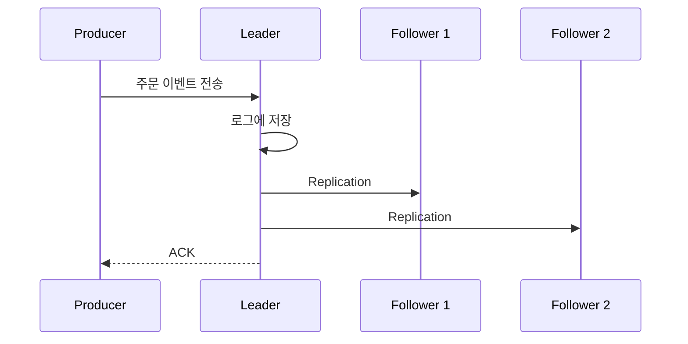
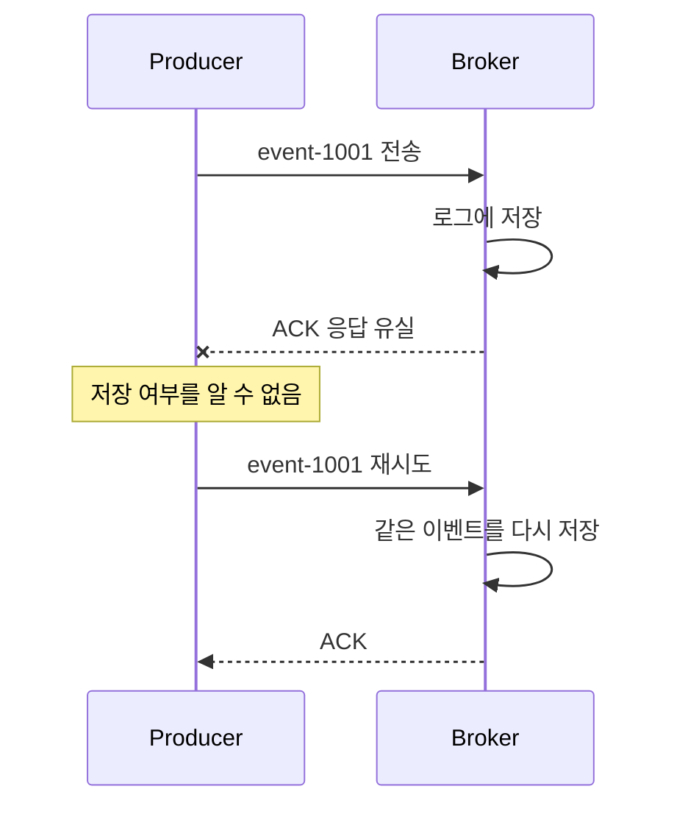

## 🌊 들어가기에 앞서

[지난 글](/31/) 에서는 Python Producer의 Callback으로 메시지가 저장된 Partition과 Offset을 확인했습니다. 화면에 ==전송 성공==까지 출력됐으니 별문제 없이 끝난 것처럼 보이죠.

근데 정말 안심해도 되는 걸까요? 주문 서비스가 ==결제 완료== 이벤트를 보낸 직후 Broker가 죽을 수도 있고, Broker는 메시지를 잘 저장했는데 ACK만 돌아오지 않을 수도 있습니다. 후자의 경우 Producer는 성공한 건지 실패한 건지 알 수 없으니 같은 메시지를 다시 보내게 됩니다. 그러면 이번에는 유실이 아니라 중복이 문제가 되겠죠?

이 문제와 연결되는 설정이 ??acks??, ??retries??, ??enable.idempotence??입니다. 이름만 보면 어려워 보이지만 결국 ==어디까지 저장된 것을 성공으로 볼 것인가==에 대한 설정들입니다. 하나씩 직접 바꿔보겠습니다.

## 📮 전송 성공은 누가 확인해줄까?

Producer는 메시지를 Topic의 Partition Leader에게 전송합니다. 이 메시지는 Leader의 로그에 먼저 기록되고, 같은 Partition을 복제하는 Follower가 Leader의 데이터를 가져갑니다.



여기서 ACK(Acknowledgment)는 ==메시지를 받았다는 확인 응답==입니다. Producer의 ??acks?? 설정은 Broker가 어느 시점에 ACK를 보내야 하는지 결정합니다.[^1]

| 설정 | 성공으로 판단하는 시점 | 장점 | 위험 |
|---|---|---|---|
| ??acks=0?? | Broker의 응답을 기다리지 않음 | 지연이 가장 짧음 | 전송 실패를 알기 어려움 |
| ??acks=1?? | Leader가 자신의 로그에 저장함 | 속도와 안정성의 절충 | 복제 전 Leader가 죽으면 유실 가능 |
| ??acks=all?? | 현재 ISR의 복제가 완료됨 | 가장 강한 내구성 | ACK까지 더 오래 걸릴 수 있음 |

표만 보면 그냥 ??acks=all??을 고르면 끝나는 것처럼 보입니다. 이름부터 전부 확인해준다는 느낌이니깐요. 하지만 ??all??이 정확히 몇 개의 Broker를 뜻하는지까지 확인해야 합니다.

## 🐳 3개의 Broker로 실습 환경 구성하기

지난 글에서는 Broker를 한 대만 사용했습니다. Replication Factor가 1이면 복제할 Follower가 없으니 ??acks=1??과 ??acks=all??을 비교하는 것이 별 의미가 없습니다. 조금 귀찮긴 하지만 이번에는 ++compose.cluster.yml++에 Broker를 3대 띄워보겠습니다. 각 Broker는 KRaft Controller와 Broker 역할을 함께 수행합니다.

```yaml title="compose.cluster.yml"
services:
  kafka-1:
    image: apache/kafka:4.3.1
    container_name: kafka-1
    ports:
      - "19092:19092"
    environment: &kafka-common
      KAFKA_PROCESS_ROLES: broker,controller
      KAFKA_CONTROLLER_LISTENER_NAMES: CONTROLLER
      KAFKA_LISTENER_SECURITY_PROTOCOL_MAP: CONTROLLER:PLAINTEXT,INTERNAL:PLAINTEXT,EXTERNAL:PLAINTEXT
      KAFKA_INTER_BROKER_LISTENER_NAME: INTERNAL
      KAFKA_CONTROLLER_QUORUM_VOTERS: 1@kafka-1:9093,2@kafka-2:9093,3@kafka-3:9093
      KAFKA_OFFSETS_TOPIC_REPLICATION_FACTOR: 3
      KAFKA_TRANSACTION_STATE_LOG_REPLICATION_FACTOR: 3
      KAFKA_TRANSACTION_STATE_LOG_MIN_ISR: 2
      CLUSTER_ID: MkU3OEVBNTcwNTJENDM2Qk
      KAFKA_NODE_ID: 1
      KAFKA_LISTENERS: INTERNAL://:9092,CONTROLLER://:9093,EXTERNAL://:19092
      KAFKA_ADVERTISED_LISTENERS: INTERNAL://kafka-1:9092,EXTERNAL://localhost:19092

  kafka-2:
    image: apache/kafka:4.3.1
    container_name: kafka-2
    ports:
      - "29092:29092"
    environment:
      <<: *kafka-common
      KAFKA_NODE_ID: 2
      KAFKA_LISTENERS: INTERNAL://:9092,CONTROLLER://:9093,EXTERNAL://:29092
      KAFKA_ADVERTISED_LISTENERS: INTERNAL://kafka-2:9092,EXTERNAL://localhost:29092

  kafka-3:
    image: apache/kafka:4.3.1
    container_name: kafka-3
    ports:
      - "39092:39092"
    environment:
      <<: *kafka-common
      KAFKA_NODE_ID: 3
      KAFKA_LISTENERS: INTERNAL://:9092,CONTROLLER://:9093,EXTERNAL://:39092
      KAFKA_ADVERTISED_LISTENERS: INTERNAL://kafka-3:9092,EXTERNAL://localhost:39092
```

설정이 갑자기 길어졌는데, 이번 글에서 봐야 할 부분은 세 가지 정도입니다.

- ??KAFKA_CONTROLLER_QUORUM_VOTERS??에는 Cluster의 상태를 함께 결정할 세 Controller를 적습니다.
- ??INTERNAL?? Listener는 Broker끼리 통신할 때, ??EXTERNAL?? Listener는 로컬 Python 코드에서 접근할 때 사용합니다.
- 세 Broker의 ??CLUSTER_ID??는 같아야 하지만 ??KAFKA_NODE_ID??는 각각 달라야 합니다.

Transaction 관련 설정은 Kafka 내부 Topic도 Broker 세 대에 복제되도록 맞춘 값입니다. 아직 Kafka Transaction을 사용하는 것은 아니므로 이번에는 이 정도만 알고 넘어가도 될 것 같습니다.

실습 환경을 실행합니다.

```bash
docker compose -f compose.cluster.yml up -d
docker compose -f compose.cluster.yml ps
```

이번 실습에서 사용할 ++reliable-orders++ Topic은 복제본을 3개 두고, 최소 2개의 ISR이 살아있을 때만 쓰기를 허용합니다.

```bash
docker exec kafka-1 /opt/kafka/bin/kafka-topics.sh \
  --create \
  --if-not-exists \
  --topic reliable-orders \
  --partitions 1 \
  --replication-factor 3 \
  --config min.insync.replicas=2 \
  --bootstrap-server kafka-1:9092
```

Topic의 Leader와 ISR을 확인해봅시다.

```bash
docker exec kafka-1 /opt/kafka/bin/kafka-topics.sh \
  --describe \
  --topic reliable-orders \
  --bootstrap-server kafka-1:9092

# 실행 결과
Topic: reliable-orders  Partition: 0  Leader: 1  Replicas: 1,2,3  Isr: 1,2,3
```

++Leader++, ++Replicas++, ++Isr++의 숫자는 실행 환경에 따라 달라질 수 있습니다. ++Replicas++는 Partition의 복제본을 가진 Broker 목록이고, ISR(In-Sync Replicas)은 그중 Leader의 데이터를 정상적으로 따라가고 있는 복제본의 집합입니다.

## 🐍 acks를 바꿔가며 메시지 보내기

지난 글과 마찬가지로 ++confluent-kafka++를 사용합니다. 명령행 인자로 ??acks?? 값을 받아 같은 메시지를 서로 다른 설정으로 전송하는 ++producer_acks.py++를 작성합니다.

```python title="producer_acks.py"
import json
import sys
import time
import uuid

from confluent_kafka import Producer


acks = sys.argv[1] if len(sys.argv) > 1 else "all"

producer = Producer({
    "bootstrap.servers": "localhost:19092,localhost:29092,localhost:39092",
    "client.id": f"order-api-acks-{acks}",
    "acks": acks,
    "enable.idempotence": False,
    "retries": 0,
    "delivery.timeout.ms": 10_000,
})


def delivery_report(error, message):
    if error is not None:
        print(f"전송 실패: {error}")
        return

    print(
        f"전송 성공: acks={acks}, partition={message.partition()}, "
        f"offset={message.offset()}"
    )


for sequence in range(1, 6):
    event = {
        "event_id": str(uuid.uuid4()),
        "order_id": "order-1001",
        "sequence": sequence,
        "created_at": time.time(),
    }

    producer.produce(
        topic="reliable-orders",
        key=event["order_id"].encode("utf-8"),
        value=json.dumps(event).encode("utf-8"),
        callback=delivery_report,
    )
    producer.poll(0)

producer.flush()
```

먼저 세 가지 설정을 차례대로 실행합니다.

```bash
python producer_acks.py 0
python producer_acks.py 1
python producer_acks.py all
```

제가 직접 실행했을 때는 아래와 같은 결과가 나왔습니다. 메시지는 각 설정마다 5개씩 보냈습니다.

```text
acks=0
전송 성공: acks=0, partition=0, offset=None

acks=1
전송 성공: acks=1, partition=0, offset=5

acks=all
전송 성공: acks=all, partition=0, offset=10
```

실제 Offset은 기존에 Topic에 저장된 메시지 수에 따라 달라집니다. 여기서 신기한 부분은 ??acks=0??입니다. 성공이라고 출력됐지만 Offset은 ??None??이 나왔습니다.

:::warning
??acks=0??에서 Callback이 성공했다고 해서 Broker가 메시지를 저장했다는 뜻은 아닙니다. Broker가 ACK를 보내지 않기 때문에 Producer는 네트워크로 전송한 사실까지만 알고, 제가 사용한 ++confluent-kafka 2.15.0++에서는 Offset도 ??None??으로 반환됐습니다. 이 설정에서는 실패 자체를 알아내기 어렵습니다.
:::

로그나 클릭 이벤트처럼 일부 유실을 감수하고 지연을 최대한 줄여야 하는 특수한 상황이 아니라면 ??acks=0??을 선택할 이유는 많지 않습니다.

## 🧱 acks=all이면 무조건 안전할까?

??acks=all??은 Leader가 현재 ISR의 확인을 기다립니다. 여기서 중요한 단어는 ==현재 ISR==입니다. 장애로 Follower가 모두 ISR에서 빠지고 Leader 혼자 남았는데도 쓰기를 허용한다면, 사실상 복제본 하나에만 기록될 수 있습니다.

이를 막는 Topic 설정이 ??min.insync.replicas??입니다.[^2]

```text
acks=all
        +
min.insync.replicas=2
        ↓
최소 2개의 ISR에 기록할 수 있을 때만 전송 성공
```

이번 Topic에는 ??min.insync.replicas=2??를 적용했습니다. Broker 한 대가 멈춰도 ISR이 2개 남아 있으므로 메시지를 계속 받을 수 있지만, 두 대가 멈춰 ISR이 하나만 남으면 Producer는 정상 저장인 것처럼 넘어가지 않고 오류를 반환합니다.

먼저 ??--describe?? 결과에서 Leader가 아닌 Follower 두 대를 확인한 뒤 차례대로 중지합니다. 예를 들어 Leader가 1이라면 2와 3을 중지합니다.

```bash
docker stop kafka-2 kafka-3
python producer_acks.py all
```

실제로 실행해보니 전송한 다섯 개의 메시지가 모두 아래 오류를 반환했습니다.

```text
전송 실패: KafkaError{code=NOT_ENOUGH_REPLICAS,val=19,
str="Broker: Not enough in-sync replicas"}
```

안전하게 복제할 수 없는 상황에서 메시지를 일단 받아주는 대신 쓰기 자체를 실패시킨 것입니다.

```bash
docker start kafka-2 kafka-3
```

Broker를 다시 시작한 직후에는 ISR이 Leader 하나만 남아있었지만, 잠시 기다리니 Follower가 데이터를 따라잡으면서 다시 세 개로 돌아왔습니다.

```text
Leader: 1  Replicas: 1,2,3  Isr: 1,2,3
```

결국 Broker가 부족한데도 일단 메시지를 받을 것인지, 아니면 안전하게 복제할 수 있을 때까지 실패시킬 것인지 선택해야 합니다. 주문이나 결제 이벤트라면 저는 후자가 맞다고 생각합니다.

## 🔁 재시도는 왜 중복을 만들까?

네트워크 요청에는 아주 애매한 순간이 존재합니다.



Broker는 메시지를 정상적으로 저장했지만 ACK만 네트워크에서 사라졌다고 가정해봅시다. Producer 입장에서는 저장에 실패한 것과 저장 후 응답만 사라진 것을 구분할 방법이 없습니다. 결국 같은 메시지를 다시 전송하고, Broker의 로그에는 중복이 생길 수 있습니다.

??retries??는 일시적인 오류가 발생했을 때 Producer가 메시지를 자동으로 다시 보내는 횟수입니다. 하지만 최신 클라이언트에서는 횟수를 작게 제한하기보다, 전체 전송의 시간 상한인 ??delivery.timeout.ms?? 안에서 재시도하도록 두는 방식이 권장됩니다.[^1]

```python
producer = Producer({
    "bootstrap.servers": "localhost:19092,localhost:29092,localhost:39092",
    "acks": "all",
    "retries": 2_147_483_647,
    "delivery.timeout.ms": 30_000,
    "retry.backoff.ms": 100,
})
```

재시도를 켜면 일시적인 Broker 장애나 Leader 변경을 견딜 수 있습니다. 반면 아무 장치 없이 같은 메시지를 다시 보내면 중복 가능성이 생깁니다. ==유실을 줄이려고 재시도를 켰더니 중복이라는 새로운 문제가 나타난 셈==입니다.

## 🪪 Idempotent Producer는 중복을 어떻게 구분할까?

멱등성(Idempotence)은 같은 작업을 여러 번 실행해도 결과가 한 번 실행한 것과 같아지는 성질입니다. Kafka에서는 ??enable.idempotence=true??로 Idempotent Producer를 활성화할 수 있습니다.[^3]

```python title="producer_idempotent.py"
import json
import uuid

from confluent_kafka import Producer


producer = Producer({
    "bootstrap.servers": "localhost:19092,localhost:29092,localhost:39092",
    "client.id": "reliable-order-api",
    "enable.idempotence": True,
    "delivery.timeout.ms": 30_000,
})


def delivery_report(error, message):
    if error is not None:
        print(f"최종 전송 실패: {error}")
        return

    print(
        f"전송 성공: partition={message.partition()}, "
        f"offset={message.offset()}"
    )


event = {
    "event_id": str(uuid.uuid4()),
    "order_id": "order-1001",
    "status": "payment-completed",
}

producer.produce(
    topic="reliable-orders",
    key=event["order_id"].encode("utf-8"),
    value=json.dumps(event).encode("utf-8"),
    callback=delivery_report,
)
producer.flush()
```

Idempotent Producer가 활성화되면 Kafka는 Producer ID(PID)와 Partition별 Sequence Number를 이용합니다. Broker는 같은 Producer가 이미 저장한 Sequence Number를 다시 보내면 새로운 메시지로 추가하지 않고 중복으로 판단합니다.[^4]

```text
PID=42, Partition=0, Sequence=7  → 처음 도착 → 저장
PID=42, Partition=0, Sequence=7  → 재시도   → 중복이므로 추가 저장하지 않음
PID=42, Partition=0, Sequence=8  → 다음 메시지 → 저장
```

++librdkafka++는 멱등성을 활성화할 때 다음 설정을 호환되는 값으로 자동 조정합니다.[^3]

- ??acks=all??
- ??retries??를 0보다 큰 값으로 설정
- ??max.in.flight.requests.per.connection=5??
- Partition 안의 원래 전송 순서를 유지

따라서 위 코드에서는 이 값들을 일일이 중복해서 적지 않았습니다. 만약 ??enable.idempotence=true??와 ??acks=1??처럼 서로 충돌하는 설정을 동시에 지정하면 Producer 생성 단계에서 오류가 발생합니다.

:::warning
이번 시리즈에서 사용하는 Python ++confluent-kafka++의 기반인 ++librdkafka++는 ??enable.idempotence??의 기본값이 ??false??입니다. 반면 Apache Kafka의 Java Producer는 충돌하는 설정이 없다면 현재 기본값이 ??true??입니다. 같은 Kafka를 사용하더라도 클라이언트 구현과 버전에 따라 기본값이 다를 수 있으므로 운영 설정을 명시적으로 확인해야 합니다.[^1][^3]
:::

## 🚧 멱등성이 막아주지 못하는 중복

이쯤 되면 ??enable.idempotence=true??만 설정해서 모든 중복 문제가 해결된 것처럼 보입니다. 하지만 Idempotent Producer가 제거하는 것은 ==한 Producer 세션 안에서 Kafka 프로토콜의 재시도로 발생한 중복==입니다.

애플리케이션 코드가 같은 이벤트를 두 번 생성하면 Kafka 입장에서는 서로 다른 두 메시지입니다.

```python
# 서로 다른 produce() 호출이므로 둘 다 정상적인 새 메시지입니다.
producer.produce(topic="reliable-orders", value=b"payment-completed")
producer.produce(topic="reliable-orders", value=b"payment-completed")
```

다음 상황은 Producer 멱등성만으로 해결되지 않습니다.

- API 요청이 두 번 들어와 애플리케이션이 이벤트를 두 번 생성한 경우
- Producer가 최종 실패를 반환한 뒤 애플리케이션이 직접 다시 전송한 경우
- Producer 프로세스가 재시작되어 새로운 세션이 만들어진 경우
- Consumer가 비즈니스 처리를 끝내고 Offset Commit 전에 죽은 경우

쉽게 말해서 Kafka가 알아서 재시도한 중복은 막아주지만, 우리가 ??produce()??를 두 번 호출한 것까지 막아주지는 못합니다. 지난 글에서 추가했던 ??event_id??가 여기서 다시 필요해집니다. Consumer는 이미 처리한 ??event_id??를 저장하고, 같은 ID가 다시 들어오면 결제나 재고 차감 같은 비즈니스 작업을 건너뛰어야 합니다.

## 🎯 실제 서비스에서는 어떻게 설정해야 할까?

모든 서비스가 같은 수준의 내구성을 요구하지는 않습니다. 주문이나 결제 이벤트라면 저는 ??acks=all??과 멱등성을 기본으로 두고, Topic에는 ??min.insync.replicas=2??를 적용할 것 같습니다. 메시지 하나가 사라졌을 때의 비용이 전송 속도 몇 ms보다 훨씬 크기 때문입니다.

반대로 다시 수집할 수 있는 지표나 일부 로그라면 요구사항에 따라 ??acks=1??도 검토할 수 있겠죠. 중요한 것은 가장 강해 보이는 설정을 무조건 고르는 것이 아니라, ==이 메시지 하나가 사라졌을 때 실제로 어떤 일이 생기는가==를 먼저 생각하는 것입니다.

Python ++confluent-kafka++를 사용하는 일반적인 서비스라면 아래 구성을 출발점으로 삼을 수 있습니다.

```python
producer = Producer({
    "bootstrap.servers": "kafka-1:9092,kafka-2:9092,kafka-3:9092",
    "client.id": "order-api",
    "enable.idempotence": True,
    "delivery.timeout.ms": 30_000,
})
```

여기서 ??delivery.timeout.ms??는 값이 작을수록 안전한 설정이 아닙니다. Broker 장애나 Leader Election이 끝나기 전에 시간이 만료되면 아직 성공할 수 있었던 메시지도 실패로 반환될 수 있습니다. 반대로 너무 길면 사용자가 결과를 오래 기다리게 됩니다. 서비스의 응답 시간 제한과 장애 복구 시간을 함께 보고 정해야 합니다.

그리고 Callback의 실패를 로그만 남기고 무시해서는 안 됩니다. 최종 전송 실패가 발생했을 때 요청을 실패로 처리할지, 별도의 저장소에 남겨 나중에 재처리할지까지 애플리케이션이 결정해야 합니다.

## 😮‍💨 마무리

처음에는 ??acks=all??만 사용하면 Producer 쪽 문제는 거의 끝나는 줄 알았습니다. 하지만 직접 Broker를 꺼보니 ISR이 몇 개 남아 있어야 하는지까지 정하지 않으면 ??all??이라는 이름만 믿고 안심하기 쉽다는 것을 확인할 수 있었습니다.

- ??acks??는 어디까지 저장되었을 때 성공으로 판단할지를 정합니다.
- 재시도에서 생기는 중복은 Idempotent Producer로 막을 수 있습니다.
- 애플리케이션과 Consumer에서 생기는 중복은 Kafka가 대신 해결해주지 않습니다.

결국 안전한 메시지 전송은 설정 하나로 끝나지 않습니다. ==메시지가 사라지는 것과 잠시 쓰지 못하는 것 중 무엇이 더 치명적인지==를 먼저 정하고, 그 선택에 맞춰 Producer와 Topic을 함께 설정해야 합니다.

다음 글에서는 Consumer가 추가되거나 사라질 때 Partition이 다시 배정되는 Rebalancing을 직접 발생시키고, 이 과정에서 왜 메시지 처리가 잠시 멈추는지 알아보겠습니다.

[^1]: Apache Kafka, [Producer Configs](https://kafka.apache.org/43/configuration/producer-configs/)
[^2]: Apache Kafka, [Topic Configs - min.insync.replicas](https://kafka.apache.org/43/configuration/topic-configs/)
[^3]: Confluent, [librdkafka Configuration](https://github.com/confluentinc/librdkafka/blob/master/CONFIGURATION.md)
[^4]: Confluent, [librdkafka Idempotent Producer](https://docs.confluent.io/platform/current/clients/librdkafka/html/md_INTRODUCTION.html#autotoc_md25)
