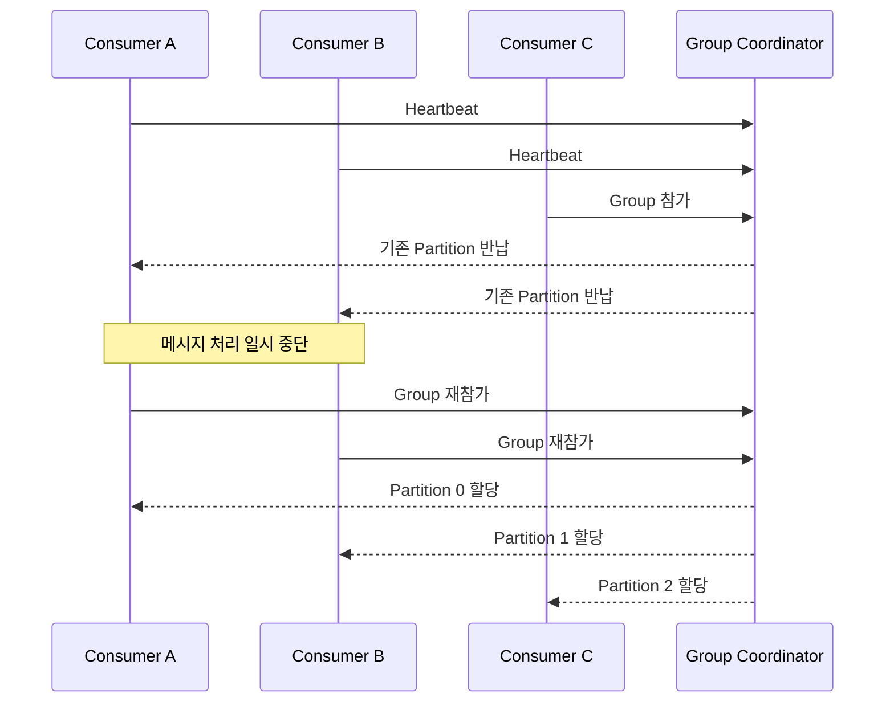

## 🌊 들어가기에 앞서

[지난 글](/35/) 에서는 Producer가 메시지를 보내는 과정에서 유실과 중복을 줄이는 방법을 알아봤습니다. 이제 메시지는 Kafka에 안전하게 들어왔습니다. 그러면 Consumer 쪽도 안심해도 될까요?

주문 이벤트를 처리하는 Consumer가 두 개 있다고 생각해봅시다. 한 Consumer가 결제 완료 이벤트를 처리하던 도중 갑자기 죽었습니다. 그 Consumer가 맡고 있던 Partition을 그대로 방치하면 이후 주문은 아무도 처리하지 못합니다. 반대로 다른 Consumer에게 너무 성급하게 넘기면, 아직 처리 중이던 이벤트가 두 곳에서 실행될 수도 있습니다.

Kafka는 이런 상황에서 Consumer Group의 Partition 담당자를 다시 정합니다. 이 과정을 ==Rebalancing==이라고 합니다.

:::important
이번 글에서 확인할 질문은 두 가지입니다.

- Consumer가 추가되거나 사라지면 Partition은 어떻게 다시 배정될까요?
- Rebalancing 도중에는 왜 처리가 멈추거나 같은 이벤트가 다시 처리될 수 있을까요?
:::

이번에는 Consumer를 직접 추가하고 종료하면서 Rebalancing 로그를 확인하고, 일부러 처리 시간을 늘려 중복이 발생할 수 있는 순간까지 재현해보겠습니다.

## 🪑 담당 좌석을 다시 나누는 Rebalancing

Consumer Group을 식당 직원이라고 생각하면 편합니다. Partition 3개는 주문이 쌓이는 세 개의 창구이고, Consumer 2개는 각 창구의 주문을 처리하는 직원입니다.

```text
Consumer A → Partition 0, 1
Consumer B → Partition 2
```

여기에 Consumer C가 출근하면 한 명에게 두 창구를 맡길 이유가 없습니다. Group은 담당 창구를 다시 나눕니다.

```text
Consumer A → Partition 0
Consumer B → Partition 1
Consumer C → Partition 2
```

반대로 Consumer B가 퇴근하거나 장애로 사라지면 Partition 1을 다른 Consumer가 넘겨받아야 합니다. 이것이 Rebalancing의 역할입니다. 실제 Kafka에서는 Group Coordinator[^1]가 Consumer의 가입과 생존 여부를 관리하고, 선택된 Partition Assignor의 규칙에 따라 할당을 결정합니다.

Rebalancing은 주로 다음 상황에서 발생합니다.

- 같은 Group에 Consumer가 새로 들어오거나 정상 종료한 경우
- Consumer가 Heartbeat를 보내지 못해 장애로 판단된 경우
- Consumer가 너무 오랫동안 ??poll()??을 호출하지 않은 경우
- 구독하는 Topic이나 Partition 수가 바뀐 경우

즉 Rebalancing 자체는 장애가 아닙니다. ==Consumer 수와 Partition 수가 달라졌을 때 처리를 계속하기 위한 정상적인 복구 과정==입니다. 문제는 담당자를 바꾸는 동안 기존 작업을 어디까지 끝냈는지 정리해야 한다는 점입니다.

## 🧭 Partition을 바꾸는 동안 무슨 일이 일어날까?

전통적인 Eager Rebalancing에서는 기존 Consumer가 자신이 맡은 Partition을 모두 반납한 뒤 새 할당을 받습니다. 직원 한 명만 새로 왔는데 전 직원이 일단 창구에서 물러났다가 다시 배치되는 셈입니다.



새 담당자가 정해지기 전에는 같은 Partition을 두 Consumer가 동시에 소유하면 안 됩니다. 그래서 기존 소유권을 회수하고 새 소유권을 나눠주는 짧은 공백이 생깁니다. 흔히 이를 Stop-the-World 방식이라고 표현합니다.

다만 모든 Rebalancing이 Group 전체를 같은 정도로 멈추는 것은 아닙니다. 뒤에서 살펴볼 Cooperative Rebalancing은 실제로 이동해야 하는 Partition만 단계적으로 넘깁니다. ==Rebalancing이라는 사건과 Group 전체의 처리 중단을 같은 뜻으로 생각하면 안 됩니다.==

## 🐳 실습 환경 준비하기

이번 실습은 [지난 글](/35/) 에서 만든 Kafka 4.3.1 Broker 세 대와 Python ++confluent-kafka 2.15.0++ 환경을 이어서 사용합니다. Docker와 Python 3.10 이상이 필요하며, 세 Broker의 외부 포트는 각각 ??19092??, ??29092??, ??39092??입니다.

먼저 Broker가 실행 중인지 확인합니다.

```bash
docker compose -f compose.cluster.yml up -d
docker compose -f compose.cluster.yml ps
```

Consumer가 일을 나누는 모습이 잘 보이도록 ++order-rebalancing++ Topic을 Partition 3개로 생성합니다.

```bash
docker exec kafka-1 /opt/kafka/bin/kafka-topics.sh \
  --create \
  --if-not-exists \
  --topic order-rebalancing \
  --partitions 3 \
  --replication-factor 3 \
  --bootstrap-server kafka-1:9092
```

실습 코드를 별도 디렉터리에 저장하고 의존성을 설치합니다. [Python 개발 환경 글](/32/) 과 마찬가지로 여기서는 ++uv++를 사용하겠습니다.

```bash
mkdir kafka-rebalancing
cd kafka-rebalancing
uv init
uv add confluent-kafka
```

다른 도구를 사용해도 괜찮습니다. 중요한 것은 실행하는 Python 환경에 ++confluent-kafka++가 설치되어 있어야 한다는 점입니다.

## 🐍 할당과 회수를 출력하는 Consumer 만들기

Rebalancing은 메시지 내용만 출력해서는 잘 보이지 않습니다. ++on_assign++과 ++on_revoke++ Callback을 등록해 어떤 Partition을 받았고 반납했는지 함께 출력하겠습니다.

```python title="consumer.py"
import json
import os
import signal
import socket
import time

from confluent_kafka import Consumer, KafkaError, KafkaException


consumer_name = os.getenv("CONSUMER_NAME", socket.gethostname())
process_seconds = float(os.getenv("PROCESS_SECONDS", "1"))
running = True


def format_partitions(partitions):
    return [partition.partition for partition in partitions]


def on_assign(consumer, partitions):
    print(f"[{consumer_name}] 할당: {format_partitions(partitions)}", flush=True)


def on_revoke(consumer, partitions):
    print(f"[{consumer_name}] 반납: {format_partitions(partitions)}", flush=True)


def stop_consumer(signum, frame):
    global running
    running = False


signal.signal(signal.SIGINT, stop_consumer)
signal.signal(signal.SIGTERM, stop_consumer)

consumer = Consumer({
    "bootstrap.servers": "localhost:19092,localhost:29092,localhost:39092",
    "group.id": "order-workers",
    "client.id": consumer_name,
    "auto.offset.reset": "earliest",
    "enable.auto.commit": False,
    "partition.assignment.strategy": "range",
    "session.timeout.ms": 10_000,
    "heartbeat.interval.ms": 3_000,
    "max.poll.interval.ms": 30_000,
})

consumer.subscribe(
    ["order-rebalancing"],
    on_assign=on_assign,
    on_revoke=on_revoke,
)

try:
    while running:
        message = consumer.poll(1.0)

        if message is None:
            continue
        if message.error():
            if message.error().code() == KafkaError._PARTITION_EOF:
                continue
            raise KafkaException(message.error())

        event = json.loads(message.value().decode("utf-8"))
        print(
            f"[{consumer_name}] 처리 시작: "
            f"partition={message.partition()}, offset={message.offset()}, "
            f"order_id={event['order_id']}",
            flush=True,
        )

        time.sleep(process_seconds)
        consumer.commit(message=message, asynchronous=False)
        print(f"[{consumer_name}] 처리 완료", flush=True)
finally:
    consumer.close()
    print(f"[{consumer_name}] 종료", flush=True)
```

자동 Commit은 끄고, 주문 처리가 끝난 다음 해당 메시지의 Offset을 동기식으로 Commit합니다. 처리 전에 Commit하면 Consumer가 죽었을 때 완료하지 못한 주문을 Kafka는 이미 처리한 것으로 기억할 수 있기 때문입니다.

그리고 종료 신호를 받으면 반복문을 빠져나온 뒤 ??close()??를 호출합니다. 정상 종료한 Consumer는 Group을 떠난다는 사실을 Coordinator에 알릴 수 있으므로, Session Timeout이 끝날 때까지 기다리지 않고 다음 Rebalancing을 시작할 수 있습니다.[^2]

## 📦 Partition마다 주문 넣기

각 Partition에 메시지를 다섯 개씩 넣는 Producer도 작성합니다. 여기서는 Rebalancing 자체를 보기 위해 Partition을 직접 지정합니다. 실제 서비스에서는 [메시지 Key 글](/31/) 에서 살펴본 것처럼 주문 ID 같은 Key로 Partition을 정하는 편이 일반적입니다.

```python title="producer.py"
import json

from confluent_kafka import Producer


producer = Producer({
    "bootstrap.servers": "localhost:19092,localhost:29092,localhost:39092",
    "enable.idempotence": True,
})

for partition in range(3):
    for sequence in range(1, 6):
        event = {
            "event_id": f"event-{partition}-{sequence}",
            "order_id": f"order-{partition}-{sequence}",
            "status": "payment-completed",
        }
        producer.produce(
            topic="order-rebalancing",
            partition=partition,
            key=event["order_id"].encode("utf-8"),
            value=json.dumps(event).encode("utf-8"),
        )

producer.flush()
print("Partition마다 주문 5개를 전송했습니다.")
```

Producer를 실행하면 총 15개의 주문 이벤트가 저장됩니다.

```bash
uv run python producer.py

# 실행 결과
Partition마다 주문 5개를 전송했습니다.
```

같은 실습을 다시 시작하고 싶다면 Consumer Group의 Offset을 초기화해야 합니다. Consumer를 모두 종료한 상태에서만 실행합니다.

```bash
docker exec kafka-1 /opt/kafka/bin/kafka-consumer-groups.sh \
  --bootstrap-server kafka-1:9092 \
  --group order-workers \
  --topic order-rebalancing \
  --reset-offsets \
  --to-earliest \
  --execute
```

:::warning
Offset Reset은 운영 중인 Consumer Group에 실행하는 명령이 아닙니다. 실행 대상을 잘못 고르면 이미 처리한 주문을 대량으로 다시 실행할 수 있으므로, Group과 Topic을 확인하고 Consumer를 모두 멈춘 뒤 사용해야 합니다.
:::

## 🔄 Consumer를 추가하며 Rebalancing 확인하기

터미널 두 개를 열고 Consumer A와 B를 차례로 실행해보겠습니다. 메시지가 너무 빨리 끝나지 않도록 주문 하나를 3초 동안 처리합니다.

첫 번째 터미널에서 Consumer A를 실행합니다.

```bash
CONSUMER_NAME=consumer-a PROCESS_SECONDS=3 uv run python consumer.py
```

처음에는 혼자 Group에 들어왔으므로 세 Partition을 모두 받습니다.

```text
[consumer-a] 할당: [0, 1, 2]
[consumer-a] 처리 시작: partition=0, offset=0, order_id=order-0-1
```

이제 두 번째 터미널에서 Consumer B를 실행합니다.

```bash
CONSUMER_NAME=consumer-b PROCESS_SECONDS=3 uv run python consumer.py
```

Consumer 수가 바뀌었으므로 Rebalancing이 시작됩니다. ??range?? Assignor를 명시했기 때문에 기존 Partition을 모두 반납한 뒤 다시 받는 Eager 방식으로 동작합니다.

```text
# Consumer A
[consumer-a] 반납: [0, 1, 2]
[consumer-a] 할당: [0, 1]

# Consumer B
[consumer-b] 할당: [2]
```

결과를 보면 Consumer A는 Partition 0과 1을, Consumer B는 Partition 2를 맡았습니다. 실제 로그의 순서와 할당 결과는 실행 시점이나 Assignor에 따라 달라질 수 있지만, ==같은 Group 안에서는 하나의 Partition을 한 Consumer만 소유한다==는 원칙은 같습니다.

이번에는 Consumer B에서 ??Ctrl+C??를 눌러 정상 종료해봅시다.

```text
# Consumer B
[consumer-b] 반납: [2]
[consumer-b] 종료

# Consumer A
[consumer-a] 반납: [0, 1]
[consumer-a] 할당: [0, 1, 2]
```

Consumer B가 담당하던 Partition 2가 다시 A에게 넘어왔습니다. Rebalancing 덕분에 Consumer 하나가 사라져도 남은 Consumer가 처리를 이어갈 수 있습니다.

## 💥 정상 종료와 갑작스러운 장애는 무엇이 다를까?

방금은 ??close()??를 호출해 정상적으로 Group을 떠났습니다. 하지만 프로세스가 강제 종료되거나 네트워크가 끊기면 떠난다는 인사를 할 수 없습니다. Coordinator는 Heartbeat가 오지 않는 것을 보고 장애를 판단해야 합니다.

세 번째 터미널에서 Consumer B를 다시 실행한 뒤 프로세스 ID를 찾습니다.

```bash
CONSUMER_NAME=consumer-b PROCESS_SECONDS=3 uv run python consumer.py
pgrep -af "python consumer.py"
```

확인한 Consumer B의 PID를 사용해 강제로 종료합니다.

```bash
kill -9 12345
```

??SIGKILL??은 프로그램이 정리 코드를 실행할 기회를 주지 않습니다. 따라서 Consumer A가 Partition을 바로 넘겨받지 않고, 실습에서 설정한 ??session.timeout.ms=10000??이 지난 뒤 Rebalancing하는 모습을 볼 수 있습니다.

```text
# 약 10초 뒤 Consumer A
[consumer-a] 반납: [0, 1]
[consumer-a] 할당: [0, 1, 2]
```

10초는 실습 결과를 빨리 보기 위해 줄인 값입니다. 너무 짧게 설정하면 일시적인 네트워크 지연이나 긴 GC Pause도 Consumer 장애로 오해해 불필요한 Rebalancing이 반복될 수 있습니다. 반대로 너무 길면 실제 장애가 발생했을 때 Partition을 넘겨받는 시간이 늘어납니다.

## ⏱️ Heartbeat와 poll은 서로 다른 생존 신호다

Consumer 장애 설정에서 가장 헷갈리는 부분이 ??heartbeat.interval.ms??, ??session.timeout.ms??, ??max.poll.interval.ms??입니다. 셋 다 시간 값이라 비슷해 보이지만 확인하는 대상이 다릅니다.

| 설정 | 확인하는 질문 | 값을 넘기면 |
|---|---|---|
| ??heartbeat.interval.ms?? | 살아 있다는 신호를 얼마나 자주 보낼까? | 이 값 자체만으로 탈락하지는 않음 |
| ??session.timeout.ms?? | Heartbeat가 얼마나 오래 없으면 죽었다고 볼까? | Group에서 제거하고 Rebalancing |
| ??max.poll.interval.ms?? | 다음 ??poll()??까지 얼마나 오래 기다릴까? | 처리 정지로 보고 Rebalancing |

Heartbeat는 주로 프로세스나 네트워크의 생존 여부를 확인합니다. 하지만 Heartbeat만 잘 보내고 실제 주문은 영원히 처리하지 않는 Consumer도 있을 수 있습니다. 몸은 출근했는데 창구 업무는 하나도 하지 않는 셈이죠. 이를 잡아내는 값이 ??max.poll.interval.ms??입니다.

현재 실습은 Classic Group Protocol[^3]을 사용하므로 Heartbeat와 Session Timeout을 Consumer에서 설정했습니다. Kafka 4.x의 새로운 Consumer Group Protocol을 사용하면 두 간격은 Broker의 ??group.consumer.heartbeat.interval.ms??와 ??group.consumer.session.timeout.ms??가 관리합니다. 사용하는 Client가 어느 Protocol을 지원하고 선택했는지 확인하지 않은 채 양쪽 설정을 섞으면 기대한 값이 적용되지 않을 수 있습니다.

## 🐢 처리가 너무 오래 걸리면 중복이 생길 수 있다

이번에는 Consumer가 죽지는 않았지만 주문 처리에 너무 오래 걸리는 상황을 만들어보겠습니다. ++consumer.py++의 세 설정을 아래와 같이 바꾸고, 처리 시간은 10초로 실행합니다.

```python
"session.timeout.ms": 5_000,
"heartbeat.interval.ms": 1_500,
"max.poll.interval.ms": 6_000,
```

++confluent-kafka++의 기반인 ++librdkafka++는 ??max.poll.interval.ms??가 ??session.timeout.ms??보다 크거나 같아야 한다는 제약을 둡니다. 기존 값인 ??session.timeout.ms=10000??을 그대로 두고 ??max.poll.interval.ms??만 6초로 낮추면 Consumer가 만들어지기도 전에 설정 오류가 발생합니다.

따라서 Session Timeout은 5초로 함께 낮췄습니다. Heartbeat도 Session Timeout의 3분의 1 이하에서 보내도록 1.5초로 조정했습니다. 이 값들은 짧은 시간 안에 실패를 확인하기 위한 실습용 설정이며, 운영 환경에 그대로 적용할 값은 아닙니다.

Consumer A를 먼저 실행하고, 이어서 Consumer B도 실행합니다.

```bash
CONSUMER_NAME=consumer-a PROCESS_SECONDS=10 uv run python consumer.py
CONSUMER_NAME=consumer-b PROCESS_SECONDS=1 uv run python consumer.py
```

Consumer A는 메시지를 가져온 뒤 10초 동안 처리하므로 6초 안에 다음 ??poll()??을 호출하지 못합니다. Client는 A가 정상적으로 처리 루프를 돌지 못한다고 판단하고 Group에서 빠지며, 해당 Partition은 B에게 넘어갑니다.[^4]

문제는 A가 Offset을 Commit하기 전에 소유권을 잃었다는 점입니다.

```text
Consumer A: offset=7 처리 시작
        ↓ 6초 동안 poll() 호출 없음
Partition 소유권이 Consumer B로 이동
        ↓
Consumer B: commit되지 않은 offset=7 처리 시작
        ↓
Consumer A: 처리 완료 후 commit 실패
```

이때 A가 결제 승인이나 재고 차감 같은 외부 작업을 이미 끝냈다면, B가 같은 이벤트를 다시 처리할 수 있습니다. ==Rebalancing이 메시지를 복사한 것은 아니지만, Commit되지 않은 Offset부터 새 Consumer가 읽기 때문에 결과적으로 중복 처리가 발생==합니다.

:::warning
??max.poll.interval.ms??를 무조건 크게 늘리는 것으로 끝내면 안 됩니다. 값이 너무 크면 실제로 멈춘 Consumer가 Partition을 오래 붙잡습니다. 처리 시간이 긴 작업은 한 번에 가져오는 양을 줄이거나, 작업을 별도 Worker에 넘기면서 Consumer의 Pause·Resume과 Offset Commit을 직접 관리하는 구조를 검토해야 합니다.
:::

그리고 Consumer 로직은 같은 ??event_id??가 다시 들어와도 결제나 재고 차감이 한 번만 반영되도록 만들어야 합니다. 지난 글에서 다룬 Idempotent Producer는 이 중복을 막아주지 못합니다. Producer의 재전송 중복과 Consumer의 재처리 중복은 서로 다른 문제입니다.

## 🤝 Cooperative Rebalancing은 무엇이 다를까?

Eager Rebalancing의 아쉬운 점은 Partition 하나만 옮기면 되더라도 모든 Consumer가 소유권을 반납한다는 것입니다. Cooperative Rebalancing은 먼저 새 할당을 계산하고, ==실제로 이동해야 하는 Partition만 단계적으로 회수==합니다. 담당이 유지되는 Partition은 계속 처리할 수 있으므로 Group 전체의 중단을 줄일 수 있습니다.

| 방식 | Partition 반납 범위 | 처리 영향 | 특징 |
|---|---|---|---|
| Eager | 기존 할당 전체 | Group 전체가 멈출 수 있음 | 단순하지만 Consumer 증감의 영향이 큼 |
| Cooperative | 이동해야 하는 Partition | 일부 Partition만 잠시 영향 | 중단은 줄지만 단계적 재할당이 필요 |
| Static Membership | 재시작한 Instance의 소유권 유지 시도 | 짧은 재시작의 Rebalancing 감소 | Instance ID를 안정적으로 관리해야 함 |

++confluent-kafka++에서는 다음과 같이 Cooperative Sticky Assignor를 선택할 수 있습니다.

```python
consumer = Consumer({
    "bootstrap.servers": "localhost:19092,localhost:29092,localhost:39092",
    "group.id": "order-workers-cooperative",
    "partition.assignment.strategy": "cooperative-sticky",
})
```

다만 운영 중인 Group의 모든 Consumer가 Eager Assignor만 사용하는 상태에서 한 번에 설정을 바꾸면 안 됩니다. Group 구성원들이 공통으로 지원하는 Assignor가 있어야 하므로, 호환되는 Assignor 목록을 먼저 배포한 뒤 Cooperative 방식으로 전환하는 단계적 Rolling 배포[^5]가 필요합니다.

Static Membership은 ??group.instance.id??에 Consumer Instance의 고정 ID를 지정하는 방식입니다. 짧은 재시작 뒤 같은 Instance가 돌아오면 불필요한 Partition 이동을 줄일 수 있습니다.

```python
consumer = Consumer({
    "group.id": "order-workers",
    "group.instance.id": "order-worker-0",
})
```

Kubernetes라면 매번 이름이 바뀌는 일반 Pod보다 StatefulSet처럼 안정적인 Identity를 제공하는 실행 환경과 잘 맞습니다. 하지만 두 Consumer에 같은 ID를 넣으면 서로 같은 Instance라고 주장하게 됩니다. ==Static Membership은 고유하고 재사용 가능한 ID를 보장할 수 있을 때만 사용해야 합니다.==

## 📊 운영에서는 무엇을 관찰해야 할까?

Rebalancing 횟수만 줄였다고 Consumer가 건강한 것은 아닙니다. Partition을 오래 붙잡은 채 처리하지 못하면 Rebalancing은 없지만 주문은 계속 밀릴 수 있습니다. 반대로 배포 때 한 번 발생한 정상 Rebalancing을 장애처럼 취급할 필요도 없습니다.

운영에서는 다음 신호를 함께 보는 편이 좋습니다.

- Rebalancing 발생 횟수와 지속 시간
- Group별, Partition별 Consumer LAG
- 한 메시지와 한 Batch의 최대 처리 시간
- Offset Commit 실패 횟수
- Consumer 재시작과 네트워크 오류 기록
- 중복 이벤트를 멱등 처리한 횟수

현재 할당과 LAG은 다음 명령으로 확인할 수 있습니다.

```bash
docker exec kafka-1 /opt/kafka/bin/kafka-consumer-groups.sh \
  --bootstrap-server kafka-1:9092 \
  --group order-workers \
  --describe
```

```text
GROUP          TOPIC              PARTITION  CURRENT-OFFSET  LOG-END-OFFSET  LAG
order-workers  order-rebalancing  0          5               5               0
order-workers  order-rebalancing  1          3               5               2
order-workers  order-rebalancing  2          5               5               0
```

Partition 1의 LAG이 2라면 최신 Offset보다 두 메시지 뒤에 있다는 뜻입니다. 특정 Partition의 LAG만 계속 쌓인다면 Consumer 수보다 메시지 Key의 쏠림이나 느린 주문 처리부터 살펴봐야 합니다.

## 🎯 실제 서비스에서는 어떻게 정해야 할까?

설정값부터 고르기 전에 먼저 ==주문 하나를 처리하는 데 최악의 경우 얼마나 걸리는가==를 측정해야 합니다. 평균이 100ms여도 외부 결제 API Timeout 때문에 가끔 20초가 걸린다면 평균만 보고 ??max.poll.interval.ms??를 정할 수 없습니다.

일반적인 Consumer라면 다음 순서로 접근할 수 있습니다.

1. 한 번의 ??poll()?? 이후 처리할 최대 작업량과 최악의 처리 시간을 측정합니다.
2. ??max.poll.interval.ms??가 그 시간을 감당하도록 두되, 멈춘 Consumer의 복구 목표 시간도 함께 봅니다.
3. 네트워크 지연과 GC Pause를 고려해 Heartbeat와 Session Timeout의 간격을 정합니다.
4. Rolling 배포가 잦고 Partition이 많다면 Cooperative Rebalancing을 검토합니다.
5. 모든 Consumer 작업은 재처리를 전제로 멱등하게 설계합니다.

Consumer가 한두 개뿐이고 배포도 드문 작은 서비스라면 Static Membership과 복잡한 Offset 제어까지 바로 도입할 필요는 없습니다. 기본 Group 관리로 시작하고 실제 Rebalancing 시간과 LAG을 측정한 뒤 문제가 확인될 때 조정해도 됩니다. 설정이 많아질수록 장애 상황에서 소유권과 Commit 시점을 추적하는 운영 비용도 커지기 때문입니다.

## 😮‍💨 마무리

처음에는 Rebalancing이 Consumer가 죽었을 때만 발생하는 장애 복구 과정이라고 생각하기 쉽습니다. 하지만 Consumer를 추가하거나 배포하고, Topic의 Partition 수가 달라지는 정상적인 운영 과정에서도 Rebalancing은 발생합니다.

- Rebalancing은 Consumer Group의 Partition 담당자를 다시 정하는 과정입니다.
- 정상 종료는 즉시 Group을 떠날 수 있지만, 갑작스러운 장애는 Session Timeout을 기다려야 합니다.
- Heartbeat는 생존을, ??poll()??은 실제 처리 루프의 진행을 확인합니다.
- Commit 전에 Partition을 잃으면 새 Consumer가 같은 메시지를 다시 처리할 수 있습니다.
- Cooperative Rebalancing과 Static Membership은 불필요한 Partition 이동을 줄이지만 멱등성을 대신하지 않습니다.

결국 Rebalancing 설정의 기준은 ==얼마나 빨리 장애를 감지할 것인가와 정상적인 느린 처리를 얼마나 기다려줄 것인가 사이의 균형==입니다. Timeout을 짧게 만드는 것보다 실제 처리 시간을 측정하고, 어떤 Consumer가 이어받아도 안전하도록 만드는 편이 먼저입니다.

다음 글에서는 Consumer가 정상적으로 살아 있는데도 메시지가 계속 밀리는 상황을 만들어보고, Consumer LAG이 왜 쌓이는지와 어디서 병목을 찾아야 하는지 알아보겠습니다.

[^1]: Group Coordinator는 Consumer Group의 구성원과 Offset을 관리하는 Broker입니다. Kafka Cluster 안의 Broker 중 하나가 Group마다 이 역할을 맡습니다.
[^2]: 이처럼 프로그램이 작업을 정리하고 연결을 닫은 뒤 종료되는 방식을 Graceful Shutdown이라고 합니다. 반대로 ??kill -9??처럼 정리할 기회 없이 종료되는 방식은 Abrupt Shutdown에 가깝습니다.
[^3]: Group Protocol은 Consumer가 Group에 참가하고 Partition을 배정받는 절차를 정의합니다. Classic Protocol에서는 Client의 역할이 컸지만, 새로운 Consumer Protocol은 할당과 Heartbeat 설정의 더 많은 부분을 Broker가 담당합니다.
[^4]: 프로세스는 살아 있고 Heartbeat도 보내지만 실제 작업은 진행하지 못하는 상태를 Livelock이라고 합니다. ??max.poll.interval.ms??는 이런 Consumer가 Partition을 계속 점유하지 못하도록 제한합니다.
[^5]: Rolling 배포는 모든 Instance를 한꺼번에 중단하지 않고 하나씩 교체하는 배포 방식입니다. 서비스 가용성을 유지할 수 있지만, 교체 과정에서 구버전과 신버전이 함께 동작할 수 있어 호환성이 필요합니다.
