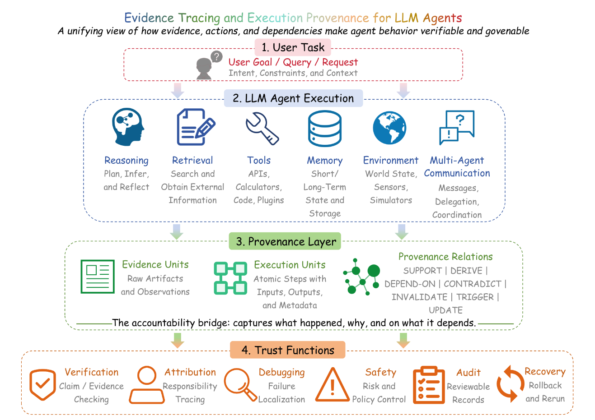
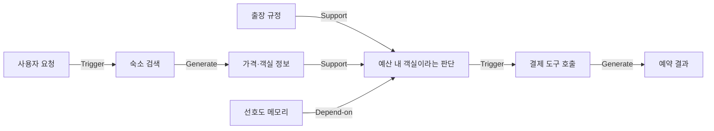
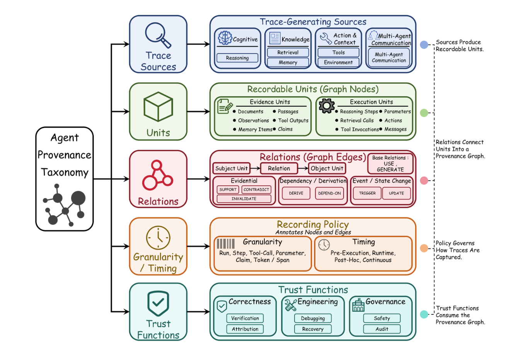
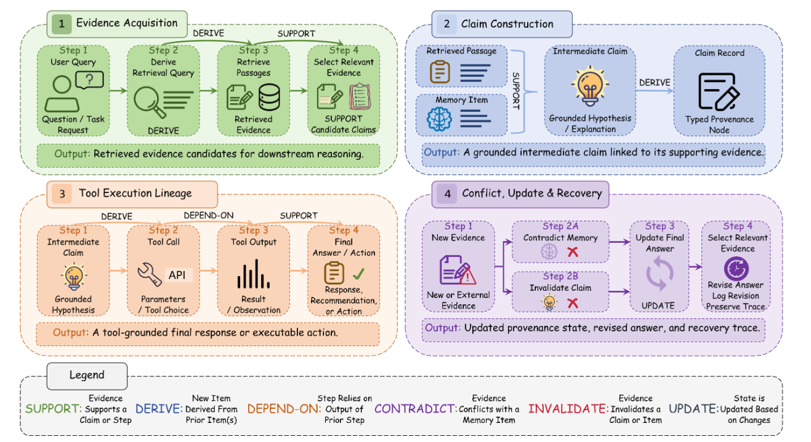
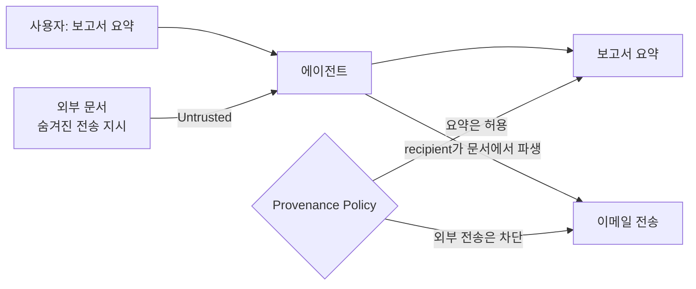
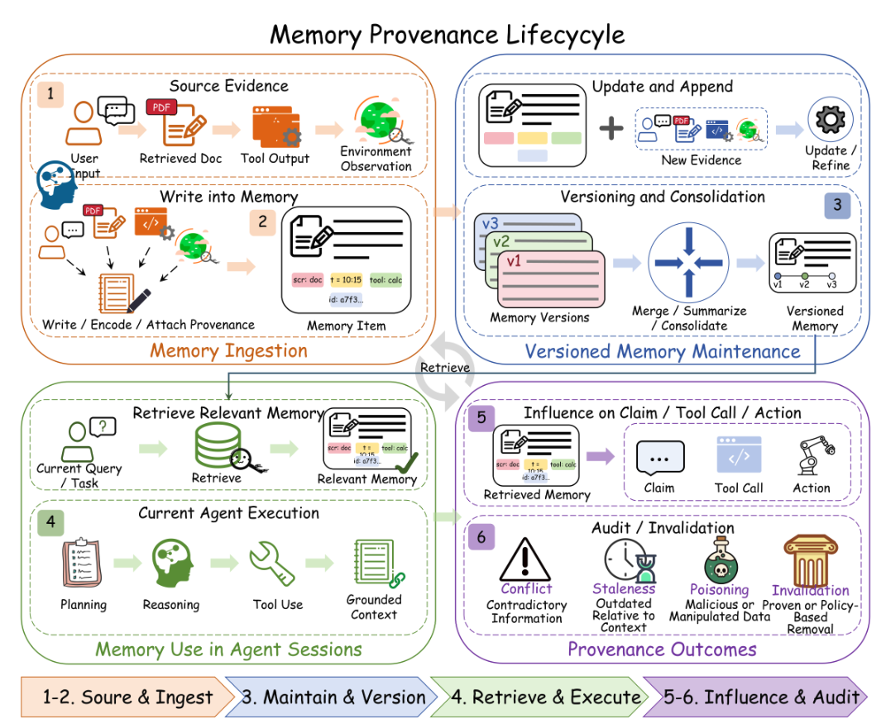
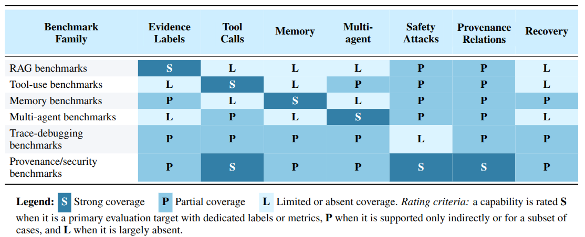

## 🧾 정답은 맞았는데, 이유가 없다면???

이번 논문을 처음 봤을 때는 제목에 있는 Trace와 Provenance가 그냥 Log를 멋있게 부르는 말인 줄 알았습니다. 그냥 에이전트가 무슨 도구를 호출했는지 잘 기록하기만 하면 되는거 아닌가? 싶었던 거죠.

그런데 논문을 읽다 보니 이 둘은 꽤 다른 친구였습니다... 이 차이를 보기 위해 호텔 예약 에이전트에게 “다음 주 부산 출장에 맞는 방을 예약해줘”라고 부탁했다고 가정해봅시다. 에이전트는 검색 사이트를 조회하고, 회사 출장 규정을 읽고, 예전에 저장한 선호도를 불러온 뒤 결제 도구를 호출합니다. 최종 결과는 꽤 그럴듯합니다.

그런데 ==결제 금액이 출장 규정을 넘겼습니다.== 이제 무엇을 확인해야 할까요?

- 검색 결과가 오래된 가격이었을까요?
- 메모리에 저장된 “바다 전망 객실 선호”가 예산보다 높은 우선순위로 적용되었을까요?
- 외부 페이지의 문장이 예약 지시로 잘못 해석되었을까요?
- 다른 에이전트가 전달한 추천에 오류가 있었을까요?
- 결제 도구에 넘긴 통화나 인원 수가 틀렸을까요?

예.. 확인할 게 정말 많습니다. 그런데 최종 답변과 일반적인 애플리케이션 로그만으로는 이 질문에 답하기 어렵습니다. 답변이 맞더라도 어떤 근거와 행동을 거쳐 만들어졌는지 알 수 없고, 반대로 답변이 틀렸을 때 어느 단계부터 다시 실행해야 하는지도 알 수 없습니다.

++From Agent Traces to Trust++ 논문에서는 이 문제를 ==결과의 정확도에서 과정의 책임성으로 시선을 옮겨야 하는 문제==로 정리합니다.[^1] 따라서 이 논문은 에이전트의 검색, 도구 호출, 메모리, 관찰, 중간 주장, 다른 에이전트와의 메시지를 하나의 연결된 구조로 다루자고 제안합니당.

:::important
에이전트를 믿기 위해 필요한 것은 “무슨 답을 냈는가?”만이 아닙니다. “어떤 근거가 어떤 판단과 행동에 영향을 주었는가?”까지 재구성할 수 있어야 합니다.
:::

그래서 이번 글에서는 제가 처음에 헷갈렸던 증거 추적(Evidence Tracing)과 실행 출처(Execution Provenance)를 쉬운 예시로 구분해보겠습니다. 그리고 이 개념이 왜 단순한 로그 수집이 아니고, 도구 보안과 장기 메모리, 장애 복구까지 연결되는지 알아봅시다.

## 🧭 Trace와 Provenance는 무엇이 다를까?

먼저 비슷해 보이는 용어부터 나눠볼까요?

에이전트 ==Trace는 실행 중 생성되거나 소비된 기록==입니다. 사용자의 요청, 검색 질의, 가져온 문서, 도구 이름과 인자, 도구 결과, 메모리 읽기·쓰기, 다른 에이전트의 메시지 등이 여기에 포함됩니다. 시간순으로 쌓인 CCTV 영상에 가깝습니다.

반면 ==Provenance는 그 기록 사이의 타입이 있는 관계==까지 표현합니다. 단순히 “웹페이지를 읽은 뒤 이메일을 보냈다”가 아니라, “웹페이지에서 얻은 주소가 이메일 도구의 수신자 인자로 전달되었다”를 나타냅니다.

저는 이 차이를 CCTV와 사건 관계도로 이해했습니다. Trace가 시간순으로 찍힌 CCTV 영상이라면 Provenance는 영상을 본 뒤 “이 사람이 건넨 열쇠로 저 문을 열었다”라고 관계를 연결한 사건 관계도입니다. 영상이 있다고 사건의 원인을 바로 알 수 있는 것은 아니잖아요??? 에이전트 로그도 똑같습니다.

| 구분 | 답하려는 질문 | 예시 |
| --- | --- | --- |
| Trace | 언제 무엇이 일어났는가? | 10시 03분에 검색하고 10시 04분에 결제 도구를 호출했다 |
| Execution Provenance | 무엇이 무엇에 영향을 주었는가? | 검색된 가격과 저장된 선호도가 객실 선택과 결제 인자를 만들었다 |
| Evidence Tracing | 어떤 근거가 주장·판단을 뒷받침하는가? | 출장 규정 3조가 “1박 15만 원 이하”라는 판단을 지지한다 |

논문에서는 실행 출처를 에이전트 실행 전체의 타입 그래프로 정의합니다. 증거 추적은 이 큰 그래프에서 증거와 주장의 지지 관계만 꺼내 본 투영(Projection)이고요.[^1]

조금 어렵게 들리죠? 실행 출처가 사건 전체의 관계도라면, 증거 추적은 그중 “이 주장을 뒷받침한 자료가 무엇인가?”에 형광펜을 칠해서 보는 것입니다. 따라서 증거 추적은 별도의 로그 시스템이 아니라 더 큰 실행 그래프를 바라보는 하나의 관점입니다.

### 1. 실제 논문 아키텍처



### 2. 예시 Flow


그림을 보면 선마다 이름이 붙어있죠? 이게 정말 중요합니다. 문서가 단순히 검색되었다는 사실과, 그 문서가 실제 주장에 근거로 사용되었다는 사실은 다릅니다. 출처를 달았다고 끝이 아닙니다. 그 출처가 해당 문장을 실제로 지지하지 않을 수도 있고, 새 도구 결과가 기존 메모리와 모순될 수도 있으니깐요!!!

## 🧩 무엇을 어떻게 기록할 것인가?

그렇다면 정확히 무엇을 기록해야할까요? 사용자의 요청부터 모델의 모든 출력까지 전부 저장하면 되는 걸까요?

흠... 무작정 많이 저장한다고 좋은 Provenance가 되는 것은 아닙니다. 관계 없이 로그만 잔뜩 쌓이면 결국 사람이 다시 처음부터 읽어야하니깐요.

논문은 서로 다른 시스템을 비교하기 위해 여섯 가지 분류 축을 제시합니다. 처음 표를 봤을 때는 항목이 많아서 복잡해 보였는데, 하나씩 보면 결국 “어디서, 무엇이, 어떻게 연결되었고, 이걸 어디에 쓸 것인가?”입니다. 특정 제품의 스키마라기보다 우리가 만든 에이전트가 무엇을 놓치고 있는지 확인하는 체크리스트에 가깝습니다.



| 분류 축 | 핵심 질문 | 대표 항목 |
| --- | --- | --- |
| Trace Source | 기록은 어디서 생기는가? | 추론, 검색, 도구, MCP 경계, 메모리, 환경, 다중 에이전트 통신 |
| Unit | 무엇을 하나의 단위로 보는가? | 문서, 주장, 도구 결과, 호출 인자, 메모리 항목, 행동 |
| Relation | 단위들은 어떻게 연결되는가? | Support, Derive, Depend-on, Contradict, Invalidate, Trigger, Update |
| Granularity & Timing | 얼마나 자세히, 언제 기록하는가? | 실행·단계·인자·주장 수준과 사전·런타임·사후 추적 |
| Representation | 어떤 형태로 저장하는가? | 구조화 로그, 실행 그래프, 증거 그래프, 런타임 상태 |
| Trust Function | 기록을 어디에 사용하는가? | 검증, 귀속, 디버깅, 차단, 감사, 장애 복구 |

저는 여기서 Unit 부분이 처음에는 조금 헷갈렸습니다. 논문에서는 ==Unit을 증거 단위와 실행 단위==로 나눕니다. 문서, 관찰, 도구 출력, 메모리, 주장은 의미를 담은 증거 단위입니다. 반면 검색 호출, 도구 실행, 메모리 갱신, 환경 변경은 에이전트가 무엇을 했는지 보여주는 실행 단위입니다.

경계가 늘 정확하게 나눠지는 것은 아닙니다. 결제 API의 응답은 도구 실행의 결과이면서, 동시에 “예약이 완료되었다”라는 주장을 지지하는 증거입니다. 그래서 둘 중 하나만 기록해서는 충분하지 않습니다.

관계도 단순 연결이 아닙니다.

- Support: 출장 규정이 예산 판단을 지지합니다.
- Derive: 원문 여러 개에서 요약 메모리를 만듭니다.
- Depend-on: 결제 인자가 검색 결과에 의존합니다.
- Contradict: 최신 가격이 오래된 메모리와 모순됩니다.
- Invalidate: 정책 변경으로 이전 승인 판단이 무효가 됩니다.
- Trigger: 결제 실패가 재계획을 시작시킵니다.
- Update: 사용자의 새 선호도가 기존 메모리를 갱신합니다.

여기서 궁금한 점은 이런 겁니다. 기존에도 데이터 출처를 표현하는 표준이 있었는데, 왜 LLM 에이전트를 위한 개념이 또 필요할까요?

W3C PROV-DM도 Entity, Activity, Agent와 사용·생성·파생 같은 관계를 정의합니다.[^2] 하지만 이 표준만으로는 “이 문서가 이 주장을 지지하는가?” 또는 “도구 결과가 메모리와 모순되는가?” 같은 의미적 관계를 직접 표현하기 어렵습니다. 논문은 기존 Provenance 개념을 버리자는 것이 아닙니다. 그 위에 LLM 에이전트에 필요한 Support와 Contradict 같은 관계를 더하자는 이야기입니다.

## 🔗 로그를 그래프로 바꾸면 무엇이 달라질까?

그냥 JSON 로그를 잘 남기면 안 될까요?(이건 진짜 ㅇㅈ이요..) 물론 구조화 로그도 실행 재현에는 유용합니다. 문제는 대부분의 관계가 사람의 머릿속에만 남는다는 점입니다.

```text
10:03 retrieve hotel-policy.pdf
10:04 read memory preferred_room=sea_view
10:05 call payment(amount=220000, currency=KRW)
```

결과를 보면 사건의 순서는 알 수 있습니다. 하지만 결제 금액이 검색 결과에서 왔는지, 메모리에서 왔는지, 아니면 모델이 갑자기 만들어낸 값인지 알 수 없습니다. 검색된 규정이 결제 판단에 사용되었는지도 불분명하죠.

그래프에서는 각 인자의 계보(Lineage)를 연결할 수 있습니다. 예를 들어 결제 금액이 신뢰할 수 없는 웹페이지에서 파생되었고, 예산 검증 단계를 거치지 않은 채 결제 도구에 도달했다면 그 경로만 차단할 수 있습니다.

==여기서 중요한 것은 데이터에 위험한 문장이 포함되었는지만이 아니라, 신뢰할 수 없는 값이 권한 있는 행동에 영향을 주었는지입니다.== 같은 웹페이지도 요약의 자료로 쓰는 것은 허용할 수 있지만, 그 안에 적힌 계좌번호를 송금 인자로 쓰는 것은 차단해야 합니다.




이 관점은 간접 프롬프트 주입도 정보 흐름 문제로 바꿔 보여줍니다.



평면 로그는 문서를 읽고 이메일 도구를 호출했다는 사실만 보여줍니다. 하지만 우리가 정말 알고 싶은 것은 ==“왜 하필 저 주소로 이메일을 보냈는가?”==입니다. 출처 그래프는 수신자 인자가 사용자의 요청이 아니라 신뢰할 수 없는 문서에서 파생되었다는 관계를 보여줍니다. 이때 Gateway는 모델이 만든 설명을 믿고 허용하는 대신, ??Untrusted → External Write?? 흐름을 정책으로 차단할 수 있습니다.

:::warning
그래프를 저장하는 것만으로 안전해지지는 않습니다. 출처 라벨이 잘못 붙거나 중간 변환에서 관계가 끊기면 그럴듯하지만 틀린 감사 기록이 만들어집니다. 수집과 표현, 검증, 집행을 별도 문제로 다뤄야 합니다.
:::

## 🧠 메모리는 저장소가 아니라 오래 남는 증거다

논문에서 개인적으로 가장 인상 깊었던 부분은 메모리였습니다. 도구 호출은 바깥세상을 바꾸지만, 메모리는 이후의 에이전트 자체를 바꿉니다. ==오늘 저장된 한 문장이 다음 달의 답변, 도구 인자, 사용자 개인화에 다시 사용될 수 있습니다.==

예를 들어 에이전트가 “이 사용자는 가격보다 바다 전망을 선호한다”라고 메모리에 저장했다고 해보겠습니다. 이 내용은 사용자가 직접 말한 것일 수도 있고, ==한 번의 예약을 모델이 과하게 일반화한 결과==일 수도 있습니다. 외부 문서에서 섞여 들어왔을 가능성도 있습니다.

그런데 메모리에 텍스트만 덜렁 남기면 어떻게 될까요? 다음 실행에서는 사용자가 직접 말한 내용과 모델이 추측한 내용이 모두 같은 사실처럼 보입니다. 따라서 논문은 메모리 항목에 다음 정보를 함께 연결해야 한다고 봅니다.





- 어디에서 만들어졌는가?
- 원문이 그대로 저장되었는가, 요약·통합되었는가?
- 언제 생성되고 마지막으로 확인되었는가?
- 최신 증거와 충돌하거나 이미 무효가 되었는가?
- 어느 답변과 도구 호출에 영향을 주었는가?
- 다른 사용자나 세션에 노출되면 안 되는 정보인가?

여기서 또 문제가 생깁니다. 메모리를 계속 원문으로 저장하면 너무 커지니깐 보통 압축하고 통합합니다. 하지만 이 과정은 저장 비용을 줄이는 대신 계보를 끊을 수 있습니다. 세 개의 관찰을 한 문장으로 요약했는데 원본 연결을 버리면, 일부 관찰이 틀렸을 때 요약 전체를 폐기해야 하는지 판단할 수 없습니다.

흠... 결국 메모리를 잘 기억하게 만드는 것과, 그 기억을 나중에 검증할 수 있게 만드는 것은 서로 다른 문제였습니다.

!!출처와 유효기간이 없는 장기 메모리는 편리한 캐시가 아니라, 나중에 조용히 행동을 바꾸는 오염된 증거가 될 수 있습니다.!!

논문이 검토한 대표 시스템도 메모리 읽기·쓰기와 개인화에는 강하지만, 충돌 처리, 오래된 정보 탐지, 오염 추적, 증거 기반 검증은 아직 제한적인 경우가 많았습니다.[^1] 메모리 시스템의 품질을 Recall만으로 평가해서는 부족한 이유입니다.

## ⏱️ 모든 것을 가장 자세히 기록해야 할까?

자, 그러면 안전하게 토큰 하나부터 모든 도구 인자까지 전부 저장하면 되지 않을까요? 예.. 현실에서는 그렇지 않습니다.

세밀한 추적은 주장 검증과 오류 위치 찾기, 정책 집행에 유리하지만 저장 비용과 지연이 늘어납니다. 프롬프트, 검색 문서, 메모리에는 개인정보와 자격증명도 포함될 수 있어 감사 로그 자체가 새로운 정보 유출 지점이 됩니다. 내부 추론 원문을 모두 보관한다고 해서 그것이 행동의 충실한 인과 설명이라는 보장도 없습니다.

논문은 필요한 신뢰 기능에 따라 세분성을 선택해야 한다고 설명합니다.[^1]

| 업무 위험 | 권장 추적 수준 | 주된 목적 |
| --- | --- | --- |
| 공개 문서 Q&A | 주장 수준, 사후 검사 | 인용과 근거의 일치 확인 |
| 사내 데이터 조회 | 도구 호출·인자 수준, 런타임 검사 | 권한과 민감정보 흐름 통제 |
| 결제·삭제·권한 변경 | 인자·정책·외부 상태 수준, 실행 전 검사 | 부작용 차단과 승인 |
| 장기 개인 비서 | 메모리 계보와 변경 이력, 지속 추적 | 오래된 정보와 오염의 전파 방지 |
| 다중 에이전트 업무 | 메시지·위임·책임 관계 수준 | 오류를 만든 에이전트와 단계 식별 |

OpenTelemetry의 Trace와 Span은 여러 단계의 실행을 연결하는 좋은 출발점입니다.[^3] 저도 처음에는 Span에 전부 기록하면 Provenance가 완성되는 줄 알았습니다. 하지만 Span이 존재한다고 Support나 Contradict 관계까지 자동으로 생기지는 않습니다. 관측 가능성(Observability)이 “어디서 실패했는가?”를 보여준다면, 의미적 Provenance는 ==“어떤 근거가 그 판단을 만들었는가?”==까지 답해야 합니다.

:::tip
처음부터 거대한 그래프 저장소를 만드는 대신, 위험한 Sink부터 역으로 설계할 수 있습니다. 결제, 삭제, 외부 전송처럼 되돌리기 어려운 행동의 인자에 출처 ID와 신뢰 라벨을 붙이고, 이후 메모리와 주장으로 범위를 넓히는 방식입니다.
:::

## 🛠️ 감사에서 복구까지 이어져야 한다

그런데 이렇게 열심히 관계를 기록해서 나중에 로그만 잘 보면 끝일까요? 저는 이 부분에서 Provenance가 단순한 Observability와 가장 크게 달라진다고 생각합니다. 어떤 근거가 실패를 만들었는지 알았다면 ==시스템은 그 영향을 끊고 복구할 수 있어야합니다.==

호텔 가격 API가 잘못된 값을 반환한 상황을 다시 보겠습니다. 출처 그래프가 있다면 다음과 같은 순서로 대응할 수 있습니다.

1. 잘못된 도구 결과를 오염된 증거로 표시합니다.
2. 그 결과에서 파생된 가격 비교와 추천을 무효화합니다.
3. 해당 추천으로 갱신된 장기 메모리를 격리합니다.
4. 영향을 받은 결제 시도가 실행 전이라면 중단합니다.
5. 다른 가격 소스로 재조회하고, 실패 지점부터 다시 계산합니다.
6. 이미 결제가 끝났다면 취소나 환불 같은 보상 작업을 시작합니다.

여기서 단순 Rollback과 보상(Compensation)은 다릅니다. 내부 메모리와 계획은 이전 상태로 돌릴 수 있지만, 이미 전송한 이메일이나 완료된 송금은 Trace를 되감는다고 사라지지 않습니다. 외부 상태 변경에는 취소 API, 반대 거래, 사람의 승인처럼 별도의 복구 경로가 필요합니다.

논문이 현재 평가 체계의 빈틈으로 지적하는 부분도 여기입니다. 기존 벤치마크는 답변 정확도, 공격 성공률, 도구 선택, 작업 성공 여부처럼 각 구성 요소를 잘 평가합니다. 그런데 실제 에이전트는 그렇게 예쁘게 한 부분에서만 실패하지 않습니다. 검색된 증거가 주장을 만들고, 그 주장이 도구 인자를 만들고, 도구 결과가 메모리를 갱신한 뒤, 다음 행동까지 바꿉니다. 이 전체 연결을 함께 평가하는 경우는 드뭅니다.[^1]





실행 출처의 완전성, 관계의 정확도, 의존성 포괄 범위, 시간적 일관성과 같은 지표도 아직 합의된 정의와 널리 채택된 데이터셋이 부족합니다. 이 논문은 새로운 벤치마크 결과를 보고하는 실험 논문이 아니라, 흩어진 연구와 평가 공백을 분류한 서베이라는 점도 구분해서 읽어야 합니다.

## 🏗️ 실제 에이전트에 적용한다면

그래서 제가 실제 Gateway에 이 논문의 내용을 적용한다면 어디서부터 시작할까요? 처음부터 거대한 그래프 데이터베이스를 만들지는 않을 것 같습니다. 논문의 분류 체계를 구현 체크리스트로 바꾸면 다음 순서가 됩니다.

흠... 모든 관계를 처음부터 완벽하게 표현하려고 하면 정작 중요한 도구 차단 기능은 만들지 못한 채 스키마만 계속 고치게 될 것 같거든요.

### 1. 실행마다 바뀌지 않는 식별자를 만든다

사용자 요청부터 검색, 메모리, 도구 호출, 외부 상태 변경까지 하나의 실행 ID로 연결합니다. 여러 에이전트가 참여한다면 부모 실행과 위임 관계도 함께 남깁니다.

### 2. 결과뿐 아니라 인자의 출처를 기록한다

도구 이름만 남기지 말고 각 인자가 사용자 입력, 검색 문서, 메모리, 다른 도구 결과 중 어디에서 파생되었는지 연결합니다. 민감한 원문은 암호화하거나 해시·참조 ID로 분리하되 계보는 유지합니다.

### 3. 신뢰 경계를 데이터와 함께 전파한다

사용자 의도, 시스템 정책, 검증된 내부 데이터, 외부 웹 콘텐츠를 같은 문자열로 취급하지 않습니다. 요약과 변환을 거쳐도 출처와 신뢰 라벨이 사라지지 않도록 합니다.

### 4. 위험한 행동 직전에 정책을 검사한다

사후 로그만으로는 결제와 삭제를 막을 수 없습니다. 도구 실행 Proxy에서 출처, 권한, 사용자 목표, 인자 제약, 승인 여부를 검사합니다. 모델은 행동을 제안할 수 있지만 집행 여부는 독립된 정책 계층이 결정합니다.

### 5. 메모리에 생성 시점과 무효화 경로를 둔다

메모리 항목에는 출처, 생성 시각, 유효 범위, 갱신 이력, 충돌 상태를 연결합니다. 원본 증거가 무효화되면 파생 메모리를 찾고 재검증할 수 있어야 합니다.

### 6. 실패 시 복구할 수 있는 관계를 남긴다

어떤 노드부터 재시도할지, 어떤 외부 작업에 보상 동작이 필요한지, 사람의 승인을 어디서 요청할지를 미리 정의합니다. 감사 가능성과 복구 가능성은 같은 그래프를 사용하지만 서로 다른 기능입니다.

## 😮‍💨 마무리

처음에 저는 Provenance를 “로그에 출처 필드를 하나 더 넣는 것” 정도로 생각했습니다. 하지만 에이전트가 검색하고, 기억하고, 도구로 외부 상태를 바꾸기 시작하면 문제의 크기가 완전히 달라집니다.

==신뢰할 수 있는 에이전트는 정답을 내는 시스템이 아니라, 근거와 행동의 연결을 검증하고 잘못된 영향만 찾아 끊을 수 있는 시스템입니다.==

- Trace는 실행 중 무슨 일이 있었는지 기록하고, Provenance는 그 사건들이 어떻게 연결되었는지 표현합니다.
- 증거 추적은 전체 실행 그래프 중 근거와 주장·판단의 지지 관계를 보는 관점입니다.
- 평면 로그보다 타입 그래프가 중요한 이유는 인용, 지지, 의존, 모순, 무효화를 구분할 수 있기 때문입니다.
- 도구 보안은 문장 탐지를 넘어 신뢰할 수 없는 출처에서 권한 있는 행동으로 흐르는 영향을 통제해야 합니다.
- 장기 메모리에는 내용뿐 아니라 출처, 시간, 충돌, 무효화, 이후 사용 이력이 필요합니다.
- 기록의 세분성은 무조건 높이는 것이 아니라 업무 위험과 검증·차단·복구 목적에 맞춰 선택해야 합니다.

결국 운영 환경에서 물어야 할 질문은 “모든 것을 기록했는가?”가 아닙니다. ==실패하거나 공격받았을 때 어떤 근거가 어떤 행동을 만들었는지 증명하고, 그 영향만 안전하게 되돌릴 수 있는가?==가 판단 기준이 되어야 합니다.

[^1]: Wang et al., [From Agent Traces to Trust: A Survey of Evidence Tracing and Execution Provenance in LLM Agents](https://arxiv.org/abs/2606.04990), arXiv:2606.04990v4, 2026. 출판 전 공개된 서베이 논문이므로 분류 체계와 제안 지표는 후속 연구에서 달라질 수 있습니다.
[^2]: W3C, [PROV-DM: The PROV Data Model](https://www.w3.org/TR/prov-dm/), W3C Recommendation, 2013.
[^3]: OpenTelemetry, [Tracing](https://opentelemetry.io/docs/concepts/signals/traces/). Trace와 Span은 분산 실행의 경로와 단계를 표현하지만, 에이전트의 의미적 지지 관계는 별도 모델링이 필요합니다.
