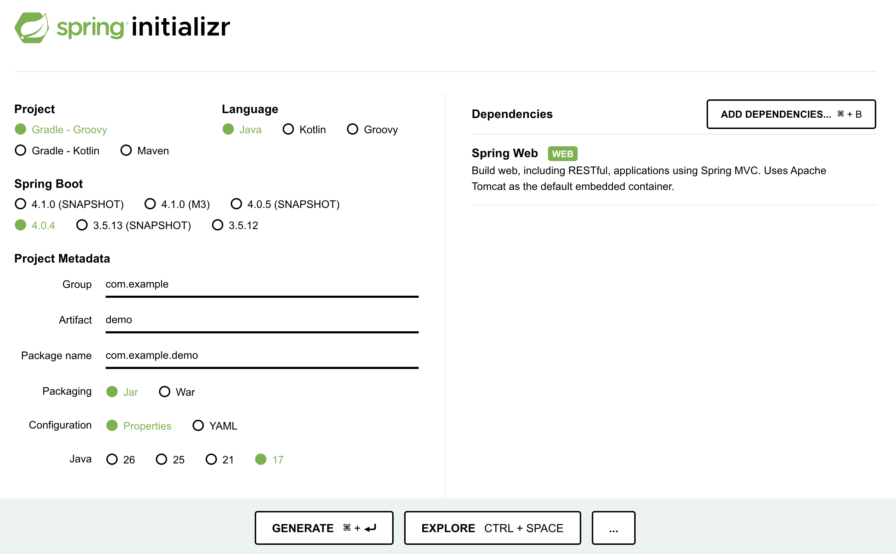
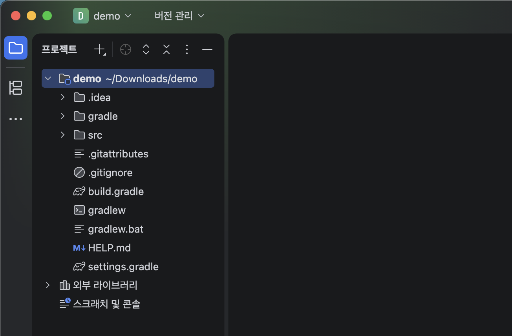

## 🐺 Spring을 공부하기 앞서, 컴린이들에게..
네.. 안녕하세요. 개발자 [pxxguin](https://github.com/pxxguin) 입니다. 이렇게 인사하는건 처음인 것 같네요. 제가 고등학생 때에 처음으로 스프링을 접했던 것 같은데, 벌써 시간이 많이 흘렀군요 하핫.. 처음 공부할 때 진짜 어려웠던게 스프링이였거든요. Nginx나, Docker보다 더 어려웠던게 스프링이였는데 IoC, DI ... 이런게 뭔지도 몰랐었고 Java 언어를 좋아했는데 스프링 때문에 싫어지기도 했었고... 별 생각이 다 나네요. PS도 알려주고 싶은게 많은데 시간이 모자란점 미안합니다 ㅠ 이상한 소리 그만하고 스프링 시작해볼게요.

## 😱 도대체 HTTP가 뭔가요?
일반적으로 웹프로그래밍을 한다면, 컴퓨터공학을 전공했다면, 컴퓨터에 관심이 있다면(?) HTTP(Hypertext Transfer Protocol) 한번은 들어봤을겁니다. 그냥 한마디로 ++HTTP란, 하이퍼텍스트를 전송하기 위한 프로토콜++이라는 뜻입니다. 여기서 프로토콜은 규약을 의미하는데요! 그냥 쉽게 설명해서 약속 또는 틀이라고 생각하면 됩니다.

우리가 학교 연구실에 들어가기 위해서 교수님께 컨택을 하려고 합니다. 그렇다면 ==예의를 갖춰서 목적이 잘 드러나게 메일 내용을 구상해야겠죠?== 이것 또한 프로토콜이라고 볼 수 있는겁니다. 네트워크를 사용할 때에도 이렇게 형식을 사용하면 된다는겁니다.

우리가 웹사이트로 이동하기 위한 주소, URL이 네트워크의 프로토콜입니다. https://www.naver.com 에서 https가 바로 프로토콜이죠. http와 https의 차이는 다른 블로그 포스팅에 적어두었으니 확인해보세요!( [바로가기](https://pxxguin.github.io/18/) )

## 💞 백엔드의 기본 API
개발을 하다보면 ++API(Application Programming Interface)++라는 용어를 많이 들어봤을겁니다. 백엔드 개발자는 바로 이 API를 만듭니다. 말 그대로 ++애플리케이션을 프로그래밍하는 데 사용하는 인터페이스++를 말합니다. 평상시에 우리는 네이버 지도나 카카오맵을 활용해서 버스를 탈지, 지하철을 탈지 파악합니다. 이러한 서비스를 제공하기 위해서 모든 애플리케이션이 지하철, 버스, 택시, 기차 등 모든 기관과 협업해야할까요? 너무 비효율적이겠죠. 따라서 ==기관에서 제공하는 API를 바탕으로 서비스를 만드는거죠.==

## ⏸ REST API란 무엇인가요?
API를 공부하다보면 ++REST API(Representational State Transfer API)를 보게 되는데, 이름 그대로 원칙을 준수하는 API라는 뜻입니다.++ 우리는 그냥 간단하게 HTTP의 틀을 잘 지켜서 소통하는 API를 REST API라고 부를겁니다.

## 🔨 Spring initializer로 프로젝트 생성하기
https://start.spring.io/ 에 접속하면 스프링 프로젝트를 간단하게 만들 수 있습니다. 아래 그림과 같이 선택한 후 GENERATE를 눌러주세요!

다음으로 각 디렉토리 내의 구성을 살펴보도록 합시다.

### 🏎 디렉토리 설명(Git 관련 제외)
- `.gradle`: Gradle이 작업할 때 필요한 파일들을 임시로 저장하는 용도로 사용하는 폴더입니다.
- `.idea`: IntelliJ를 IDEA라고 부르기도 합니다. 이 폴더는 IntelliJ가 사용하는 폴더입니다.
- `gradle`: 우리와 함께 프로젝트를 진행해나갈 Gradle이 저장된 폴더입니다. 당분간 열어 볼 일은 없으니 용도만 알아 두세요.
- `build`: 프로젝트를 실행할 준비를 마치면 생성되는 폴더입니다. 방금 프로젝트를 처음 생성할 때에 Gradle 이 도와줬듯이 프로젝트는 실행할 준비를 마쳤습니다. 따라서 이 폴더가 생성된 것입니다.
- `src/main/`
  - `java`: 실제 코딩을 하는 부분입니다.
    - `com.example.demo`: 이 부분부터 객체를 추가하여 웹서버를 구축합니다.
      - `DemoApplication.java`
  - `resources`
    - `static`: html 파일을 둘 수 있습니다.
    - `templates`
    - `application.properties`
- `build.gradle`: 여기서는 우리가 앞에서 설정한 Dependencies를 확인할 수 있습니다.
- `gradlew`, `gradlew.bat`: 프로젝트를 생성할 때 선택했던 패키징을 할 수 있게 도와주는 파일입니다. 따라 서 우리 프로젝트에서는 jar 파일을 만들 때 사용됩니다. gradlew는 맥(Mac)을 위한 파일이고 gradlew. bat는 윈도우(Windows)를 위한 파일입니다.
- `settings.gradle`: 프로젝트 관련 설정 파일입니다. 확장자가 gradle이라면 Gradle이 사용하는 파일입니다.

## ➡️ 마무리
일단, 프로젝트의 기본 소개까지해서 1차 포스팅을 마치도록 하겠습니다. 지금 당장은 디렉토리 설명 부분을 잘 모르더라도, 앞으로의 포스팅을 보다보면 쉽게 이해할 수 있을겁니다.