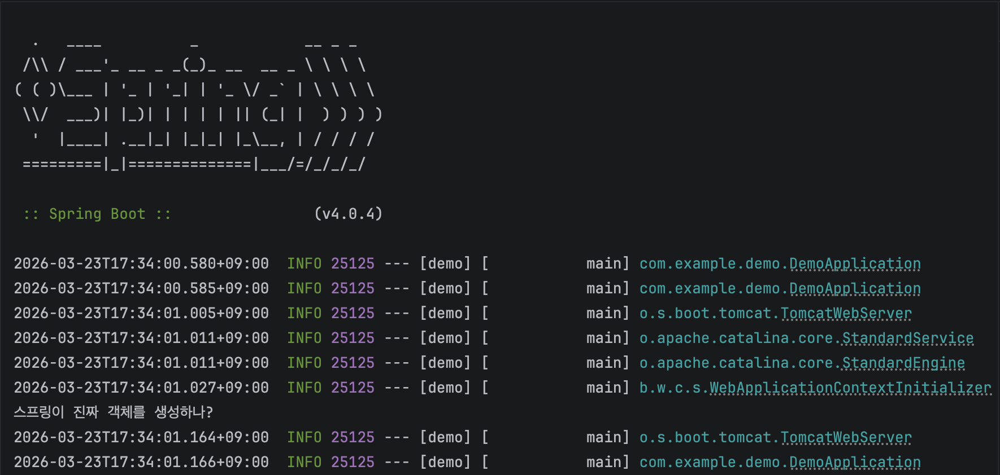

## 🏸 스프링 코어의 Main
스프링을 배우다보면 반드시 알아야하는 네 가지 개념이 있습니다. ==제어의 역전(Inversion of Control, IoC), 스프링 컨테이너(Container), 스프링 빈(Bean), 의존성 주입(Dependency Injection, DI)==이 아마 이해하는데 가장 난해한 개념이 아닐까 싶습니다.

### 🐗 각 개념의 정리
- IoC: 제어의 역전이라고 불리는 이 개념은 사실 어려운 개념이 아닙니다. 원래 개발자가 객체를 생성하잖아요? 이때 객체를 생성하는 시점은 개발자가 직접 정하죠. 하지만 ++제어의 역전의 경우 이 모든 제어권을 스프링에게 이전한다++는겁니다. 그냥 스프링에게 "해줘" 하는거죠.
- 컨테이너, 빈: IoC로 객체에 대한 제어권을 가져간 스프링은, 이제 객체를 관리해야하는 책임을 가지게 되었습니다. 스프링이 이 모든 객체들을 쉽게 관리하기 위해서는 하나의 상자에 넣어서 관리하면 편하겠죠? 이러한 ++상자 역할을 하는것을 바로 스프링 컨테이너++라고 합니다. 그렇다면 이 상자에는 객체가 들어있겠죠? 이 ++객체를 바로 스프링 빈++이라고 합니다.
- DI: 제어권을 스프링에게 넘겼으니, 객체를 호출해야하는 경우 스프링에게 의존성을 요청해야겠죠? 이것을 바로 ++DI라고 하고, 쉽게 설명하면 발자가 직접 객체를 만들지 않고, 스프링 컨테이너로부터 필요한 객체를 주입받는 것을 의미합니다.++


## 📵 스프링 MVC
MVC는 Model, View, Controller의 앞글자의 약자입니다. 하나의 애플리케이션을 3부분으로 나눈 이유가 무엇일까요? 당연히, 크기 때문입니다. 소프트웨어는 시간이 지날수록 부피가 커지기 시작했고 원활한 유지 보수를 위해서는 소프트웨어를 쪼갤 수밖에 없었습니다. 이를 코드를 구조화(Structured)한다고 표현하며, 코드를 구조화하는 데 유용하게 쓰이는 힌트를 디자인 패턴(Design Pattern)이라고 부릅니다. 그중에서도 객체 지향 프로그래밍 분야에서 가장 많이 활용하는 것이 바로 MVC입니다.

여기서 잘 보면 ==View -> Controller -> Model==로 데이터가 전달되고 여기의 역도 마찬가지입니다. View는 사용자가 보는 화면을 의미하고, Model은 실제 연산이나 동작을 담당합니다. 가운데 있는 Controller의 경우 View와 Model 가운데에서 중재하는 역할을 합니다.

하지만 이제 웹 애플리케이션은 분리하지 않으면 관리가 어려울 정도로 점점 커져버려 부피를 쪼개야만 했습니다. 이 과정에서 스프링은 뷰를 리액트라는 라이브러리에 넘겨주고, 더 이상 뷰를 담당하지 않게 되었습니다. 스프링은 이제 컨트롤러와 모델을 구현하는 백엔드 프레임워크로 자리매김하게 된 것입니다.

## 🎨 스프링 빈으로 등록하는 방법
@Component를 어디 달아야 할지부터 생각해봅니다. 어노테이션의 특징은 바로 아래 줄까지만 영향을 미친다는 것입니다. 따라서 ProductController 맨 위에 @Component를 두고 이 클래스를 스프링 빈으로 등록해달라고 요청합시다.
```java title="./com.example.demo/ProductController.java"
package com.example.demo;

import org.springframework.stereotype.Component;

@Component
public class ProductController {
}
```
진짜로 스프링이 객체를 알아서 불러오는지 확인해볼까요?

```java title="./com.example.demo/ProductController.java"
package com.example.demo;

import org.springframework.stereotype.Component;

@Component
public class ProductController {
    ProductController() {
        System.out.println("스프링이 진짜 객체를 생성하나?");
    }
}
```



오호! 정말 제대로 동작하는군요~ 컴포넌트를 설정해 두었더니, 스프링이 객체를 생성해서 스프링 빈으로 등록해주나봅니다!


## 📎 마무리
일단 이번 포스팅에서는 스프링 빈으로 등록하는 방법에 대해서 배웠습니다. 자세한 내용은 다음장부터 이어질 예정이니 기대해주세요!