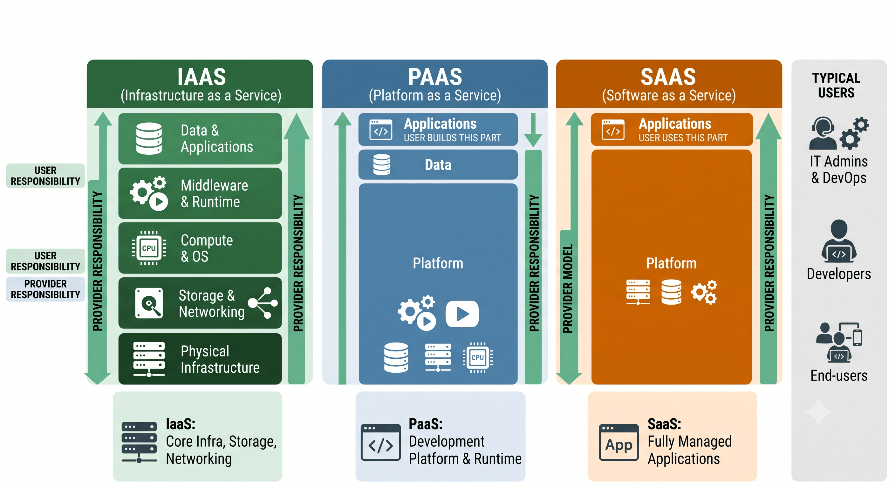

## 🌗 코드형 인프라스트럭처란?
==코드형 인프라스트럭처(Infrastructure as Code, IaC)==는 시스템 인프라스트럭처(System Infrastructure, Infra)를 사람의 개입에 의한 물리적인 방식에 의존하지 않고, ==기계가 읽을 수 있는 설정 코드로 정의하여 자동으로 관리하는 프로비저닝(provisioning) 방식==을 말한다. 여기서 Provisioning이란, Infra를 사용하는데 필요한 자원과 권한을 사전에 준비하고 공급하여 사용할 수 있도록 설정하는 과정이다.

클라우드 컴퓨팅이 고도로 발전하면서 AWS, Microsoft Azure, Google Cloud Platform 등 사설 클라우드 제공자로부터 컴퓨팅 인스턴스를 대여하고 실행하는 것이 매우 쉽고 저렴해졌다. 이에 따라서, 각 회사에서 서버를 직접 구성해 애플리케이션을 배포하는 온프레미스(on-premises) 접근 방식의 단점이 드러나기 시작했다.

### 1. 클라우드와 온프레미스의 장단점 비교
||Cloud Computing|On-premises|
|---|---|---|
|비용|사용량에 비례한 비용 청구|막대한 초기 투자 비용|
|수직 확장성|비교적 유연함|경직됨|
|수평 확장성|매우 유연함|경직됨|   

:::important
우리가 온프레미스 환경으로 서버를 운영하고 있다고 가정하자. 많은 사용자의 트래픽이 몰릴것 같다고 예상해서 고스펙의 서버를 구성하였다. 하지만 예상보다 적은 사용자가 서비스를 이용하는 것이다... 이 경우에서 수직 확장성과 수평 확장성을 설명하겠다.
- ==수직 확장성==: 적은 사용자가 이용한다면 서버 성능을 감소시키는 것이 도움이 될 것이다. 클라우드의 경우 서버를 동적으로 변경할 수 있지만, 온프레미스 환경은 어떠한가? 기존에 구축한 서버의 성능을 감소시키려면 추가 비용(?)이 들 수 있다. 
- ==수평 확장성==: 서버를 하나만 운영한다면, 사용자의 트래픽이 몰릴 때 대처하기 어렵다. 이럴때는 주로 로드밸런싱을 활용해서 트래픽을 분산시킨다. 클라우드의 경우, 새로운 EC2(Elastic Compute Cloud)를 생성해서 서버를 수평적으로 확장할 수 있지만, 온프레미스 상황에서는 서버를 증가시킨다는게 힘들다.
:::

### 2. IaC를 왜 사용해야하는가?

우리가 실제 서비스를 구성을 한다면, 주로 AWS와 같은 클라우드 시스템에서 EC2, IAM 설정 등 정말 수 없이 많은 것들을 직접 구축해야한다. 이 경우에, 우리는 웹 콘솔 페이지를 사용해서 할 수 있다. 하지만, ==서비스가 조금만 복잡해지고 이 시스템을 다루는 사람들이 점차 증가한다면 조금만 설정을 잘못해도 꼬이게 된다.== 이러한 문제를 해결하기 위해서, IaC를 사용해서 미리 우리가 구축하고 싶은 클라우드 내용을 선언하는 것이다.

더 쉽게 설명을 하겠다. Docker로 예시를 들면, Docker에서 각 컨테이너를 실행하는 방법은 두 가지 방법이 있다. ++docker run -d --name test ubuntu:latest++와 같은 방식으로 동작하도록 하는 방법이나, Dockerfile을 지정해서 실행하는 경우가 있다. 여기서 개발 초기에는 

## ⚪️ Terraform을 어떻게 설치하는가?
### 1. Ubuntu/Debian에서의 설치
```bash
wget -O - https://apt.releases.hashicorp.com/gpg | sudo gpg --dearmor -o /usr/share/keyrings/hashicorp-archive-keyring.gpg
echo "deb [arch=$(dpkg --print-architecture) signed-by=/usr/share/keyrings/hashicorp-archive-keyring.gpg] https://apt.releases.hashicorp.com $(grep -oP '(?<=UBUNTU_CODENAME=).*' /etc/os-release || lsb_release -cs) main" | sudo tee /etc/apt/sources.list.d/hashicorp.list
sudo apt update && sudo apt install terraform
```

### 2. CentOS/RHEL
```bash
sudo yum install -y yum-utils
sudo yum-config-manager --add-repo https://rpm.releases.hashicorp.com/RHEL/hashicorp.repo
sudo yum -y install terraform
```