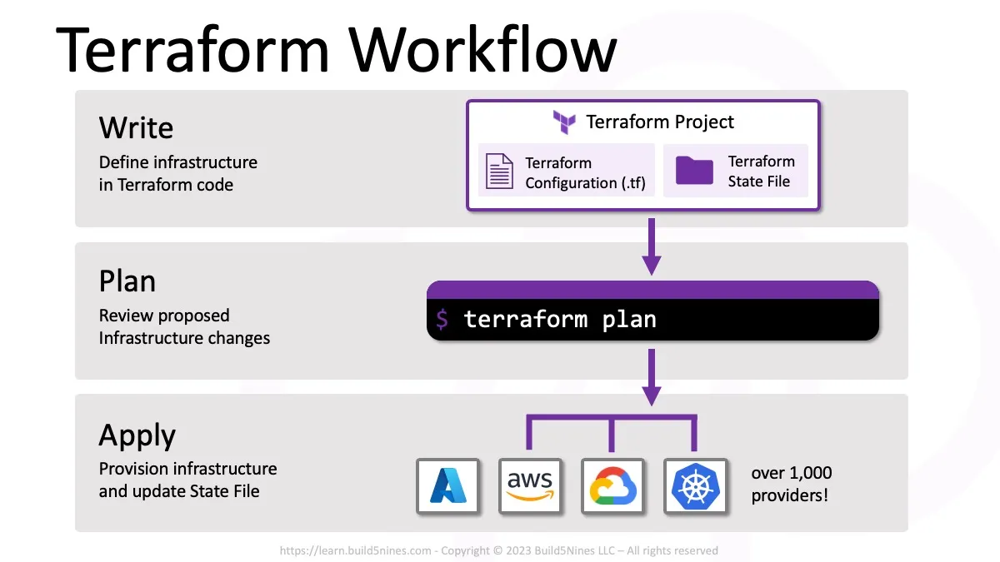

## 🌽 Terraform의 작동 방식

테라폼의 작동은 기본적으로 ==코드 작성(Write) > 플래닝(Plan) > 반영(Apply)==의 세 단계의 워크플로를 따른다. 확장자는 일반적으로 ==.tf==를 가지며, 하나의 디렉터리 안에 여러개의 구성 파일을 둘 수 있다. 구성 파일을 담고 있는 디렉토리에서 테라폼 초기화 명령(??terraform init??)을 수행하면 주요 테라폼 명령을 수행할 수 있도록 필요한 설정이 진행된다.

### 1. 기본 실습 (1)
```bash name="main.tf"
resource "local_file" "abc" {
    content = "abc!"
    filename = "${path.module}/abc.txt"
}
```
- ==local_file==은 테라폼의 local 프로바이더로 파일을 프로비저닝하는 데 사용된다.
- ==${path.module}==는 테라폼 모듈의 파일 시스템 경로이며, 여기서는 현재 디렉토리를 가리킨다.

현재 디렉토리에서 ==main.tf==를 생성한 이후에, ??terraform init??을 실행하면, 아래와 같은 디렉토리 구조를 가지게 된다.
```bash
> root@ubuntu ls -ali
total 8
239526472 drwxr-xr-x. 3 pxxguin pxxguin   66 Jul 26 22:19 .
     5327 drwxr-xr-x. 7 pxxguin pxxguin  106 Jul 26 22:13 ..
239526473 -rw-r--r--. 1 pxxguin pxxguin   92 Jul 26 22:14 main.tf
 84364313 drwxr-xr-x. 3 pxxguin pxxguin   23 Jul 26 22:19 .terraform
239526492 -rw-r--r--. 1 pxxguin pxxguin 1228 Jul 26 22:19 .terraform.lock.hcl
```

### 2. 기본 실습 (2)
우리가 작성한 테라폼 파일이 올바르게 잘 작성되어있는지에 대한 확인은 ??terraform validate??를 통해서 확인할 수 있다.
```bash name="main.tf"
resource "local_file" "abc" {
    content = "abc!"
    filename = "${path.module}/abc.txt"
}
```
위 상태에서 validate를 실행한다면, 코드에 문제가 없기 때문에 아래와 같은 결과를 반환한다.
```bash
> terraform validate
Success! The configuration is valid.
```

하지만, 기존의 코드에서 filename 부분을 주석 처리를 한다면, 결과는 달라진다.
```bash name="main.tf"
resource "local_file" "abc" {
    content = "abc!"
    # filename = "${path.module}/abc.txt"
}
```

혹시 내가 작성한 코드가 틀렸는지 맞았는지 궁금하다면, ??terraform validate??를 주기적으로 실행해서 추적하는 것이 좋다.
```bash
> terraform validate
╷
│ Error: Missing required argument
│ 
│   on main.tf line 1, in resource "local_file" "abc":
│    1: resource "local_file" "abc" {
│ 
│ The argument "filename" is required, but no definition was found.
```

### 3. 기본 실습 (3)
앞에서 테라폼의 기본 동작에 대한 흐름을 설명했다. 기억하는지 모르겠지만, 돌아보면 Write > Plan > Apply이였다는 것을 확인할 수 있다. 앞에서 봤던 두 가지 명령은 ??terraform init??과 ??terraform validate??였다. 이번에는 ??terraform plan??을 확인해보자.

??terraform plan?? 명령은 테라폼으로 적용할 인프라의 변경 사항에 관한 실행 계획을 생성하는 동작이다. 또한 출력되는 결과를 확인하여 어떤 변경이 적용될지 사용자가 미리 검토하고 이해하는데 도움을 준다. 주로 plan 명령은 변경 사항을 실제로 적용하지는 않으므로 적용 전에 예상한 구성이 맞는지 검토하는데 주로 이용된다.
:::tip
😆 plan을 사용하는 이유
- 테라폼 실행 이전의 상태와 비교해 현재 상태가 최신화되었는지 확인한다.
- 적용하고자 하는 구성을 현재 상태와 비교하고 변경점을 확인한다.
- 구성이 적용되는 경우 대상이 테라폼 구성에 어떻게 반영되는지 확인한다.
:::

```bash
> terraform plan

Terraform used the selected providers to generate the following execution plan. Resource actions are indicated with the following symbols:
  + create

Terraform will perform the following actions:

  # local_file.abc will be created
  + resource "local_file" "abc" {
      + content              = "abc!"
      + content_base64sha256 = (known after apply)
      + content_base64sha512 = (known after apply)
      + content_md5          = (known after apply)
      + content_sha1         = (known after apply)
      + content_sha256       = (known after apply)
      + content_sha512       = (known after apply)
      + directory_permission = "0777"
      + file_permission      = "0777"
      + filename             = "./abc.txt"
      + id                   = (known after apply)
    }

Plan: 1 to add, 0 to change, 0 to destroy.

───────────────────────────────────────────────────────────────────────────────────────────────────────────────────────────────────────────────────────────────────────────────────────────────

Note: You didn't use the -out option to save this plan, so Terraform can't guarantee to take exactly these actions if you run "terraform apply" now.
```
??terraform plan"??을 실행하면 처음 출력된 로그에서 심볼이 가진 의미를 설명해준다. 현재는 기존에 생성된 리소스가 없으므로 앞선 구성 파일 내용을 바탕으로 새로 생성해야 하기 때문에 + 기호만 나타난다.

여기서 팁이 있다면, 가끔 ??terraform plan -detailed-exitcode??와 같이 ==detailed-exitcode==를 붙이는 경우가 있다. 이때는 숫자로 된 결과를 반환하는데, ==0: 변경 사항이 없는 성공==, ==1: 오류가 있음==, ==2: 변경 사항이 있는 성공==으로 결과를 나눌 수 있다. 이 부분이 왜 필요하냐면, Github Actions와 같은 CI/CD를 사용할 때, 선행되어있는 ==.tf==코드의 오류 유무에 따라서 CD 흐름에 영향을 줄 수 있기 때문이다. 예를 들면, if 조건을 사용해서 ??terraform plan -detailed-exitcode??를 입력했을 때 2를 반환한다면 CD를 중단하는 로직을 구현할 수도 있다는 것이다.

### 4. 기본 실습 (4)
마지막으로 ??terraform apply??는 계획을 기반으로 작업을 실행하는데 결과는 아래와 같다.
```bash
─ terraform apply

Terraform used the selected providers to generate the following execution plan. Resource actions are indicated with the following symbols:
  + create

Terraform will perform the following actions:

  # local_file.abc will be created
  + resource "local_file" "abc" {
      + content              = "abc!"
      + content_base64sha256 = (known after apply)
      + content_base64sha512 = (known after apply)
      + content_md5          = (known after apply)
      + content_sha1         = (known after apply)
      + content_sha256       = (known after apply)
      + content_sha512       = (known after apply)
      + directory_permission = "0777"
      + file_permission      = "0777"
      + filename             = "./abc.txt"
      + id                   = (known after apply)
    }

Plan: 1 to add, 0 to change, 0 to destroy.

Do you want to perform these actions?
  Terraform will perform the actions described above.
  Only 'yes' will be accepted to approve.

  Enter a value: yes

local_file.abc: Creating...
local_file.abc: Creation complete after 0s [id=5678fb68a642f3c6c8004c1bdc21e7142087287b]

Apply complete! Resources: 1 added, 0 changed, 0 destroyed.
```
Enter a value: 부분에 yes를 입력하면 정상적으로 동작한다. ??terraform apply??가 진행되면 아래와 같은 디렉토리 구조와 abc.txt 파일 안에, 우리가 작성한 abc!이 적어져있는 것을 확인할 수 있다.
```bash
> ls -ali
total 16
239526472 drwxr-xr-x. 3 pxxguin pxxguin  106 Jul 26 22:44 .
     5327 drwxr-xr-x. 7 pxxguin pxxguin  106 Jul 26 22:13 ..
239526476 -rwxr-xr-x. 1 pxxguin pxxguin    4 Jul 26 22:44 abc.txt
239526473 -rw-r--r--. 1 pxxguin pxxguin   92 Jul 26 22:33 main.tf
 84364313 drwxr-xr-x. 3 pxxguin pxxguin   23 Jul 26 22:19 .terraform
239526492 -rw-r--r--. 1 pxxguin pxxguin 1228 Jul 26 22:19 .terraform.lock.hcl
239526474 -rw-r--r--. 1 pxxguin pxxguin 1613 Jul 26 22:44 terraform.tfstate
```

### 5. 진짜 꿀팁이 있다면..
일반적으로 ??terraform plan??과 ??terraform apply??가 서로 이어지는 경우가 많은데, 이럴때는 plan을 저장하고, 저장된 계획을 apply에 적용시키면 더 정확히 동작하는 것을 확인할 수 있다.
```bash
> terraform plan -out=tfplan
> terraform apply tfplan
local_file.abc: Creating...
local_file.abc: Creation complete after 0s [id=5678fb68a642f3c6c8004c1bdc21e7142087287b]

Apply complete! Resources: 1 added, 0 changed, 0 destroyed.
```

## 🐤 Terraform의 새로운 규칙
### 1. Terraform에서의 멱등성
apply 기본 수행에서 plan 이후 변경 내용을 확인하고 적용하려는 동작을 확인했었다. Terraform은 ==선언적 구성 관리를 제공하는 언어로 멱등성==을 갖고 이후에 추가로 설명될 상태를 관리하기 때문에 동일한 구성에 대해서는 다시 실행하거나 변경하는 작업을 수행하지 않는다. 따라서 변경 없는 구성에서는 plan 단계에서 변경 사항이 없기 대문에 출력되는 메시지 내용처럼 프로비저닝 동작이 추가로 발생하지 않는다.

### 2. 기존 main.tf에 resource를 추가한다면?
```bash
resource "local_file" "abc" {
    content = "abc!"
    filename = "${path.module}/abc.txt"
}

resource "local_file" "def" {
    content = "def!"
    filename = "${path.module}/def.txt"
}
```
위에 대해서 apply를 적용하면, 다음과 같은 결과를 확인할 수 있다.
```bash
local_file.abc: Refreshing state... [id=5678fb68a642f3c6c8004c1bdc21e7142087287b]
...생략...
Terraform will perform the following actions:

  # local_file.def will be created
  + resource "local_file" "def" {
      + content              = "def!"
      + content_base64sha256 = (known after apply)
      + content_base64sha512 = (known after apply)
      + content_md5          = (known after apply)
      + content_sha1         = (known after apply)
      + content_sha256       = (known after apply)
      + content_sha512       = (known after apply)
      + directory_permission = "0777"
      + file_permission      = "0777"
      + filename             = "./def.txt"
      + id                   = (known after apply)
    }

Plan: 1 to add, 0 to change, 0 to destroy.
...생략...
  Enter a value: yes

local_file.def: Creating...
local_file.def: Creation complete after 0s [id=15f946cb27f0730866cefea4f0923248d9366cb0]

Apply complete! Resources: 1 added, 0 changed, 0 destroyed.
```
이미 프로비저닝된 구성인 ==resource "local_file" "abc"{}==에 대해서는 변경이 없지만 새로 추가된 리소스 ==resource "local_file" "def"{}==에 대해서는 새로 생성하겠다는 실행 계획을 보여준다.
```bash
> tree
.
├── abc.txt
├── def.txt
├── main.tf
├── terraform.tfstate
├── terraform.tfstate.backup
└── tfplan
```
이전에 생성한 ==tfplan==은 abc.txt만을 생성하는 구성이었다. 다시 apply 동작에 ==tfplan== 파일을 적용해 실행해본다.

```bash
> terraform apply tfplan
╷
│ Error: Saved plan is stale
│ 
│ The given plan file can no longer be applied because the state was changed by another operation after the plan was created.
╵
```
tfplan이 생성된 이후에 변경이 발생했으므로 기존에 작성된 실행 계획은 더는 적용될 수 없다. 추가로 생성한 코드에 대해서 다시 계획을 생성한 이후에 apply를 적용하는게 대다수의 경우이다.

## 🍽 마무리
이후에는 좀 더 고도화된 terraform 구조를 알아본다.